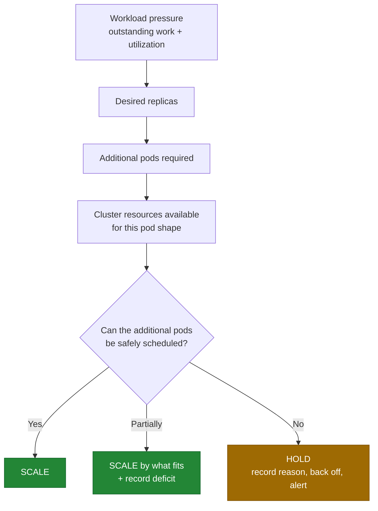
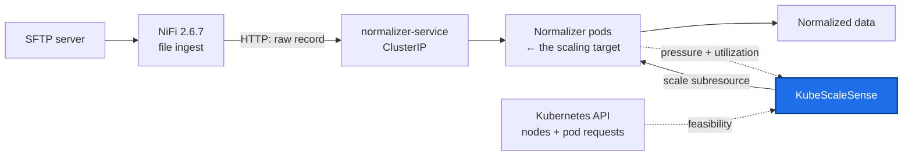

# KubeScaleSense

**A resource-aware Kubernetes pod autoscaling controller.**

KubeScaleSense scales a normalization workload according to incoming demand **while first evaluating whether
the Kubernetes cluster can actually schedule the additional pods** — preventing the Pending pods, resource
exhaustion, and processing interruptions that follow from scaling blindly.

> **Status: design phase.** This repository currently contains the engineering design only. No controller
> code, manifests, or cluster resources have been created yet. See
> [docs/implementation-plan.md](docs/implementation-plan.md) for the phased build plan.

---

## The problem

A spike in incoming data makes the normalization pool fall behind: work queues up, latency rises, utilization
climbs, and more replicas are needed. Raising the replica count blindly is unsafe — if the cluster has no
schedulable capacity for pods of that shape, Kubernetes cannot place them. The pods sit `Pending`, nodes come
under resource pressure, and healthy pods can be evicted mid-request. The demand problem quietly becomes a
reliability problem.

A standard Horizontal Pod Autoscaler computes replicas from utilization and delegates placement to the
scheduler. It never asks whether the delta it just requested is schedulable.

## The approach

Every scaling decision must satisfy **two independent conditions**:

| Question | Answered from | Establishes |
| --- | --- | --- |
| Is the workload under pressure? | Outstanding work reported by a pluggable signal source + pod CPU utilization | **Demand** |
| Can the cluster place N more pods of this exact shape? | Node `allocatable` **minus already-requested** resources, per node, on nodes passing the pod's scheduling predicates | **Feasibility** |

Demand without feasibility produces Pending pods. Feasibility without demand produces waste. KubeScaleSense
requires both, and when demand exceeds feasibility it scales by what fits and **holds the rest with a specific,
alerting reason** — turning an invisible reliability problem into a visible capacity problem.

The central design rule: **current CPU utilization is never treated as proof that another pod can be
scheduled.** A pod requesting 2 cores while using 50 m still holds 2 cores of the scheduler's budget, so
"the cluster looks 60 % idle" and "nothing more can be scheduled" are routinely both true.

Three statements the project keeps strictly apart — conflating them is the failure mode it exists to avoid:

| | Statement | Role |
| --- | --- | --- |
| **L1** | "The cluster has spare resources" | Aggregate; **never** a decision input, exported for humans only |
| **L2** | "The cluster can *probably* schedule this specific pod" | The estimate the scaling gate uses |
| **L3** | "The cluster *actually scheduled* the pod" | Observed fact; verified after the fact, since only the scheduler can produce it |

The POC therefore guarantees it will never issue a *knowingly* infeasible scale-up — **not** that no pod will
ever be Pending. Full statement:
[Design Limitations and Assumptions](docs/requirements.md#10-design-limitations-and-assumptions).



## Demonstration pipeline

The workload used to exercise the controller is a data-normalization pipeline. NiFi ingests files and posts
each record over HTTP; the **Normalizer** is a small stateless application that normalizes a record and
returns the result. The **controller is the deliverable**, and it scales the Normalizer Deployment only — not
NiFi itself ([NG-1](docs/requirements.md#3-non-goals)).



There is **no database, message broker, shared filesystem, or object storage** anywhere in this picture, and
that is the point: a request goes to one pod, the pod holds nothing, and adding a replica adds throughput
([ADR-21](docs/architecture.md#adr-21-how-does-work-reach-the-normalizer-pods)). Two consequences are worth
stating up front rather than discovering later:

- **Throughput is bounded by the caller's concurrency as well as the replica count.** If NiFi sends requests
  four at a time, an eighth replica changes nothing — the controller would be correct and the demonstration
  worthless, so a test gates it ([FS-28](docs/failure-scenarios.md#fs-28-adding-replicas-does-not-add-throughput)).
- **KubeScaleSense does not provide data durability, and does not claim to.** Delivery is at-least-once and
  normalization is idempotent; a request lost to a pod crash is retried by NiFi. The controller's contribution
  is narrower and honest: its scaling actions do not destroy in-flight work
  ([durability boundary](docs/requirements.md#7-durability-boundary-and-workload-responsibilities)).

> **Why this is simpler than it was.** Earlier revisions routed work through a PostgreSQL work-item table with
> `FOR UPDATE SKIP LOCKED` claiming, to guarantee that no item could be lost even if every pod died. It
> worked, and it was the wrong trade: a database, a schema, a JDBC driver, a lease protocol, and a cleanup job
> were added to a project about *resource-aware scaling decisions*, none of which the scaling logic ever read.
> The reasoning is preserved in [ADR-18](docs/architecture.md#adr-18-what-is-the-durable-work-store-for-the-poc-pipeline)…[ADR-20](docs/architecture.md#adr-20-how-is-in-flight-work-protected-without-a-shared-filesystem),
> marked SUPERSEDED rather than deleted, and in
> [DR-12](docs/design-review.md#dr-12-the-poc-work-store-cannot-provide-the-claimed-semantics-on-the-proposed-environment).

---

## Documentation

Read in this order; each document is the canonical source for its own identifiers, and the others link to it
rather than restating it.

| Document | Contents | Canonical for |
| --- | --- | --- |
| [docs/requirements.md](docs/requirements.md) | Problem statement, goals, non-goals, functional and non-functional requirements, assumptions, the durability boundary, configuration reference, glossary | `FR-xx`, `NFR-xx`, `A-xx`, `D-xx`, `WR-xx`, `NG-xx`, config parameters |
| [docs/architecture.md](docs/architecture.md) | System architecture, component responsibilities, decision flow, data model, RBAC, observability, and the ADRs answering every critical design question | `ADR-xx`, `P-x`, metric names, RBAC |
| [docs/scaling-algorithm.md](docs/scaling-algorithm.md) | Desired-replica computation, guard ordering, scale-up/scale-down logic, cooldown and hysteresis, insufficient-resource behaviour, worked examples, tuning | Reason codes, decision pipeline |
| [docs/resource-calculation.md](docs/resource-calculation.md) | Candidate node filtering, effective pod request, free requestable resources, fit capacity, predicates modelled vs. ignored, worked example | Fit-capacity model |
| [docs/failure-scenarios.md](docs/failure-scenarios.md) | 29 failure modes with specified responses, data-loss analysis, interacting failures, alerting | `FS-xx` |
| [docs/test-plan.md](docs/test-plan.md) | Test strategy and IDs, local kind demo environment, demo narrative, CI gates, traceability matrix | `UT/IT/DI/E2E/PF/SK-xx` |
| [docs/implementation-plan.md](docs/implementation-plan.md) | Phases P0–P5 with exit criteria, risk register, deferred scope, definition of done, open questions | `P0`–`P5`, `R-x`, `Q-x` |
| [docs/design-review.md](docs/design-review.md) | Correctness review of the design set: the L1/L2/L3 distinction, 16 findings with fixes, and the decisions that are immutable for Phase 1 | `DR-xx`, `I-xx` |
| [architecture § 11](docs/architecture.md#11-phase-1-architecture-baseline) | **The settled architecture implementation will follow** — topology, component contracts, data flow, assumptions | Phase 1 baseline |

### Design decisions at a glance

| Question | Answer | Detail |
| --- | --- | --- |
| What is scaled? | One `Deployment` of stateless Normalizer pods, via its `scale` subresource | [ADR-01](docs/architecture.md#adr-01-what-exactly-is-being-scaled) |
| How are desired replicas computed? | `max(ceil(pressure / itemsPerReplica), ceil(readyReplicas × cpu% / target%))` | [ADR-02](docs/architecture.md#adr-02-how-should-the-desired-replica-count-be-calculated) |
| How does work reach the pods? | An HTTP request through a ClusterIP Service. No store, broker, shared filesystem, or object storage | [ADR-21](docs/architecture.md#adr-21-how-does-work-reach-the-normalizer-pods) |
| Where does the demand signal come from? | A replaceable source interface: `synthetic`, `http`, or `none` — read-only telemetry, never zero-on-error | [ADR-22](docs/architecture.md#adr-22-where-does-the-workload-pressure-signal-come-from) |
| Capacity, allocatable, or requested? | **Allocatable − requested, per node**, on schedulable candidate nodes | [ADR-05](docs/architecture.md#adr-05-capacity-allocatable-or-requested) |
| Will N more pods fit? | `Σ min(⌊freeCPU/req⌋, ⌊freeMem/req⌋, freeSlots)` per node, minus a margin — floored per node, so fragmentation counts | [ADR-06](docs/architecture.md#adr-06-how-do-we-determine-whether-n-additional-pods-are-likely-schedulable) |
| Taints, selectors, affinity? | Untolerated `NoSchedule`/`NoExecute`, `nodeSelector`, and required node affinity exclude nodes; preferred affinity ignored; topology spread and pod anti-affinity explicitly out of scope | [ADR-07](docs/architecture.md#adr-07-how-do-taints-and-tolerations-affect-the-calculation), [ADR-08](docs/architecture.md#adr-08-how-do-node-affinity-rules-affect-the-calculation) |
| Demand high, resources short? | Scale by what fits; hold the rest; back off; alert on the deficit | [ADR-09](docs/architecture.md#adr-09-what-happens-when-demand-is-high-but-resources-are-insufficient) |
| Oscillation? | Deadband + asymmetric cooldowns + `max()` over a scale-down stabilization window + EWMA smoothing | [ADR-10](docs/architecture.md#adr-10-how-do-we-avoid-replica-oscillation) |
| Impossible scale retried forever? | Exponential backoff, reset level-triggered on observed capacity increase | [ADR-11](docs/architecture.md#adr-11-how-do-we-avoid-repeatedly-attempting-an-impossible-scale) |
| Stale data? | Watches, explicit sample ages, no action before cache sync, `resourceVersion` preconditions, headroom | [ADR-12](docs/architecture.md#adr-12-how-do-we-avoid-stale-resource-information) |
| Pod stuck Pending? | Block further scale-ups immediately; after a timeout, revert / freeze / report | [ADR-13](docs/architecture.md#adr-13-what-happens-if-a-newly-created-pod-stays-pending) |
| API failures? | Fail-safe is **freeze**: hold replicas, bounded retries, never scale down on unknown state | [ADR-14](docs/architecture.md#adr-14-what-happens-if-kubernetes-api-calls-fail) |
| Normalizer pod crash? | Durability is a **workload** property: NiFi retries the failed request, normalization is idempotent, shutdown is graceful. The controller does not claim to prevent loss | [ADR-15](docs/architecture.md#adr-15-how-do-we-protect-data-processing-when-a-worker-pod-crashes), [§7](docs/requirements.md#7-durability-boundary-and-workload-responsibilities) |
| Someone else edits `replicas`? | Adopt their value as the baseline; abstain entirely if it keeps happening — never compete | [ADR-17](docs/architecture.md#adr-17-how-do-we-handle-other-writers-of-the-replica-count) |
| Local demo? | `kind` with a tainted control plane and heterogeneous workers, plus ballast pods that commit resources without using them | [ADR-16](docs/architecture.md#adr-16-how-will-this-be-demonstrated-in-a-local-kubernetes-environment) |

---

## Planned repository layout

Created during [P0–P3](docs/implementation-plan.md#3-phase-details); nothing below exists yet.

```text
cmd/
  kubescalesense/       # controller entrypoint: config, wiring, leader election
  normalizer/           # the demo workload: a small stateless HTTP server
internal/
  config/               # schema, defaults, validation
  kubernetes/           # clients, informers, scale writes, events
  resources/            # node filtering, free-resource math, fit capacity
  metrics/              # workload-signal sources, pod utilization, staleness
  scaling/              # pure decision engine: Snapshot -> Decision
  controller/           # reconcile loop, actuator, pending watchdog
  observability/        # Prometheus metrics, health, logging
  normalizer/           # normalization logic, in-flight accounting, drain
config/                 # kubescalesense.yaml
deploy/
  kubescalesense/       # RBAC, ConfigMap, controller Deployment
  normalizer/           # Normalizer Deployment + normalizer-service
  demo/                 # SFTP, NiFi, file generator, ballast
tests/                  # integration + e2e harness, kind config, scenarios
docs/                   # this design set
```

The Normalizer lives in this repository rather than elsewhere so that the whole POC runs locally from one
`make demo-up`, and so that the properties the controller depends on — statelessness, idempotency, graceful
shutdown, an in-flight count — are testable requirements instead of assumptions about someone else's service
([WR-01…WR-07](docs/requirements.md#workload-signal-requirements-v02)).

## Technology

Go (≥ 1.24) · `client-go` informers and typed clients · `metrics.k8s.io` · NiFi 2.6.7 for ingest · plain
HTTP between NiFi and the Normalizer · Prometheus · `kind` for local demonstration. No database, no message
broker, no shared or object storage. A pure decision engine with an injected clock and no I/O keeps the
interesting logic exhaustively unit-testable.

## Non-goals for the first version

Autoscaling NiFi · provisioning nodes · vertical scaling · scale-to-zero · multiple target workloads · full
scheduler simulation · topology spread and pod anti-affinity · priority/preemption · GPUs and extended
resources · quota modelling · a CRD API · coexisting with an HPA on the same target.
Rationale for each: [requirements § 3](docs/requirements.md#3-non-goals). When to revisit:
[implementation-plan § 7](docs/implementation-plan.md#7-deferred-scope-and-when-to-pick-it-up).

## Next step

Design and architecture are closed: the [design review](docs/design-review.md) findings are folded in, all
open questions are resolved or deferred with a stated default, and the settled architecture is
[architecture § 11](docs/architecture.md#11-phase-1-architecture-baseline). **No Phase 1 blockers remain**
([prerequisites](docs/implementation-plan.md#81-prerequisites-for-starting-phase-1-implementation)).

Begin [P0 — Foundation](docs/implementation-plan.md#p0--foundation). The first code milestone is
[P1](docs/implementation-plan.md#p1--observation-dry-run-only): a controller that computes fit capacity and
reports the decisions it *would* make, validated by hand against `kubectl describe node` before it is ever
allowed to write. P1 needs no pipeline at all — the `synthetic` signal source exercises the entire demand
path — so the Normalizer and NiFi arrive in
[P2](docs/implementation-plan.md#p2--demonstration-workload), gated on proving that replicas convert into
throughput.
