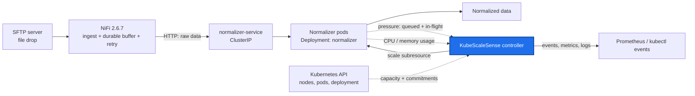
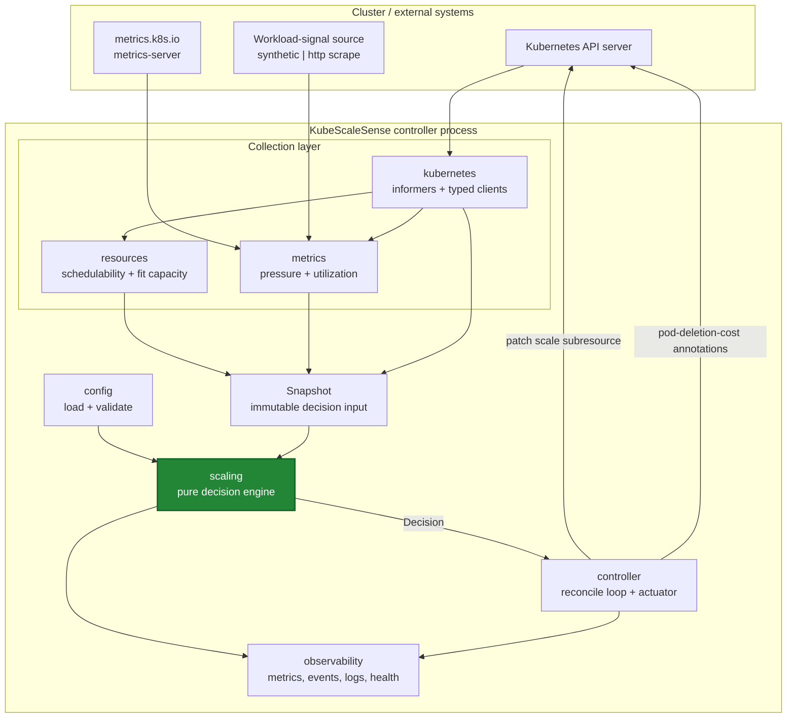
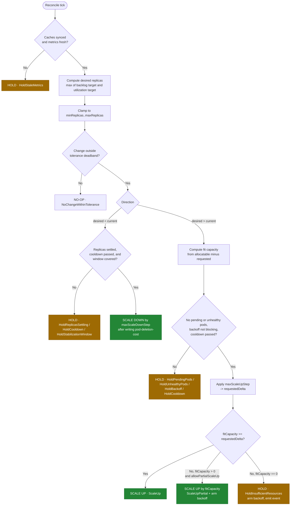
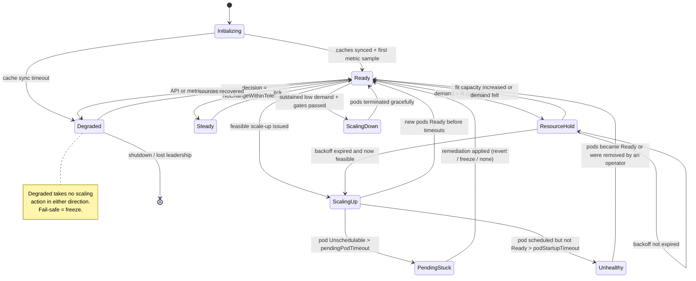
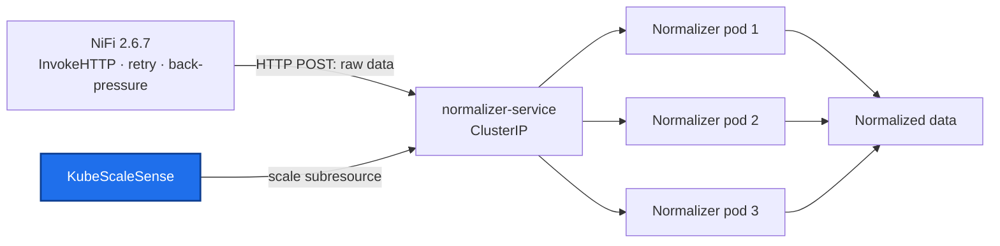
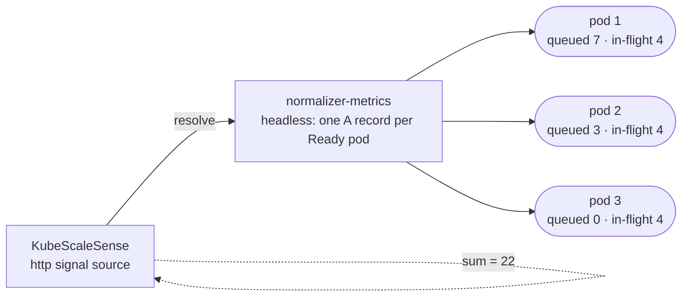
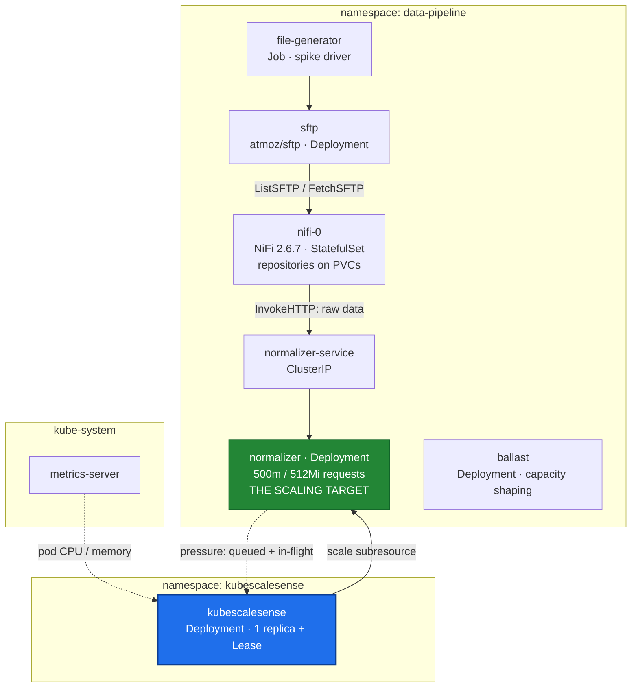
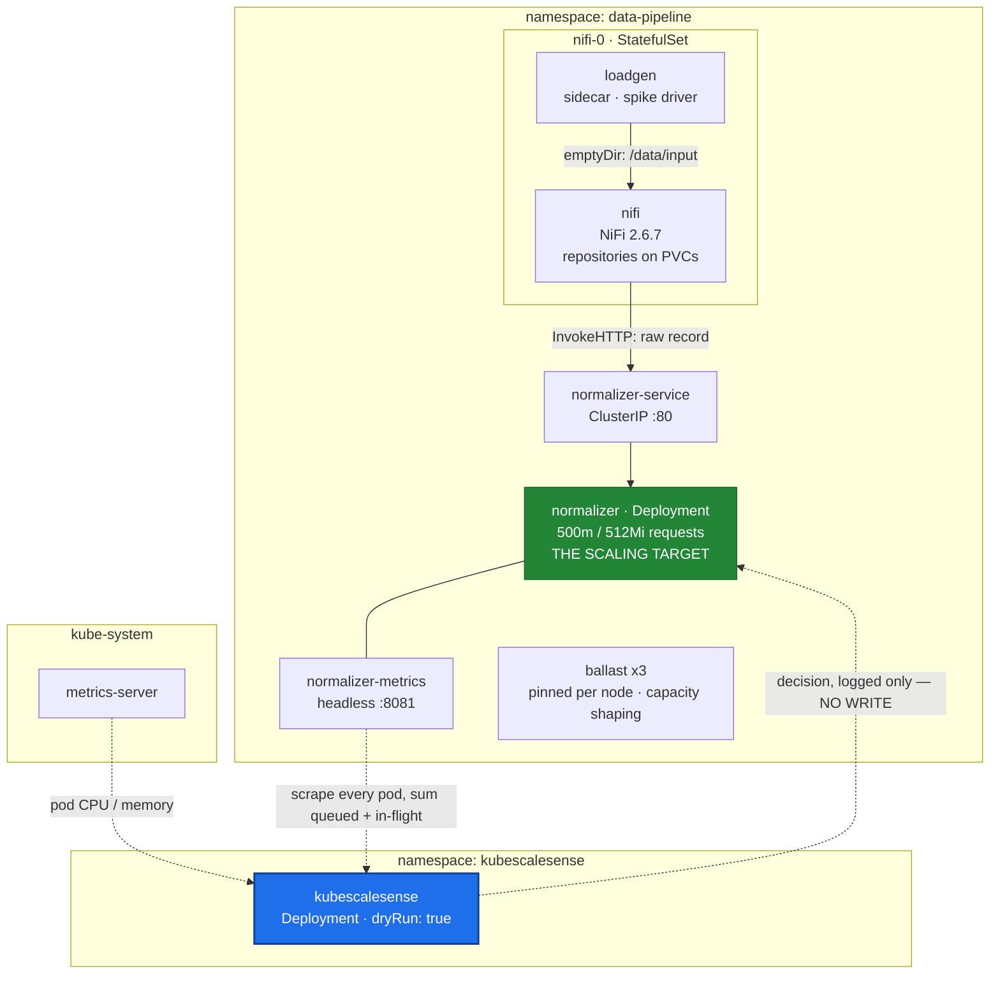

# KubeScaleSense — System Architecture

> Status: **Design (pre-implementation)** · Version: 0.2
> Canonical source for: system architecture, component responsibilities, RBAC, observability contract,
> and the architecture decision records (`ADR-xx`) that answer the project's critical design questions.

Related documents: [requirements](requirements.md) · [scaling-algorithm](scaling-algorithm.md) ·
[resource-calculation](resource-calculation.md) · [failure-scenarios](failure-scenarios.md) ·
[test-plan](test-plan.md) · [implementation-plan](implementation-plan.md)

---

## 1. Context

KubeScaleSense is a Go control-loop that sizes one **Normalizer** `Deployment` from two independent inputs:
**workload demand** and **cluster schedulability**. The data pipeline is the demonstration workload; the
controller is the deliverable.



Scope boundary, per [NG-1](requirements.md#3-non-goals): the controller scales **the Normalizer Deployment
only**. NiFi is fixed-size and owns ingestion durability and retry. If NiFi later becomes the bottleneck, that
is a separate target workload with its own policy — not a change to this algorithm.

There is **no durable work store, message broker, shared filesystem, or object store** between NiFi and the
Normalizer. Work arrives as an HTTP request through a Kubernetes `Service`, which is the simplest interface
that still demonstrates resource-aware scaling
([ADR-21](#adr-21-how-does-work-reach-the-normalizer-pods)). Durability is NiFi's responsibility and is
explicitly **not** claimed by this controller
([requirements § 7](requirements.md#7-durability-boundary-and-workload-responsibilities)). The settled
architecture is [§11](#11-phase-1-architecture-baseline).

---

## 2. Architectural principles

| # | Principle | Consequence in the design |
| --- | --- | --- |
| P-1 | **Demand and feasibility are separate questions** | Two independent subsystems (`metrics`, `resources`) feed one decision engine; neither can alone authorize a scale-up |
| P-2 | **The decision engine is a pure function** | `Decide(Snapshot, Config, now) → Decision`. No clients, no clock, no logging inside. Makes the interesting logic exhaustively unit-testable ([NFR-06](requirements.md#5-non-functional-requirements)) |
| P-3 | **Conservative by construction** | Every estimate rounds against action: pessimistic fit capacity, headroom reserves, HOLD on doubt ([NFR-05](requirements.md#5-non-functional-requirements)) |
| P-4 | **Every decision is explainable** | One reason code per reconcile, propagated identically into logs, events, and metric labels |
| P-5 | **Read from caches, write rarely** | Informers for nodes/pods/deployment; a write only when the replica count actually changes ([NFR-04](requirements.md#5-non-functional-requirements)) |
| P-6 | **Estimator, not scheduler** | KubeScaleSense models a documented subset of scheduler predicates and treats the Pending-pod watchdog as the correctness backstop ([NG-6](requirements.md#3-non-goals)) |
| P-7 | **Minimal POC, documented evolution** | Single binary, ConfigMap config, one target. CRD, multi-target, and predicate fidelity are explicitly phased ([§10](#10-evolution-to-a-production-controller)) |

---

## 3. Logical architecture



The dashed boundary that matters: everything above `Snapshot` does I/O and is integration-tested against
fakes; `scaling` is pure and unit-tested exhaustively; `controller` is thin glue that performs the single
mutation a decision authorizes.

---

## 4. Component responsibilities

Proposed layout (Go module `github.com/jensilin/KubeScaleSense`):

```text
cmd/
  kubescalesense/main.go        # flags, config load, wiring, leader election, signal handling
internal/
  config/                       # schema, defaults, validation, env overrides
  kubernetes/                   # clients, informers, scale writes, event recorder
  resources/                    # node filtering, free-resource math, fit capacity
  metrics/                      # workload-pressure sources, pod utilization, staleness
  scaling/                      # Snapshot, Decision, reason codes, pure Decide()
  controller/                   # reconcile loop, actuator, pending-pod watchdog, backoff state
  observability/                # Prometheus registry, health handlers, structured logging
cmd/
  normalizer/                   # the demonstration workload: a small stateless HTTP app (Phase 2)
internal/normalizer/            # normalization handler, in-flight accounting, metrics endpoint
config/                         # kubescalesense.yaml (defaults, examples)
deploy/
  kubescalesense/               # RBAC, Deployment, ConfigMap for the controller
  normalizer/                   # Deployment, normalizer-service, PDB for the workload
  demo/                         # SFTP, NiFi, ballast, load generator (Phase 2+)
tests/                          # integration + e2e harness, scenario scripts
docs/                           # this design set
```

The Normalizer lives in this repository so the whole POC runs locally with one `make demo-up`, but it is a
**separate application** with no shared code with the controller beyond the Go module — the controller must
never gain compile-time knowledge of the workload it scales.

### 4.1 Config (`internal/config`)

Owns the schema in [requirements § 8](requirements.md#8-configuration-requirements). Loads YAML, applies
defaults, applies `KSS_*` env overrides, validates, and **fails fast** (CR-2). Validation includes the
cross-cutting checks that prevent an unsafe run: `minReplicas <= maxReplicas`, `interval >= 5s`, target pod
template declares CPU and memory requests ([A-03](requirements.md#6-workload-and-environment-assumptions)),
and no HPA exists for the target ([FR-19](requirements.md#4-functional-requirements)).

### 4.2 Kubernetes access layer (`internal/kubernetes`)

- Typed `client-go` clientset plus shared informers for `Node`, `Pod` (namespace-scoped for the target,
  cluster-scoped for node resource accounting), and the target `Deployment`.
- All reads in the reconcile path come from informer caches ([NFR-04](requirements.md#5-non-functional-requirements)); no per-reconcile `LIST`.
- Writes: `scale` subresource update with `resourceVersion` precondition ([FR-05](requirements.md#4-functional-requirements)), and `pod-deletion-cost` annotation patches.
- Owns the `EventRecorder` and the readiness signal derived from cache sync + informer health.

**Why plain client-go and not controller-runtime for v0.1:** the controller reconciles *one* object on a
timer and needs no scheme, webhook, or CRD machinery. Plain informers keep the binary and the mental model
small. Migration to controller-runtime is a Phase 4 item, motivated by the CRD, not by the loop.

### 4.3 Workload metrics collector (`internal/metrics`)

Produces the demand half of the snapshot:

| Signal | Source | Notes |
| --- | --- | --- |
| `pressureItems` | The configured `WorkloadSignal` source: `synthetic` (a scripted series) or `http` (scraped from **every** Normalizer pod through a headless Service and summed, [ADR-22a](#adr-22a-the-http-source-scrapes-every-pod)) | Primary demand signal — **outstanding work**: queued plus in-flight requests. Optional EWMA smoothing ([scaling-algorithm § 8.4](scaling-algorithm.md#84-signal-smoothing)) |
| `inFlightRequests` | Same source; the Normalizer's own in-flight counter, summed over pods | Reported, and the natural input for `pod-deletion-cost`. Makes "the pool is busy but nothing is queued" visible |
| `requestRate`, `processingRate`, `processingLatency` | Same source | **Observability only** in v0.2 ([FR-39](requirements.md#workload-signal-requirements-v02)); recorded from Phase 1 so a latency- or arrival-rate-driven demand model can be derived from data instead of guessed |
| `podCPUUsage`, `podMemoryUsage` | `PodMetrics` from `metrics.k8s.io/v1beta1` for the target's pods | Averaged over **Ready and warm** pods only; starting pods would drag the average down and suppress scale-up |
| `readyReplicas`, `currentReplicas` | Target `Deployment` status/spec | `readyReplicas` is the denominator for utilization |
| `sampleAge` | Newest sample timestamp vs. now | Drives `HoldStaleMetrics` ([FR-09](requirements.md#4-functional-requirements)) |

Each source is behind an interface (`WorkloadSignal`, `UtilizationSource`) with a fake for tests. A source
failure is recorded as `unavailable` in the snapshot rather than aborting the reconcile — the engine decides
what a missing signal means (usually: no scale-up, never a scale-down).

**The signal source is deliberately replaceable, and that is a design requirement rather than a convenience**
([FR-36](requirements.md#workload-signal-requirements-v02),
[ADR-22](#adr-22-where-does-the-workload-pressure-signal-come-from)). The controller's subject is the scaling
decision; where the number comes from is the workload's business. Consequences worth stating:

- The first implementation may use the **synthetic** source, so P1 can be built and demonstrated before the
  pipeline exists. A scripted pressure series also makes the decision engine's behaviour reproducible in a way
  a live pipeline never is.
- The controller holds **no workload credentials** and issues **no writes** to the data path — the signal is
  read-only telemetry over in-cluster HTTP
  ([FR-37](requirements.md#workload-signal-requirements-v02)).
- Swapping in a queue depth, a broker's backlog, or a Prometheus query later changes one implementation of one
  interface and nothing else.

### 4.4 Resource discovery (`internal/resources`)

Produces the feasibility half of the snapshot: candidate node set, per-node free requestable CPU/memory and
pod slots, effective pod request of the target, and total fit capacity. Full algorithm and worked example in
[resource-calculation](resource-calculation.md). This component contains **no policy** — it answers "how
many more of this pod fit right now?" and nothing about whether to use them.

### 4.5 Decision engine (`internal/scaling`)

The pure core (P-2). Input: `Snapshot` (demand + feasibility + history + clock reading). Output: `Decision`
{`targetReplicas`, `reason`, `details`, `requeueAfter`}. Implements desired-replica computation, clamping,
step limits, stability gates, feasibility gating, partial scale-up, and backoff arithmetic. Specified in
[scaling-algorithm](scaling-algorithm.md).

### 4.6 Controller (`internal/controller`)

The only stateful, side-effecting component:

- Ticks every `controller.interval`, builds the snapshot, calls `Decide`, actuates at most one mutation.
- Holds the small amount of state the engine needs but cannot derive from the cluster: `lastScaleUpTime`,
  `lastScaleDownTime`, `desiredHistory` (ring buffer for the stabilization window), `holdBackoff`
  (attempts + next-eligible time), `lastGoodReplicas`.
- Runs the **pending-pod watchdog** ([FR-20](requirements.md#4-functional-requirements),
  [FS-06](failure-scenarios.md#fs-06-newly-created-pod-stays-pending)).
- State is in-memory and intentionally not persisted: after a restart the controller re-derives everything
  from the cluster and behaves as if freshly cooled down ([NFR-08](requirements.md#5-non-functional-requirements)).

### 4.7 Observability (`internal/observability`)

Prometheus registry, `/healthz`, `/readyz`, structured JSON logging with a stable field set. Contract in [§8](#8-observability-requirements).

---

## 5. Scaling decision flow

### 5.1 Decision pipeline



Note the ordering choice: **demand is computed before feasibility**, and feasibility is evaluated only once the
direction is known to be up. This keeps the expensive node walk off the common no-op path, and it means a HOLD
always carries a concrete "we wanted N, we can place M" statement rather than an abstract capacity report.

Critically, feasibility is computed **before** the pending/backoff/cooldown gates rather than after them. The
backoff reset is level-triggered on observed capacity, so `F` must be evaluated even on reconciles that will
return `HoldBackoff` — otherwise recovery becomes unobservable and the backoff silently degenerates into a
timer ([DR-01](design-review.md#dr-01-backoff-gate-makes-the-recovery-in-one-interval-claim-unreachable)).

### 5.2 One reconcile, end to end

```mermaid
sequenceDiagram
    autonumber
    participant T as Ticker
    participant C as controller
    participant M as metrics
    participant N as signal source
    participant R as resources
    participant I as informer cache
    participant E as scaling.Decide
    participant K as API server

    T->>C: tick (interval 15s)
    C->>M: CollectDemand()
    M->>N: read outstanding work (queued + in-flight)
    M->>I: PodMetrics + Deployment status
    M-->>C: pressure=400, avgCPU=88%, age=6s
    C->>R: Feasibility(podTemplate)
    R->>I: list Nodes + all Pods (cache)
    R-->>C: candidateNodes=2, fitCapacity=4, blocked=cpu
    C->>E: Decide(snapshot, config, now)
    E-->>C: ScaleUp to 6 (delta 4, feasible)
    C->>K: update scale (replicas=6, resourceVersion precondition)
    K-->>C: 200 OK
    C->>K: Event: ScaledUp 2 -> 6, pressure 400, fit 4
    C->>C: lastScaleUpTime=now; reset holdBackoff
```

### 5.3 Controller state machine



---

## 6. Data model — the decision snapshot

The snapshot is the contract between the I/O layers and the pure engine, and the unit of test fixtures.

```go
type Snapshot struct {
    Now time.Time

    // Target
    CurrentReplicas int32
    ReadyReplicas   int32
    MinReplicas     int32
    MaxReplicas     int32
    PodRequest      Resources // effective per-pod request: CPU milli, memory bytes

    // Demand
    Backlog        Signal[int64]   // value + sampledAt + available
    AvgCPUPercent  Signal[float64] // of request, over Ready pods
    AvgMemPercent  Signal[float64]

    // Feasibility
    FitCapacity     int32        // additional target pods placeable now
    CandidateNodes  int32
    BlockingReason  ResourceDim  // cpu | memory | podSlots | none
    FreeCPUMilli    int64        // aggregate over candidate nodes, for reporting
    FreeMemoryBytes int64

    // Target state (owned by controller / read from the Deployment)
    RolloutInProgress bool        // generation != observedGeneration, or updatedReplicas != replicas
    ExternalDrifts    int32       // replica changes observed that we did not write

    // History (owned by controller)
    LastScaleUp     time.Time
    LastScaleDown   time.Time
    DesiredHistory  []DesiredSample // for the stabilization window; coverage matters, not just max()
    HoldBackoff     BackoffState    // includes FitCapacityAtArm for the level-triggered reset
    LastGoodReplicas int32
    PendingOurPods  int32
    OldestPendingAge time.Duration
    UnhealthyPodAge  time.Duration  // longest scheduled-but-not-Ready duration in the current ReplicaSet
}
```

`Signal[T]` carries `available` and `sampledAt` so the engine — not the collector — decides what a missing or
stale input means. That is the difference between a controller that "does something reasonable" and one whose
behaviour on partial failure is specified and tested ([FS-09](failure-scenarios.md#fs-09-kubernetes-api-failure)).

---

## 7. Kubernetes permissions and RBAC

Least privilege ([FR-25](requirements.md#4-functional-requirements)). Two bindings: a small `ClusterRole` for
cluster-scoped resource discovery, and a namespaced `Role` for the target and coordination objects.

| Resource | API group | Verbs | Scope | Why |
| --- | --- | --- | --- | --- |
| `nodes` | core | get, list, watch | Cluster | Allocatable, taints, labels, conditions ([FR-11](requirements.md#4-functional-requirements), [FR-12](requirements.md#4-functional-requirements)) |
| `pods` | core | get, list, watch | Cluster | Sum requests per node — pods of *other* namespaces consume the same node budget |
| `nodes`, `pods` | metrics.k8s.io | get, list | Cluster | Utilization signal ([FR-07](requirements.md#4-functional-requirements)) |
| `deployments` | apps | get, list, watch | Namespace | Read spec/status + pod template for the effective request; detect rollouts and external replica writes ([FR-31](requirements.md#review-driven-requirements-v011), [FR-32](requirements.md#review-driven-requirements-v011)) |
| `deployments/scale` | apps | get, update, patch | Namespace | The one mutation that changes replica count ([FR-01](requirements.md#4-functional-requirements)) |
| `replicasets` | apps | get, list, watch | Namespace | Identify pods of the target's **current** ReplicaSet, so a doomed pod of a superseded ReplicaSet cannot trigger remediation of a healthy one ([DR-09](design-review.md#dr-09-rbac-omits-replicaset-reads-that-the-watchdog-requires)) |
| `pods` | core | patch | Namespace | `pod-deletion-cost` annotation ([FR-21](requirements.md#4-functional-requirements)) |
| `horizontalpodautoscalers` | autoscaling | get, list, watch | Namespace | Conflict detection ([FR-19](requirements.md#4-functional-requirements)) |
| `events` | core / events.k8s.io | create, patch | Namespace | Decision audit trail ([FR-24](requirements.md#4-functional-requirements)) |
| `leases` | coordination.k8s.io | get, create, update | Namespace | Leader election ([FR-26](requirements.md#4-functional-requirements)) |

**Deliberately excluded:**

- No `delete` on pods. Scale-down goes through the ReplicaSet controller so that PDBs, graceful termination,
  and `preStop` hooks apply. Direct pod deletion would bypass exactly the protections
  [D-05](requirements.md#7-durability-boundary-and-workload-responsibilities) depends on.
- No write access to nodes: no cordon, no taint, no eviction.
- No `deployments` `update` — only `deployments/scale`, so a bug cannot rewrite the pod template.
- **No `secrets` access at all.** The v0.2 signal design needs no workload credentials: pressure is read from
  the Normalizer's metrics endpoint over in-cluster HTTP, or generated synthetically
  ([FR-37](requirements.md#workload-signal-requirements-v02)).
- No `events` **read**. A consequence worth stating: the controller cannot quote the ReplicaSet's
  `FailedCreate` message, so a quota-blocked scale-up is reported as "replicas not materialising into pods"
  with quota and `LimitRange` named as candidates, rather than as a precise cause
  ([DR-09](design-review.md#dr-09-rbac-omits-replicaset-reads-that-the-watchdog-requires)). Cluster-wide event
  reads were judged not worth the permission for a POC.

Pod hardening: non-root, read-only root filesystem, all capabilities dropped, `seccompProfile:
RuntimeDefault`, no service account token beyond the controller's own.

---

## 8. Observability requirements

### 8.1 Metrics (Prometheus, port 8080, canonical names)

| Metric | Type | Labels | Purpose |
| --- | --- | --- | --- |
| `kss_reconcile_total` | counter | `reason` | Decision distribution — the primary behavioural signal |
| `kss_reconcile_duration_seconds` | histogram | `phase` | [NFR-02](requirements.md#5-non-functional-requirements) budget |
| `kss_last_reconcile_timestamp_seconds` | gauge | — | Liveness of the loop; alert if stale > 3 × `interval` |
| `kss_scale_actions_total` | counter | `direction`, `outcome` | Actual mutations vs. conflicts/errors |
| `kss_current_replicas` / `kss_desired_replicas` | gauge | — | Divergence between the two is the "unmet demand" signal |
| `kss_desired_replicas_uncapped` | gauge | — | Desired before clamp/step, exposes `maxReplicas` saturation |
| `kss_backlog_items` | gauge | `source` | Demand input, raw: outstanding work items from the configured signal source |
| `kss_backlog_items_smoothed` | gauge | — | What the engine actually used |
| `kss_workload_in_flight_requests` | gauge | — | Requests being served now; input to `pod-deletion-cost` |
| `kss_workload_request_rate` / `kss_workload_processing_rate` | gauge | — | Arrivals and completions per second. **Observability only** in v0.2 ([FR-39](requirements.md#workload-signal-requirements-v02)) |
| `kss_workload_processing_latency_seconds` | gauge | `quantile` | Per-request latency; recorded now so a latency-driven demand model can be derived from data later |
| `kss_workload_signal_source_up` | gauge | `source` | 1 when the configured source answered the last collection — distinguishes "no work" from "no answer" |
| `kss_avg_cpu_utilization_percent` / `kss_avg_memory_utilization_percent` | gauge | — | Demand input, relative to request |
| `kss_metric_sample_age_seconds` | gauge | `signal` | Staleness watch ([FR-09](requirements.md#4-functional-requirements)) |
| `kss_fit_capacity_pods` | gauge | — | **The headline resource-awareness metric** |
| `kss_fit_capacity_blocking_dimension` | gauge | `dimension` | 1 for the binding constraint: cpu / memory / podSlots |
| `kss_candidate_nodes` / `kss_excluded_nodes` | gauge | `exclusion_reason` | Why the candidate set shrank: notReady, cordoned, taint, selector, affinity |
| `kss_free_requestable_cpu_millicores` / `kss_free_requestable_memory_bytes` | gauge | — | Aggregate headroom on candidate nodes |
| `kss_node_free_requestable_cpu_millicores` | gauge | `node` | Per-node detail; cardinality-bounded by cluster size |
| `kss_insufficient_resource_holds_total` | counter | `dimension` | How often demand exceeded capacity |
| `kss_hold_backoff_seconds` | gauge | — | Current backoff interval ([FR-18](requirements.md#4-functional-requirements)) |
| `kss_pending_target_pods` | gauge | — | Pods of ours in Pending |
| `kss_unhealthy_target_pods` | gauge | — | Pods scheduled but not Ready past `podStartupTimeout` ([FR-30](requirements.md#review-driven-requirements-v011)) |
| `kss_pending_pod_remediations_total` | counter | `action` | Watchdog interventions ([FS-06](failure-scenarios.md#fs-06-newly-created-pod-stays-pending)) |
| `kss_external_scale_changes_total` | counter | — | Replica writes by other actors ([FR-31](requirements.md#review-driven-requirements-v011)) |
| `kss_backoff_fit_capacity_at_arm` | gauge | — | Capacity level the active backoff is a statement about; reset compares `F` against it ([FR-33](requirements.md#review-driven-requirements-v011)) |
| `kss_api_errors_total` | counter | `resource`, `verb`, `code` | API health ([FS-09](failure-scenarios.md#fs-09-kubernetes-api-failure)) |
| `kss_leader` | gauge | — | 1 if this replica is leader |
| `kss_config_info` | gauge | key config values | Correlate behaviour with configuration in the demo |

### 8.2 Kubernetes Events

On the target `Deployment`, so `kubectl describe deployment normalizer` explains the pipeline's behaviour:

| Reason | Type | Example message |
| --- | --- | --- |
| `ScaledUp` | Normal | `2 -> 6 (pressure 400, itemsPerReplica 50, fitCapacity 4)` |
| `ScaledUpPartial` | Warning | `2 -> 4 of 6 desired; fitCapacity 2, blocking dimension cpu` |
| `ScaledDown` | Normal | `6 -> 5 (pressure 30 for 300s, stabilization window satisfied)` |
| `InsufficientClusterResources` | Warning | `need 4 pods of 500m/512Mi, can place 0; candidate nodes 2/3, blocking cpu; retry in 30s` |
| `PodPendingTimeout` | Warning | `pod normalizer-x unschedulable for 124s; reverting 6 -> 2` |
| `PodStartupFailure` | Warning | `2 pods scheduled but not Ready for 312s (ImagePullBackOff); blocking scale-ups` |
| `ScalingConflict` | Warning | `HPA hpa/normalizer targets the same Deployment; refusing to scale` |
| `ExternalScaleDetected` | Warning | `replicas changed 6 -> 2 by another actor; adopting as baseline, history reset` |
| `RolloutInProgress` | Normal | `generation 7 != observedGeneration 6; holding both directions until rollout completes` |
| `MetricsUnavailable` | Warning | `workload signal source unavailable for 75s; holding` |

Event emission for repeating HOLD states is rate-limited to once per backoff cycle to avoid event spam
([FR-24](requirements.md#4-functional-requirements)).

### 8.3 Structured logging

One `info` line per reconcile with a stable field set, so a demo run is fully auditable
([NFR-10](requirements.md#5-non-functional-requirements)):

```json
{"level":"info","msg":"decision","reason":"HoldInsufficientResources",
 "current":2,"desiredRaw":8,"desiredClamped":8,"stepLimited":6,"requestedDelta":4,
 "backlog":400,"backlogSmoothed":372,"avgCpuPct":88,"sampleAgeSec":6,
 "podRequestCpuMilli":500,"podRequestMemMiB":512,
 "candidateNodes":2,"excludedNodes":{"cordoned":1},"fitCapacity":0,"blocking":"cpu",
 "freeCpuMilli":400,"freeMemMiB":1792,"backoffSec":30,"nextEligible":"2026-09-10T16:41:12Z"}
```

`debug` adds the per-node fit breakdown. Health: `/healthz` = process/loop alive; `/readyz` = caches synced,
config valid, leader (or intentionally passive).

---

## 9. Architecture decision records

Each ADR answers one of the project's critical design questions. Format: decision, rationale, rejected
alternatives, consequences.

### ADR-01: What exactly is being scaled?

**Decision.** One `Deployment` of stateless **Normalizer** pods (`data-pipeline/normalizer`), via its `scale`
subresource. Not NiFi, not nodes, not pod size, not the SFTP server, and not the `Service` in front of the
pods.

**Rationale.** The Normalizer is the only pipeline component that is stateless per request
([A-01](requirements.md#6-workload-and-environment-assumptions)), horizontally scalable, and the actual
bottleneck under a file spike. NiFi 2.6.7 holds flow state and repositories; adding/removing NiFi nodes
requires cluster-coordinator participation and flow rebalancing, which is a different problem with a
different risk profile.

**Rejected.** *StatefulSet target* — ordinal identity and per-pod PVCs make replica changes non-interchangeable.
*Scaling NiFi too* — [NG-1](requirements.md#3-non-goals); revisit only if NiFi ingestion becomes the measured
bottleneck. *Job/Queue-per-item (a Job per file)* — a clean model, but it moves the problem to Job admission
and loses the "resource-aware replica count" thesis this project exists to explore.

**Consequences.** Replica count is the single actuation knob. The controller needs no knowledge of request
identity or content, which is why an incorrect decision can only affect throughput
([requirements § 7](requirements.md#7-durability-boundary-and-workload-responsibilities)).

### ADR-02: How should the desired replica count be calculated?

**Decision.**

```text
desiredBacklog    = ceil(backlogSmoothed / itemsPerReplica)
desiredUtilization = ceil(readyReplicas × avgCPUPercent / targetCPUUtilizationPercent)
desiredRaw        = max(desiredBacklog, desiredUtilization)
```

then clamp to `[minReplicas, maxReplicas]`, apply the tolerance deadband, then apply step limits.

**Rationale.** Workload pressure — outstanding work, queued plus in-flight — is the *leading* indicator: it
rises the instant requests arrive faster than they complete, before CPU responds, and it is what the
pipeline's latency SLO is actually about. Utilization is the *trailing* safety net: it catches the case where
items are unexpectedly expensive (large or complex records) so the per-replica assumption in
`itemsPerReplica` is wrong. `max()` means either signal can *ask* for capacity but both must be low to permit
a scale-down — which is the conservative direction ([FR-22](requirements.md#4-functional-requirements)).

Request rate, processing rate, and latency are collected but are **not** decision inputs in v0.2
([FR-39](requirements.md#workload-signal-requirements-v02)). They are recorded so that the drain-time model
below can be derived from measurements rather than assumed — the same discipline applied to
`itemsPerReplica`.

**Rejected.** *Utilization only (HPA-equivalent)* — reacts after latency has already grown, and a queue that
is backed up while pods idle on I/O reads as "not busy". *Backlog only* — mis-sized `itemsPerReplica` becomes
silent under-provisioning. *Sum or average of the two* — no defensible unit, and averaging lets a low signal
mask a high one. *Queueing-theory / drain-time model* (`replicas = arrivalRate × serviceTime`) — better in
principle, needs a measured service-time distribution; deferred to Phase 3 once Phase 1 has recorded
`backlogGrowthRate`.

**Consequences.** Two tunables with clear physical meaning. `itemsPerReplica` is derived empirically in the
Phase 2 load tests, not guessed.

### ADR-03: How should available CPU be calculated?

**Decision.** Per candidate node:
`freeCPU(n) = allocatable.cpu(n) − Σ requests.cpu(non-terminal pods on n) − perNodeReserveCPUMilli`,
floored at zero. Aggregate only for reporting; decisions use per-node values
([resource-calculation § 4](resource-calculation.md#4-step-3--per-node-free-requestable-resources)).

**Rationale.** This mirrors what `kube-scheduler`'s `NodeResourcesFit` plugin actually checks: requests
against allocatable, per node. Requests are the cluster's *committed* budget; a pod requesting 2 cores but
using 50 m still blocks 2 cores of scheduling. The reserve absorbs the pods that will land during our decision
window (DaemonSet rollouts, other controllers) and the drift between our cached view and reality.

**Rejected.** *Capacity-based* — ignores kube/system-reserved and eviction thresholds, over-estimates.
*Usage-based (`allocatable − current usage`)* — the central mistake this project is built to avoid: it
"discovers" free CPU that the scheduler has already promised to idle pods, producing exactly the Pending pods
in the problem statement. *Aggregate cluster free CPU / pod request* — the fragmentation error: 10 nodes with
400 m free each is 4 cores of "free CPU" and zero placements for a 500 m pod.

**Consequences.** Estimates are pessimistic relative to a real scheduler (which can also preempt and which
sees burstable overcommit). Pessimism is the accepted bias ([NFR-05](requirements.md#5-non-functional-requirements)).

### ADR-04: How should available memory be calculated?

**Decision.** Identical structure to CPU — `allocatable − Σ requests − perNodeReserveMemoryMiB` per node —
evaluated **as an independent dimension**, never traded off against CPU. Per-node fit is
`min(cpuFit, memFit, podSlotFit)`.

**Rationale.** The scheduler requires *every* resource dimension to fit simultaneously, so the binding
constraint is the minimum, and reporting *which* dimension binds is what makes a HOLD actionable
(`kss_fit_capacity_blocking_dimension`). Memory deserves special care because it is incompressible: CPU
over-commitment causes throttling and slow processing, whereas memory over-commitment causes OOM kills and
node-pressure eviction — which can kill *already-running* healthy workers and interrupt in-flight items
([FS-11](failure-scenarios.md#fs-11-node-memory-pressure-evicts-running-workers)). Hence a memory reserve
that is deliberately generous relative to the pod size.

**Rejected.** *Weighted resource score across dimensions* — appropriate for choosing among feasible nodes
(scheduler scoring), wrong for deciding feasibility. *Ignoring memory because the workload is CPU-bound* —
file processing buffers content; memory is frequently the real limit.

### ADR-05: Capacity, allocatable, or requested?

**Decision.** **Allocatable minus requested**, per node, on the filtered candidate set. Capacity is used only
for human-facing reporting; usage is used only for the demand signal.

| Basis | What it answers | Why not the feasibility basis |
| --- | --- | --- |
| `capacity` | Hardware size | Includes kube-reserved, system-reserved, eviction thresholds → over-estimates, schedules pods the kubelet will fight |
| **`allocatable − requests`** | **What the scheduler can still commit** | **Chosen: matches `NodeResourcesFit`** |
| `allocatable − usage` | Instantaneous slack | Ignores existing commitments; idle-but-reserved capacity looks free → Pending pods |
| `limits`-based | Worst-case burst ceiling | Limits are not a scheduling input at all; sums typically exceed allocatable by design |

**Consequences.** The controller depends on the workload declaring honest requests
([A-03](requirements.md#6-workload-and-environment-assumptions)); startup validation enforces their presence.
Documented in the demo narrative because it is the project's central insight.

### ADR-06: How do we determine whether N additional pods are likely schedulable?

**Decision.** A conservative greedy per-node fit count:
`fitCapacity = Σ over candidate nodes min(⌊freeCPU/reqCPU⌋, ⌊freeMem/reqMem⌋, freePodSlots) − fitCapacityMarginPods`,
compared against `requestedDelta`. Full derivation and worked example in
[resource-calculation § 5](resource-calculation.md#5-step-4--fit-capacity).

**Rationale.** Counting per node and summing respects fragmentation, which an aggregate calculation cannot.
Because target pods are identical ([A-02](requirements.md#6-workload-and-environment-assumptions)), greedy
counting is exact for the modelled predicates — no bin-packing search needed. The pod-slot term catches the
`maxPods` (default 110) limit that resource math alone misses. The margin covers the modelled-vs-real gap.

**Rejected.** *Running the real scheduler / a simulator* (`kube-scheduler-simulator`, scheduler framework
in-process) — highest fidelity, but a heavy dependency that must track the cluster's scheduler version and
configuration; a Phase 5 option, over-engineering for the POC
([P-7](#2-architectural-principles)). *Dry-run pod creation* — creating and deleting a probe pod is a real
mutation with real side effects (webhooks, quota consumption, noise) and does not answer "can N fit".
*Optimistic scale then observe* — this *is* the HPA behaviour being replaced.

**Consequences.** KubeScaleSense can be wrong in one direction (thinks a pod fits when it does not, due to
unmodelled predicates such as topology spread), so the Pending-pod watchdog is mandatory, not optional
([ADR-13](#adr-13-what-happens-if-a-newly-created-pod-stays-pending)).

**Review amendments.** Two additions from the [design review](design-review.md):

- Greedy counting is not merely a heuristic here — it is *provably* exact for identical pods, because
  `fit(n)` is a floor division by a fixed pod size, so placing one pod reduces the cluster total by exactly
  one and no online scheduler ordering can strand a counted unit. The argument and its two preconditions are
  recorded in [resource-calculation § 5.1](resource-calculation.md#51-why-greedy-counting-is-safe-for-identical-pods)
  ([DR-16](design-review.md#dr-16-greedy-fit-counting-was-under-justified)).
- "No topology constraints in the pod spec" does **not** imply no topology predicate: a cluster admin can
  configure hard `defaultConstraints` for the `PodTopologySpread` plugin in the scheduler configuration, which
  applies to pods that declare none. Recorded as assumption
  [A-09](requirements.md#103-assumptions-that-must-hold-for-the-guarantees-to-be-meaningful).

### ADR-07: How do taints and tolerations affect the calculation?

**Decision.** A node is excluded from the candidate set if it carries any `NoSchedule` or `NoExecute` taint
not tolerated by the target pod template. `PreferNoSchedule` taints are ignored (they do not prevent
placement). Tolerations are evaluated with full Kubernetes semantics: operators `Equal`/`Exists`, empty key
with `Exists` matching all taints, empty effect matching all effects.

**Rationale.** Untolerated `NoSchedule` is a hard predicate; counting such a node's free CPU would inflate fit
capacity and produce the exact Pending outcome we exist to prevent. This is also the mechanism behind the
common real-world surprise: a control-plane node showing gigabytes of "free" resources that no application pod
can ever use — in the kind demo, the control-plane node's
`node-role.kubernetes.io/control-plane:NoSchedule` taint must reduce the candidate set, and the test asserts it
([resource-calculation § 6](resource-calculation.md#6-predicates-modelled-and-predicates-ignored)).

**Rejected.** *Ignoring taints in v0.1* — cheap, but breaks on every real cluster and on the kind demo itself.
*Modelling `NoExecute` `tolerationSeconds` eviction timing* — affects eviction, not admission; out of scope.

**Consequences.** Nodes excluded by taint are reported via `kss_excluded_nodes{exclusion_reason="taint"}`,
which turns a puzzling HOLD into a one-glance explanation.

### ADR-08: How do node affinity rules affect the calculation?

**Decision.** Honour `nodeSelector` and
`affinity.nodeAffinity.requiredDuringSchedulingIgnoredDuringExecution` (full `nodeSelectorTerms` OR-of-ANDs
semantics, including `In`, `NotIn`, `Exists`, `DoesNotExist`, `Gt`, `Lt`). Treat
`preferredDuringScheduling…` as non-binding (ignored for feasibility). Inter-pod affinity/anti-affinity and
topology spread constraints are **not** modelled in v0.1 ([NG-7](requirements.md#3-non-goals)).

**Rationale.** Required node affinity and `nodeSelector` are hard predicates evaluable from node labels alone
— cheap and exact. Preferred affinity only reorders candidates. Inter-pod rules are fundamentally different:
their outcome depends on where the *new* pods land, so evaluating them requires simulating placement, and a
naive evaluation is worse than none.

**Rejected.** *Modelling anti-affinity approximately* (e.g. "one pod per node if anti-affinity present") —
tempting and often right, but silently wrong for `topologyKey`s other than hostname and for `maxSkew > 1`.
Instead: documented limitation + watchdog backstop, and a Phase 3 item to support the common
hostname-anti-affinity case explicitly.

**Consequences.** For a target using pod anti-affinity or topology spread, fit capacity may be an
over-estimate; the Pending watchdog catches it, and the limitation is stated in
[failure-scenarios § FS-05](failure-scenarios.md#fs-05-unmodelled-scheduling-predicate-causes-a-wrong-fit-estimate).

### ADR-09: What happens when demand is high but resources are insufficient?

**Decision.** Scale by whatever fits and hold the rest — `ScaleUpPartial` when
`0 < fitCapacity < requestedDelta` and `allowPartialScaleUp` is true; `HoldInsufficientResources` when
`fitCapacity == 0`. In both cases: arm exponential backoff, emit a `Warning` event once per backoff cycle,
increment `kss_insufficient_resource_holds_total{dimension}`, and keep `kss_desired_replicas` at the true
desired value so the unmet demand stays visible.

**Rationale.** Partial progress is strictly better than none — three of four needed pods drain the backlog
slower but they drain it, and they consume capacity the cluster genuinely has. Holding the remainder is the
core thesis: an unschedulable pod adds no throughput while adding scheduler churn, alarming Pending pods, and
(under memory pressure) risk to healthy workers. Crucially, **HOLD is not silent**: the divergence between
`kss_desired_replicas` and `kss_current_replicas` is the signal that a human (or, later, a cluster autoscaler)
must add nodes. The controller's job is to convert an invisible reliability problem into a visible capacity
problem.

**Rejected.** *Scale anyway and let the scheduler sort it out* — the HPA behaviour and the reason this project
exists. *Hold entirely rather than partially* — leaves usable capacity idle during an incident; available as
`allowPartialScaleUp: false` for operators who prefer all-or-nothing. *Evict lower-priority workloads to make
room* — requires priority/preemption ([NG-8](requirements.md#3-non-goals)) and turns an autoscaler into a
cluster arbiter.

**Consequences.** The SLO can be missed while the controller is behaving correctly. That is the honest outcome
of a capacity shortfall, and the recommended alert is precisely
`kss_desired_replicas > kss_current_replicas` sustained for 5 minutes.

### ADR-10: How do we avoid replica oscillation?

The 1→2→1→2 flapping case.

**Decision.** Four independent damping mechanisms, all specified in
[scaling-algorithm § 8](scaling-algorithm.md#8-hysteresis-and-oscillation-control):

1. **Deadband** — ignore changes within `tolerancePercent` (10 %) of current replicas.
2. **Asymmetric cooldowns** — 60 s up, 300 s down: react fast, retreat slowly.
3. **Scale-down stabilization window** — scale down only if `max(desired over 300s) < current`, so a single
   quiet sample can never trigger a scale-down.
4. **EWMA smoothing** of the backlog signal (α = 0.4) to damp sampling noise.

**Rationale.** Oscillation is a control-theory problem: it comes from acting on a noisy signal with a fast
feedback path and a symmetric response. `max()` over the window is the key asymmetry — the same trick the HPA
uses — because the cost of a late scale-down (a little waste) is far below the cost of a wrong one (evicted
pods, re-processed items, thrash). Independent mechanisms cover independent causes: deadband handles
rounding at the boundary, the window handles genuine bursty idleness, smoothing handles sampler noise, and
cooldowns bound the worst-case action rate regardless.

**Rejected.** *A single long cooldown* — either too slow to react to spikes or too weak to stop flapping.
*Hard-coded pod lifetime minimums* — blunt, and does not prevent up/down/up around a threshold. *PID
controller* — real oscillation control, but needs tuning nobody will do for a POC and is hard to explain in a
decision log.

**Consequences.** Worst-case action rate is bounded: at most one scale-up per 60 s and one scale-down per
300 s. Scale-down after a spike takes ~5 minutes — an intentional trade documented in the demo.

### ADR-11: How do we avoid repeatedly attempting an impossible scale?

**Decision.** Exponential backoff on infeasible scale-ups: 30 s → 60 s → … → 15 m cap, `factor 2`. While
backoff is active the decision is `HoldBackoff` and no `scale` write is attempted. Backoff resets immediately
when any of these changes materially: fit capacity increases, a scale action succeeds, or desired replicas
falls to or below current. Events are emitted once per backoff cycle, not per reconcile.

**Rationale.** Without backoff, an infeasible demand produces a decision every `interval` forever: log spam,
event spam (which itself pressures the API server), and a metrics series that cannot distinguish "one problem
persisting" from "many problems". Resetting on *capacity increase* rather than on a timer is what makes the
controller responsive the moment an operator adds a node or another workload releases resources — a
level-triggered reset on the input that matters, not an edge-triggered guess.

**Rejected.** *Fixed retry interval* — either too chatty or too slow to notice recovery. *Giving up
permanently until restarted* — an operator adding a node would see no reaction. *Backoff keyed to the exact
requested delta* — considered, but demand legitimately changes during an incident and re-keying resets the
backoff too eagerly; keying on "infeasible-ness" with a capacity-change reset is simpler and behaves better.

**Consequences.** Recovery latency after capacity appears is one `interval` (≤ 15 s), not one backoff period —
because the reset is driven by observed capacity, and the informer sees a new node immediately.

### ADR-12: How do we avoid stale resource information?

**Decision.** Layered defences:

1. **Watch, don't poll** — informers deliver node/pod changes in near real time; no periodic full `LIST`.
2. **Explicit sample ages** — every signal carries `sampledAt`; the engine refuses to act on anything older
   than `metricsStaleAfter` (`HoldStaleMetrics`), and never scales *down* on stale data.
3. **No action before caches sync** ([NFR-08](requirements.md#5-non-functional-requirements)).
4. **Re-read before commit** — the resource snapshot is built immediately before `Decide`, and the `scale`
   write carries a `resourceVersion` precondition; a `409 Conflict` discards the decision and re-runs the
   loop rather than retrying a stale value ([FR-05](requirements.md#4-functional-requirements)).
5. **Node heartbeat check** — nodes whose `Ready` condition heartbeat is older than twice the kubelet status
   report frequency are excluded from the candidate set: the "free" resources of a node we can no longer see
   are not usable. The window is minutes rather than the 40 s node-monitor grace period because the 40 s
   budget applies to the node `Lease`, not to `status.conditions`
   ([resource-calculation § 2](resource-calculation.md#2-step-1--candidate-node-set)).
6. **Headroom as slack for the irreducible race** — between our read and the scheduler's placement, other
   controllers may consume capacity; `perNodeReserve*` and `fitCapacityMarginPods` absorb it.

**Rationale.** Some staleness is unavoidable in a distributed system, so the design combines *reducing* it
(watches, late snapshot) with *tolerating* it (headroom) and *detecting* it (ages, preconditions).

**Rejected.** *Bypassing the informer cache with direct `LIST` calls before each decision* — measurably worse
for API load ([NFR-04](requirements.md#5-non-functional-requirements)) and barely fresher than a synced watch.
*Trusting the cache unconditionally* — no defence against a partitioned watch.

### ADR-13: What happens if a newly created pod stays Pending?

**Decision.** A watchdog tracks pods owned by the target's current ReplicaSet. A pod in `Pending` with
`PodScheduled=False` (reason `Unschedulable`) for longer than `pendingPodTimeout` (120 s) triggers
`pending.onPendingTimeout`:

- **`revert`** (default) — scale back to `lastGoodReplicas`, emit `PodPendingTimeout`, arm backoff. This
  removes the unschedulable pod through the ReplicaSet controller (no direct pod deletion, so PDBs and
  graceful termination still apply).
- **`freeze`** — keep replicas, block further scale-ups until the pod schedules or is removed.
- **`none`** — report only; for debugging.

Independently, **any** Pending pod of ours blocks further scale-ups (`HoldPendingPods`) — the controller never
stacks a second unschedulable request on top of the first.

**Rationale.** A stuck Pending pod is the observable signature of a wrong fit estimate — an unmodelled
predicate ([ADR-08](#adr-08-how-do-node-affinity-rules-affect-the-calculation)), a namespace `ResourceQuota`
([NG-10](requirements.md#3-non-goals)), a missing PVC, or a capacity race. Because
[ADR-06](#adr-06-how-do-we-determine-whether-n-additional-pods-are-likely-schedulable) knowingly models a
*subset* of predicates, this backstop is what makes the honest claim "we won't leave pods Pending" true in
practice rather than only in the modelled world. `revert` is the default because a Pending pod is pure
liability: no throughput, plus scheduler churn.

**Rejected.** *Deleting the Pending pod directly* — the ReplicaSet controller would immediately recreate it;
the replica count is the real cause. *Waiting indefinitely* — correct only when a cluster autoscaler is
present, which is [NG-2](requirements.md#3-non-goals); `onPendingTimeout: none` covers that case later.

**Consequences.** A `revert` can fight a genuinely-transient condition (e.g. a node rebooting), which is why
the timeout is 120 s rather than seconds, and why reverting arms the backoff instead of retrying immediately.

**Review amendment — the other half of the failure space.** This ADR originally covered only pods that never
*schedule*. Pods that schedule and then never become *useful* (`ImagePullBackOff`, `CrashLoopBackOff`, failing
readiness) are worse for a resource-aware controller: they hold committed requests while processing nothing, so
the backlog grows, the controller scales up again, and it consumes cluster capacity that other workloads need
— reacting to a broken image by eating the cluster. Any pod of the current ReplicaSet that is scheduled but
not Ready for longer than `pending.podStartupTimeout` (300 s) therefore blocks scale-ups
(`HoldUnhealthyPods`), with **no** auto-remediation: these pods may recover, and removing replicas from a
partially-broken pool can remove the working ones
([DR-06](design-review.md#dr-06-scheduled-but-unhealthy-pods-cause-unbounded-scale-up),
[FS-24](failure-scenarios.md#fs-24-scheduled-but-unhealthy-pods)).

### ADR-14: What happens if Kubernetes API calls fail?

**Decision.** Fail-safe means **freeze**, not guess:

| Failure | Behaviour |
| --- | --- |
| Read failure / watch desync | Serve the last synced cache; if the affected signal exceeds `metricsStaleAfter`, decide `HoldStaleMetrics`. Never scale down on unavailable data |
| `scale` write, transient (`5xx`, timeout, throttle) | Retry with jittered backoff inside the reconcile, bounded by `interval`; then abandon and re-decide next tick |
| `scale` write, `409 Conflict` | Discard the decision, re-read, re-decide ([FR-05](requirements.md#4-functional-requirements)) |
| `403`/`404` (RBAC or target missing) | Treat as fatal configuration error: log, event, `/readyz` fails, no retry storm |
| Metrics API unavailable | Degrade to backlog-only, emit `MetricsUnavailable`, and (Phase 3) require both signals before scale-down |
| Lost leadership | Stop deciding immediately; exit so the new leader starts from a clean, cooled-down state |

All API errors increment `kss_api_errors_total{resource,verb,code}` and are surfaced through `/readyz`.

**Rationale.** In an autoscaler, the null action is the safe action: holding a replica count that was
appropriate a minute ago is almost always better than acting on unknown state. The one thing never to do
under uncertainty is scale *down*, since that terminates pods holding in-flight items.

**Rejected.** *Aggressive retry until success* — amplifies an API-server incident. *Assuming "no data means
idle"* — would scale a busy pipeline to `minReplicas` precisely during an outage.

### ADR-15: How do we protect data processing when a worker pod crashes?

**Decision.** Durability lives in the workload design, **not in the controller**, and KubeScaleSense makes no
durability claim of its own. Required properties are
[D-01…D-07](requirements.md#7-durability-boundary-and-workload-responsibilities): NiFi's durable
repositories, **NiFi retry** on a failed or timed-out normalization request, **idempotent normalization** so a
retry is harmless, graceful shutdown that drains in-flight requests inside
`terminationGracePeriodSeconds`, `pod-deletion-cost` so scale-down removes idle pods first, and a
`PodDisruptionBudget` for node-level disruption. The controller's contributions are narrow and deliberate: it
never deletes pods directly, it writes deletion costs, and it avoids the resource exhaustion that causes
*involuntary* eviction of healthy pods.

**Rationale.** A pod can die at any instant for reasons no autoscaler controls — OOM, node failure, spot
reclaim, `kubectl delete`. Any design where a scaling decision can lose data is broken independently of the
autoscaler. The answer here is to hold **nothing durable inside the scaled workload**: a Normalizer pod owns
no state, so losing one costs an in-flight request, which NiFi re-sends. That reduces the blast radius of
*every* wrong decision to "a request is served later, possibly twice" — which
[D-03](requirements.md#7-durability-boundary-and-workload-responsibilities) makes harmless because
normalization is a pure function of its input.

This is also why the durability claim is phrased as an assumption set on the pipeline and verified by
[test-plan § 6](test-plan.md#6-data-integrity-scenarios), rather than as a controller feature. The
distinction is not pedantry: a project that claims durability it does not implement will be trusted in
exactly the situation where it fails.

**Rejected.** *A durable work store between NiFi and the pods* (the v0.1 answer — PostgreSQL with claim/ack
semantics) — it did provide stronger in-flight guarantees, but it bought them with a database, a schema, a
claim protocol, a JDBC driver, and a lease-tuning constraint, none of which are the subject of this project
([ADR-21](#adr-21-how-does-work-reach-the-normalizer-pods)). *Exactly-once processing* — needs distributed
transactions across SFTP, NiFi, and the output sink; at-least-once with idempotent processing is the standard,
cheaper answer. *Controller-orchestrated drain (query pods, wait, then delete)* — duplicates what graceful
termination already does, and requires pod-delete permission we deliberately do not hold
([§7](#7-kubernetes-permissions-and-rbac)).

**Review corrections.** Two claims in the original list did not survive review:

- **A `PodDisruptionBudget` does not constrain scale-down.** PDBs are enforced only by the Eviction API
  (drain, descheduler, autoscaler consolidation); a ReplicaSet scale-down deletes pods directly and ignores
  them entirely. D-07 is rescoped to node-level disruption, and scale-down safety rests solely on
  `maxScaleDownStep`, deletion-cost ordering, graceful shutdown, and NiFi retry
  ([DR-10](design-review.md#dr-10-poddisruptionbudget-does-not-protect-against-scale-down)).
- **`pod-deletion-cost` is a preference within the Ready cohort, not a selector.** The ReplicaSet controller
  ranks candidates by unassigned, then `Pending` before `Running`, then **not-Ready before Ready**, and only
  then by deletion cost. A busy pod with a momentary readiness blip is removed before an idle Ready pod
  regardless of cost ([DR-11](design-review.md#dr-11-pod-deletion-cost-ordering-was-described-too-loosely)).
  The real guarantee for in-flight work is graceful shutdown plus NiFi retry.

### ADR-16: How will this be demonstrated in a local Kubernetes environment?

**Decision.** A `kind` cluster with one control-plane and three workers, deliberately **small and
heterogeneous** so resource exhaustion is reachable on a laptop, plus `metrics-server`, a single-node NiFi
2.6.7 StatefulSet, the `normalizer` Deployment behind `normalizer-service`, and a load generator. Five
scripted scenarios (happy-path spike, insufficient resources, capacity restored, node cordon, pod crash)
drive the demo; full setup and expected outputs in
[test-plan § 7](test-plan.md#7-local-demonstration-environment).

**As built (P2).** The `atmoz/sftp` server is **not** part of the demo. An SFTP server needs an account, and
committing one here would trade the project's no-credentials property for a convenience; the flow uses
`ListFile` / `FetchFile` on a directory a generator sidecar fills, and the realistic deployment swaps those
two processors for `ListSFTP` / `FetchSFTP` with operator-supplied credentials. Everything downstream of the
fetch is byte-identical either way, so nothing the demo demonstrates depends on the difference
([deploy/demo](../deploy/demo/README.md)).

**Rationale.** The interesting behaviour — HOLD instead of Pending — only appears in a cluster that can run
out of room. Constraining worker sizes makes that a two-command demo instead of a cloud-scale exercise. Node
*heterogeneity* is essential: it is what makes fragmentation visible, so the demo can show that "4 cores free
in the cluster" and "no room for a 500 m pod" are compatible statements.

**Rejected.** *minikube single node* — a one-node cluster cannot demonstrate fragmentation or the taint
exclusion of the control-plane node; supported but not the reference environment. *A managed cloud cluster* —
cost, and a cluster autoscaler would silently paper over the very condition being demonstrated.

**Review amendment, then simplification.** The multi-node topology this ADR requires was in direct tension
with the v0.1 pipeline's *shared* work store: kind's default `local-path-provisioner` offers only node-local
`ReadWriteOnce` volumes, so a "shared" PVC silently became per-node directories
([DR-12](design-review.md#dr-12-the-poc-work-store-cannot-provide-the-claimed-semantics-on-the-proposed-environment)).
That tension is **gone**, because the pipeline no longer has shared state to place: work reaches the pods as
an HTTP request through a `Service`, which is node-agnostic by construction
([ADR-21](#adr-21-how-does-work-reach-the-normalizer-pods)). The demo now needs no PVC other than NiFi's own,
no CSI driver, and no RWX StorageClass.

### ADR-17: How do we handle other writers of the replica count?

**Decision.** Track `lastWrittenReplicas`. When observed `spec.replicas` differs from our last write and we did
not write it, infer an external change: **adopt the observed value as the new baseline**, reset cooldown timers
and `desiredHistory`, and emit `ExternalScaleDetected` once. If drift recurs more than
`scaling.externalChangeTolerance` (3) times within the stabilization window, stop acting entirely
(`HoldExternalChange`). On startup and on acquiring leadership, the current value is adopted **silently**, with
no event and no drift increment.

**Rationale.** The [FS-16](failure-scenarios.md#fs-16-competing-controller-on-the-same-target) analysis
covered a competing HPA and missed the likelier case: a **GitOps controller**. Argo CD or Flux reconciling
`replicas: 2` from git will revert every scale-up within seconds; a controller that simply scales up again next
interval produces an oscillation loop with an external actor, terminating pods on every cycle. Manual
`kubectl scale` and other operators are the same class of conflict.

Worth being explicit about why the existing machinery does not cover this: **`resourceVersion` preconditions do
not help.** The external write succeeds, we observe the new value, and our next write is against a fresh
version. Optimistic concurrency prevents *lost updates*; it says nothing about *disagreements over intent*.

Adopting rather than fighting is the level-triggered choice, consistent with the rest of the design: the
controller's job is to make the replica count appropriate *now*, not to defend a number it wrote earlier.
Refusing after repeated drift is the same stance as the HPA case, for the same reason — whoever writes last
wins, so competing has no safe outcome ([I-12](design-review.md#5-immutable-phase-1-decisions)).

**Rejected.** *Fighting (re-asserting our value immediately)* — guarantees oscillation and burns API budget.
*Ignoring external writes* — our cooldowns and history would describe a replica count that no longer exists.
*Taking ownership via a field-manager conflict or an admission webhook* — real solutions, but far outside a POC.

**Consequences.** In a GitOps-managed environment KubeScaleSense must be granted ownership of `replicas` (e.g.
Argo CD `ignoreDifferences` on the replica field), exactly as an HPA must be. That is a deployment
prerequisite, now recorded as [A-10](requirements.md#103-assumptions-that-must-hold-for-the-guarantees-to-be-meaningful).

### ADR-18: What is the durable work store for the POC pipeline?

> **Status: SUPERSEDED (v0.2) by [ADR-21](#adr-21-how-does-work-reach-the-normalizer-pods).**
> The decision below was correct for the question it was asked. The question itself has been withdrawn: the
> POC no longer has a durable work store, because it no longer needs one.
>
> **Why it was withdrawn.** This ADR optimised for in-flight durability inside the scaled workload — exclusive
> claiming, transactional acknowledgement, lease-based crash recovery. Those are real properties, but buying
> them cost a database, a schema, a claim protocol, a JDBC driver for NiFi, a lease-duration tuning
> constraint, and a single point of failure — none of which is the subject of this project. KubeScaleSense
> exists to decide *whether the cluster can safely accommodate more pods*, and none of that machinery
> contributes to that question. The simplification deletes the entire component and delegates durability to
> NiFi, which already implements it
> ([requirements § 7](requirements.md#7-durability-boundary-and-workload-responsibilities)).
>
> **What was kept.** The comparison below is retained deliberately, because it records *why* a shared
> filesystem and an object store were rejected — and that reasoning still applies to anyone who proposes
> reintroducing one. What is **not** retained is the schema, the SQL, and the operational detail; those
> described a component that no longer exists.

**Decision (withdrawn).** A **PostgreSQL work-item table**. Items were to be claimed with
`SELECT … FOR UPDATE SKIP LOCKED`, held under a **lease**, and acknowledged in the **same transaction** that
writes the normalized output. The shared-filesystem design and its atomic-rename claim protocol were
abandoned rather than repaired.

The schema, the `SKIP LOCKED` claim query, and the transactional-acknowledgement statement that this ADR
specified have been removed rather than preserved, because a reader finding executable DDL in the current
architecture document would reasonably conclude it describes something to build.

**Rationale (as recorded at the time).** Ranked against the alternatives on the criteria that mattered for the
v0.1 pipeline:

| | Shared RWX filesystem (NFS) | Object storage (MinIO/S3) | Message queue (RabbitMQ/Redis) | **PostgreSQL (chosen at the time)** |
| --- | --- | --- | --- | --- |
| Works on kind/minikube | Needs a CSI driver + NFS server pod | Yes, one Deployment | Yes, one Deployment | **Yes, one Deployment** |
| Atomic claim | `rename()` — atomic server-side, but weakened by NFSv3 retransmit/DRC and client attribute caching | **No.** "Rename" is copy+delete; needs conditional `PUT` (`If-None-Match`) or a lease service | Native (`basic.get`+ack, `XREADGROUP`) | **`FOR UPDATE SKIP LOCKED` — the textbook primitive, provably exclusive** |
| Crash recovery | Reaper scanning `inflight/` by mtime | Lease objects, hand-rolled | Native redelivery on unacked close | **Lease expiry folded into the claim query** |
| Duplicate *output* prevention | Convention (temp file + rename) | Convention | Dual-write problem: ack and output are in different systems | **A `PRIMARY KEY` — enforced, not promised** |
| Backlog signal for autoscaling | `ls \| wc -l`, or NiFi's queue | `ListObjects` count, paginated | First-class queue depth | **One indexed `count(*)`** |
| Conservation assertions for the DI suite | Filesystem walks | Bucket listings | Management-API counters plus an external ledger | **`GROUP BY status` — the ledger is inherent** |
| NiFi 2.6.7 native processor | `PutFile` | `PutS3Object` | `PublishAMQP` / `PublishKafka` | `PutDatabaseRecord` (JDBC driver must be provided) |
| New infrastructure | CSI driver, NFS server, RWX StorageClass | MinIO + S3 SDK | Broker + client library + a blob store for payloads | **One container, one RWO PVC** |
| Operational complexity | Medium-high | Medium | Medium | **Low** |

Three considerations decided it:

1. **Correctness must be enforced, not assumed.** `SKIP LOCKED` and a `PRIMARY KEY` are guarantees the
   database makes; temp-file-then-rename and "the reaper only touches dead claims" are conventions the
   application makes. The [design review](design-review.md#dr-12-the-poc-work-store-cannot-provide-the-claimed-semantics-on-the-proposed-environment)
   found the original claim protocol resting on a primitive the environment does not provide, and a POC
   should not spend its risk budget there.
2. **Transactional ack removes the dual-write problem.** Because the output and the acknowledgement are one
   commit, a pod that dies mid-item leaves *no* partial output and *no* lost item. Every other option splits
   ack from output across two systems, which is precisely where at-least-once pipelines leak. This is the
   single largest simplification in the pipeline design, and it makes [D-03](requirements.md#7-durability-boundary-and-workload-responsibilities)
   provable instead of aspirational.
3. **The demand signal gets better, not just cheaper.** `count(*) WHERE claimable` is exactly the quantity a
   replica consumes, which is what `itemsPerReplica` is defined against
   ([ADR-19](#adr-19-where-does-the-backlog-signal-come-from)).

**Rejected, with reasons.**

- **NFS RWX filesystem.** The closest to the original design and therefore the tempting choice. Rejected
  because it adds a CSI driver and an NFS server to the demo in exchange for a claim primitive that is still
  only *probably* correct — NFSv3 duplicate-request caching can mask a retransmitted `RENAME`, and client
  attribute caching makes "did I win the claim?" a question about mount options. Adding infrastructure to
  obtain a weaker guarantee is the wrong trade.
- **MinIO / S3.** Good local ergonomics and no RWX requirement, but the claim protocol must be rebuilt on
  conditional `PUT`, whose availability depends on the MinIO version, and ack-versus-output remains a
  dual-write. Retained as the **P5** evolution for large payloads via the claim-check pattern (references in
  Postgres, bytes in object storage), which is the right shape for production and unnecessary for a POC.
- **RabbitMQ / Kafka / Redis Streams.** The strongest technical rivals: claim, ack, redelivery, and queue
  depth are all native, and `PublishAMQP` is a native NiFi processor. Rejected for three reasons: file
  payloads do not belong in a broker, so a blob store returns and the component count rises; ack and output
  live in different systems, reintroducing the dual write; and the conservation assertions the data-integrity
  suite is built on (`input = output`, no duplicates, no partials) become cross-system reconciliation instead
  of one query. A broker is the better answer at production throughput and the worse answer for a
  demonstration whose deliverable is a *provable* count.
- **NiFi pushing to pods over HTTP (no work store at all).** Superficially the simplest option — zero new
  components, and NiFi's FlowFile repository already provides durability and retry. Rejected **at the time**
  because it is *push, not pull*: throughput is then governed by NiFi's configured concurrent-task count as
  well as by the replica count, so adding replicas might not demonstrably add throughput, weakening the causal
  chain the project exists to show (pressure → scale-up → drain).

  **This rejection was reversed in v0.2** ([ADR-21](#adr-21-how-does-work-reach-the-normalizer-pods)). The
  concern was legitimate but was answered disproportionately: the fix for "the client may not send enough
  concurrent requests" is to *configure the client's concurrency above the replica ceiling*, not to introduce
  a database. The concern is now carried honestly as a stated assumption
  ([A-13](requirements.md#103-assumptions-that-must-hold-for-the-guarantees-to-be-meaningful)), a named
  failure mode ([FS-28](failure-scenarios.md#fs-28-adding-replicas-does-not-add-throughput)), and a test that
  proves throughput actually tracks replica count
  ([DI-08](test-plan.md#6-data-integrity-scenarios)) rather than by architecture that assumes it.

**Consequences (as recorded, now historical).** The work store would have been a single point of failure with
a node-local PVC on kind; payloads would have needed a size bound; NiFi would have needed a pinned JDBC driver
supplied by an init container; and duplicate processing would have remained possible whenever a lease expired
while its worker was alive but slow. Every one of these costs disappeared with the component. That the
withdrawal removed four consequences and added one assumption is the clearest evidence the trade was wrong for
this project's scope.

### ADR-19: Where does the backlog signal come from?

> **Status: SUPERSEDED (v0.2) by [ADR-22](#adr-22-where-does-the-workload-pressure-signal-come-from).**
> This ADR answered "which of two concrete systems do we query?" — the work store or NiFi's REST API. With the
> work store withdrawn ([ADR-18](#adr-18-what-is-the-durable-work-store-for-the-poc-pipeline)), the answer it
> gave no longer exists.
>
> **Why the replacement is differently shaped, not just differently valued.** The mistake preserved here is
> worth naming: this ADR bound the controller to a *specific* backlog technology, which is why withdrawing the
> work store invalidated the demand signal as collateral damage. ADR-22 makes the source an interface with a
> synthetic default, so the controller can no longer be invalidated by a workload decision at all.

**Decision (withdrawn).** The primary demand signal was to be the **count of claimable rows in the work
store**, not NiFi's queued-FlowFile count, and NiFi's REST API was removed from the controller entirely.

**Rationale (as recorded).** It followed from
[ADR-18](#adr-18-what-is-the-durable-work-store-for-the-poc-pipeline) rather than being an independent choice:
once NiFi lands records into a work store on arrival, its internal queue drains to near zero and no longer
represents outstanding work, so reading it would mean scaling on a structurally-zero number.

**What survived into v0.2.** Two conclusions are still in force. *Summing two different queues is meaningless*
— they count different things at different pipeline stages, so a sum has no defensible unit and a `max()`
would be dominated by whichever is noisier. And *the controller holds no workload credentials*: whatever the
source, it is read-only telemetry ([FR-37](requirements.md#workload-signal-requirements-v02)). The limitation
this ADR identified also survives in a new form: the controller still cannot see a spike that is still
buffered inside NiFi ([requirements § 10.2](requirements.md#102-what-the-poc-does-not-guarantee)).

### ADR-20: How is in-flight work protected without a shared filesystem?

> **Status: SUPERSEDED (v0.2) by [ADR-15](#adr-15-how-do-we-protect-data-processing-when-a-worker-pod-crashes)
> and [ADR-21](#adr-21-how-does-work-reach-the-normalizer-pods).**
> This ADR mapped a durability layer model onto database mechanisms. With no work store, there is no claim, no
> lease, no acknowledgement, and no reaper to map.
>
> **The substitution it performed, one step further.** v0.1 replaced filesystem conventions with database
> guarantees. v0.2 removes the layer entirely: in-flight work is protected by *not existing inside the scaled
> workload*. A Normalizer pod holds nothing durable, so pod loss costs one request, which NiFi re-sends.

| Layer | v0.1 (filesystem) | v0.1.2 (work store) | **v0.2 (no work store)** |
| --- | --- | --- | --- |
| Claim | Atomic rename into `inflight/<pod>/` | `FOR UPDATE SKIP LOCKED` + lease | **None.** The `Service` load-balances a request to one pod; there is nothing to claim |
| Crash recovery | Reaper returns stale entries | Expired leases reclaimed by the next claim | **NiFi retry** — the request fails and is re-sent ([D-02](requirements.md#7-durability-boundary-and-workload-responsibilities)) |
| Idempotent output | Temp file + rename | `INSERT … ON CONFLICT DO NOTHING` | **Normalization is a pure function** of its input, so a retry is harmless by construction ([D-03](requirements.md#7-durability-boundary-and-workload-responsibilities)) |
| Acknowledgement | Delete input after rename | Same transaction as the output | **The HTTP response.** Success or failure is the acknowledgement |
| Graceful drain | `preStop` stops claiming | Unchanged | Fail readiness, drain in-flight requests, then exit ([D-05](requirements.md#7-durability-boundary-and-workload-responsibilities)) |
| In-flight count for `pod-deletion-cost` | Count `inflight/` directory | Report claimed-and-unfinished | Report in-flight HTTP requests ([WR-07](requirements.md#workload-signal-requirements-v02)) |

**What this trade actually costs, stated plainly.** v0.1.2 was genuinely stronger on one axis: a claimed item
could not be lost even if *every* pod died, because the item stayed durably in the store. Under v0.2 a request
in flight when a pod dies is lost **unless NiFi retries it** — so durability now depends on a component this
project does not own. That is an acceptable trade only because durability is explicitly not this project's
subject or claim ([requirements § 7](requirements.md#7-durability-boundary-and-workload-responsibilities)),
and it is recorded as assumption [A-12](requirements.md#103-assumptions-that-must-hold-for-the-guarantees-to-be-meaningful)
rather than buried.

**Consequences.** [Q-3](implementation-plan.md#8-open-questions) (reaper as sidecar or CronJob) stays
dissolved, and the cleanup CronJob that v0.1.2 still needed for pruning `done` rows disappears with the table.

### ADR-21: How does work reach the Normalizer pods?

**Decision.** NiFi sends each unit of work as an **HTTP request** to `normalizer-service`, a ClusterIP
`Service` that load-balances across the Normalizer pods. The Normalizer normalizes the payload and returns or
writes the result. There is **no durable work store, message broker, shared filesystem, or object storage**
between NiFi and the pods.



**Rationale.** The project's subject is a single question: *can the cluster safely accommodate more pods of
this shape, and should it?* Everything in the pipeline exists only to produce a credible demand signal and a
credible scaling target. Judged against that purpose, a durable work store was **infrastructure spent on a
problem the project is not about** — it made the pipeline more defensible and the demonstration no more
convincing, while adding a database, a schema, a claim protocol, a driver dependency, a tuning constraint, and
a single point of failure.

An HTTP `Service` is the minimum viable interface that still exhibits every property the demonstration needs:

| Property the demo needs | How the HTTP design provides it |
| --- | --- |
| A scaling target with identical, well-defined pod requests | One `Deployment`, one pod template ([A-02](requirements.md#6-workload-and-environment-assumptions)) |
| Stateless, interchangeable replicas | Any pod can serve any request ([WR-01](requirements.md#workload-signal-requirements-v02)) |
| Load spread across replicas without coordination | `Service` / kube-proxy load-balancing — no claim protocol needed |
| A demand signal that rises under load | Queued + in-flight requests, reported by the pods themselves ([ADR-22](#adr-22-where-does-the-workload-pressure-signal-come-from)) |
| Tolerance of pod loss | Request fails → NiFi retries ([D-02](requirements.md#7-durability-boundary-and-workload-responsibilities)) |
| Zero new infrastructure | A `Service` is already there; NiFi's `InvokeHTTP` is a standard processor |

**Rejected.**

- **A durable work store (PostgreSQL, the v0.1.2 decision).** Rejected as disproportionate, not as incorrect —
  the full comparison is retained in [ADR-18](#adr-18-what-is-the-durable-work-store-for-the-poc-pipeline).
- **Message broker (RabbitMQ / Kafka / Redis Streams).** Native claim, ack, and queue depth, but payloads do
  not belong in a broker, so a blob store returns and the component count rises.
- **Shared filesystem (RWX PVC / NFS).** Unavailable by default on kind, and the claim primitive it needs is
  weaker than it appears ([DR-12](design-review.md#dr-12-the-poc-work-store-cannot-provide-the-claimed-semantics-on-the-proposed-environment)).
- **Object storage (MinIO / S3).** No atomic rename, so the claim protocol must be rebuilt on conditional
  writes. Retained as a P5 option *only* if payload size ever forces it
  ([§10](#10-evolution-to-a-production-controller)).
- **NiFi writing files for the pods to poll.** Reintroduces shared state and the node-locality problem in
  exchange for nothing.

**Consequences — the one that matters.** Because work is **pushed**, throughput is bounded by NiFi's
concurrency *as well as* by replica count. If NiFi dispatches 4 concurrent requests to 8 replicas, half the
pool idles and the controller's scale-up changes nothing. This is the single real cost of the simplification,
and it is handled by making it explicit rather than by design:

- Stated as [A-13](requirements.md#103-assumptions-that-must-hold-for-the-guarantees-to-be-meaningful): NiFi's
  concurrent-task count must exceed `maxReplicas`.
- Recorded as [FS-28](failure-scenarios.md#fs-28-adding-replicas-does-not-add-throughput), with the diagnosis
  that distinguishes it from a capacity shortfall.
- **Proven by [DI-08](test-plan.md#6-data-integrity-scenarios)**, which measures throughput against replica
  count and fails if the curve is flat. The property v0.1 tried to guarantee architecturally is now asserted
  by a test, which is the cheaper and more honest instrument.

Two further consequences: the pipeline has no queue of its own, so **NiFi's queue is the buffer** and its
back-pressure configuration is the pipeline's real overflow behaviour
([FS-20](failure-scenarios.md#fs-20-sustained-overload-beyond-cluster-capacity)); and a request in flight when
a pod dies depends on NiFi retry, per
[ADR-20](#adr-20-how-is-in-flight-work-protected-without-a-shared-filesystem).

### ADR-22: Where does the workload-pressure signal come from?

**Decision.** From a **replaceable source behind one interface**, not from a named technology. v0.2 defines
three implementations, selected by `workload.signal.source`:

| Source | Produces | Purpose |
| --- | --- | --- |
| `synthetic` (default for P1) | A scripted pressure series from a file or ConfigMap | Build and demonstrate the controller before the pipeline exists; make engine behaviour exactly reproducible |
| `http` | Outstanding requests scraped from the Normalizer's own metrics endpoint | The real signal for the demo pipeline |
| `none` | Signal permanently unavailable | Assert the fail-safe path: utilization-only, never a scale-down |

The primary signal is **outstanding work** — queued plus in-flight requests — because that is the quantity
`itemsPerReplica` is defined against. Request rate, processing rate, and latency are collected and exported
but are **not** decision inputs in v0.2 ([FR-39](requirements.md#workload-signal-requirements-v02)).

**Rationale.** Three reasons, in order of importance:

1. **The controller must not be invalidated by a workload decision.** This is the lesson of
   [ADR-19](#adr-19-where-does-the-backlog-signal-come-from): binding the demand signal to a specific store
   meant that removing the store also broke the signal. An interface makes the workload's storage choices
   irrelevant to the controller, which is where that coupling belonged all along.
2. **A synthetic source is a feature, not a stub.** An autoscaler's decision logic is a function of a number
   over time. Being able to *script* that number is how the interesting cases — a spike, a plateau, a sawtooth,
   a signal that goes silent — become deterministic tests instead of timing-dependent pipeline runs. It also
   decouples P1 from P2 entirely.
3. **It is honest about what the POC has measured.** Deriving demand from arrival rate and service time is a
   better model ([ADR-02](#adr-02-how-should-the-desired-replica-count-be-calculated)), but it needs a measured
   service-time distribution that does not exist yet. Collecting those signals now, without deciding on them,
   is what makes the Phase 3 model derivable from data rather than guessed.

**Rejected.** *A specific queue, database, or broker as the sole source* — the coupling that ADR-19 got wrong.
*Prometheus as a required dependency* — a reasonable production source and a Phase 4 implementation of this
same interface, but requiring a monitoring stack to make a scaling decision is a heavy dependency for a POC.
*Deriving pressure from CPU utilization alone* — that is the HPA, and conflating demand with utilization is the
error [ADR-05](#adr-05-capacity-allocatable-or-requested) exists to avoid.

**Consequences.** The `http` source depends on the Normalizer exposing its own in-flight and queued counts
([WR-07](requirements.md#workload-signal-requirements-v02)) — a small, natural requirement on a workload that
wants to be autoscaled. A source failure is `unavailable`, never zero
([FR-38](requirements.md#workload-signal-requirements-v02),
[FS-15](failure-scenarios.md#fs-15-metrics-source-unavailable)). And because the default source is synthetic,
**a demo can lie**: the pressure series is whatever the operator scripted, so any published result must state
which source produced it. [E2E](test-plan.md#8-end-to-end-scenarios) scenarios therefore run against the
`http` source, and the synthetic source is confined to unit and integration levels.

<a id="adr-22a-the-http-source-scrapes-every-pod"></a>

#### ADR-22a (P2 addendum): the `http` source scrapes every pod, through a headless Service

**Decision.** The `http` source resolves its endpoint host to **every address behind it** and scrapes each
one, summing the results. The endpoint is a second Service, `normalizer-metrics`, with
`clusterIP: None` and `publishNotReadyAddresses: false`.



**Rationale.** Pressure is *queued plus in-flight, summed over pods*. `normalizer-service` is a ClusterIP and
balances each request to one backend, so scraping it returns **one pod's** counters. That under-reports total
pressure by roughly the replica count: identical to the true value at one replica, and wrong at every other
count — in the direction that makes the controller scale *down* under load. It is the kind of error that
passes a single-replica test and then never looks obviously wrong.

Resolving DNS rather than listing Endpoints through the Kubernetes API is what keeps this decision cheap: the
signal source needs no API access, no informer, and **no additional RBAC**, so it stays a plain HTTP client
and the read-only permission set is unchanged.

**A partial sum is worse than no sum.** If any pod fails to answer, the whole sample is reported
`unavailable` rather than summed short, because a partial sum is indistinguishable from a genuine drop in
load and the controller would react by scaling down — exactly the wrong response to a pod that is too busy to
answer. `SampledAt` is taken from the **oldest** contributing response's `Date` header, so the sample's age
is the age of its stalest part ([FR-34](requirements.md#review-driven-requirements-v011),
[DR-14](design-review.md#dr-14-staleness-measured-only-from-local-receive-time-misses-a-frozen-source)).

**Rejected.** *Scraping the ClusterIP and multiplying by the replica count* — assumes the load is evenly
distributed, which is precisely the assumption that fails when one pod is wedged. *Listing Endpoints through
the API* — correct, but buys a permission and a cache to obtain what DNS already reports. *Having each pod
push its counters* — needs an aggregator, which is a stateful component the v0.2 architecture deliberately
does not have.

---

## 10. Evolution to a production controller

The POC is intentionally small; each step below is additive and none invalidates the algorithm.

| Concern | POC (v0.1) | Production direction |
| --- | --- | --- |
| API surface | ConfigMap YAML, one target | `ScalingPolicy` CRD with status conditions; many targets, one controller |
| Framework | client-go + informers | controller-runtime, once a CRD justifies the scheme/manager machinery |
| Predicate fidelity | CPU, memory, pod slots, taints, nodeSelector, required node affinity | Add topology spread and hostname anti-affinity; optionally the scheduler framework in-process ([ADR-06](#adr-06-how-do-we-determine-whether-n-additional-pods-are-likely-schedulable)) |
| Quota | Reactive via Pending watchdog | Proactive `ResourceQuota`/`LimitRange` modelling ([NG-10](requirements.md#3-non-goals)) |
| Demand model | Workload pressure + CPU utilization | Drain-time/queueing model using measured service time and arrival rate; SLO-driven target latency |
| Signal source | `synthetic` or a scrape of the workload's own metrics | Prometheus query, or a queue/broker depth — another implementation of the same interface ([ADR-22](#adr-22-where-does-the-workload-pressure-signal-come-from)) |
| Workload interface | HTTP request through a `Service` | A durable queue if the workload genuinely needs one; large payloads via the claim-check pattern, references in the request and bytes in object storage ([ADR-21](#adr-21-how-does-work-reach-the-normalizer-pods)) |
| Capacity shortfall | HOLD + alert | Cooperate with cluster autoscaler: express demand as a pending-capacity signal, then trust it to add nodes |
| Multi-tenancy | Single namespace | Per-namespace policies, fair-share arbitration between competing workloads |
| State | In-memory | Status subresource for decision history, so restarts and dashboards share one source of truth |
| Safety | Dry-run flag | Admission-time policy validation, plus a canary/shadow mode comparing KSS decisions against HPA offline |

---

## 11. Phase 1 Architecture Baseline

> Status: **settled**. This section is the single statement of what implementation will build. Everything
> here is decided; nothing here is a placeholder. Changing an item requires an amended ADR *before* code, not
> a commit that quietly diverges.
>
> Established by: the [design review](design-review.md) (16 findings, `DR-01`…`DR-16`) and the v0.2
> simplification in [ADR-21](#adr-21-how-does-work-reach-the-normalizer-pods) and
> [ADR-22](#adr-22-where-does-the-workload-pressure-signal-come-from), which withdrew
> [ADR-18](#adr-18-what-is-the-durable-work-store-for-the-poc-pipeline)…[ADR-20](#adr-20-how-is-in-flight-work-protected-without-a-shared-filesystem).
> Immutable decisions: [`I-1`…`I-19`](design-review.md#5-immutable-phase-1-decisions).

### 11.1 Deployment topology



Five workloads plus the controller, on a 4-node kind cluster (1 tainted control-plane + 3 workers). **No
database, no message broker, no object store, no shared filesystem, no CSI driver, no RWX StorageClass, no
cloud dependency.** The only PersistentVolumes in the demo are NiFi's own repositories, which is the one place
durability is actually required.

### 11.2 Component inventory and contracts

| Component | Role | Contract it must honour |
| --- | --- | --- |
| SFTP server | File drop target | Files are only deleted by NiFi after the flow commits ([D-01](requirements.md#7-durability-boundary-and-workload-responsibilities)) |
| NiFi 2.6.7 | Durable ingest buffer; file → records → HTTP requests | Repositories on PVCs; `ListSFTP → FetchSFTP → ConvertRecord → InvokeHTTP`; **retry** on non-2xx and timeout with bounded back-off ([D-02](requirements.md#7-durability-boundary-and-workload-responsibilities)); concurrent-task count **greater than `maxReplicas`** ([A-13](requirements.md#103-assumptions-that-must-hold-for-the-guarantees-to-be-meaningful)) |
| `normalizer-service` | ClusterIP `Service` in front of the pods | Load-balances across **Ready** pods only, so a draining pod stops receiving traffic |
| `normalizer` | Small stateless HTTP app; **the scaling target** | Stateless per request; normalization is a pure function of input ([WR-03](requirements.md#workload-signal-requirements-v02)); explicit CPU/memory requests, identical across replicas ([A-02](requirements.md#6-workload-and-environment-assumptions)); on `SIGTERM` fail readiness, drain in-flight, exit; publish queued/in-flight counts and latency |
| KubeScaleSense | Resource-aware scaling decisions | One reason code per reconcile; writes only `spec.replicas` and `pod-deletion-cost`; never deletes pods; **no credentials of any kind** into the workload's data path |
| `file-generator` / `ballast` | Demand and capacity shaping for scenarios | Deterministic and repeatable; ballast consumes requests but no CPU |

### 11.3 Data flow, stated precisely

1. `file-generator` writes files to SFTP.
2. NiFi `ListSFTP → FetchSFTP → ConvertRecord` splits each file into records and removes the source file only
   after the flow commits to its repository.
3. NiFi `InvokeHTTP` posts each record to `normalizer-service`, which routes it to one Ready Normalizer pod.
4. The pod normalizes the payload and returns the result. A non-2xx response or a timeout sends the FlowFile to
   NiFi's retry relationship, where it is re-sent after a back-off.
5. A pod that dies fails its in-flight requests, which NiFi retries against the remaining pods. Nothing durable
   is lost, because nothing durable lives in the pod.
6. KubeScaleSense samples the pressure signal and pod utilization, computes demand, computes fit capacity, and
   writes at most one replica change per reconcile.

Note step 4: **the HTTP response is the acknowledgement.** That is the entire correctness protocol, and it
replaces a claim, a lease, a transaction, and a reaper
([ADR-20](#adr-20-how-is-in-flight-work-protected-without-a-shared-filesystem)).

### 11.4 The three-level capacity discipline

Restated here because it governs every claim made about behaviour
([design review § 2](design-review.md#2-three-statements-that-are-not-the-same-thing)):

- **L1** "the cluster has spare resources" — exported for humans, **never** a decision input.
- **L2** "the cluster can probably schedule this pod" — the gate's only input.
- **L3** "the cluster actually scheduled the pod" — observed, and verified by the watchdogs.

The POC guarantees it never issues a **knowingly** infeasible scale-up. It does not guarantee that no pod is
ever Pending.

### 11.5 Assumptions implementation will follow

| # | Assumption | Where violated behaviour is documented |
| --- | --- | --- |
| A-01…A-07 | Original workload/environment assumptions (stateless per request, identical pod template, declared requests, grace period > request time, …) | [requirements § 6](requirements.md#6-workload-and-environment-assumptions) |
| A-08…A-11 | Truthful node data, no hard default topology constraints, sole replica writer, fixed node pool | [requirements § 10.3](requirements.md#103-assumptions-that-must-hold-for-the-guarantees-to-be-meaningful) |
| A-12 | **NiFi retries failed requests and normalization is idempotent.** The whole durability argument rests on this pair | [requirements § 7](requirements.md#7-durability-boundary-and-workload-responsibilities) |
| A-13 | **NiFi's request concurrency exceeds `maxReplicas`.** Work is pushed, so the client's concurrency bounds throughput alongside replica count | [ADR-21](#adr-21-how-does-work-reach-the-normalizer-pods), [FS-28](failure-scenarios.md#fs-28-adding-replicas-does-not-add-throughput) |
| A-14 | **The pressure signal measures outstanding work**, not instantaneous arrivals | [ADR-22](#adr-22-where-does-the-workload-pressure-signal-come-from) |
| A-15 | **The Normalizer has no hidden shared bottleneck** that would stop replicas converting into throughput | [FS-28](failure-scenarios.md#fs-28-adding-replicas-does-not-add-throughput) |
| A-16 | **Items are of comparable CPU cost**, so `itemsPerReplica` is meaningful | [R-2](implementation-plan.md#5-risk-register) |

### 11.6 Explicitly out of scope for Phase 1

CRD; multi-target; scale-to-zero; topology-spread and anti-affinity modelling; quota modelling; hot config
reload; **any durable work store, message broker, object storage, or shared filesystem**; predictive scaling;
cooperation with the cluster autoscaler. Each has a documented pick-up trigger in
[implementation-plan § 7](implementation-plan.md#7-deferred-scope-and-when-to-pick-it-up).

The storage-shaped items are listed together deliberately. They were in scope in v0.1.2 and were removed as
disproportionate ([ADR-21](#adr-21-how-does-work-reach-the-normalizer-pods)); reintroducing one is a change to
the project's scope, not an implementation detail, and needs a new ADR before code.

### 11.7 As built, after P2

§11.1–§11.6 are the design baseline and are left as written. This subsection records where the implementation
differs, so the two can be compared rather than conflated.



| § | Baseline | As built |
| --- | --- | --- |
| 11.1 | `sftp` Deployment; `file-generator` Job; one Service | No SFTP ([ADR-16](#adr-16-how-will-this-be-demonstrated-in-a-local-kubernetes-environment) as-built note); the generator is a sidecar sharing an `emptyDir` with NiFi; **two** Services, the second headless for the pressure scrape ([ADR-22a](#adr-22a-the-http-source-scrapes-every-pod)) |
| 11.1 | `KSS -->` scale subresource | **No write path exists.** The controller's Kubernetes client exposes read-only interfaces and a test asserts that structurally. The arrow is P3's |
| 11.2 | `ListSFTP → FetchSFTP → ConvertRecord → InvokeHTTP` | `ListFile → FetchFile → SplitText → InvokeHTTP → PutFile`, with the SFTP variant a two-processor swap |
| 11.3 | Step 6 "writes at most one replica change per reconcile" | Step 6 computes the decision and logs it. Nothing is written |

The P2 pipeline's output is an `emptyDir`, not durable storage, and the project does not claim otherwise: what
P2 demonstrates is that a real workload can be measured and that the measurement drives a correct decision.
End-to-end durable delivery is not among its claims, and the v0.2 architecture contains nothing that would
provide it beyond NiFi's retry
([D-02](requirements.md#7-durability-boundary-and-workload-responsibilities)).
