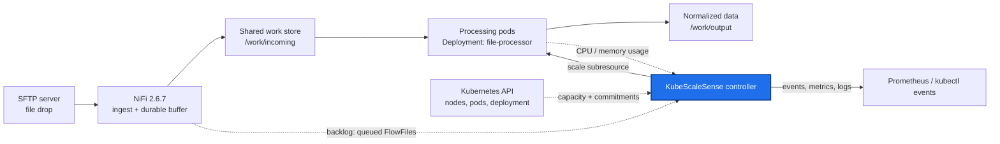
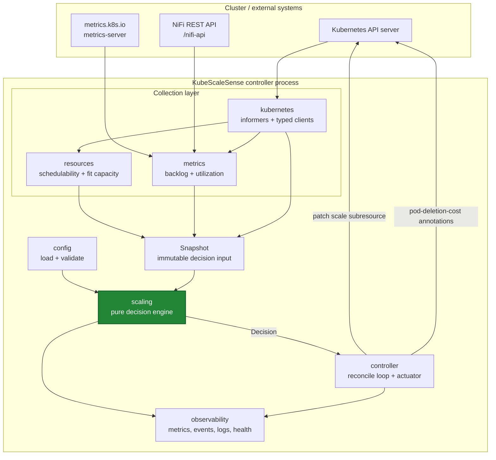
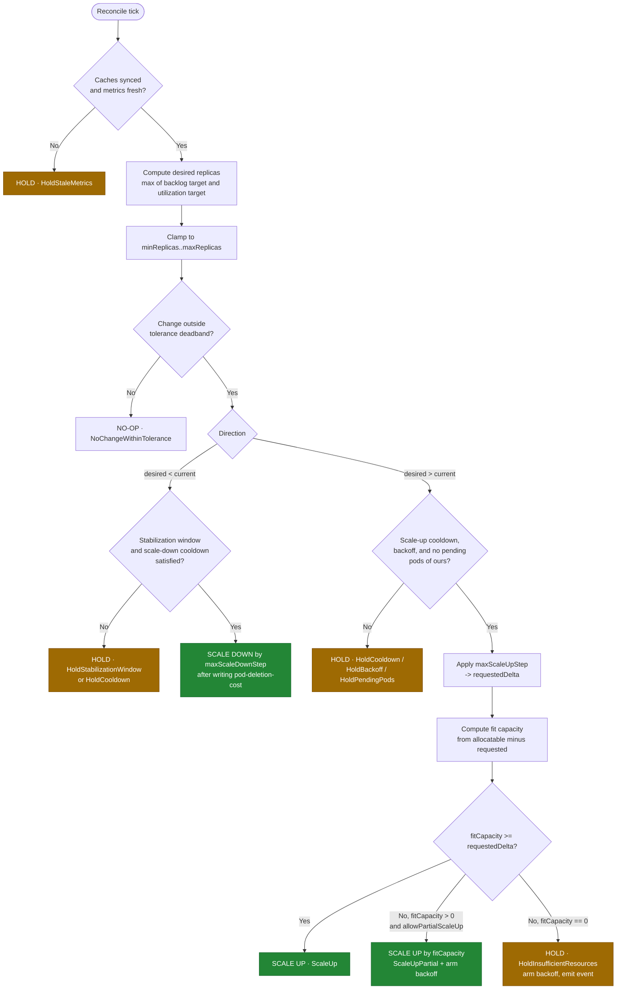
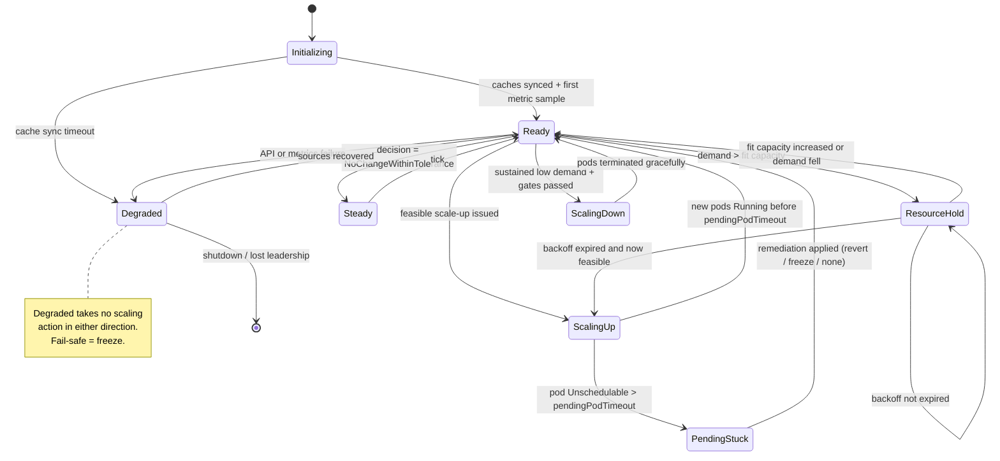

# KubeScaleSense — System Architecture

> Status: **Design (pre-implementation)** · Version: 0.1
> Canonical source for: system architecture, component responsibilities, RBAC, observability contract,
> and the architecture decision records (`ADR-xx`) that answer the project's critical design questions.

Related documents: [requirements](requirements.md) · [scaling-algorithm](scaling-algorithm.md) ·
[resource-calculation](resource-calculation.md) · [failure-scenarios](failure-scenarios.md) ·
[test-plan](test-plan.md) · [implementation-plan](implementation-plan.md)

---

## 1. Context

KubeScaleSense is a Go control-loop that sizes one processing `Deployment` from two independent inputs:
**workload demand** and **cluster schedulability**. The file-processing pipeline is the demonstration
workload; the controller is the deliverable.



Scope boundary, per [NG-1](requirements.md#3-non-goals): the controller scales **the processing pool only**.
NiFi is fixed-size and treated as a durable buffer. If NiFi later becomes the bottleneck, that is a separate
target workload with its own policy — not a change to this algorithm.

---

## 2. Architectural principles

| # | Principle | Consequence in the design |
| --- | --- | --- |
| P-1 | **Demand and feasibility are separate questions** | Two independent subsystems (`metrics`, `resources`) feed one decision engine; neither can alone authorize a scale-up |
| P-2 | **The decision engine is a pure function** | `Decide(Snapshot, Config, now) → Decision`. No clients, no clock, no logging inside. Makes the interesting logic exhaustively unit-testable ([NFR-06](requirements.md#5-non-functional-requirements)) |
| P-3 | **Conservative by construction** | Every estimate rounds against action: pessimistic fit capacity, headroom reserves, HOLD on doubt ([NFR-05](requirements.md#5-non-functional-requirements)) |
| P-4 | **Every decision is explainable** | One reason code per reconcile, propagated identically into logs, events, and metric labels |
| P-5 | **Read from caches, write rarely** | Informers for nodes/pods/deployment; a write only when the replica count actually changes ([NFR-04](requirements.md#5-non-functional-requirements)) |
| P-6 | **Estimator, not scheduler** | KubeScaleSense models a documented subset of scheduler predicates and treats the Pending-pod watchdog as the correctness backstop ([NG-6](requirements.md#3-non-goals)) |
| P-7 | **Minimal POC, documented evolution** | Single binary, ConfigMap config, one target. CRD, multi-target, and predicate fidelity are explicitly phased ([§10](#10-evolution-to-a-production-controller)) |

---

## 3. Logical architecture



The dashed boundary that matters: everything above `Snapshot` does I/O and is integration-tested against
fakes; `scaling` is pure and unit-tested exhaustively; `controller` is thin glue that performs the single
mutation a decision authorizes.

---

## 4. Component responsibilities

Proposed layout (Go module `github.com/jensilin/KubeScaleSense`):

```text
cmd/
  kubescalesense/main.go        # flags, config load, wiring, leader election, signal handling
internal/
  config/                       # schema, defaults, validation, env overrides
  kubernetes/                   # clients, informers, scale writes, event recorder
  resources/                    # node filtering, free-resource math, fit capacity
  metrics/                      # NiFi backlog, pod utilization, staleness
  scaling/                      # Snapshot, Decision, reason codes, pure Decide()
  controller/                   # reconcile loop, actuator, pending-pod watchdog, backoff state
  observability/                # Prometheus registry, health handlers, structured logging
config/                         # kubescalesense.yaml (defaults, examples)
deploy/                         # manifests: RBAC, Deployment, ConfigMap, demo pipeline (Phase 2+)
tests/                          # integration + e2e harness, scenario scripts
docs/                           # this design set
```

### 4.1 Config (`internal/config`)

Owns the schema in [requirements § 8](requirements.md#8-configuration-requirements). Loads YAML, applies
defaults, applies `KSS_*` env overrides, validates, and **fails fast** (CR-2). Validation includes the
cross-cutting checks that prevent an unsafe run: `minReplicas <= maxReplicas`, `interval >= 5s`, target pod
template declares CPU and memory requests ([A-03](requirements.md#6-workload-and-environment-assumptions)),
and no HPA exists for the target ([FR-19](requirements.md#4-functional-requirements)).

### 4.2 Kubernetes access layer (`internal/kubernetes`)

- Typed `client-go` clientset plus shared informers for `Node`, `Pod` (namespace-scoped for the target,
  cluster-scoped for node resource accounting), and the target `Deployment`.
- All reads in the reconcile path come from informer caches ([NFR-04](requirements.md#5-non-functional-requirements)); no per-reconcile `LIST`.
- Writes: `scale` subresource update with `resourceVersion` precondition ([FR-05](requirements.md#4-functional-requirements)), and `pod-deletion-cost` annotation patches.
- Owns the `EventRecorder` and the readiness signal derived from cache sync + informer health.

**Why plain client-go and not controller-runtime for v0.1:** the controller reconciles *one* object on a
timer and needs no scheme, webhook, or CRD machinery. Plain informers keep the binary and the mental model
small. Migration to controller-runtime is a Phase 4 item, motivated by the CRD, not by the loop.

### 4.3 Workload metrics collector (`internal/metrics`)

Produces the demand half of the snapshot:

| Signal | Source | Notes |
| --- | --- | --- |
| `backlogItems` | Sum of `queued.count` (FlowFiles) over `workload.nifi.connectionIDs` from `GET /nifi-api/flow/process-groups/{id}/status` or `GET /nifi-api/connections/{id}` | Primary demand signal. Optional EWMA smoothing ([scaling-algorithm § 8.4](scaling-algorithm.md#84-signal-smoothing)) |
| `backlogGrowthRate` | Difference of consecutive backlog samples per second | Phase 3 input for predictive scaling; recorded from Phase 1 for offline analysis |
| `podCPUUsage`, `podMemoryUsage` | `PodMetrics` from `metrics.k8s.io/v1beta1` for the target's pods | Averaged over **Ready** pods only; starting pods would drag the average down and suppress scale-up |
| `readyReplicas`, `currentReplicas` | Target `Deployment` status/spec | `readyReplicas` is the denominator for utilization |
| `sampleAge` | Newest sample timestamp vs. now | Drives `HoldStaleMetrics` ([FR-09](requirements.md#4-functional-requirements)) |

Each source is behind an interface (`BacklogSource`, `UtilizationSource`) with a fake for tests. A source
failure is recorded as `unavailable` in the snapshot rather than aborting the reconcile — the engine decides
what a missing signal means (usually: no scale-up, never a scale-down).

### 4.4 Resource discovery (`internal/resources`)

Produces the feasibility half of the snapshot: candidate node set, per-node free requestable CPU/memory and
pod slots, effective pod request of the target, and total fit capacity. Full algorithm and worked example in
[resource-calculation](resource-calculation.md). This component contains **no policy** — it answers "how
many more of this pod fit right now?" and nothing about whether to use them.

### 4.5 Decision engine (`internal/scaling`)

The pure core (P-2). Input: `Snapshot` (demand + feasibility + history + clock reading). Output: `Decision`
{`targetReplicas`, `reason`, `details`, `requeueAfter`}. Implements desired-replica computation, clamping,
step limits, stability gates, feasibility gating, partial scale-up, and backoff arithmetic. Specified in
[scaling-algorithm](scaling-algorithm.md).

### 4.6 Controller (`internal/controller`)

The only stateful, side-effecting component:

- Ticks every `controller.interval`, builds the snapshot, calls `Decide`, actuates at most one mutation.
- Holds the small amount of state the engine needs but cannot derive from the cluster: `lastScaleUpTime`,
  `lastScaleDownTime`, `desiredHistory` (ring buffer for the stabilization window), `holdBackoff`
  (attempts + next-eligible time), `lastGoodReplicas`.
- Runs the **pending-pod watchdog** ([FR-20](requirements.md#4-functional-requirements),
  [FS-06](failure-scenarios.md#fs-06-newly-created-pod-stays-pending)).
- State is in-memory and intentionally not persisted: after a restart the controller re-derives everything
  from the cluster and behaves as if freshly cooled down ([NFR-08](requirements.md#5-non-functional-requirements)).

### 4.7 Observability (`internal/observability`)

Prometheus registry, `/healthz`, `/readyz`, structured JSON logging with a stable field set. Contract in [§8](#8-observability-requirements).

---

## 5. Scaling decision flow

### 5.1 Decision pipeline



Note the ordering choice: **demand is computed before feasibility**, and feasibility is evaluated only on the
scale-up path. This keeps the expensive node walk off the common no-op path, and it means a HOLD always
carries a concrete "we wanted N, we can place M" statement rather than an abstract capacity report.

### 5.2 One reconcile, end to end

```mermaid
sequenceDiagram
    autonumber
    participant T as Ticker
    participant C as controller
    participant M as metrics
    participant N as NiFi API
    participant R as resources
    participant I as informer cache
    participant E as scaling.Decide
    participant K as API server

    T->>C: tick (interval 15s)
    C->>M: CollectDemand()
    M->>N: GET queued FlowFile counts
    M->>I: PodMetrics + Deployment status
    M-->>C: backlog=400, avgCPU=88%, age=6s
    C->>R: Feasibility(podTemplate)
    R->>I: list Nodes + all Pods (cache)
    R-->>C: candidateNodes=2, fitCapacity=4, blocked=cpu
    C->>E: Decide(snapshot, config, now)
    E-->>C: ScaleUp to 6 (delta 4, feasible)
    C->>K: update scale (replicas=6, resourceVersion precondition)
    K-->>C: 200 OK
    C->>K: Event: ScaledUp 2 -> 6, backlog 400, fit 4
    C->>C: lastScaleUpTime=now; reset holdBackoff
```

### 5.3 Controller state machine



---

## 6. Data model — the decision snapshot

The snapshot is the contract between the I/O layers and the pure engine, and the unit of test fixtures.

```go
type Snapshot struct {
    Now time.Time

    // Target
    CurrentReplicas int32
    ReadyReplicas   int32
    MinReplicas     int32
    MaxReplicas     int32
    PodRequest      Resources // effective per-pod request: CPU milli, memory bytes

    // Demand
    Backlog        Signal[int64]   // value + sampledAt + available
    AvgCPUPercent  Signal[float64] // of request, over Ready pods
    AvgMemPercent  Signal[float64]

    // Feasibility
    FitCapacity     int32        // additional target pods placeable now
    CandidateNodes  int32
    BlockingReason  ResourceDim  // cpu | memory | podSlots | none
    FreeCPUMilli    int64        // aggregate over candidate nodes, for reporting
    FreeMemoryBytes int64

    // History (owned by controller)
    LastScaleUp     time.Time
    LastScaleDown   time.Time
    DesiredHistory  []DesiredSample // for the stabilization window
    HoldBackoff     BackoffState
    LastGoodReplicas int32
    PendingOurPods  int32
    OldestPendingAge time.Duration
}
```

`Signal[T]` carries `available` and `sampledAt` so the engine — not the collector — decides what a missing or
stale input means. That is the difference between a controller that "does something reasonable" and one whose
behaviour on partial failure is specified and tested ([FS-09](failure-scenarios.md#fs-09-kubernetes-api-failure)).

---

## 7. Kubernetes permissions and RBAC

Least privilege ([FR-25](requirements.md#4-functional-requirements)). Two bindings: a small `ClusterRole` for
cluster-scoped resource discovery, and a namespaced `Role` for the target and coordination objects.

| Resource | API group | Verbs | Scope | Why |
| --- | --- | --- | --- | --- |
| `nodes` | core | get, list, watch | Cluster | Allocatable, taints, labels, conditions ([FR-11](requirements.md#4-functional-requirements), [FR-12](requirements.md#4-functional-requirements)) |
| `pods` | core | get, list, watch | Cluster | Sum requests per node — pods of *other* namespaces consume the same node budget |
| `nodes`, `pods` | metrics.k8s.io | get, list | Cluster | Utilization signal ([FR-07](requirements.md#4-functional-requirements)) |
| `deployments` | apps | get, list, watch | Namespace | Read spec/status + pod template for the effective request |
| `deployments/scale` | apps | get, update, patch | Namespace | The one mutation that changes replica count ([FR-01](requirements.md#4-functional-requirements)) |
| `pods` | core | patch | Namespace | `pod-deletion-cost` annotation ([FR-21](requirements.md#4-functional-requirements)) |
| `horizontalpodautoscalers` | autoscaling | get, list, watch | Namespace | Conflict detection ([FR-19](requirements.md#4-functional-requirements)) |
| `events` | core / events.k8s.io | create, patch | Namespace | Decision audit trail ([FR-24](requirements.md#4-functional-requirements)) |
| `leases` | coordination.k8s.io | get, create, update | Namespace | Leader election ([FR-26](requirements.md#4-functional-requirements)) |

**Deliberately excluded:**

- No `delete` on pods. Scale-down goes through the ReplicaSet controller so that PDBs, graceful termination,
  and `preStop` hooks apply. Direct pod deletion would bypass exactly the protections
  [D-05](requirements.md#7-data-loss-protection-assumptions) depends on.
- No write access to nodes: no cordon, no taint, no eviction.
- No `deployments` `update` — only `deployments/scale`, so a bug cannot rewrite the pod template.
- No secrets access beyond the single mounted NiFi credential `Secret` (mounted as a file, not read via API).

Pod hardening: non-root, read-only root filesystem, all capabilities dropped, `seccompProfile:
RuntimeDefault`, no service account token beyond the controller's own.

---

## 8. Observability requirements

### 8.1 Metrics (Prometheus, port 8080, canonical names)

| Metric | Type | Labels | Purpose |
| --- | --- | --- | --- |
| `kss_reconcile_total` | counter | `reason` | Decision distribution — the primary behavioural signal |
| `kss_reconcile_duration_seconds` | histogram | `phase` | [NFR-02](requirements.md#5-non-functional-requirements) budget |
| `kss_last_reconcile_timestamp_seconds` | gauge | — | Liveness of the loop; alert if stale > 3 × `interval` |
| `kss_scale_actions_total` | counter | `direction`, `outcome` | Actual mutations vs. conflicts/errors |
| `kss_current_replicas` / `kss_desired_replicas` | gauge | — | Divergence between the two is the "unmet demand" signal |
| `kss_desired_replicas_uncapped` | gauge | — | Desired before clamp/step, exposes `maxReplicas` saturation |
| `kss_backlog_items` | gauge | `source` | Demand input, raw |
| `kss_backlog_items_smoothed` | gauge | — | What the engine actually used |
| `kss_avg_cpu_utilization_percent` / `kss_avg_memory_utilization_percent` | gauge | — | Demand input, relative to request |
| `kss_metric_sample_age_seconds` | gauge | `signal` | Staleness watch ([FR-09](requirements.md#4-functional-requirements)) |
| `kss_fit_capacity_pods` | gauge | — | **The headline resource-awareness metric** |
| `kss_fit_capacity_blocking_dimension` | gauge | `dimension` | 1 for the binding constraint: cpu / memory / podSlots |
| `kss_candidate_nodes` / `kss_excluded_nodes` | gauge | `exclusion_reason` | Why the candidate set shrank: notReady, cordoned, taint, selector, affinity |
| `kss_free_requestable_cpu_millicores` / `kss_free_requestable_memory_bytes` | gauge | — | Aggregate headroom on candidate nodes |
| `kss_node_free_requestable_cpu_millicores` | gauge | `node` | Per-node detail; cardinality-bounded by cluster size |
| `kss_insufficient_resource_holds_total` | counter | `dimension` | How often demand exceeded capacity |
| `kss_hold_backoff_seconds` | gauge | — | Current backoff interval ([FR-18](requirements.md#4-functional-requirements)) |
| `kss_pending_target_pods` | gauge | — | Pods of ours in Pending |
| `kss_pending_pod_remediations_total` | counter | `action` | Watchdog interventions ([FS-06](failure-scenarios.md#fs-06-newly-created-pod-stays-pending)) |
| `kss_api_errors_total` | counter | `resource`, `verb`, `code` | API health ([FS-09](failure-scenarios.md#fs-09-kubernetes-api-failure)) |
| `kss_leader` | gauge | — | 1 if this replica is leader |
| `kss_config_info` | gauge | key config values | Correlate behaviour with configuration in the demo |

### 8.2 Kubernetes Events

On the target `Deployment`, so `kubectl describe deployment file-processor` explains the pipeline's behaviour:

| Reason | Type | Example message |
| --- | --- | --- |
| `ScaledUp` | Normal | `2 -> 6 (backlog 400, itemsPerReplica 50, fitCapacity 4)` |
| `ScaledUpPartial` | Warning | `2 -> 4 of 6 desired; fitCapacity 2, blocking dimension cpu` |
| `ScaledDown` | Normal | `6 -> 5 (backlog 30 for 300s, stabilization window satisfied)` |
| `InsufficientClusterResources` | Warning | `need 4 pods of 500m/512Mi, can place 0; candidate nodes 2/3, blocking cpu; retry in 30s` |
| `PodPendingTimeout` | Warning | `pod file-processor-x unschedulable for 124s; reverting 6 -> 2` |
| `ScalingConflict` | Warning | `HPA hpa/file-processor targets the same Deployment; refusing to scale` |
| `MetricsUnavailable` | Warning | `NiFi backlog source unavailable for 75s; holding` |

Event emission for repeating HOLD states is rate-limited to once per backoff cycle to avoid event spam
([FR-24](requirements.md#4-functional-requirements)).

### 8.3 Structured logging

One `info` line per reconcile with a stable field set, so a demo run is fully auditable
([NFR-10](requirements.md#5-non-functional-requirements)):

```json
{"level":"info","msg":"decision","reason":"HoldInsufficientResources",
 "current":2,"desiredRaw":8,"desiredClamped":8,"stepLimited":6,"requestedDelta":4,
 "backlog":400,"backlogSmoothed":372,"avgCpuPct":88,"sampleAgeSec":6,
 "podRequestCpuMilli":500,"podRequestMemMiB":512,
 "candidateNodes":2,"excludedNodes":{"cordoned":1},"fitCapacity":0,"blocking":"cpu",
 "freeCpuMilli":400,"freeMemMiB":1792,"backoffSec":30,"nextEligible":"2026-09-10T16:41:12Z"}
```

`debug` adds the per-node fit breakdown. Health: `/healthz` = process/loop alive; `/readyz` = caches synced,
config valid, leader (or intentionally passive).

---

## 9. Architecture decision records

Each ADR answers one of the project's critical design questions. Format: decision, rationale, rejected
alternatives, consequences.

### ADR-01: What exactly is being scaled?

**Decision.** One `Deployment` of stateless processing pods (`data-pipeline/file-processor`), via its `scale`
subresource. Not NiFi, not nodes, not pod size, not the SFTP server.

**Rationale.** The processing pool is the only pipeline component that is stateless per item
([A-01](requirements.md#6-workload-and-environment-assumptions)), horizontally scalable, and the actual
bottleneck under a file spike. NiFi 2.6.7 holds flow state and repositories; adding/removing NiFi nodes
requires cluster-coordinator participation and flow rebalancing, which is a different problem with a
different risk profile.

**Rejected.** *StatefulSet target* — ordinal identity and per-pod PVCs make replica changes non-interchangeable.
*Scaling NiFi too* — [NG-1](requirements.md#3-non-goals); revisit only if NiFi ingestion becomes the measured
bottleneck. *Job/Queue-per-item (a Job per file)* — a clean model, but it moves the problem to Job admission
and loses the "resource-aware replica count" thesis this project exists to explore.

**Consequences.** Replica count is the single actuation knob. The controller needs no knowledge of item
identity, which is why an incorrect decision can only affect throughput ([§7 of requirements](requirements.md#7-data-loss-protection-assumptions)).

### ADR-02: How should the desired replica count be calculated?

**Decision.**

```text
desiredBacklog    = ceil(backlogSmoothed / itemsPerReplica)
desiredUtilization = ceil(readyReplicas × avgCPUPercent / targetCPUUtilizationPercent)
desiredRaw        = max(desiredBacklog, desiredUtilization)
```

then clamp to `[minReplicas, maxReplicas]`, apply the tolerance deadband, then apply step limits.

**Rationale.** Backlog is the *leading* indicator: it rises the instant files arrive, before CPU responds, and
it is what the pipeline's latency SLO is actually about. Utilization is the *trailing* safety net: it catches
the case where items are unexpectedly expensive (large or complex files) so the per-replica assumption in
`itemsPerReplica` is wrong. `max()` means either signal can *ask* for capacity but both must be low to permit
a scale-down — which is the conservative direction ([FR-22](requirements.md#4-functional-requirements)).

**Rejected.** *Utilization only (HPA-equivalent)* — reacts after latency has already grown, and a queue that
is backed up while pods idle on I/O reads as "not busy". *Backlog only* — mis-sized `itemsPerReplica` becomes
silent under-provisioning. *Sum or average of the two* — no defensible unit, and averaging lets a low signal
mask a high one. *Queueing-theory / drain-time model* (`replicas = arrivalRate × serviceTime`) — better in
principle, needs a measured service-time distribution; deferred to Phase 3 once Phase 1 has recorded
`backlogGrowthRate`.

**Consequences.** Two tunables with clear physical meaning. `itemsPerReplica` is derived empirically in the
Phase 2 load tests, not guessed.

### ADR-03: How should available CPU be calculated?

**Decision.** Per candidate node:
`freeCPU(n) = allocatable.cpu(n) − Σ requests.cpu(non-terminal pods on n) − perNodeReserveCPUMilli`,
floored at zero. Aggregate only for reporting; decisions use per-node values
([resource-calculation § 4](resource-calculation.md#4-step-3--per-node-free-requestable-resources)).

**Rationale.** This mirrors what `kube-scheduler`'s `NodeResourcesFit` plugin actually checks: requests
against allocatable, per node. Requests are the cluster's *committed* budget; a pod requesting 2 cores but
using 50 m still blocks 2 cores of scheduling. The reserve absorbs the pods that will land during our decision
window (DaemonSet rollouts, other controllers) and the drift between our cached view and reality.

**Rejected.** *Capacity-based* — ignores kube/system-reserved and eviction thresholds, over-estimates.
*Usage-based (`allocatable − current usage`)* — the central mistake this project is built to avoid: it
"discovers" free CPU that the scheduler has already promised to idle pods, producing exactly the Pending pods
in the problem statement. *Aggregate cluster free CPU / pod request* — the fragmentation error: 10 nodes with
400 m free each is 4 cores of "free CPU" and zero placements for a 500 m pod.

**Consequences.** Estimates are pessimistic relative to a real scheduler (which can also preempt and which
sees burstable overcommit). Pessimism is the accepted bias ([NFR-05](requirements.md#5-non-functional-requirements)).

### ADR-04: How should available memory be calculated?

**Decision.** Identical structure to CPU — `allocatable − Σ requests − perNodeReserveMemoryMiB` per node —
evaluated **as an independent dimension**, never traded off against CPU. Per-node fit is
`min(cpuFit, memFit, podSlotFit)`.

**Rationale.** The scheduler requires *every* resource dimension to fit simultaneously, so the binding
constraint is the minimum, and reporting *which* dimension binds is what makes a HOLD actionable
(`kss_fit_capacity_blocking_dimension`). Memory deserves special care because it is incompressible: CPU
over-commitment causes throttling and slow processing, whereas memory over-commitment causes OOM kills and
node-pressure eviction — which can kill *already-running* healthy workers and interrupt in-flight items
([FS-11](failure-scenarios.md#fs-11-node-memory-pressure-evicts-running-workers)). Hence a memory reserve
that is deliberately generous relative to the pod size.

**Rejected.** *Weighted resource score across dimensions* — appropriate for choosing among feasible nodes
(scheduler scoring), wrong for deciding feasibility. *Ignoring memory because the workload is CPU-bound* —
file processing buffers content; memory is frequently the real limit.

### ADR-05: Capacity, allocatable, or requested?

**Decision.** **Allocatable minus requested**, per node, on the filtered candidate set. Capacity is used only
for human-facing reporting; usage is used only for the demand signal.

| Basis | What it answers | Why not the feasibility basis |
| --- | --- | --- |
| `capacity` | Hardware size | Includes kube-reserved, system-reserved, eviction thresholds → over-estimates, schedules pods the kubelet will fight |
| **`allocatable − requests`** | **What the scheduler can still commit** | **Chosen: matches `NodeResourcesFit`** |
| `allocatable − usage` | Instantaneous slack | Ignores existing commitments; idle-but-reserved capacity looks free → Pending pods |
| `limits`-based | Worst-case burst ceiling | Limits are not a scheduling input at all; sums typically exceed allocatable by design |

**Consequences.** The controller depends on the workload declaring honest requests
([A-03](requirements.md#6-workload-and-environment-assumptions)); startup validation enforces their presence.
Documented in the demo narrative because it is the project's central insight.

### ADR-06: How do we determine whether N additional pods are likely schedulable?

**Decision.** A conservative greedy per-node fit count:
`fitCapacity = Σ over candidate nodes min(⌊freeCPU/reqCPU⌋, ⌊freeMem/reqMem⌋, freePodSlots) − fitCapacityMarginPods`,
compared against `requestedDelta`. Full derivation and worked example in
[resource-calculation § 5](resource-calculation.md#5-step-4--fit-capacity).

**Rationale.** Counting per node and summing respects fragmentation, which an aggregate calculation cannot.
Because target pods are identical ([A-02](requirements.md#6-workload-and-environment-assumptions)), greedy
counting is exact for the modelled predicates — no bin-packing search needed. The pod-slot term catches the
`maxPods` (default 110) limit that resource math alone misses. The margin covers the modelled-vs-real gap.

**Rejected.** *Running the real scheduler / a simulator* (`kube-scheduler-simulator`, scheduler framework
in-process) — highest fidelity, but a heavy dependency that must track the cluster's scheduler version and
configuration; a Phase 5 option, over-engineering for the POC
([P-7](#2-architectural-principles)). *Dry-run pod creation* — creating and deleting a probe pod is a real
mutation with real side effects (webhooks, quota consumption, noise) and does not answer "can N fit".
*Optimistic scale then observe* — this *is* the HPA behaviour being replaced.

**Consequences.** KubeScaleSense can be wrong in one direction (thinks a pod fits when it does not, due to
unmodelled predicates such as topology spread), so the Pending-pod watchdog is mandatory, not optional
([ADR-13](#adr-13-what-happens-if-a-newly-created-pod-stays-pending)).

### ADR-07: How do taints and tolerations affect the calculation?

**Decision.** A node is excluded from the candidate set if it carries any `NoSchedule` or `NoExecute` taint
not tolerated by the target pod template. `PreferNoSchedule` taints are ignored (they do not prevent
placement). Tolerations are evaluated with full Kubernetes semantics: operators `Equal`/`Exists`, empty key
with `Exists` matching all taints, empty effect matching all effects.

**Rationale.** Untolerated `NoSchedule` is a hard predicate; counting such a node's free CPU would inflate fit
capacity and produce the exact Pending outcome we exist to prevent. This is also the mechanism behind the
common real-world surprise: a control-plane node showing gigabytes of "free" resources that no application pod
can ever use — in the kind demo, the control-plane node's
`node-role.kubernetes.io/control-plane:NoSchedule` taint must reduce the candidate set, and the test asserts it
([resource-calculation § 6](resource-calculation.md#6-predicates-modelled-and-predicates-ignored)).

**Rejected.** *Ignoring taints in v0.1* — cheap, but breaks on every real cluster and on the kind demo itself.
*Modelling `NoExecute` `tolerationSeconds` eviction timing* — affects eviction, not admission; out of scope.

**Consequences.** Nodes excluded by taint are reported via `kss_excluded_nodes{exclusion_reason="taint"}`,
which turns a puzzling HOLD into a one-glance explanation.

### ADR-08: How do node affinity rules affect the calculation?

**Decision.** Honour `nodeSelector` and
`affinity.nodeAffinity.requiredDuringSchedulingIgnoredDuringExecution` (full `nodeSelectorTerms` OR-of-ANDs
semantics, including `In`, `NotIn`, `Exists`, `DoesNotExist`, `Gt`, `Lt`). Treat
`preferredDuringScheduling…` as non-binding (ignored for feasibility). Inter-pod affinity/anti-affinity and
topology spread constraints are **not** modelled in v0.1 ([NG-7](requirements.md#3-non-goals)).

**Rationale.** Required node affinity and `nodeSelector` are hard predicates evaluable from node labels alone
— cheap and exact. Preferred affinity only reorders candidates. Inter-pod rules are fundamentally different:
their outcome depends on where the *new* pods land, so evaluating them requires simulating placement, and a
naive evaluation is worse than none.

**Rejected.** *Modelling anti-affinity approximately* (e.g. "one pod per node if anti-affinity present") —
tempting and often right, but silently wrong for `topologyKey`s other than hostname and for `maxSkew > 1`.
Instead: documented limitation + watchdog backstop, and a Phase 3 item to support the common
hostname-anti-affinity case explicitly.

**Consequences.** For a target using pod anti-affinity or topology spread, fit capacity may be an
over-estimate; the Pending watchdog catches it, and the limitation is stated in
[failure-scenarios § FS-05](failure-scenarios.md#fs-05-unmodelled-scheduling-predicate-causes-a-wrong-fit-estimate).

### ADR-09: What happens when demand is high but resources are insufficient?

**Decision.** Scale by whatever fits and hold the rest — `ScaleUpPartial` when
`0 < fitCapacity < requestedDelta` and `allowPartialScaleUp` is true; `HoldInsufficientResources` when
`fitCapacity == 0`. In both cases: arm exponential backoff, emit a `Warning` event once per backoff cycle,
increment `kss_insufficient_resource_holds_total{dimension}`, and keep `kss_desired_replicas` at the true
desired value so the unmet demand stays visible.

**Rationale.** Partial progress is strictly better than none — three of four needed pods drain the backlog
slower but they drain it, and they consume capacity the cluster genuinely has. Holding the remainder is the
core thesis: an unschedulable pod adds no throughput while adding scheduler churn, alarming Pending pods, and
(under memory pressure) risk to healthy workers. Crucially, **HOLD is not silent**: the divergence between
`kss_desired_replicas` and `kss_current_replicas` is the signal that a human (or, later, a cluster autoscaler)
must add nodes. The controller's job is to convert an invisible reliability problem into a visible capacity
problem.

**Rejected.** *Scale anyway and let the scheduler sort it out* — the HPA behaviour and the reason this project
exists. *Hold entirely rather than partially* — leaves usable capacity idle during an incident; available as
`allowPartialScaleUp: false` for operators who prefer all-or-nothing. *Evict lower-priority workloads to make
room* — requires priority/preemption ([NG-8](requirements.md#3-non-goals)) and turns an autoscaler into a
cluster arbiter.

**Consequences.** The SLO can be missed while the controller is behaving correctly. That is the honest outcome
of a capacity shortfall, and the recommended alert is precisely
`kss_desired_replicas > kss_current_replicas` sustained for 5 minutes.

### ADR-10: How do we avoid replica oscillation?

The 1→2→1→2 flapping case.

**Decision.** Four independent damping mechanisms, all specified in
[scaling-algorithm § 8](scaling-algorithm.md#8-hysteresis-and-oscillation-control):

1. **Deadband** — ignore changes within `tolerancePercent` (10 %) of current replicas.
2. **Asymmetric cooldowns** — 60 s up, 300 s down: react fast, retreat slowly.
3. **Scale-down stabilization window** — scale down only if `max(desired over 300s) < current`, so a single
   quiet sample can never trigger a scale-down.
4. **EWMA smoothing** of the backlog signal (α = 0.4) to damp sampling noise.

**Rationale.** Oscillation is a control-theory problem: it comes from acting on a noisy signal with a fast
feedback path and a symmetric response. `max()` over the window is the key asymmetry — the same trick the HPA
uses — because the cost of a late scale-down (a little waste) is far below the cost of a wrong one (evicted
pods, re-processed items, thrash). Independent mechanisms cover independent causes: deadband handles
rounding at the boundary, the window handles genuine bursty idleness, smoothing handles sampler noise, and
cooldowns bound the worst-case action rate regardless.

**Rejected.** *A single long cooldown* — either too slow to react to spikes or too weak to stop flapping.
*Hard-coded pod lifetime minimums* — blunt, and does not prevent up/down/up around a threshold. *PID
controller* — real oscillation control, but needs tuning nobody will do for a POC and is hard to explain in a
decision log.

**Consequences.** Worst-case action rate is bounded: at most one scale-up per 60 s and one scale-down per
300 s. Scale-down after a spike takes ~5 minutes — an intentional trade documented in the demo.

### ADR-11: How do we avoid repeatedly attempting an impossible scale?

**Decision.** Exponential backoff on infeasible scale-ups: 30 s → 60 s → … → 15 m cap, `factor 2`. While
backoff is active the decision is `HoldBackoff` and no `scale` write is attempted. Backoff resets immediately
when any of these changes materially: fit capacity increases, a scale action succeeds, or desired replicas
falls to or below current. Events are emitted once per backoff cycle, not per reconcile.

**Rationale.** Without backoff, an infeasible demand produces a decision every `interval` forever: log spam,
event spam (which itself pressures the API server), and a metrics series that cannot distinguish "one problem
persisting" from "many problems". Resetting on *capacity increase* rather than on a timer is what makes the
controller responsive the moment an operator adds a node or another workload releases resources — a
level-triggered reset on the input that matters, not an edge-triggered guess.

**Rejected.** *Fixed retry interval* — either too chatty or too slow to notice recovery. *Giving up
permanently until restarted* — an operator adding a node would see no reaction. *Backoff keyed to the exact
requested delta* — considered, but demand legitimately changes during an incident and re-keying resets the
backoff too eagerly; keying on "infeasible-ness" with a capacity-change reset is simpler and behaves better.

**Consequences.** Recovery latency after capacity appears is one `interval` (≤ 15 s), not one backoff period —
because the reset is driven by observed capacity, and the informer sees a new node immediately.

### ADR-12: How do we avoid stale resource information?

**Decision.** Layered defences:

1. **Watch, don't poll** — informers deliver node/pod changes in near real time; no periodic full `LIST`.
2. **Explicit sample ages** — every signal carries `sampledAt`; the engine refuses to act on anything older
   than `metricsStaleAfter` (`HoldStaleMetrics`), and never scales *down* on stale data.
3. **No action before caches sync** ([NFR-08](requirements.md#5-non-functional-requirements)).
4. **Re-read before commit** — the resource snapshot is built immediately before `Decide`, and the `scale`
   write carries a `resourceVersion` precondition; a `409 Conflict` discards the decision and re-runs the
   loop rather than retrying a stale value ([FR-05](requirements.md#4-functional-requirements)).
5. **Node heartbeat check** — nodes whose `Ready` condition heartbeat is older than the node-monitor grace
   period are excluded from the candidate set: a silent node's "free" resources are not usable.
6. **Headroom as slack for the irreducible race** — between our read and the scheduler's placement, other
   controllers may consume capacity; `perNodeReserve*` and `fitCapacityMarginPods` absorb it.

**Rationale.** Some staleness is unavoidable in a distributed system, so the design combines *reducing* it
(watches, late snapshot) with *tolerating* it (headroom) and *detecting* it (ages, preconditions).

**Rejected.** *Bypassing the informer cache with direct `LIST` calls before each decision* — measurably worse
for API load ([NFR-04](requirements.md#5-non-functional-requirements)) and barely fresher than a synced watch.
*Trusting the cache unconditionally* — no defence against a partitioned watch.

### ADR-13: What happens if a newly created pod stays Pending?

**Decision.** A watchdog tracks pods owned by the target's current ReplicaSet. A pod in `Pending` with
`PodScheduled=False` (reason `Unschedulable`) for longer than `pendingPodTimeout` (120 s) triggers
`pending.onPendingTimeout`:

- **`revert`** (default) — scale back to `lastGoodReplicas`, emit `PodPendingTimeout`, arm backoff. This
  removes the unschedulable pod through the ReplicaSet controller (no direct pod deletion, so PDBs and
  graceful termination still apply).
- **`freeze`** — keep replicas, block further scale-ups until the pod schedules or is removed.
- **`none`** — report only; for debugging.

Independently, **any** Pending pod of ours blocks further scale-ups (`HoldPendingPods`) — the controller never
stacks a second unschedulable request on top of the first.

**Rationale.** A stuck Pending pod is the observable signature of a wrong fit estimate — an unmodelled
predicate ([ADR-08](#adr-08-how-do-node-affinity-rules-affect-the-calculation)), a namespace `ResourceQuota`
([NG-10](requirements.md#3-non-goals)), a missing PVC, or a capacity race. Because
[ADR-06](#adr-06-how-do-we-determine-whether-n-additional-pods-are-likely-schedulable) knowingly models a
*subset* of predicates, this backstop is what makes the honest claim "we won't leave pods Pending" true in
practice rather than only in the modelled world. `revert` is the default because a Pending pod is pure
liability: no throughput, plus scheduler churn.

**Rejected.** *Deleting the Pending pod directly* — the ReplicaSet controller would immediately recreate it;
the replica count is the real cause. *Waiting indefinitely* — correct only when a cluster autoscaler is
present, which is [NG-2](requirements.md#3-non-goals); `onPendingTimeout: none` covers that case later.

**Consequences.** A `revert` can fight a genuinely-transient condition (e.g. a node rebooting), which is why
the timeout is 120 s rather than seconds, and why reverting arms the backoff instead of retrying immediately.

### ADR-14: What happens if Kubernetes API calls fail?

**Decision.** Fail-safe means **freeze**, not guess:

| Failure | Behaviour |
| --- | --- |
| Read failure / watch desync | Serve the last synced cache; if the affected signal exceeds `metricsStaleAfter`, decide `HoldStaleMetrics`. Never scale down on unavailable data |
| `scale` write, transient (`5xx`, timeout, throttle) | Retry with jittered backoff inside the reconcile, bounded by `interval`; then abandon and re-decide next tick |
| `scale` write, `409 Conflict` | Discard the decision, re-read, re-decide ([FR-05](requirements.md#4-functional-requirements)) |
| `403`/`404` (RBAC or target missing) | Treat as fatal configuration error: log, event, `/readyz` fails, no retry storm |
| Metrics API unavailable | Degrade to backlog-only, emit `MetricsUnavailable`, and (Phase 3) require both signals before scale-down |
| Lost leadership | Stop deciding immediately; exit so the new leader starts from a clean, cooled-down state |

All API errors increment `kss_api_errors_total{resource,verb,code}` and are surfaced through `/readyz`.

**Rationale.** In an autoscaler, the null action is the safe action: holding a replica count that was
appropriate a minute ago is almost always better than acting on unknown state. The one thing never to do
under uncertainty is scale *down*, since that terminates pods holding in-flight items.

**Rejected.** *Aggressive retry until success* — amplifies an API-server incident. *Assuming "no data means
idle"* — would scale a busy pipeline to `minReplicas` precisely during an outage.

### ADR-15: How do we protect data processing when a worker pod crashes?

**Decision.** Durability lives in the workload design, not the controller. Required properties are
[D-01…D-07](requirements.md#7-data-loss-protection-assumptions): NiFi's durable repositories, a claim-based
(pull) work store, atomic-rename output with delete-after-commit, an in-flight reaper for hard crashes,
graceful drain via `preStop` + generous `terminationGracePeriodSeconds`, `pod-deletion-cost` so scale-down
removes idle pods first, and a `PodDisruptionBudget`. The controller's contributions are narrow and
deliberate: it never deletes pods directly, it writes deletion costs, and it avoids the resource exhaustion
that causes *involuntary* eviction of healthy workers.

**Rationale.** A pod can die at any instant for reasons no autoscaler controls — OOM, node failure, spot
reclaim, `kubectl delete`. Any design where a scaling decision can lose data is broken independently of the
autoscaler. Making the queue durable and pull-based reduces the blast radius of *every* wrong decision to
"an item is processed later, possibly twice" — which [D-03](requirements.md#7-data-loss-protection-assumptions)
makes harmless. This is why the project's data-loss claim is phrased as an assumption set on the pipeline and
verified by [test-plan § 6](test-plan.md#6-data-integrity-scenarios), rather than as a controller feature.

**Rejected.** *Exactly-once processing* — needs distributed transactions across SFTP, NiFi, and the output
store; at-least-once with idempotent writes is the standard, cheaper answer. *Controller-orchestrated
drain (query pods, wait, then delete)* — duplicates what `preStop` and graceful termination already do, and
requires pod-delete permission we deliberately do not hold ([§7](#7-kubernetes-permissions-and-rbac)).

### ADR-16: How will this be demonstrated in a local Kubernetes environment?

**Decision.** A `kind` cluster with one control-plane and three workers, deliberately **small and
heterogeneous** so resource exhaustion is reachable on a laptop, plus `metrics-server`, a single-node NiFi
2.6.7 StatefulSet, an `atmoz/sftp` server, a shared work store, and a file generator. Five scripted scenarios
(happy-path spike, insufficient resources, capacity restored, node cordon, pod crash) drive the demo; full
setup and expected outputs in [test-plan § 7](test-plan.md#7-local-demonstration-environment).

**Rationale.** The interesting behaviour — HOLD instead of Pending — only appears in a cluster that can run
out of room. Constraining worker sizes makes that a two-command demo instead of a cloud-scale exercise. Node
*heterogeneity* is essential: it is what makes fragmentation visible, so the demo can show that "4 cores free
in the cluster" and "no room for a 500 m pod" are compatible statements.

**Rejected.** *minikube single node* — a one-node cluster cannot demonstrate fragmentation or the taint
exclusion of the control-plane node; supported but not the reference environment. *A managed cloud cluster* —
cost, and a cluster autoscaler would silently paper over the very condition being demonstrated.

---

## 10. Evolution to a production controller

The POC is intentionally small; each step below is additive and none invalidates the algorithm.

| Concern | POC (v0.1) | Production direction |
| --- | --- | --- |
| API surface | ConfigMap YAML, one target | `ScalingPolicy` CRD with status conditions; many targets, one controller |
| Framework | client-go + informers | controller-runtime, once a CRD justifies the scheme/manager machinery |
| Predicate fidelity | CPU, memory, pod slots, taints, nodeSelector, required node affinity | Add topology spread and hostname anti-affinity; optionally the scheduler framework in-process ([ADR-06](#adr-06-how-do-we-determine-whether-n-additional-pods-are-likely-schedulable)) |
| Quota | Reactive via Pending watchdog | Proactive `ResourceQuota`/`LimitRange` modelling ([NG-10](requirements.md#3-non-goals)) |
| Demand model | Backlog + CPU utilization | Drain-time/queueing model using measured service time; SLO-driven target latency |
| Capacity shortfall | HOLD + alert | Cooperate with cluster autoscaler: express demand as a pending-capacity signal, then trust it to add nodes |
| Multi-tenancy | Single namespace | Per-namespace policies, fair-share arbitration between competing workloads |
| State | In-memory | Status subresource for decision history, so restarts and dashboards share one source of truth |
| Safety | Dry-run flag | Admission-time policy validation, plus a canary/shadow mode comparing KSS decisions against HPA offline |
