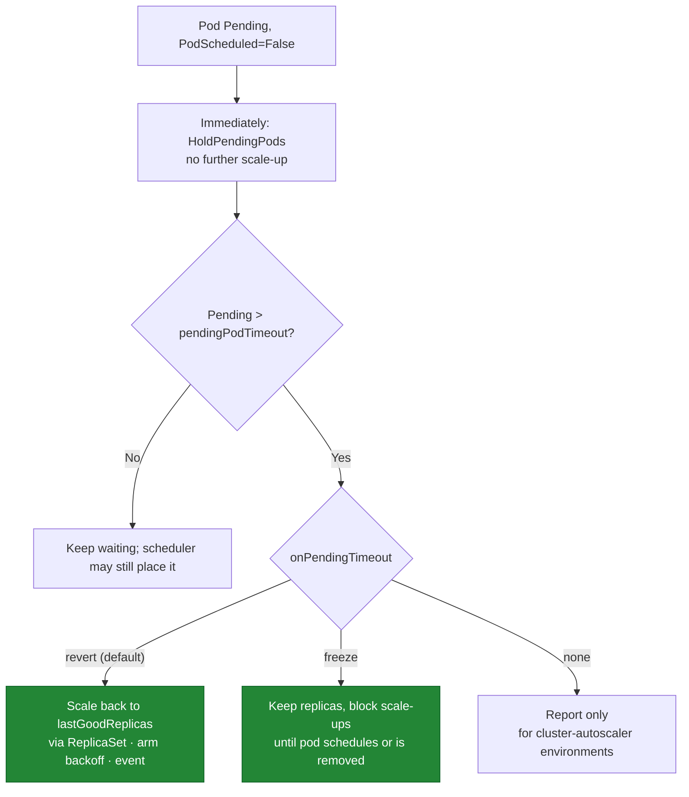
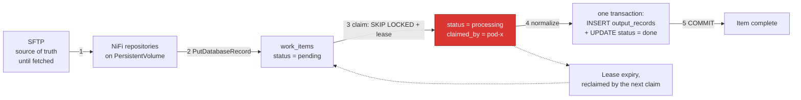

# KubeScaleSense — Failure Scenarios

> Status: **Design (pre-implementation)** · Version: 0.1
> Canonical source for: failure modes (`FS-xx`), the controller's specified response to each, and the
> data-loss analysis.

Related documents: [requirements](requirements.md) · [architecture](architecture.md) ·
[scaling-algorithm](scaling-algorithm.md) · [resource-calculation](resource-calculation.md) ·
[test-plan](test-plan.md) · [implementation-plan](implementation-plan.md)

---

## 1. How to read this document

Every scenario is specified as: **trigger → detection → controller behaviour → data-loss risk → mitigation →
verifying test**. "Controller behaviour" is a commitment, expressed with the reason codes from
[scaling-algorithm § 2](scaling-algorithm.md#2-decision-outcomes-and-reason-codes), and it is what the tests
in [test-plan](test-plan.md) assert.

Two rules govern every response below, and most of the table is a consequence of them:

1. **The null action is the safe action.** Under uncertainty, hold the current replica count. A stale
   decision is nearly always better than a decision from unknown state.
2. **Never scale down on doubt.** Scaling down terminates pods holding in-flight work, so unavailable or
   stale data must never look like "idle".

**Severity** describes the consequence if the mitigation were absent:

| Severity | Meaning |
| --- | --- |
| **S1** | Data loss or corruption |
| **S2** | Processing stops or cluster health degrades |
| **S3** | Throughput degraded / SLO at risk; pipeline still correct |
| **S4** | Noise, waste, or reduced observability |

---

## 2. Scenario summary

| ID | Scenario | Sev | Controller response | Test |
| --- | --- | --- | --- | --- |
| [FS-01](#fs-01-workload-spike-exceeds-maxreplicas) | Demand exceeds `maxReplicas` | S3 | `HoldAtMaxReplicas` + event | E2E-10 |
| [FS-02](#fs-02-insufficient-cluster-resources) | Not enough schedulable capacity | S3 | `HoldInsufficientResources`, backoff, alert | E2E-02 |
| [FS-03](#fs-03-partial-scale-up-leaves-a-deficit) | Only some needed pods fit | S3 | `ScaleUpPartial`, deficit visible | E2E-02 |
| [FS-04](#fs-04-fragmentation-free-resources-exist-but-nothing-fits) | Free CPU exists, no node can host a pod | S3 | `HoldInsufficientResources` (correctly) | E2E-04 |
| [FS-05](#fs-05-unmodelled-scheduling-predicate-causes-a-wrong-fit-estimate) | Over-estimated fit (topology spread, quota, volumes) | S2 | Pending watchdog remediates | E2E-08 |
| [FS-06](#fs-06-newly-created-pod-stays-pending) | New pod stuck `Unschedulable` | S2 | `HoldPendingPods` → revert/freeze | IT-07, E2E-08 |
| [FS-07](#fs-07-repeated-impossible-scale-attempts) | Infeasible demand persists | S4 | Exponential backoff, one event/cycle | UT-09, E2E-02 |
| [FS-08](#fs-08-stale-resource-or-metric-information) | Cached/aged data | S2 | `HoldStaleMetrics`, no action | UT-12, E2E-07 |
| [FS-09](#fs-09-kubernetes-api-failure) | API errors, conflicts, throttling | S2 | Freeze, bounded retry, `409` → re-decide | IT-02, IT-03 |
| [FS-10](#fs-10-namespace-resourcequota-blocks-pod-creation) | Quota rejects pod creation | S2 | Watchdog on unmaterialised replicas | IT-08 |
| [FS-11](#fs-11-node-memory-pressure-evicts-running-workers) | Node pressure evicts healthy pods | S1 | Prevented by request-based math + reserves | DI-06 |
| [FS-12](#fs-12-worker-pod-crashes-mid-item) | Pod OOM/panic while processing | S1 | Out of scope for the controller; lease expiry reclaims the item | DI-01, DI-09 |
| [FS-13](#fs-13-node-failure-or-drain-removes-workers) | Node lost or drained | S2 | Candidate set shrinks; re-scale if feasible | E2E-05 |
| [FS-14](#fs-14-scale-down-terminates-a-busy-pod) | Scale-down hits a working pod | S1 | Deletion cost + graceful drain | DI-02 |
| [FS-15](#fs-15-metrics-source-unavailable) | Work store or metrics-server unreachable | S3 | Degrade or `HoldStaleMetrics` | IT-10, E2E-07 |
| [FS-16](#fs-16-competing-controller-on-the-same-target) | HPA also scaling the target | S2 | `HoldScalingConflict`, refuse to act | IT-06 |
| [FS-17](#fs-17-controller-crash-restart-or-leadership-change) | Controller dies or loses lease | S3 | Cold start, cooled down, re-derive | IT-09, E2E-11 |
| [FS-18](#fs-18-replica-oscillation) | Sawtooth demand near a threshold | S4 | Deadband + window + cooldowns | UT-10, E2E-06 |
| [FS-19](#fs-19-misconfiguration) | Bad config or missing pod requests | S2 | Fail fast at startup | UT-21 |
| [FS-20](#fs-20-sustained-overload-beyond-cluster-capacity) | Arrival rate exceeds any feasible capacity | S3 | Honest HOLD + deficit alert | E2E-02 |
| [FS-21](#fs-21-target-pod-template-changes-mid-flight) | Requests changed during a rollout | S4 | Re-read template each reconcile | IT-02 |
| [FS-22](#fs-22-external-actor-changes-the-replica-count) | GitOps/operator/human writes `replicas` | S2 | Adopt baseline; refuse after repeated drift | IT-13 |
| [FS-23](#fs-23-scale-up-requested-during-a-rollout) | Scale-up during a rollout; surge exceeds the estimate | S2 | `HoldRolloutInProgress` | IT-14 |
| [FS-24](#fs-24-scheduled-but-unhealthy-pods) | Pods schedule then fail to become Ready | S2 | `HoldUnhealthyPods`, no auto-remediation | IT-15 |
| [FS-25](#fs-25-work-store-does-not-provide-the-assumed-claim-semantics) | Work store cannot claim atomically | **S1** | **Resolved by design change**: database-enforced claiming | DI-08 |
| [FS-26](#fs-26-leadership-handoff-races-with-an-in-flight-write) | Old and new leader both write | S4 | Precondition rejects the loser; silent baseline adoption | IT-09 |
| [FS-27](#fs-27-stabilization-window-gap-after-an-outage) | Window nearly empty after an outage | S2 | Coverage requirement blocks scale-down | UT-24 |
| [FS-28](#fs-28-work-store-unavailable-or-saturated) | Work store down or throttling claims | S2 | Freeze; distinguish "growing" from "undrainable" | IT-16, DI-10 |
| [FS-29](#fs-29-lease-expires-while-the-worker-is-still-alive) | Lease expiry during slow processing | S4 | Concurrent reprocessing; one output wins by constraint | DI-09 |

Scenarios FS-22 through FS-27 were added by the [design review](design-review.md); FS-22, FS-24, and FS-25
were genuine omissions rather than refinements. FS-28 and FS-29 are the two failure modes **introduced** by
choosing a database work store — recorded deliberately, because a design change that closes one scenario and
silently opens two others has not been closed honestly.

---

## 3. Detailed scenarios

### FS-01: Workload spike exceeds `maxReplicas`

**Trigger.** Backlog implies more replicas than the configured ceiling.
**Detection.** `desiredRaw > maxReplicas` while `currentReplicas == maxReplicas`.
**Behaviour.** `HoldAtMaxReplicas`; `kss_desired_replicas_uncapped` shows the true demand so the ceiling's cost
is measurable.
**Data-loss risk.** None — the backlog waits durably in NiFi ([D-01](requirements.md#7-data-loss-protection-assumptions)).
**Mitigation.** Deliberately distinct from `HoldInsufficientResources`: this one is fixed by raising a policy
limit, not by adding hardware. Conflating them would send an operator to the wrong remedy.
**Test.** E2E-10.

### FS-02: Insufficient cluster resources

**Trigger.** Demand needs `Δ_req` pods; `F == 0`.
**Detection.** Feasibility gate ([scaling-algorithm § 6](scaling-algorithm.md#6-step-4--scale-up-logic-and-the-feasibility-gate)).
**Behaviour.** `HoldInsufficientResources`; backoff armed; one `Warning` event per cycle naming the blocking
dimension and candidate node count; `kss_insufficient_resource_holds_total{dimension}` increments.
**Data-loss risk.** None. Throughput is capped at what the cluster safely supports.
**Mitigation.** This is the project's core designed behaviour, not an error path: the alternative (issuing the
scale-up anyway) converts a visible capacity shortfall into Pending pods and node pressure. Recovery is
automatic and prompt because backoff resets on observed capacity increase
([scaling-algorithm § 9.2](scaling-algorithm.md#92-reset-is-level-triggered-on-capacity-not-timer-driven)).
**Test.** E2E-02, E2E-03.

### FS-03: Partial scale-up leaves a deficit

**Trigger.** `0 < F < Δ_req`.
**Behaviour.** `ScaleUpPartial` to `current + F`; backoff armed for the remainder; `kss_desired_replicas`
keeps reporting the *full* desired value so the deficit does not disappear from dashboards just because
progress was made.
**Data-loss risk.** None.
**Mitigation.** Partial progress is strictly better than none; operators preferring all-or-nothing set
`allowPartialScaleUp: false` ([ADR-09](architecture.md#adr-09-what-happens-when-demand-is-high-but-resources-are-insufficient)).
**Test.** E2E-02.

### FS-04: Fragmentation, free resources exist but nothing fits

**Trigger.** Aggregate free CPU exceeds the pod request, but no single node has room (e.g. 5 nodes × 300 m
free vs. a 500 m request).
**Detection.** Per-node flooring in [resource-calculation § 5](resource-calculation.md#5-step-4--fit-capacity)
yields `F = 0` while `kss_free_requestable_cpu_millicores` is large.
**Behaviour.** `HoldInsufficientResources` — the *correct* answer despite "free" resources.
**Mitigation.** This scenario is the reason aggregate free resources are exported for humans but never used as
a decision input. The apparent contradiction between the two metrics is intentional and documented; the demo
shows it explicitly.
**Test.** E2E-04.

### FS-05: Unmodelled scheduling predicate causes a wrong fit estimate

**Trigger.** The target uses a predicate outside the v0.1 model — topology spread, pod anti-affinity, volume
topology, extended resources ([resource-calculation § 6](resource-calculation.md#6-predicates-modelled-and-predicates-ignored)).
**Detection.** Not detectable in advance by design; observed as a Pending pod.
**Behaviour.** The scale-up is issued, the pod goes Pending, `HoldPendingPods` blocks any further scale-up,
and the watchdog remediates per [FS-06](#fs-06-newly-created-pod-stays-pending).
**Data-loss risk.** None directly; S2 because an unschedulable pod adds scheduler churn and operator confusion
while adding no throughput.
**Mitigation.** Bounded by `fitCapacityMarginPods`, caught by the watchdog, and stated as a limitation rather
than hidden. This is the honest cost of choosing an estimator over a scheduler simulation
([ADR-06](architecture.md#adr-06-how-do-we-determine-whether-n-additional-pods-are-likely-schedulable)) — and
the reason the watchdog is a hard requirement.
**Test.** E2E-08.

### FS-06: Newly created pod stays Pending

**Trigger.** A pod created by our scale-up cannot be scheduled: estimation error (FS-05), a capacity race, a
quota (FS-10), or a missing PVC.
**Detection.** Watchdog over pods owned by the target's current ReplicaSet: `phase == Pending` with
`PodScheduled=False`, reason `Unschedulable`, for longer than `pendingPodTimeout` (120 s).
**Behaviour.**

**Data-loss risk.** None. The pending pod never processed anything, and removing it is done by lowering
`replicas` so the ReplicaSet controller terminates gracefully — the controller never deletes pods directly
([architecture § 7](architecture.md#7-kubernetes-permissions-and-rbac)).
**Mitigation.** `HoldPendingPods` prevents stacking a second bad request on the first, so estimation errors
cannot compound across reconciles. The 120 s timeout is generous on purpose: a rebooting node or a slow
volume attach should not trigger a revert.
**Test.** IT-07 (all three modes), E2E-08.

### FS-07: Repeated impossible scale attempts

**Trigger.** Demand stays above capacity for a long period.
**Behaviour.** Exponential backoff 30 s → 15 m (`factor 2`), reason `HoldBackoff`, one event per cycle instead
of one per reconcile ([scaling-algorithm § 9.1](scaling-algorithm.md#91-backoff-state-machine)).
**Severity rationale.** Without backoff the impact is S4 noise — log/event spam that pressures the API server
and makes metrics unable to distinguish one persistent problem from many new ones.
**Mitigation.** Reset is level-triggered on *capacity increase*, so recovery latency stays at one interval
(≤ 15 s) even mid-backoff.
**Test.** UT-09, E2E-02 (backoff growth), E2E-03 (prompt reset).

### FS-08: Stale resource or metric information

**Trigger.** Watch desync, metrics-server lag, NiFi slowness, or a controller resume after suspension.
**Detection.** Every signal carries `sampledAt`; `kss_metric_sample_age_seconds` exceeds `metricsStaleAfter`.
Nodes with stale `Ready` heartbeats are excluded from the candidate set (C2). Freshness is evaluated against
**both** the local receive age and the source-reported sample age: receive age alone would let a *frozen*
metrics-server serving ten-minute-old samples look perfectly fresh, while source timestamps alone would be
distorted by clock skew ([FR-34](requirements.md#review-driven-requirements-v011),
[DR-14](design-review.md#dr-14-staleness-measured-only-from-local-receive-time-misses-a-frozen-source)).
**Behaviour.** `HoldStaleMetrics` — **no action in either direction**. Notably, no scale-down: "no data" must
never be interpreted as "no work".
**Data-loss risk.** None with the hold; S2 if a stale-driven scale-down terminated busy pods.
**Mitigation.** Layered per [ADR-12](architecture.md#adr-12-how-do-we-avoid-stale-resource-information):
watches rather than polling, a snapshot built immediately before the decision, explicit ages, no action before
cache sync, `resourceVersion` preconditions on writes, and reserves to absorb the irreducible race.
**Test.** UT-12, E2E-07.

### FS-09: Kubernetes API failure

**Trigger.** API server unavailable, throttling (`429`), `5xx`, RBAC change, or an update conflict.
**Behaviour** ([ADR-14](architecture.md#adr-14-what-happens-if-kubernetes-api-calls-fail)):

| Failure | Response |
| --- | --- |
| Read / watch failure | Serve last synced cache; beyond `metricsStaleAfter` → `HoldStaleMetrics` |
| Write `5xx`/timeout/`429` | Jittered retry bounded by `interval`, then abandon and re-decide next tick |
| Write `409 Conflict` | Discard decision, re-read, re-decide — never retry a stale replica value |
| `403` / `404` | Fatal configuration error: event, `/readyz` failure, no retry storm |
| Lost leadership | Stop deciding immediately and exit, so the new leader starts cooled down |

**Data-loss risk.** None from the controller; S2 because scaling is frozen while the pipeline may be
overloaded.
**Mitigation.** Bounded retries avoid amplifying an API-server incident; `kss_api_errors_total{resource,verb,code}`
plus readiness make the freeze visible rather than silent.
**Test.** IT-02 (conflict), IT-03 (`403`), E2E-07.

### FS-10: Namespace `ResourceQuota` blocks pod creation

**Trigger.** A quota on `requests.cpu`/`requests.memory`/`pods` rejects the ReplicaSet's pod creation.
**Detection.** Distinctive signature: **no Pending pod appears at all**. `spec.replicas` rises but
`status.replicas` does not, and the ReplicaSet emits `FailedCreate`. The watchdog therefore also triggers on
"replicas not materialising into pods within `pendingPodTimeout`".
**Behaviour.** Watchdog remediation as in FS-06, plus a `Warning` event naming the quota.
**Mitigation.** Quota is not modelled proactively in v0.1 ([NG-10](requirements.md#3-non-goals)); the reactive
path is cheap and sufficient for the POC. Proactive modelling — subtracting quota headroom from `F` — is
Phase 3.
**Test.** IT-08.

### FS-11: Node memory pressure evicts running workers

**Trigger.** A node's actual memory usage crosses the kubelet eviction threshold; the kubelet evicts pods by
QoS class and usage-above-request.
**Why this is the S1 scenario the design targets.** Eviction kills *already-running healthy* workers, each
holding in-flight items — so a scaling decision can interrupt work it never touched. This is the mechanism
behind "processing can be interrupted, data may be lost" in the problem statement, and it is precisely what a
usage-based autoscaler invites by packing pods onto nodes whose committed requests are already spoken for.
**Behaviour / prevention.** Structural rather than reactive:

- Fit capacity uses **requests against allocatable**, so the controller never places a pod on a node whose
  budget is already committed ([ADR-05](architecture.md#adr-05-capacity-allocatable-or-requested)).
- `allocatable` already excludes kube/system-reserved and eviction thresholds.
- `perNodeReserveMemoryMiB` leaves additional slack.
- Memory is evaluated as an independent dimension and never traded against CPU
  ([ADR-04](architecture.md#adr-04-how-should-available-memory-be-calculated)), because memory is
  incompressible: CPU overcommit merely throttles, memory overcommit kills.
- Workload-side: processing pods set memory **limits** close to requests (Guaranteed/Burstable-with-tight-limits)
  so one pod cannot balloon and endanger its neighbours; a `PodDisruptionBudget` protects the pool
  ([D-07](requirements.md#7-data-loss-protection-assumptions)).
- If a node does become pressured, the kubelet's `memory-pressure` taint removes it from our candidate set
  automatically ([resource-calculation § 2.1](resource-calculation.md#21-taints-and-tolerations-c4)).

**Residual risk.** Under-requesting neighbours can still pressure a node
([resource-calculation § 4.1](resource-calculation.md#41-known-over-estimation-under-requesting-neighbours)).
Residual loss is then absorbed by [D-04](requirements.md#7-data-loss-protection-assumptions) — an evicted
pod's claims expire and are reclaimed by the next claim query.
**Test.** DI-06.

### FS-12: Worker pod crashes mid-item

**Trigger.** OOM kill, panic, SIGKILL, node loss.
**Behaviour.** Not a controller concern — no autoscaler can prevent it
([ADR-15](architecture.md#adr-15-how-do-we-protect-data-processing-when-a-worker-pod-crashes)). Correctness
comes from the workload contract, now expressed in database terms
([ADR-20](architecture.md#adr-20-how-is-in-flight-work-protected-without-a-shared-filesystem)): the item's row
is untouched because its transaction never committed, its lease expires, and the next claim query reclaims it.
Because output and acknowledgement commit **together**, a crash can leave neither a partial output nor an
acknowledged-but-unwritten item — the two states that made the filesystem design delicate are now
unrepresentable.
**Data-loss risk.** S1 without D-01…D-04; none with them. Duplicate processing is possible and harmless by
[D-03](requirements.md#7-data-loss-protection-assumptions), which is enforced by a `PRIMARY KEY`.
**Test.** DI-01, DI-04, DI-05, DI-09.

### FS-13: Node failure or drain removes workers

**Trigger.** Node `NotReady`, cordoned, or drained; several replicas disappear at once.
**Detection.** Node informer; candidate filter C1/C3 removes the node; `kss_candidate_nodes` drops.
**Behaviour.** The ReplicaSet controller recreates the lost pods; KubeScaleSense recomputes `F` against the
smaller cluster and either replaces capacity elsewhere or reports `HoldInsufficientResources`. Because the
drained node is excluded, the controller does not attempt to place pods on it.
**Data-loss risk.** In-flight items on lost pods are reclaimed on lease expiry (D-04).
**Mitigation.** A drain and a capacity shortfall converge on the same well-tested path, which is why no
special-case logic exists for it.
**Test.** E2E-05.

### FS-14: Scale-down terminates a busy pod

**Trigger.** Demand falls; a replica is removed while processing an item.
**Behaviour.** Before writing the lower replica count the controller refreshes
`controller.kubernetes.io/pod-deletion-cost` from reported in-flight counts, so the ReplicaSet controller
prefers the idlest pod ([scaling-algorithm § 7](scaling-algorithm.md#7-step-5--scale-down-logic)). Termination
is graceful: `preStop` stops claiming new items and waits for the current one, within a
`terminationGracePeriodSeconds` larger than the maximum item processing time
([A-07](requirements.md#6-workload-and-environment-assumptions), D-05).
**Data-loss risk.** S1 if the pod were killed abruptly; none with graceful drain, and even a hard kill only
delays the item by one lease period (D-04).
**Mitigation, stated precisely after review.** Two claims were too strong:

- **Deletion cost is a preference within the Ready cohort, not a selector.** The ReplicaSet controller ranks
  candidates by unassigned, then `Pending` before `Running`, then **not-Ready before Ready**, and only then by
  deletion cost. A busy pod with a momentary readiness blip is removed before an idle Ready pod regardless of
  cost, and the mechanism requires the `PodDeletionCost` feature gate (beta, default-on since 1.22)
  ([DR-11](design-review.md#dr-11-pod-deletion-cost-ordering-was-described-too-loosely)).
- **A `PodDisruptionBudget` does not apply here at all.** PDBs constrain the Eviction API only; a ReplicaSet
  scale-down deletes pods directly and ignores them
  ([DR-10](design-review.md#dr-10-poddisruptionbudget-does-not-protect-against-scale-down)).

So the actual guarantees for in-flight work during scale-down are, in increasing order of reliability:
`maxScaleDownStep: 1`, graceful drain via `preStop`, and lease expiry as the backstop that holds even on a
hard kill.
**Test.** DI-02.

### FS-15: Metrics source unavailable

**Trigger.** Work store unreachable, refusing connections, or slow past `workStore.timeout`; or
metrics-server missing.
**Behaviour.**

| Missing source | Response |
| --- | --- |
| Backlog (work store) | Required signal → `HoldStaleMetrics` once age > `metricsStaleAfter`; event `MetricsUnavailable`. A query timeout counts as unavailable, never as zero ([FR-38](requirements.md#work-store-requirements-v012)) |
| Utilization (metrics-server) | Degrade to backlog-only (`desiredUtilization` omitted from the `max()`), emit `MetricsUnavailable`, continue scaling |

**Rationale for the asymmetry.** The backlog is the primary demand signal and has no substitute; utilization
is a safety net whose absence merely reduces sensitivity to expensive items. Losing the net is a degradation;
losing the primary signal means the controller is blind, and a blind autoscaler must not act.
**Test.** IT-10, E2E-07.

### FS-16: Competing controller on the same target

**Trigger.** An HPA (or another KubeScaleSense instance without leader election) also writes the target's
`scale`.
**Detection.** HPA informer in the target namespace at startup and every reconcile; conflict signature is
rapid `409`s and unexplained replica changes.
**Behaviour.** `HoldScalingConflict`: refuse to act, `Warning` event, `/readyz` failure. Startup detection is
fatal ([FR-19](requirements.md#4-functional-requirements)).
**Data-loss risk.** S2 — two controllers with different models produce sustained oscillation, and oscillation
means repeated pod termination.
**Mitigation.** Refusing is better than winning: whichever controller writes last would determine behaviour,
so a "fight" has no safe outcome. Leader election prevents the self-conflict case
([FR-26](requirements.md#4-functional-requirements)).
**Test.** IT-06.

### FS-17: Controller crash, restart, or leadership change

**Trigger.** Pod restart, node loss, lease handoff, deployment upgrade.
**Behaviour.** Decision state is in-memory by design ([architecture § 4.6](architecture.md#46-controller-internalcontroller)).
On start the controller re-derives everything from the cluster and behaves as freshly cooled down: no action
until caches sync and one metric sample exists ([NFR-08](requirements.md#5-non-functional-requirements)), with
empty `desiredHistory` (so no immediate scale-down is possible), cleared backoff, and
`lastGoodReplicas = currentReplicas`.
**Data-loss risk.** None — replica count lives in the `Deployment`, not in the controller.
**Mitigation.** Choosing amnesia over persistence is deliberate: a restart yields *more* conservative
behaviour (a scale-down needs a fresh full stabilization window), and there is no persisted state to become
inconsistent with reality. The cost is a slower first scale-down after a restart, which is acceptable.
**Test.** IT-09, E2E-11.

### FS-18: Replica oscillation

**Trigger.** Demand hovering at a replica boundary, or noisy sampling.
**Behaviour.** Four independent damping mechanisms
([scaling-algorithm § 8](scaling-algorithm.md#8-hysteresis-and-oscillation-control)): deadband, asymmetric
cooldowns, scale-down stabilization window using `max()`, and optional EWMA smoothing. Worst-case action rate
is bounded at one scale-up per 60 s and one scale-down per 300 s regardless of input.
**Data-loss risk.** S4 as noise, but each cycle terminates a pod, so sustained oscillation is a real
correctness pressure on the drain path.
**Test.** UT-10, E2E-06 (soak with sawtooth load, asserting a bounded action count).

### FS-19: Misconfiguration

**Trigger.** `minReplicas > maxReplicas`, `interval` too small, target missing, pod template without resource
requests, unreachable NiFi URL, `itemsPerReplica: 0`.
**Behaviour.** Startup validation fails fast with a non-zero exit and a specific message (CR-2). Missing pod
requests are singled out: without them fit capacity is meaningless
([resource-calculation § 3](resource-calculation.md#3-step-2--effective-pod-request-of-the-target-workload)),
so the controller refuses to run rather than computing a number nobody should trust.
**Mitigation.** Crash-looping with a clear message is preferable to running with a subtly wrong model;
`dryRun: true` provides a safe way to validate a new configuration against a live cluster.
**Test.** UT-21.

### FS-20: Sustained overload beyond cluster capacity

**Trigger.** Arrival rate exceeds the throughput of `min(maxReplicas, F-limited replicas)` indefinitely.
**Behaviour.** The controller scales to the safe maximum and then holds, reporting a persistent deficit
(`kss_desired_replicas` − `kss_current_replicas`). Backlog grows; latency SLO is breached.
**Data-loss risk.** Bounded by NiFi's repository sizing and back-pressure configuration — the pipeline's real
limit. If the buffer fills, NiFi back-pressure stops fetching from SFTP, leaving files on the SFTP server
rather than dropping them. That is the intended overflow behaviour and an explicit capacity-planning input.
**Mitigation.** The controller cannot fix a capacity shortfall; its contribution is to make it loud, specific,
and attributable (which dimension, which nodes, how many pods short). Converting an invisible reliability
problem into a visible capacity problem is the designed outcome
([ADR-09](architecture.md#adr-09-what-happens-when-demand-is-high-but-resources-are-insufficient)).
**Test.** E2E-02 with a sustained generator.

### FS-21: Target pod template changes mid-flight

**Trigger.** An operator edits the processing container's requests, or a rollout is in progress.
**Behaviour.** The effective pod request is re-read from the live template every reconcile, so fit capacity
reflects the new shape immediately. During a rolling update both old and new pods exist and both count in
Step 3; terminating pods still hold resources
([resource-calculation § 4](resource-calculation.md#4-step-3--per-node-free-requestable-resources)), so the
controller is conservative exactly when the deployment is churning. Writes use `deployments/scale` only, so a
controller bug cannot rewrite the template.
**Mitigation.** A scale-up during a rollout may be deferred by lower `F`; acceptable and self-correcting. Note
that scaling is held entirely while a rollout is in flight, per [FS-23](#fs-23-scale-up-requested-during-a-rollout).
**Test.** IT-02.

### FS-22: External actor changes the replica count

**Trigger.** A GitOps controller (Argo CD, Flux) reconciles `replicas` from git, an operator runs
`kubectl scale`, or another controller writes the `scale` subresource.
**Detection.** Observed `spec.replicas` differs from `lastWrittenReplicas` and we did not write it.
**Behaviour.** Adopt the observed value as the new baseline, reset cooldown timers and `desiredHistory`, emit
`ExternalScaleDetected` once. After more than `scaling.externalChangeTolerance` (3) recurrences inside the
stabilization window: `HoldExternalChange`, refuse to act
([ADR-17](architecture.md#adr-17-how-do-we-handle-other-writers-of-the-replica-count)).
**Why this is S2 and was the review's largest omission.** A GitOps controller reverting every scale-up within
seconds, against a controller that scales up again each interval, is an *unbounded oscillation loop with an
external actor* — terminating pods on every cycle and burning API budget indefinitely. It is far more likely in
practice than the competing HPA that FS-16 covers.
**Note.** `resourceVersion` preconditions do **not** mitigate this. The external write succeeds and our next
write is against a fresh version; optimistic concurrency prevents lost updates, not disagreements about intent.
**Mitigation.** In GitOps-managed environments, ownership of the replica field must be granted to the
controller (e.g. Argo CD `ignoreDifferences`), exactly as for an HPA — recorded as
[A-10](requirements.md#103-assumptions-that-must-hold-for-the-guarantees-to-be-meaningful).
**Test.** IT-13.

### FS-23: Scale-up requested during a rollout

**Trigger.** A scale-up is decided while the Deployment is rolling out a new pod template.
**Detection.** `metadata.generation != status.observedGeneration`, or `updatedReplicas != replicas`.
**Behaviour.** `HoldRolloutInProgress` in **both** directions until the rollout completes.
**Why.** Fit capacity correctly accounts for the surge and terminating pods that *already exist*, but not for
the surge that our own scale-up will cause: with `maxSurge: 25 %`, a request for 4 additional replicas
transiently needs up to 5 pods' worth of resources. The gate approves 4, the Deployment controller asks for 5,
and the fifth is the pod that goes Pending — an over-estimate created by the controller's own request.
**Mitigation.** Holding is the cheap correct answer: rollouts are short and operator-initiated. The alternative
— requiring `F >= Δ_req + surge(Δ_req)` — is more permissive but adds a second, subtler resource calculation
for a rare window, and was rejected as unnecessary complexity
([DR-08](design-review.md#dr-08-rollouts-and-maxsurge-are-unaccounted-for)).
**Test.** IT-14.

### FS-24: Scheduled but unhealthy pods

**Trigger.** Pods schedule successfully and then never become useful: `ImagePullBackOff`,
`CrashLoopBackOff`, a failing readiness probe, a missing Secret or ConfigMap, a bad configuration.
**Detection.** A pod of the target's current ReplicaSet with `PodScheduled=True` and not `Ready` for longer
than `pending.podStartupTimeout` (300 s).
**Behaviour.** `HoldUnhealthyPods` — block scale-ups, emit `PodStartupFailure`, expose
`kss_unhealthy_target_pods`. Deliberately **no** auto-remediation.
**Why this is the worst behavioural bug the review found.** Without this guard the feedback loop runs the wrong
way: broken pods are scheduled, so their requests are committed and consume real cluster capacity; they process
nothing, so the backlog grows; the growing backlog raises `desiredBacklog`, so the controller scales up; the new
pods are equally broken. A resource-aware autoscaler that responds to a bad image tag by consuming the cluster —
and potentially starving its neighbours — is a worse outcome than the Pending pods this project exists to
prevent.
**Why no auto-revert** (unlike [FS-06](#fs-06-newly-created-pod-stays-pending)): these pods are scheduled and
may recover once an image or Secret is fixed, and removing replicas from a partially-broken pool can remove the
healthy ones. The controller cannot fix a broken image; the correct action is to stop making the situation more
expensive and say so loudly.
**Data-loss risk.** None directly. S2 because processing has effectively stopped while capacity is consumed.
**Test.** IT-15.

### FS-25: Work store does not provide the assumed claim semantics

> **Resolved by design change, not mitigation.** The atomic-rename protocol was abandoned in favour of a
> PostgreSQL work-item table with `FOR UPDATE SKIP LOCKED`
> ([ADR-18](architecture.md#adr-18-what-is-the-durable-work-store-for-the-poc-pipeline)). This scenario is
> retained because it records *why* — and because the class of failure it describes reappears the moment
> anyone reintroduces a shared filesystem or an object store. DI-08 exists to keep the primitive verified.

**Trigger.** The shared work store cannot support atomic, mutually-exclusive item claiming — the primitive
[D-02](requirements.md#7-data-loss-protection-assumptions) and
[D-03](requirements.md#7-data-loss-protection-assumptions) depend on.
**Two concrete cases in the *original* POC design:**

| Store | Failure |
| --- | --- |
| RWX PVC on kind | kind ships `local-path-provisioner`, which provides only **node-local `ReadWriteOnce`** volumes. A "shared" PVC silently becomes a per-node directory: items written by NiFi are invisible to workers on other nodes and sit unprocessed. Indistinguishable from data loss during a demo, and directly at odds with the multi-node topology the fit-capacity demo requires |
| MinIO / S3 | Object stores have **no atomic rename**; "rename" is copy-then-delete. Two pods can both claim the same item, so the claim protocol provides no mutual exclusion and correctness rests entirely on D-03 idempotency |

**Behaviour.** Outside the controller's control and undetectable by it — which is exactly why it is recorded
as a scenario rather than left as a storage detail.
**Resolution.** Neither option was taken. Both were rejected in favour of a primitive the *database* enforces:
an NFS provisioner would have added a CSI driver and a server pod in exchange for a claim that is only
probably correct under NFSv3 retransmits and client attribute caching, and object storage would have required
rebuilding the claim on conditional `PUT` while leaving acknowledgement and output as a dual write. The chosen
design makes exclusion a property of `SKIP LOCKED` and idempotency a property of a `PRIMARY KEY`
([ADR-18](architecture.md#adr-18-what-is-the-durable-work-store-for-the-poc-pipeline),
[A-12](requirements.md#103-assumptions-that-must-hold-for-the-guarantees-to-be-meaningful)).
**Test.** DI-08 verifies the primitive under concurrent cross-node claims rather than assuming it.

### FS-28: Work store unavailable or saturated

**Trigger.** The PostgreSQL pod is restarting, its node is gone, connections are exhausted, or queries queue
behind lock contention.
**Detection (controller).** The backlog query fails or exceeds `workStore.timeout`; the signal is recorded
**unavailable**, never zero ([FR-38](requirements.md#work-store-requirements-v012)).
**Behaviour.** `HoldStaleMetrics` — freeze. The replica count is left exactly as it is: workers whose claims
are still valid keep processing, and no scale-down removes capacity on the basis of a database outage.
**Why this is the price of the design.** The work store is a **single point of failure** for the pipeline, and
in the POC it runs as one instance on a node-local PVC ([A-14](requirements.md#103-assumptions-that-must-hold-for-the-guarantees-to-be-meaningful)).
That is an accepted POC trade, not an oversight: an HA store would add a replicated database to a project
whose subject is scheduling. The saturation case is subtler than the outage case — a store slow enough to
throttle claiming makes the backlog grow for reasons that **more replicas cannot fix**, so the controller
would scale up into a bottleneck it cannot see ([A-15](requirements.md#103-assumptions-that-must-hold-for-the-guarantees-to-be-meaningful)).
**Mitigation.** Export claim latency and store connection saturation on the demo dashboard next to the
backlog, so "the queue is growing" can be distinguished from "the queue cannot be drained". Bounded worker
connection pools keep a scale-up from exhausting `max_connections` — the specific way this failure would
otherwise be *caused* by scaling.
**Data-loss risk.** None: committed rows are durable, and uncommitted work is reclaimed by lease expiry.
**Test.** IT-16, DI-10.

### FS-29: Lease expires while the worker is still alive

**Trigger.** An item takes longer than `leaseDuration` — a large item, a slow store, or CPU starvation on a
crowded node.
**Behaviour.** Another worker legitimately reclaims the item and processes it concurrently. Both may finish;
only one output survives, because the insert is `ON CONFLICT (item_key) DO NOTHING` against a `PRIMARY KEY`,
and the losing acknowledgement simply marks an already-`done` row.
**Data-loss risk.** None. The cost is wasted CPU, which is bounded by `attempts` and visible as a
reprocessing-rate metric.
**Mitigation.** `leaseDuration` must exceed both the maximum per-item processing time and
`terminationGracePeriodSeconds` ([§7](requirements.md#7-data-loss-protection-assumptions)). This is the one
new tuning constraint the work-store design introduces, and getting it wrong degrades throughput silently —
hence the explicit metric rather than a comment in a manifest.
**Test.** DI-05 (negative half), DI-09.

### FS-26: Leadership handoff races with an in-flight write

**Trigger.** An outgoing leader has a `scale` write in flight as the incoming leader begins reconciling.
**Behaviour.** One write wins; the loser's `resourceVersion` precondition fails with `409`, and it re-reads and
re-decides ([FS-09](#fs-09-kubernetes-api-failure)). The new leader adopts observed `spec.replicas` as its
baseline **silently** — no `ExternalScaleDetected` event and no drift counter increment — since the previous
leader's legitimate write would otherwise be misclassified as an external change
([DR-13](design-review.md#dr-13-leader-handoff-interacts-with-external-change-detection)).
**Data-loss risk.** None.
**Test.** IT-09.

### FS-27: Stabilization window gap after an outage

**Trigger.** A metrics or API outage, or a controller restart, leaves `desiredHistory` with few or no samples,
because reconciles that return before computing demand append nothing.
**Behaviour.** Scale-down additionally requires the window to be **covered** — at least
`scaleDownWindowCoverage` (0.8) of `ceil(W / interval)` expected samples, with the oldest at least `W` old.
Uncovered windows report `HoldStabilizationWindow`.
**Why.** Without the coverage test, `max()` over a nearly-empty window is trivially low, so the guard is
satisfied by *missing data* and the controller scales down on the strength of five minutes of no information.
This is the same error as reading "no backlog data" as "no backlog", re-entering through the history buffer
([DR-04](design-review.md#dr-04-stabilization-window-gaps-permit-a-blind-scale-down)).
**Test.** UT-24.

---

## 4. Data-loss analysis

### 4.1 Where loss could occur, and what prevents it

| Step | Failure during this step | Outcome | Protection |
| --- | --- | --- | --- |
| 1 | Fetch interrupted | File remains on SFTP; re-listed | NiFi commits before deleting the remote file (D-01) |
| 2 | NiFi pod dies | FlowFile survives in the repository on its PV | D-01 |
| 3 | Pod dies after claim | Lease expires; the next claim query reclaims the row | D-02, D-04 |
| 4 | Pod dies mid-processing | Partial work discarded; item reclaimed after lease expiry | D-04 |
| 5 | Pod dies mid-commit | The transaction rolls back — **no** output row, **no** acknowledgement, so the item is simply reclaimed | D-03 (transactional ack) |
| — | Pod dies after commit | Nothing to do: output and acknowledgement are already both durable | D-03 |
| — | Item reprocessed after a lease expiry | Second output insert is a no-op | D-03 (`ON CONFLICT DO NOTHING` on a `PRIMARY KEY`) |

**The single highest-risk state is step 3–4** (an item claimed by a pod that then dies), and its entire
mitigation is lease expiry plus idempotency. Note what the work-store design removed: the old step 5 — "pod
dies after writing output but before acknowledging" — is no longer a state the system can occupy, because
those two writes are one commit ([ADR-20](architecture.md#adr-20-how-is-in-flight-work-protected-without-a-shared-filesystem)).
Everything else in the pipeline is durable by construction.

### 4.2 What the controller does and does not contribute

| Concern | Owner |
| --- | --- |
| Item durability, claim semantics, idempotency, lease recovery | **Workload** (D-01…D-04) |
| Graceful drain on termination | **Workload** `preStop` + grace period (D-05); controller supplies deletion-cost hints (D-06) |
| Avoiding *involuntary* eviction of healthy workers | **Controller** — request-based fit math and reserves (FS-11) |
| Not deleting pods directly | **Controller** — no pod `delete` permission at all |
| Not scaling down on stale or missing data | **Controller** — FS-08, FS-15 |
| Not stacking unschedulable requests | **Controller** — `HoldPendingPods`, FS-06 |

The claim this design supports, stated precisely:

> Given the workload properties D-01…D-07, **no scaling decision — right or wrong — can lose data.** A wrong
> decision costs throughput, or causes an item to be processed later or twice, which
> [D-03](requirements.md#7-data-loss-protection-assumptions) renders harmless.

### 4.3 What would invalidate the claim

Stating the invalidating conditions is part of the design; each is a review item for any pipeline change:

| If this changes | Consequence |
| --- | --- |
| The claim stops being database-enforced (e.g. a move back to a filesystem or object store) | **D-02 broken at the foundation** — two pods claim the same item concurrently, and the entire durability argument falls back onto D-03 idempotency ([FS-25](#fs-25-work-store-does-not-provide-the-assumed-claim-semantics)). Verify the primitive; never assume it |
| Output and acknowledgement stop sharing one transaction | Partial outputs and acknowledged-but-unwritten items become representable again — the dual-write problem the work-store design exists to remove ([ADR-18](architecture.md#adr-18-what-is-the-durable-work-store-for-the-poc-pipeline)) |
| `leaseDuration` drops below the maximum item processing time | Silent duplicate processing on every slow item ([FS-29](#fs-29-lease-expires-while-the-worker-is-still-alive)) |
| NiFi repositories move to `emptyDir` | D-01 broken: NiFi pod loss loses buffered files |
| Work is **pushed** to pods (HTTP/Site-to-Site) instead of claimed | D-02 broken: terminating a pod loses its in-flight payload; scale-down becomes lossy |
| Output writes become non-idempotent (append, or an external side effect such as an email or a non-idempotent API call) | D-03 broken: reprocessing duplicates effects; at-least-once is no longer safe |
| Claims are taken without a lease, or leases are never checked | D-04 broken: crashed-pod items stall until manual intervention |
| Item processing time can exceed `terminationGracePeriodSeconds` | D-05 broken: A-07 violated; graceful drain truncated, relies on lease expiry |
| Processing pods drop memory limits | FS-11 risk rises: one pod can pressure a node and evict peers |

---

## 5. Interacting failures

Individually-handled failures can combine; these three combinations are specifically designed for and tested.

| Combination | Interaction | Specified behaviour |
| --- | --- | --- |
| Spike (FS-02) + metrics-server down (FS-15) | Utilization signal missing exactly when needed | Backlog-only scaling continues; feasibility gate unchanged; `MetricsUnavailable` event (E2E-07) |
| Node drain (FS-13) + high demand (FS-02) | Capacity shrinks while demand grows | Candidate set shrinks → `HoldInsufficientResources` with a growing deficit; no attempt to use the drained node (E2E-05) |
| Controller restart (FS-17) + oscillating demand (FS-18) | History lost; damping state reset | Empty `desiredHistory` fails the window-coverage test (FS-27), so a restart is strictly *more* damped, never less (E2E-11) |
| Unhealthy pods (FS-24) + rising backlog (FS-02) | Broken pods hold capacity while demand climbs | `HoldUnhealthyPods` takes precedence over the feasibility gate, so the controller stops adding broken replicas instead of consuming the cluster (IT-15) |

A general property worth noting: because every uncertainty path converges on **hold**, simultaneous failures
compose safely — the intersection of several "do nothing" responses is still "do nothing". The system's worst
case under compound failure is a frozen replica count with loud telemetry, not an erratic one.

---

## 6. Alerting recommendations

| Alert | Expression (sketch) | For | Meaning |
| --- | --- | --- | --- |
| **Replica deficit** | `kss_desired_replicas − kss_current_replicas > 0` | 5 m | *The* signal to add capacity or raise `maxReplicas` |
| Insufficient resources | `increase(kss_insufficient_resource_holds_total[15m]) > 0` | — | Chronic shortfall; check blocking dimension |
| Pending remediation | `increase(kss_pending_pod_remediations_total[1h]) > 0` | — | Fit estimate was wrong: unmodelled predicate or quota (FS-05, FS-10) |
| Unhealthy pods | `kss_unhealthy_target_pods > 0` | 5 m | Pods scheduled but not becoming Ready; scaling is blocked (FS-24) |
| External replica writes | `increase(kss_external_scale_changes_total[15m]) > 2` | — | Another actor is managing replicas (FS-22) |
| Controller stalled | `time() − kss_last_reconcile_timestamp_seconds > 3×interval` | 1 m | Loop wedged or leadership lost |
| Signals stale | `kss_metric_sample_age_seconds > metricsStaleAfter` | 2 m | Scaling is frozen (FS-08, FS-15) |
| API errors | `rate(kss_api_errors_total[5m]) > 0.1` | 10 m | RBAC, throttling, or API-server trouble (FS-09) |
| Scaling conflict | `kss_reconcile_total{reason="HoldScalingConflict"} > 0` | 1 m | Another controller owns the target (FS-16) |
| Max replicas saturated | `kss_desired_replicas_uncapped > maxReplicas` | 15 m | Policy ceiling is the binding constraint (FS-01) |

---

## 7. Traceability

| Requirement | Scenarios |
| --- | --- |
| [FR-09](requirements.md#4-functional-requirements) staleness | FS-08, FS-15 |
| [FR-15](requirements.md#4-functional-requirements) insufficient-resource reporting | FS-02, FS-03, FS-04, FS-20 |
| [FR-18](requirements.md#4-functional-requirements) backoff | FS-07 |
| [FR-19](requirements.md#4-functional-requirements) sole ownership | FS-16 |
| [FR-20](requirements.md#4-functional-requirements) pending watchdog | FS-05, FS-06, FS-10 |
| [FR-21](requirements.md#4-functional-requirements)/[FR-22](requirements.md#4-functional-requirements) drain safety | FS-14 |
| [FR-27](requirements.md#4-functional-requirements) API failure | FS-09 |
| [D-01…D-07](requirements.md#7-data-loss-protection-assumptions) | [§4](#4-data-loss-analysis), FS-11, FS-12, FS-14, FS-25 |
| [NFR-05](requirements.md#5-non-functional-requirements) conservative bias | FS-04, FS-05, FS-08, [§5](#5-interacting-failures) |
| [FR-29](requirements.md#review-driven-requirements-v011) settled replicas, covered window | FS-27 |
| [FR-30](requirements.md#review-driven-requirements-v011) unhealthy-pod guard | FS-24 |
| [FR-31](requirements.md#review-driven-requirements-v011) external change detection | FS-22, FS-26 |
| [FR-32](requirements.md#review-driven-requirements-v011) rollout hold | FS-23 |
| [FR-34](requirements.md#review-driven-requirements-v011) dual staleness check | FS-08 |
| [FR-36](requirements.md#work-store-requirements-v012)–FR-38 work-store signal | FS-15, FS-28 |
| [WR-01](requirements.md#work-store-requirements-v012)–WR-04 claim, ack, recovery | FS-12, FS-25, FS-29 |
