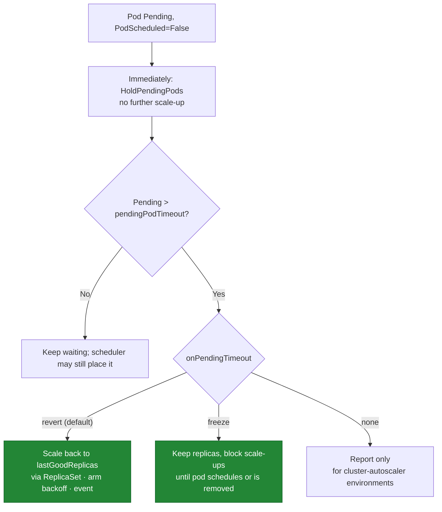
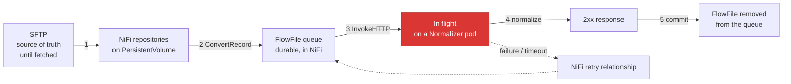

# KubeScaleSense — Failure Scenarios

> Status: **Design (pre-implementation)** · Version: 0.2
> Canonical source for: failure modes (`FS-xx`), the controller's specified response to each, and the
> data-loss analysis.

Related documents: [requirements](requirements.md) · [architecture](architecture.md) ·
[scaling-algorithm](scaling-algorithm.md) · [resource-calculation](resource-calculation.md) ·
[test-plan](test-plan.md) · [implementation-plan](implementation-plan.md)

---

## 1. How to read this document

Every scenario is specified as: **trigger → detection → controller behaviour → data-loss risk → mitigation →
verifying test**. "Controller behaviour" is a commitment, expressed with the reason codes from
[scaling-algorithm § 2](scaling-algorithm.md#2-decision-outcomes-and-reason-codes), and it is what the tests
in [test-plan](test-plan.md) assert.

Two rules govern every response below, and most of the table is a consequence of them:

1. **The null action is the safe action.** Under uncertainty, hold the current replica count. A stale
   decision is nearly always better than a decision from unknown state.
2. **Never scale down on doubt.** Scaling down terminates pods holding in-flight work, so unavailable or
   stale data must never look like "idle".

**Severity** describes the consequence if the mitigation were absent:

| Severity | Meaning |
| --- | --- |
| **S1** | Data loss or corruption |
| **S2** | Processing stops or cluster health degrades |
| **S3** | Throughput degraded / SLO at risk; pipeline still correct |
| **S4** | Noise, waste, or reduced observability |

---

## 2. Scenario summary

| ID | Scenario | Sev | Controller response | Test |
| --- | --- | --- | --- | --- |
| [FS-01](#fs-01-workload-spike-exceeds-maxreplicas) | Demand exceeds `maxReplicas` | S3 | `HoldAtMaxReplicas` + event | E2E-10 |
| [FS-02](#fs-02-insufficient-cluster-resources) | Not enough schedulable capacity | S3 | `HoldInsufficientResources`, backoff, alert | E2E-02 |
| [FS-03](#fs-03-partial-scale-up-leaves-a-deficit) | Only some needed pods fit | S3 | `ScaleUpPartial`, deficit visible | E2E-02 |
| [FS-04](#fs-04-fragmentation-free-resources-exist-but-nothing-fits) | Free CPU exists, no node can host a pod | S3 | `HoldInsufficientResources` (correctly) | E2E-04 |
| [FS-05](#fs-05-unmodelled-scheduling-predicate-causes-a-wrong-fit-estimate) | Over-estimated fit (topology spread, quota, volumes) | S2 | Pending watchdog remediates | E2E-08 |
| [FS-06](#fs-06-newly-created-pod-stays-pending) | New pod stuck `Unschedulable` | S2 | `HoldPendingPods` → revert/freeze | IT-07, E2E-08 |
| [FS-07](#fs-07-repeated-impossible-scale-attempts) | Infeasible demand persists | S4 | Exponential backoff, one event/cycle | UT-09, E2E-02 |
| [FS-08](#fs-08-stale-resource-or-metric-information) | Cached/aged data | S2 | `HoldStaleMetrics`, no action | UT-12, E2E-07 |
| [FS-09](#fs-09-kubernetes-api-failure) | API errors, conflicts, throttling | S2 | Freeze, bounded retry, `409` → re-decide | IT-02, IT-03 |
| [FS-10](#fs-10-namespace-resourcequota-blocks-pod-creation) | Quota rejects pod creation | S2 | Watchdog on unmaterialised replicas | IT-08 |
| [FS-11](#fs-11-node-memory-pressure-evicts-running-workers) | Node pressure evicts healthy pods | S1 | Prevented by request-based math + reserves | DI-06 |
| [FS-12](#fs-12-normalizer-pod-crashes-mid-request) | Pod OOM/panic while serving a request | S1 | Out of scope for the controller; NiFi retries the request | DI-01, DI-09 |
| [FS-13](#fs-13-node-failure-or-drain-removes-workers) | Node lost or drained | S2 | Candidate set shrinks; re-scale if feasible | E2E-05 |
| [FS-14](#fs-14-scale-down-terminates-a-busy-pod) | Scale-down hits a working pod | S1 | Deletion cost + graceful shutdown | DI-02 |
| [FS-15](#fs-15-metrics-source-unavailable) | Signal source or metrics-server unreachable | S3 | Degrade or `HoldStaleMetrics` | IT-10, E2E-07 |
| [FS-16](#fs-16-competing-controller-on-the-same-target) | HPA also scaling the target | S2 | `HoldScalingConflict`, refuse to act | IT-06 |
| [FS-17](#fs-17-controller-crash-restart-or-leadership-change) | Controller dies or loses lease | S3 | Cold start, cooled down, re-derive | IT-09, E2E-11 |
| [FS-18](#fs-18-replica-oscillation) | Sawtooth demand near a threshold | S4 | Deadband + window + cooldowns | UT-10, E2E-06 |
| [FS-19](#fs-19-misconfiguration) | Bad config or missing pod requests | S2 | Fail fast at startup | UT-21 |
| [FS-20](#fs-20-sustained-overload-beyond-cluster-capacity) | Arrival rate exceeds any feasible capacity | S3 | Honest HOLD + deficit alert | E2E-02 |
| [FS-21](#fs-21-target-pod-template-changes-mid-flight) | Requests changed during a rollout | S4 | Re-read template each reconcile | IT-02 |
| [FS-22](#fs-22-external-actor-changes-the-replica-count) | GitOps/operator/human writes `replicas` | S2 | Adopt baseline; refuse after repeated drift | IT-13 |
| [FS-23](#fs-23-scale-up-requested-during-a-rollout) | Scale-up during a rollout; surge exceeds the estimate | S2 | `HoldRolloutInProgress` | IT-14 |
| [FS-24](#fs-24-scheduled-but-unhealthy-pods) | Pods schedule then fail to become Ready | S2 | `HoldUnhealthyPods`, no auto-remediation | IT-15 |
| [FS-25](#fs-25-withdrawn-shared-work-store-claim-semantics) | *Withdrawn* — shared work store cannot claim atomically | — | No work store exists; retained as history | — |
| [FS-26](#fs-26-leadership-handoff-races-with-an-in-flight-write) | Old and new leader both write | S4 | Precondition rejects the loser; silent baseline adoption | IT-09 |
| [FS-27](#fs-27-stabilization-window-gap-after-an-outage) | Window nearly empty after an outage | S2 | Coverage requirement blocks scale-down | UT-24 |
| [FS-28](#fs-28-adding-replicas-does-not-add-throughput) | Client concurrency, not replicas, bounds throughput | **S3** | Scaling is correct but ineffective; diagnosable, not fixable by the controller | DI-08 |
| [FS-29](#fs-29-a-retried-request-is-normalized-twice) | Timeout causes a duplicate normalization | S4 | Harmless: normalization is a pure function | DI-04 |

Scenarios FS-22 through FS-27 were added by the [design review](design-review.md); FS-22 and FS-24 were
genuine omissions rather than refinements. FS-28 and FS-29 are the two failure modes **introduced** by the
v0.2 simplification ([ADR-21](architecture.md#adr-21-how-does-work-reach-the-normalizer-pods)), replacing the
two introduced by the work store it withdrew. Recording them is deliberate: a simplification that closes two
scenarios and silently opens two others has not been made honestly. FS-28 is the more important of the pair,
because it is the one that can make the *demonstration itself* misleading.

---

## 3. Detailed scenarios

### FS-01: Workload spike exceeds `maxReplicas`

**Trigger.** Backlog implies more replicas than the configured ceiling.
**Detection.** `desiredRaw > maxReplicas` while `currentReplicas == maxReplicas`.
**Behaviour.** `HoldAtMaxReplicas`; `kss_desired_replicas_uncapped` shows the true demand so the ceiling's cost
is measurable.
**Data-loss risk.** None — the backlog waits durably in NiFi ([D-01](requirements.md#7-durability-boundary-and-workload-responsibilities)).
**Mitigation.** Deliberately distinct from `HoldInsufficientResources`: this one is fixed by raising a policy
limit, not by adding hardware. Conflating them would send an operator to the wrong remedy.
**Test.** E2E-10.

### FS-02: Insufficient cluster resources

**Trigger.** Demand needs `Δ_req` pods; `F == 0`.
**Detection.** Feasibility gate ([scaling-algorithm § 6](scaling-algorithm.md#6-step-4--scale-up-logic-and-the-feasibility-gate)).
**Behaviour.** `HoldInsufficientResources`; backoff armed; one `Warning` event per cycle naming the blocking
dimension and candidate node count; `kss_insufficient_resource_holds_total{dimension}` increments.
**Data-loss risk.** None. Throughput is capped at what the cluster safely supports.
**Mitigation.** This is the project's core designed behaviour, not an error path: the alternative (issuing the
scale-up anyway) converts a visible capacity shortfall into Pending pods and node pressure. Recovery is
automatic and prompt because backoff resets on observed capacity increase
([scaling-algorithm § 9.2](scaling-algorithm.md#92-reset-is-level-triggered-on-capacity-not-timer-driven)).
**Test.** E2E-02, E2E-03.

### FS-03: Partial scale-up leaves a deficit

**Trigger.** `0 < F < Δ_req`.
**Behaviour.** `ScaleUpPartial` to `current + F`; backoff armed for the remainder; `kss_desired_replicas`
keeps reporting the *full* desired value so the deficit does not disappear from dashboards just because
progress was made.
**Data-loss risk.** None.
**Mitigation.** Partial progress is strictly better than none; operators preferring all-or-nothing set
`allowPartialScaleUp: false` ([ADR-09](architecture.md#adr-09-what-happens-when-demand-is-high-but-resources-are-insufficient)).
**Test.** E2E-02.

### FS-04: Fragmentation, free resources exist but nothing fits

**Trigger.** Aggregate free CPU exceeds the pod request, but no single node has room (e.g. 5 nodes × 300 m
free vs. a 500 m request).
**Detection.** Per-node flooring in [resource-calculation § 5](resource-calculation.md#5-step-4--fit-capacity)
yields `F = 0` while `kss_free_requestable_cpu_millicores` is large.
**Behaviour.** `HoldInsufficientResources` — the *correct* answer despite "free" resources.
**Mitigation.** This scenario is the reason aggregate free resources are exported for humans but never used as
a decision input. The apparent contradiction between the two metrics is intentional and documented; the demo
shows it explicitly.
**Test.** E2E-04.

### FS-05: Unmodelled scheduling predicate causes a wrong fit estimate

**Trigger.** The target uses a predicate outside the v0.1 model — topology spread, pod anti-affinity, volume
topology, extended resources ([resource-calculation § 6](resource-calculation.md#6-predicates-modelled-and-predicates-ignored)).
**Detection.** Not detectable in advance by design; observed as a Pending pod.
**Behaviour.** The scale-up is issued, the pod goes Pending, `HoldPendingPods` blocks any further scale-up,
and the watchdog remediates per [FS-06](#fs-06-newly-created-pod-stays-pending).
**Data-loss risk.** None directly; S2 because an unschedulable pod adds scheduler churn and operator confusion
while adding no throughput.
**Mitigation.** Bounded by `fitCapacityMarginPods`, caught by the watchdog, and stated as a limitation rather
than hidden. This is the honest cost of choosing an estimator over a scheduler simulation
([ADR-06](architecture.md#adr-06-how-do-we-determine-whether-n-additional-pods-are-likely-schedulable)) — and
the reason the watchdog is a hard requirement.
**Test.** E2E-08.

### FS-06: Newly created pod stays Pending

**Trigger.** A pod created by our scale-up cannot be scheduled: estimation error (FS-05), a capacity race, a
quota (FS-10), or a missing PVC.
**Detection.** Watchdog over pods owned by the target's current ReplicaSet: `phase == Pending` with
`PodScheduled=False`, reason `Unschedulable`, for longer than `pendingPodTimeout` (120 s).
**Behaviour.**

**Data-loss risk.** None. The pending pod never processed anything, and removing it is done by lowering
`replicas` so the ReplicaSet controller terminates gracefully — the controller never deletes pods directly
([architecture § 7](architecture.md#7-kubernetes-permissions-and-rbac)).
**Mitigation.** `HoldPendingPods` prevents stacking a second bad request on the first, so estimation errors
cannot compound across reconciles. The 120 s timeout is generous on purpose: a rebooting node or a slow
volume attach should not trigger a revert.
**Test.** IT-07 (all three modes), E2E-08.

### FS-07: Repeated impossible scale attempts

**Trigger.** Demand stays above capacity for a long period.
**Behaviour.** Exponential backoff 30 s → 15 m (`factor 2`), reason `HoldBackoff`, one event per cycle instead
of one per reconcile ([scaling-algorithm § 9.1](scaling-algorithm.md#91-backoff-state-machine)).
**Severity rationale.** Without backoff the impact is S4 noise — log/event spam that pressures the API server
and makes metrics unable to distinguish one persistent problem from many new ones.
**Mitigation.** Reset is level-triggered on *capacity increase*, so recovery latency stays at one interval
(≤ 15 s) even mid-backoff.
**Test.** UT-09, E2E-02 (backoff growth), E2E-03 (prompt reset).

### FS-08: Stale resource or metric information

**Trigger.** Watch desync, metrics-server lag, a slow signal source, or a controller resume after suspension.
**Detection.** Every signal carries `sampledAt`; `kss_metric_sample_age_seconds` exceeds `metricsStaleAfter`.
Nodes with stale `Ready` heartbeats are excluded from the candidate set (C2). Freshness is evaluated against
**both** the local receive age and the source-reported sample age: receive age alone would let a *frozen*
metrics-server serving ten-minute-old samples look perfectly fresh, while source timestamps alone would be
distorted by clock skew ([FR-34](requirements.md#review-driven-requirements-v011),
[DR-14](design-review.md#dr-14-staleness-measured-only-from-local-receive-time-misses-a-frozen-source)).
**Behaviour.** `HoldStaleMetrics` — **no action in either direction**. Notably, no scale-down: "no data" must
never be interpreted as "no work".
**Data-loss risk.** None with the hold; S2 if a stale-driven scale-down terminated busy pods.
**Mitigation.** Layered per [ADR-12](architecture.md#adr-12-how-do-we-avoid-stale-resource-information):
watches rather than polling, a snapshot built immediately before the decision, explicit ages, no action before
cache sync, `resourceVersion` preconditions on writes, and reserves to absorb the irreducible race.
**Test.** UT-12, E2E-07.

### FS-09: Kubernetes API failure

**Trigger.** API server unavailable, throttling (`429`), `5xx`, RBAC change, or an update conflict.
**Behaviour** ([ADR-14](architecture.md#adr-14-what-happens-if-kubernetes-api-calls-fail)):

| Failure | Response |
| --- | --- |
| Read / watch failure | Serve last synced cache; beyond `metricsStaleAfter` → `HoldStaleMetrics` |
| Write `5xx`/timeout/`429` | Jittered retry bounded by `interval`, then abandon and re-decide next tick |
| Write `409 Conflict` | Discard decision, re-read, re-decide — never retry a stale replica value |
| `403` / `404` | Fatal configuration error: event, `/readyz` failure, no retry storm |
| Lost leadership | Stop deciding immediately and exit, so the new leader starts cooled down |

**Data-loss risk.** None from the controller; S2 because scaling is frozen while the pipeline may be
overloaded.
**Mitigation.** Bounded retries avoid amplifying an API-server incident; `kss_api_errors_total{resource,verb,code}`
plus readiness make the freeze visible rather than silent.
**Test.** IT-02 (conflict), IT-03 (`403`), E2E-07.

### FS-10: Namespace `ResourceQuota` blocks pod creation

**Trigger.** A quota on `requests.cpu`/`requests.memory`/`pods` rejects the ReplicaSet's pod creation.
**Detection.** Distinctive signature: **no Pending pod appears at all**. `spec.replicas` rises but
`status.replicas` does not, and the ReplicaSet emits `FailedCreate`. The watchdog therefore also triggers on
"replicas not materialising into pods within `pendingPodTimeout`".
**Behaviour.** Watchdog remediation as in FS-06, plus a `Warning` event naming the quota.
**Mitigation.** Quota is not modelled proactively in v0.1 ([NG-10](requirements.md#3-non-goals)); the reactive
path is cheap and sufficient for the POC. Proactive modelling — subtracting quota headroom from `F` — is
Phase 3.
**Test.** IT-08.

### FS-11: Node memory pressure evicts running workers

**Trigger.** A node's actual memory usage crosses the kubelet eviction threshold; the kubelet evicts pods by
QoS class and usage-above-request.
**Why this is the S1 scenario the design targets.** Eviction kills *already-running healthy* workers, each
holding in-flight items — so a scaling decision can interrupt work it never touched. This is the mechanism
behind "processing can be interrupted, data may be lost" in the problem statement, and it is precisely what a
usage-based autoscaler invites by packing pods onto nodes whose committed requests are already spoken for.
**Behaviour / prevention.** Structural rather than reactive:

- Fit capacity uses **requests against allocatable**, so the controller never places a pod on a node whose
  budget is already committed ([ADR-05](architecture.md#adr-05-capacity-allocatable-or-requested)).
- `allocatable` already excludes kube/system-reserved and eviction thresholds.
- `perNodeReserveMemoryMiB` leaves additional slack.
- Memory is evaluated as an independent dimension and never traded against CPU
  ([ADR-04](architecture.md#adr-04-how-should-available-memory-be-calculated)), because memory is
  incompressible: CPU overcommit merely throttles, memory overcommit kills.
- Workload-side: processing pods set memory **limits** close to requests (Guaranteed/Burstable-with-tight-limits)
  so one pod cannot balloon and endanger its neighbours; a `PodDisruptionBudget` protects the pool
  ([D-07](requirements.md#7-durability-boundary-and-workload-responsibilities)).
- If a node does become pressured, the kubelet's `memory-pressure` taint removes it from our candidate set
  automatically ([resource-calculation § 2.1](resource-calculation.md#21-taints-and-tolerations-c4)).

**Residual risk.** Under-requesting neighbours can still pressure a node
([resource-calculation § 4.1](resource-calculation.md#41-known-over-estimation-under-requesting-neighbours)).
Residual loss is then absorbed by [D-02](requirements.md#7-durability-boundary-and-workload-responsibilities) —
the evicted pod's in-flight requests fail and NiFi re-sends them.
**Test.** DI-06.

### FS-12: Normalizer pod crashes mid-request

**Trigger.** OOM kill, panic, SIGKILL, node loss, while the pod is serving a normalization request.
**Behaviour.** Not a controller concern — no autoscaler can prevent it
([ADR-15](architecture.md#adr-15-how-do-we-protect-data-processing-when-a-worker-pod-crashes)). The in-flight
request fails: the connection drops or times out, NiFi routes the FlowFile to its retry relationship, and it is
re-sent to a surviving pod ([D-02](requirements.md#7-durability-boundary-and-workload-responsibilities)). The
pod held nothing durable, so there is nothing to recover — which is the entire point of keeping the scaled
workload stateless.
**Data-loss risk.** S1 **if NiFi does not retry**; none if it does. This is the sharpest illustration of the
responsibility boundary: the controller cannot make this case safe and does not claim to
([requirements § 7](requirements.md#7-durability-boundary-and-workload-responsibilities)). The dependency is
recorded as [A-12](requirements.md#103-assumptions-that-must-hold-for-the-guarantees-to-be-meaningful).
**What changed, and what it cost.** Under the withdrawn work-store design an item could not be lost even if
every pod died, because it stayed durably in the store. That protection is gone, traded for the removal of an
entire component ([ADR-20](architecture.md#adr-20-how-is-in-flight-work-protected-without-a-shared-filesystem)).
The trade is acceptable **only** because durability is explicitly not this project's claim.
**Test.** DI-01, DI-04, DI-09.

### FS-13: Node failure or drain removes workers

**Trigger.** Node `NotReady`, cordoned, or drained; several replicas disappear at once.
**Detection.** Node informer; candidate filter C1/C3 removes the node; `kss_candidate_nodes` drops.
**Behaviour.** The ReplicaSet controller recreates the lost pods; KubeScaleSense recomputes `F` against the
smaller cluster and either replaces capacity elsewhere or reports `HoldInsufficientResources`. Because the
drained node is excluded, the controller does not attempt to place pods on it.
**Data-loss risk.** Requests in flight on the lost pods fail and are retried by NiFi (D-02, D-04).
**Mitigation.** A drain and a capacity shortfall converge on the same well-tested path, which is why no
special-case logic exists for it.
**Test.** E2E-05.

### FS-14: Scale-down terminates a busy pod

**Trigger.** Demand falls; a replica is removed while it is serving requests.
**Behaviour.** Before writing the lower replica count the controller refreshes
`controller.kubernetes.io/pod-deletion-cost` from reported in-flight counts, so the ReplicaSet controller
prefers the idlest pod ([scaling-algorithm § 7](scaling-algorithm.md#7-step-5--scale-down-logic)). Termination
is graceful: on `SIGTERM` the pod fails its readiness probe so `normalizer-service` stops routing new requests
to it, then drains the requests already in flight within a `terminationGracePeriodSeconds` larger than the
maximum request processing time ([A-07](requirements.md#6-workload-and-environment-assumptions),
[WR-06](requirements.md#workload-signal-requirements-v02), D-05).
**Data-loss risk.** S1 if the pod were killed abruptly; none with graceful shutdown, and even a hard kill only
costs the in-flight requests, which NiFi retries (D-02).
**Mitigation, stated precisely after review.** Two claims were too strong:

- **Deletion cost is a preference within the Ready cohort, not a selector.** The ReplicaSet controller ranks
  candidates by unassigned, then `Pending` before `Running`, then **not-Ready before Ready**, and only then by
  deletion cost. A busy pod with a momentary readiness blip is removed before an idle Ready pod regardless of
  cost, and the mechanism requires the `PodDeletionCost` feature gate (beta, default-on since 1.22)
  ([DR-11](design-review.md#dr-11-pod-deletion-cost-ordering-was-described-too-loosely)).
- **A `PodDisruptionBudget` does not apply here at all.** PDBs constrain the Eviction API only; a ReplicaSet
  scale-down deletes pods directly and ignores them
  ([DR-10](design-review.md#dr-10-poddisruptionbudget-does-not-protect-against-scale-down)).

So the actual guarantees for in-flight work during scale-down are, in increasing order of reliability:
`maxScaleDownStep: 1`, graceful shutdown driven by readiness, and NiFi retry as the backstop that holds even
on a hard kill.
**Test.** DI-02.

### FS-15: Metrics source unavailable

**Trigger.** The workload-signal source is unreachable, refusing connections, or slower than
`workload.signal.timeout`; or metrics-server is missing.
**Behaviour.**

| Missing source | Response |
| --- | --- |
| Pressure (workload-signal source) | Required signal → `HoldStaleMetrics` once age > `metricsStaleAfter`; event `MetricsUnavailable`. A scrape timeout counts as unavailable, **never as zero** ([FR-38](requirements.md#workload-signal-requirements-v02)) |
| Utilization (metrics-server) | Degrade to pressure-only (`desiredUtilization` omitted from the `max()`), emit `MetricsUnavailable`, continue scaling |

**Rationale for the asymmetry.** Pressure is the primary demand signal and has no substitute; utilization is a
safety net whose absence merely reduces sensitivity to expensive items. Losing the net is a degradation;
losing the primary signal means the controller is blind, and a blind autoscaler must not act.

**A specific trap this design creates.** When the source is the Normalizer's own metrics endpoint, a *total*
outage of the Normalizer makes the pressure signal unavailable at exactly the moment demand is highest. The
signal and the workload share a failure domain. The response is still correct — freeze, never scale down — but
it means an operator cannot rely on the pressure metric to diagnose a Normalizer outage; that is what
`kss_workload_signal_source_up` and the unhealthy-pod guard ([FS-24](#fs-24-scheduled-but-unhealthy-pods)) are
for.
**Test.** IT-10, E2E-07.

### FS-16: Competing controller on the same target

**Trigger.** An HPA (or another KubeScaleSense instance without leader election) also writes the target's
`scale`.
**Detection.** HPA informer in the target namespace at startup and every reconcile; conflict signature is
rapid `409`s and unexplained replica changes.
**Behaviour.** `HoldScalingConflict`: refuse to act, `Warning` event, `/readyz` failure. Startup detection is
fatal ([FR-19](requirements.md#4-functional-requirements)).
**Data-loss risk.** S2 — two controllers with different models produce sustained oscillation, and oscillation
means repeated pod termination.
**Mitigation.** Refusing is better than winning: whichever controller writes last would determine behaviour,
so a "fight" has no safe outcome. Leader election prevents the self-conflict case
([FR-26](requirements.md#4-functional-requirements)).
**Test.** IT-06.

### FS-17: Controller crash, restart, or leadership change

**Trigger.** Pod restart, node loss, lease handoff, deployment upgrade.
**Behaviour.** Decision state is in-memory by design ([architecture § 4.6](architecture.md#46-controller-internalcontroller)).
On start the controller re-derives everything from the cluster and behaves as freshly cooled down: no action
until caches sync and one metric sample exists ([NFR-08](requirements.md#5-non-functional-requirements)), with
empty `desiredHistory` (so no immediate scale-down is possible), cleared backoff, and
`lastGoodReplicas = currentReplicas`.
**Data-loss risk.** None — replica count lives in the `Deployment`, not in the controller.
**Mitigation.** Choosing amnesia over persistence is deliberate: a restart yields *more* conservative
behaviour (a scale-down needs a fresh full stabilization window), and there is no persisted state to become
inconsistent with reality. The cost is a slower first scale-down after a restart, which is acceptable.
**Test.** IT-09, E2E-11.

### FS-18: Replica oscillation

**Trigger.** Demand hovering at a replica boundary, or noisy sampling.
**Behaviour.** Four independent damping mechanisms
([scaling-algorithm § 8](scaling-algorithm.md#8-hysteresis-and-oscillation-control)): deadband, asymmetric
cooldowns, scale-down stabilization window using `max()`, and optional EWMA smoothing. Worst-case action rate
is bounded at one scale-up per 60 s and one scale-down per 300 s regardless of input.
**Data-loss risk.** S4 as noise, but each cycle terminates a pod, so sustained oscillation is a real
correctness pressure on the drain path.
**Test.** UT-10, E2E-06 (soak with sawtooth load, asserting a bounded action count).

### FS-19: Misconfiguration

**Trigger.** `minReplicas > maxReplicas`, `interval` too small, target missing, pod template without resource
requests, an `http` signal source with an empty or malformed endpoint, `itemsPerReplica: 0`.
**Behaviour.** Startup validation fails fast with a non-zero exit and a specific message (CR-2). Missing pod
requests are singled out: without them fit capacity is meaningless
([resource-calculation § 3](resource-calculation.md#3-step-2--effective-pod-request-of-the-target-workload)),
so the controller refuses to run rather than computing a number nobody should trust.
**Mitigation.** Crash-looping with a clear message is preferable to running with a subtly wrong model;
`dryRun: true` provides a safe way to validate a new configuration against a live cluster.
**Test.** UT-21.

### FS-20: Sustained overload beyond cluster capacity

**Trigger.** Arrival rate exceeds the throughput of `min(maxReplicas, F-limited replicas)` indefinitely.
**Behaviour.** The controller scales to the safe maximum and then holds, reporting a persistent deficit
(`kss_desired_replicas` − `kss_current_replicas`). Backlog grows; latency SLO is breached.
**Data-loss risk.** Bounded by NiFi's repository sizing and back-pressure configuration — the pipeline's real
limit. If the buffer fills, NiFi back-pressure stops fetching from SFTP, leaving files on the SFTP server
rather than dropping them. That is the intended overflow behaviour and an explicit capacity-planning input.
**Mitigation.** The controller cannot fix a capacity shortfall; its contribution is to make it loud, specific,
and attributable (which dimension, which nodes, how many pods short). Converting an invisible reliability
problem into a visible capacity problem is the designed outcome
([ADR-09](architecture.md#adr-09-what-happens-when-demand-is-high-but-resources-are-insufficient)).
**Test.** E2E-02 with a sustained generator.

### FS-21: Target pod template changes mid-flight

**Trigger.** An operator edits the processing container's requests, or a rollout is in progress.
**Behaviour.** The effective pod request is re-read from the live template every reconcile, so fit capacity
reflects the new shape immediately. During a rolling update both old and new pods exist and both count in
Step 3; terminating pods still hold resources
([resource-calculation § 4](resource-calculation.md#4-step-3--per-node-free-requestable-resources)), so the
controller is conservative exactly when the deployment is churning. Writes use `deployments/scale` only, so a
controller bug cannot rewrite the template.
**Mitigation.** A scale-up during a rollout may be deferred by lower `F`; acceptable and self-correcting. Note
that scaling is held entirely while a rollout is in flight, per [FS-23](#fs-23-scale-up-requested-during-a-rollout).
**Test.** IT-02.

### FS-22: External actor changes the replica count

**Trigger.** A GitOps controller (Argo CD, Flux) reconciles `replicas` from git, an operator runs
`kubectl scale`, or another controller writes the `scale` subresource.
**Detection.** Observed `spec.replicas` differs from `lastWrittenReplicas` and we did not write it.
**Behaviour.** Adopt the observed value as the new baseline, reset cooldown timers and `desiredHistory`, emit
`ExternalScaleDetected` once. After more than `scaling.externalChangeTolerance` (3) recurrences inside the
stabilization window: `HoldExternalChange`, refuse to act
([ADR-17](architecture.md#adr-17-how-do-we-handle-other-writers-of-the-replica-count)).
**Why this is S2 and was the review's largest omission.** A GitOps controller reverting every scale-up within
seconds, against a controller that scales up again each interval, is an *unbounded oscillation loop with an
external actor* — terminating pods on every cycle and burning API budget indefinitely. It is far more likely in
practice than the competing HPA that FS-16 covers.
**Note.** `resourceVersion` preconditions do **not** mitigate this. The external write succeeds and our next
write is against a fresh version; optimistic concurrency prevents lost updates, not disagreements about intent.
**Mitigation.** In GitOps-managed environments, ownership of the replica field must be granted to the
controller (e.g. Argo CD `ignoreDifferences`), exactly as for an HPA — recorded as
[A-10](requirements.md#103-assumptions-that-must-hold-for-the-guarantees-to-be-meaningful).
**Test.** IT-13.

### FS-23: Scale-up requested during a rollout

**Trigger.** A scale-up is decided while the Deployment is rolling out a new pod template.
**Detection.** `metadata.generation != status.observedGeneration`, or `updatedReplicas != replicas`.
**Behaviour.** `HoldRolloutInProgress` in **both** directions until the rollout completes.
**Why.** Fit capacity correctly accounts for the surge and terminating pods that *already exist*, but not for
the surge that our own scale-up will cause: with `maxSurge: 25 %`, a request for 4 additional replicas
transiently needs up to 5 pods' worth of resources. The gate approves 4, the Deployment controller asks for 5,
and the fifth is the pod that goes Pending — an over-estimate created by the controller's own request.
**Mitigation.** Holding is the cheap correct answer: rollouts are short and operator-initiated. The alternative
— requiring `F >= Δ_req + surge(Δ_req)` — is more permissive but adds a second, subtler resource calculation
for a rare window, and was rejected as unnecessary complexity
([DR-08](design-review.md#dr-08-rollouts-and-maxsurge-are-unaccounted-for)).
**Test.** IT-14.

### FS-24: Scheduled but unhealthy pods

**Trigger.** Pods schedule successfully and then never become useful: `ImagePullBackOff`,
`CrashLoopBackOff`, a failing readiness probe, a missing Secret or ConfigMap, a bad configuration.
**Detection.** A pod of the target's current ReplicaSet with `PodScheduled=True` and not `Ready` for longer
than `pending.podStartupTimeout` (300 s).
**Behaviour.** `HoldUnhealthyPods` — block scale-ups, emit `PodStartupFailure`, expose
`kss_unhealthy_target_pods`. Deliberately **no** auto-remediation.
**Why this is the worst behavioural bug the review found.** Without this guard the feedback loop runs the wrong
way: broken pods are scheduled, so their requests are committed and consume real cluster capacity; they process
nothing, so the backlog grows; the growing backlog raises `desiredBacklog`, so the controller scales up; the new
pods are equally broken. A resource-aware autoscaler that responds to a bad image tag by consuming the cluster —
and potentially starving its neighbours — is a worse outcome than the Pending pods this project exists to
prevent.
**Why no auto-revert** (unlike [FS-06](#fs-06-newly-created-pod-stays-pending)): these pods are scheduled and
may recover once an image or Secret is fixed, and removing replicas from a partially-broken pool can remove the
healthy ones. The controller cannot fix a broken image; the correct action is to stop making the situation more
expensive and say so loudly.
**Data-loss risk.** None directly. S2 because processing has effectively stopped while capacity is consumed.
**Test.** IT-15.

### FS-25: Withdrawn, shared work-store claim semantics

> **Withdrawn in v0.2. Retained as history, not as an active scenario.**
> This scenario described a shared work store that could not support atomic, mutually-exclusive item claiming.
> The v0.2 architecture has **no work store of any kind**
> ([ADR-21](architecture.md#adr-21-how-does-work-reach-the-normalizer-pods)), so the failure it describes has
> no mechanism to occur.

It is kept for one reason: **the class of failure it documents returns the moment anyone reintroduces shared
state between the pods.** The two concrete cases were:

| Store | Failure |
| --- | --- |
| RWX PVC on kind | kind ships `local-path-provisioner`, which provides only **node-local `ReadWriteOnce`** volumes. A "shared" PVC silently becomes a per-node directory: items written by NiFi are invisible to pods on other nodes and sit unprocessed. Indistinguishable from data loss during a demo, and directly at odds with the multi-node topology the fit-capacity demo requires |
| MinIO / S3 | Object stores have **no atomic rename**; "rename" is copy-then-delete. Two pods can both claim the same item, so the claim protocol provides no mutual exclusion and correctness rests entirely on idempotency |

**Why this history matters to a future reader.** The first instinct when someone proposes "let the pods share
a volume" is that kind will handle it. It will appear to, and then quietly process a fraction of the data. If
shared state ever returns to this design, this scenario becomes active again and needs a test that proves the
primitive across nodes — not an assumption that it holds
([DR-12](design-review.md#dr-12-the-poc-work-store-cannot-provide-the-claimed-semantics-on-the-proposed-environment)).

### FS-28: Adding replicas does not add throughput

**Trigger.** NiFi dispatches fewer concurrent requests than there are Normalizer replicas — the default
`InvokeHTTP` concurrent-task count is small — or the Normalizer has a hidden shared bottleneck (an external
dependency, a global lock, a connection cap). The controller scales up correctly and nothing improves.
**Detection.** The signature is distinctive and worth learning: `kss_current_replicas` rises, fit capacity is
adequate, **no** pod is Pending or unhealthy, yet `kss_workload_processing_rate` is flat and the pressure
signal keeps growing. Per-pod CPU utilization *falls* as replicas are added while the queue grows — the
inverse of the healthy scale-up signature.
**Behaviour (controller).** None, and this is correct: every decision the controller made was right. It saw
pressure, confirmed feasibility, and scaled. The bottleneck is on the client side of a push interface, which
the controller neither observes nor controls.
**Why this is the price of the v0.2 simplification.** With work *pushed* over HTTP, throughput is
`min(client concurrency, replica capacity)`. The withdrawn work-store design avoided this by making pods
*pull*, which is exactly the argument
[ADR-18](architecture.md#adr-18-what-is-the-durable-work-store-for-the-poc-pipeline) used to reject HTTP push.
That argument was sound but disproportionate: the answer is to configure the client's concurrency above
`maxReplicas` ([A-13](requirements.md#103-assumptions-that-must-hold-for-the-guarantees-to-be-meaningful)),
not to introduce a database.
**Why it is S3 and not S4.** It does not corrupt or lose anything, but it can make the **demonstration itself
misleading**: a graph showing replicas rising while the backlog also rises looks exactly like a controller
that is not working. Diagnosing this as a client-concurrency problem rather than a controller bug is the
difference between trusting the project and abandoning it.
**Mitigation.** NiFi's concurrent-task count is set above `maxReplicas` and asserted during demo setup;
processing rate and per-pod utilization are plotted beside replica count so a flat throughput curve is
visible immediately; and **DI-08 fails the build** if throughput does not track replica count
([A-15](requirements.md#103-assumptions-that-must-hold-for-the-guarantees-to-be-meaningful)).
**Data-loss risk.** None. Work waits in NiFi's queue, which is durable (D-01).
**Test.** DI-08, plus [WT-13](test-plan.md#51-workload-and-pipeline-tests--p2-no-cluster-required) — the
concurrency setting is checked against the configured `maxReplicas` in the shipped flow on every commit, and
`tests/e2e/assert-nifi-flow.sh` checks it in the running NiFi at demo start-up. DI-08 is the test that
matters, because only a live pipeline can show a flat throughput curve; the two static checks catch the
specific cause that is cheap to catch and easy to introduce.
**Status (P2).** The mitigations are in place; **DI-08 has not been run** in this environment, because `kind`
is unavailable. Until it has, "replicas convert into throughput" is a design argument rather than a
measurement, and it gates P3
([implementation-plan](implementation-plan.md#p2-as-built-deviations-from-the-plan)).

### FS-29: A retried request is normalized twice

**Trigger.** A request succeeds on the Normalizer but its response is lost, or it exceeds NiFi's response
timeout while still being processed. NiFi cannot distinguish "failed" from "succeeded but unacknowledged", so
it retries.
**Behaviour.** The record is normalized a second time, possibly on a different pod. Both attempts produce
**identical output**, because normalization is a pure function of its input
([D-03](requirements.md#7-durability-boundary-and-workload-responsibilities),
[WR-03](requirements.md#workload-signal-requirements-v02)).
**Data-loss risk.** None. The cost is wasted CPU, visible as a gap between
`kss_workload_request_rate` and the pipeline's record arrival rate.
**Mitigation.** This is at-least-once delivery, accepted deliberately rather than engineered away: exactly-once
would require distributed transactions across SFTP, NiFi, and the output sink
([ADR-15](architecture.md#adr-15-how-do-we-protect-data-processing-when-a-worker-pod-crashes)). The
requirement it places on the workload is precise and testable — **normalization must be a pure function** —
and it is the assumption that makes the entire retry-based durability model safe. If the Normalizer ever gains
a side effect (an email, a counter, a non-idempotent API call), this scenario becomes S1 immediately.
**Note.** NiFi's response timeout must exceed the maximum normalization time, or *every* slow request is
retried and the pool does duplicate work under exactly the load where it can least afford to. This is the one
tuning constraint the v0.2 design introduces — the analogue of the lease-duration constraint the work-store
design introduced, and cheaper because getting it wrong wastes CPU rather than corrupting a claim.
**Test.** DI-04, plus [WT-01/WT-02](test-plan.md#51-workload-and-pipeline-tests--p2-no-cluster-required) for
the purity this scenario's harmlessness depends on, and WT-13 for the timeout constraint. WT-02 is the
non-obvious one: the Normalizer's CPU cost is tunable, and folding its proof-of-work into the response body
would have made every retuning a change to the output. The digest is returned in a header instead, so purity
survives the knob.

### FS-26: Leadership handoff races with an in-flight write

**Trigger.** An outgoing leader has a `scale` write in flight as the incoming leader begins reconciling.
**Behaviour.** One write wins; the loser's `resourceVersion` precondition fails with `409`, and it re-reads and
re-decides ([FS-09](#fs-09-kubernetes-api-failure)). The new leader adopts observed `spec.replicas` as its
baseline **silently** — no `ExternalScaleDetected` event and no drift counter increment — since the previous
leader's legitimate write would otherwise be misclassified as an external change
([DR-13](design-review.md#dr-13-leader-handoff-interacts-with-external-change-detection)).
**Data-loss risk.** None.
**Test.** IT-09.

### FS-27: Stabilization window gap after an outage

**Trigger.** A metrics or API outage, or a controller restart, leaves `desiredHistory` with few or no samples,
because reconciles that return before computing demand append nothing.
**Behaviour.** Scale-down additionally requires the window to be **covered** — at least
`scaleDownWindowCoverage` (0.8) of `ceil(W / interval)` expected samples, with the oldest at least `W` old.
Uncovered windows report `HoldStabilizationWindow`.
**Why.** Without the coverage test, `max()` over a nearly-empty window is trivially low, so the guard is
satisfied by *missing data* and the controller scales down on the strength of five minutes of no information.
This is the same error as reading "no backlog data" as "no backlog", re-entering through the history buffer
([DR-04](design-review.md#dr-04-stabilization-window-gaps-permit-a-blind-scale-down)).
**Test.** UT-24.

---

## 4. Data-loss analysis

### 4.1 Where loss could occur, and what prevents it

**Read this section as a boundary statement, not as a controller feature.** KubeScaleSense provides no
durability ([requirements § 7](requirements.md#7-durability-boundary-and-workload-responsibilities)). What
follows is the analysis of where the *pipeline* can lose data, so that the claim "a scaling decision cannot
lose data" can be stated precisely and its dependencies named.

| Step | Failure during this step | Outcome | Protection |
| --- | --- | --- | --- |
| 1 | Fetch interrupted | File remains on SFTP; re-listed | NiFi commits before deleting the remote file (D-01) |
| 2 | NiFi pod dies | FlowFile survives in the repository on its PV | D-01 |
| 3 | Request refused or the pod is gone | Connection error → retry relationship → re-sent to another pod | D-02 |
| 4 | Pod dies mid-normalization | In-flight work discarded; the request fails and is re-sent | D-02, D-04 |
| 5 | Response lost after successful normalization | NiFi cannot tell success from failure, so it re-sends; the record is normalized twice with identical output | D-03 ([FS-29](#fs-29-a-retried-request-is-normalized-twice)) |
| — | NiFi exhausts its retry limit | **The record is dropped or routed to a failure queue.** This is the pipeline's real data-loss boundary and it belongs to NiFi's flow configuration | Flow design: a failure relationship that parks records rather than discarding them |

**The single highest-risk state is step 3–4** — a request in flight on a pod that dies — and its entire
mitigation is NiFi retry plus idempotent normalization. Note precisely what the simplification changed here:
under the withdrawn work-store design, steps 3–5 were protected by a durable row, a lease, and a transaction,
so the pipeline could survive the loss of *every* pod. Now they are protected by a retry, so the pipeline
survives the loss of *any* pod but depends on NiFi being alive and configured to retry. That dependency is
[A-12](requirements.md#103-assumptions-that-must-hold-for-the-guarantees-to-be-meaningful), and the last row
of the table is the honest statement of where data can still be lost.

### 4.2 What the controller does and does not contribute

| Concern | Owner |
| --- | --- |
| Input durability, retry, back-pressure, and the failure relationship | **NiFi / workload design** (D-01, D-02) |
| Idempotent normalization, so a retry is harmless | **Workload** (D-03, [WR-03](requirements.md#workload-signal-requirements-v02)) |
| Graceful shutdown on termination | **Workload** — readiness-driven drain within the grace period (D-05); controller supplies deletion-cost hints (D-06) |
| Avoiding *involuntary* eviction of healthy pods | **Controller** — request-based fit math and reserves (FS-11) |
| Not deleting pods directly | **Controller** — no pod `delete` permission at all |
| Not scaling down on stale or missing data | **Controller** — FS-08, FS-15 |
| Not stacking unschedulable requests | **Controller** — `HoldPendingPods`, FS-06 |

The claim this design supports, stated precisely and no more strongly:

> Given the workload properties D-01…D-07, **no scaling decision — right or wrong — can lose data.** A wrong
> decision costs throughput, or causes a record to be normalized later or twice, which
> [D-03](requirements.md#7-durability-boundary-and-workload-responsibilities) renders harmless.

Note what that sentence does **not** say. It does not say the pipeline cannot lose data — it can, if NiFi
exhausts its retries or its repositories are lost. It says that *scaling decisions* are not a route to data
loss. That is the only durability-adjacent claim this project makes, and it is deliberately narrow.

### 4.3 What would invalidate the claim

Stating the invalidating conditions is part of the design; each is a review item for any pipeline change:

| If this changes | Consequence |
| --- | --- |
| **NiFi stops retrying failed requests**, or its retry limit is reached and records are discarded | **D-02 broken at the foundation.** This is now the single load-bearing dependency of the whole argument: without retry, every pod crash and every scale-down loses in-flight work, and the controller's decisions *do* become a route to data loss ([FS-12](#fs-12-normalizer-pod-crashes-mid-request)) |
| Normalization gains a side effect — an email, a counter, an append, a non-idempotent API call | **D-03 broken.** Retry stops being harmless, so at-least-once delivery becomes duplicated real-world effects, and [FS-29](#fs-29-a-retried-request-is-normalized-twice) escalates from S4 to S1 |
| NiFi's response timeout drops below the maximum normalization time | Every slow request is retried while still being processed: duplicate work under peak load, exactly when the pool can least afford it ([FS-29](#fs-29-a-retried-request-is-normalized-twice)) |
| NiFi repositories move to `emptyDir` | D-01 broken: NiFi pod loss loses buffered files |
| The Normalizer becomes **stateful** — an in-memory queue that survives readiness, a local cache of unsent results, a per-pod file | D-04 broken: pod loss now destroys work that no retry will recover, and the "nothing durable inside the scaled workload" premise fails |
| Shared state returns between the pods (RWX volume, object store, shared cache) | [FS-25](#fs-25-withdrawn-shared-work-store-claim-semantics) reactivates, and the claim-semantics problem it documents must be re-verified rather than assumed |
| Request processing time can exceed `terminationGracePeriodSeconds` | D-05 broken: A-07 violated; graceful shutdown is truncated and drops in-flight requests, relying entirely on retry |
| Normalizer pods drop memory limits | FS-11 risk rises: one pod can pressure a node and evict peers |

---

## 5. Interacting failures

Individually-handled failures can combine; these three combinations are specifically designed for and tested.

| Combination | Interaction | Specified behaviour |
| --- | --- | --- |
| Spike (FS-02) + metrics-server down (FS-15) | Utilization signal missing exactly when needed | Backlog-only scaling continues; feasibility gate unchanged; `MetricsUnavailable` event (E2E-07) |
| Node drain (FS-13) + high demand (FS-02) | Capacity shrinks while demand grows | Candidate set shrinks → `HoldInsufficientResources` with a growing deficit; no attempt to use the drained node (E2E-05) |
| Controller restart (FS-17) + oscillating demand (FS-18) | History lost; damping state reset | Empty `desiredHistory` fails the window-coverage test (FS-27), so a restart is strictly *more* damped, never less (E2E-11) |
| Unhealthy pods (FS-24) + rising backlog (FS-02) | Broken pods hold capacity while demand climbs | `HoldUnhealthyPods` takes precedence over the feasibility gate, so the controller stops adding broken replicas instead of consuming the cluster (IT-15) |

A general property worth noting: because every uncertainty path converges on **hold**, simultaneous failures
compose safely — the intersection of several "do nothing" responses is still "do nothing". The system's worst
case under compound failure is a frozen replica count with loud telemetry, not an erratic one.

---

## 6. Alerting recommendations

| Alert | Expression (sketch) | For | Meaning |
| --- | --- | --- | --- |
| **Replica deficit** | `kss_desired_replicas − kss_current_replicas > 0` | 5 m | *The* signal to add capacity or raise `maxReplicas` |
| Insufficient resources | `increase(kss_insufficient_resource_holds_total[15m]) > 0` | — | Chronic shortfall; check blocking dimension |
| Pending remediation | `increase(kss_pending_pod_remediations_total[1h]) > 0` | — | Fit estimate was wrong: unmodelled predicate or quota (FS-05, FS-10) |
| Unhealthy pods | `kss_unhealthy_target_pods > 0` | 5 m | Pods scheduled but not becoming Ready; scaling is blocked (FS-24) |
| **Scaling without effect** | `kss_current_replicas` rising while `rate(kss_workload_processing_rate[10m]) ≈ 0` and no pod is Pending | 10 m | Throughput is bounded by client concurrency, not replicas — the controller is correct and ineffective (FS-28) |
| External replica writes | `increase(kss_external_scale_changes_total[15m]) > 2` | — | Another actor is managing replicas (FS-22) |
| Controller stalled | `time() − kss_last_reconcile_timestamp_seconds > 3×interval` | 1 m | Loop wedged or leadership lost |
| Signals stale | `kss_metric_sample_age_seconds > metricsStaleAfter` | 2 m | Scaling is frozen (FS-08, FS-15) |
| API errors | `rate(kss_api_errors_total[5m]) > 0.1` | 10 m | RBAC, throttling, or API-server trouble (FS-09) |
| Scaling conflict | `kss_reconcile_total{reason="HoldScalingConflict"} > 0` | 1 m | Another controller owns the target (FS-16) |
| Max replicas saturated | `kss_desired_replicas_uncapped > maxReplicas` | 15 m | Policy ceiling is the binding constraint (FS-01) |

---

## 7. Traceability

| Requirement | Scenarios |
| --- | --- |
| [FR-09](requirements.md#4-functional-requirements) staleness | FS-08, FS-15 |
| [FR-15](requirements.md#4-functional-requirements) insufficient-resource reporting | FS-02, FS-03, FS-04, FS-20 |
| [FR-18](requirements.md#4-functional-requirements) backoff | FS-07 |
| [FR-19](requirements.md#4-functional-requirements) sole ownership | FS-16 |
| [FR-20](requirements.md#4-functional-requirements) pending watchdog | FS-05, FS-06, FS-10 |
| [FR-21](requirements.md#4-functional-requirements)/[FR-22](requirements.md#4-functional-requirements) drain safety | FS-14 |
| [FR-27](requirements.md#4-functional-requirements) API failure | FS-09 |
| [D-01…D-07](requirements.md#7-durability-boundary-and-workload-responsibilities) | [§4](#4-data-loss-analysis), FS-11, FS-12, FS-14, FS-29 |
| [NFR-05](requirements.md#5-non-functional-requirements) conservative bias | FS-04, FS-05, FS-08, [§5](#5-interacting-failures) |
| [FR-29](requirements.md#review-driven-requirements-v011) settled replicas, covered window | FS-27 |
| [FR-30](requirements.md#review-driven-requirements-v011) unhealthy-pod guard | FS-24 |
| [FR-31](requirements.md#review-driven-requirements-v011) external change detection | FS-22, FS-26 |
| [FR-32](requirements.md#review-driven-requirements-v011) rollout hold | FS-23 |
| [FR-34](requirements.md#review-driven-requirements-v011) dual staleness check | FS-08 |
| [FR-36](requirements.md#workload-signal-requirements-v02)–FR-39 workload-signal source | FS-15 |
| [WR-01](requirements.md#workload-signal-requirements-v02)–WR-05 stateless, idempotent, horizontally scalable | FS-12, FS-28, FS-29 |
| [WR-06](requirements.md#workload-signal-requirements-v02) graceful shutdown | FS-14 |
