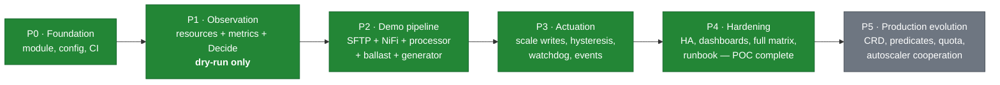
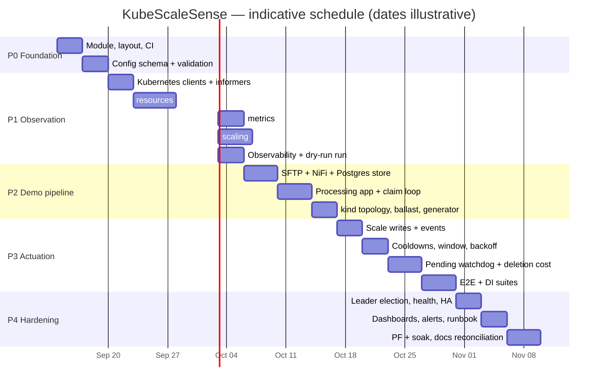

# KubeScaleSense — Implementation Plan

> Status: **Design (pre-implementation)** · Version: 0.1
> Canonical source for: phase definitions (`P0`–`P5`), exit criteria, risk register, deferred scope, and the
> definition of done for the POC.

Related documents: [requirements](requirements.md) · [architecture](architecture.md) ·
[scaling-algorithm](scaling-algorithm.md) · [resource-calculation](resource-calculation.md) ·
[failure-scenarios](failure-scenarios.md) · [test-plan](test-plan.md)

**Nothing in this plan has been implemented yet.** The repository currently contains this design set only.

**Post-review status.** The [design review](design-review.md) produced sixteen findings, all folded into the
design. Three change this plan rather than only the specification:

- **P1** gains the corrected feasibility/backoff ordering ([DR-01](design-review.md#dr-01-backoff-gate-makes-the-recovery-in-one-interval-claim-unreachable)) and integer arithmetic in the engine.
- **P2** gains a **blocking prerequisite**: the work store must be proven to support atomic, exclusive,
  cross-node item claiming before the pipeline is built on it ([DR-12](design-review.md#dr-12-the-poc-work-store-cannot-provide-the-claimed-semantics-on-the-proposed-environment)).
- **P3** gains three guards that are correctness requirements, not polish: the unhealthy-pod guard, external
  replica-change detection, and the rollout hold.

**Architecture closure (v0.1.2).** That P2 prerequisite is now **closed**, not merely scheduled: the work
store is a PostgreSQL work-item table with `FOR UPDATE SKIP LOCKED` claiming and transactional
acknowledgement, and the backlog signal moves from NiFi's REST API to the store's claimable count
([ADR-18](architecture.md#adr-18-what-is-the-durable-work-store-for-the-poc-pipeline)…[ADR-20](architecture.md#adr-20-how-is-in-flight-work-protected-without-a-shared-filesystem),
[architecture § 11](architecture.md#11-phase-1-architecture-baseline)). All seven open questions are resolved
or deferred with a stated default ([§8](#8-open-questions)); **no Phase 1 blockers remain**, and P1 becomes
slightly smaller because the NiFi REST client disappears.

---

## 1. Sequencing principle

The phase order follows one rule: **observe correctly before acting at all.**

The riskiest thing this controller does is write a replica count. The second riskiest is computing fit
capacity, because a wrong estimate is invisible until pods go Pending. So the plan front-loads the estimator
and runs it in permanent dry-run against a real cluster (P1), where its output can be checked by hand against
`kubectl describe node`, before any actuation code exists (P3). By the time the controller can write, its
inputs have already been validated against reality.

The corollary: a phase is only complete when its exit tests pass. "Written but unverified" carries no credit,
because for an autoscaler the interesting failures are precisely the ones that look fine in code review.

---

## 2. Phase overview

| Phase | Goal | Effort | Cumulative capability |
| --- | --- | --- | --- |
| **P0** | Foundation: module, layout, config, CI | ~1 week | Builds, validates config, refuses bad input |
| **P1** | Observation: fit capacity + demand + decisions, dry-run | ~2 weeks | Reports what it *would* do; estimator verified by hand |
| **P2** | Demonstration workload | ~1.5 weeks | Real pipeline processes files; backlog signal live; `itemsPerReplica` measured |
| **P3** | Actuation and stability | ~2 weeks | Actually scales, safely; the demo works end to end |
| **P4** | Hardening and operability | ~1.5 weeks | **POC complete**: HA, dashboards, full test matrix, runbook |
| P5 | Production evolution | open-ended | CRD, higher predicate fidelity, quota, multi-target |

Total to a demonstrable, tested POC: **~8 weeks** of one engineer's focused effort.

---

## 3. Phase details

### P0 — Foundation

**Goal.** A repository that builds, tests, and refuses to run with an unsafe configuration.

**Deliverables**

- Go module `github.com/jensilin/KubeScaleSense`, Go ≥ 1.24, layout per
  [architecture § 4](architecture.md#4-component-responsibilities).
- `internal/config`: schema, defaults, `KSS_*` env overrides, validation (CR-1…CR-5), plus
  `config/kubescalesense.yaml` matching [requirements § 8](requirements.md#8-configuration-requirements) exactly.
- `cmd/kubescalesense`: flag parsing, structured logger, signal handling, graceful shutdown. No cluster access yet.
- `Makefile` (`build`, `test`, `lint`, `demo-up`, `demo-down`), `Dockerfile` (distroless, non-root),
  `.golangci.yml`.
- CI skeleton per [test-plan § 10](test-plan.md#10-ci-pipeline), including the markdown link check over `docs/`.
- `deploy/` skeleton: ServiceAccount, Role/ClusterRole per
  [architecture § 7](architecture.md#7-kubernetes-permissions-and-rbac), ConfigMap, Deployment (not yet applied).

**Exit criteria**

- `make build test lint` green; `UT-21` passes (every invalid-config case yields a specific error).
- A deliberately broken config fails startup with a non-zero exit and an actionable message.
- Docs link check passes.

**Not in this phase.** Any Kubernetes API call.

**Prerequisite note.** The development machine currently has neither Go nor `kubectl`/`kind` installed;
installing the toolchain is the first P0 task.

---

### P1 — Observation (dry-run only)

**Goal.** Compute fit capacity, collect demand, and produce decisions that are *reported but never acted on*.
This is the phase where the project's central claim is validated.

**Deliverables**

- `internal/kubernetes`: clientset, informers for Node / Pod (cluster-scoped) / Deployment, pods indexed by
  `spec.nodeName`, cache-sync gating, event recorder (unused until P3).
- `internal/resources`: the full pipeline of
  [resource-calculation](resource-calculation.md) — candidate filtering with taints, `nodeSelector`, required
  node affinity; effective pod request with sidecars, init containers, and overhead; per-node free requestable
  resources; fit capacity with margin; blocking dimension.
- `internal/metrics`: `metrics.k8s.io` utilization (Ready **and warm** pods only,
  [FR-28](requirements.md#review-driven-requirements-v011)) and a backlog source behind an interface. P1 uses
  `workload.source: none|http` — a static or HTTP-provided backlog — so the engine can be exercised before the
  pipeline exists. The `workstore` source arrives in P2; no NiFi REST client is built at any point
  ([ADR-19](architecture.md#adr-19-where-does-the-backlog-signal-come-from)).
- `internal/scaling`: `Snapshot`, `Decision`, reason codes, and `Decide` implementing
  [scaling-algorithm §§ 3–6](scaling-algorithm.md#3-step-1--compute-desired-replicas). Cooldown/window/backoff
  fields exist in the snapshot and are honoured, but the controller does not yet maintain history across
  restarts of the loop. Feasibility is computed before the up-gates, and `BackoffState` carries
  `fitCapacityAtArm`, from the outset — retrofitting the ordering later is how
  [DR-01](design-review.md#dr-01-backoff-gate-makes-the-recovery-in-one-interval-claim-unreachable) happens.
  Utilization and smoothing arithmetic is integer from the start
  ([FR-35](requirements.md#review-driven-requirements-v011)).
- `internal/observability`: full metric set, `/healthz`, `/readyz`, the one-line-per-reconcile decision log.
- `controller.dryRun` **hard-defaulted to true** for this phase; the actuator is a no-op logger.

**Exit criteria**

- `UT-01`…`UT-22` pass with ≥ 90 % coverage in `internal/scaling` and `internal/resources`.
- `UT-19` reproduces the reference worked example (`F = 4`) from
  [resource-calculation § 7](resource-calculation.md#7-worked-example) exactly.
- `IT-01`, `IT-05`, `IT-12` pass.
- **Manual validation gate:** on a kind cluster with ballast pods, `kss_fit_capacity_pods` and per-node free
  resources are compared by hand against `kubectl describe node` output across at least five capacity states,
  including one where the control-plane taint must exclude a node and one fragmentation case. Any discrepancy
  blocks the phase.

**Why the manual gate exists.** A unit test proves the arithmetic matches its author's expectations; only a
comparison against a real cluster proves the *model* matches Kubernetes. This is the cheapest possible place to
discover a misunderstanding of `allocatable`, sidecar accounting, or taint semantics — before any code can
scale anything.

**Not in this phase.** Writes of any kind, cooldown state persistence, the watchdog, the demo pipeline.

---

### P2 — Demonstration workload

**Goal.** A real pipeline whose backlog is a genuine demand signal, and a cluster topology in which resource
exhaustion is reachable on purpose.

**Architecture is settled before this phase starts.** The work store is a PostgreSQL work-item table
([ADR-18](architecture.md#adr-18-what-is-the-durable-work-store-for-the-poc-pipeline)); the former blocking
prerequisite is closed ([§8.2](#82-formerly-blocking-items-now-closed)). **DI-08 and DI-09 gate the rest of
the phase**: until exclusive claiming and transactional acknowledgement are proven on a multi-node cluster,
no conservation assertion built on them means anything.

**Deliverables**

- `deploy/demo/`: `atmoz/sftp`; NiFi 2.6.7 StatefulSet with repositories on PVCs
  ([D-01](requirements.md#7-data-loss-protection-assumptions)); **PostgreSQL StatefulSet** with the schema
  from [ADR-18](architecture.md#adr-18-what-is-the-durable-work-store-for-the-poc-pipeline), two roles
  (read/write for the pipeline, **read-only** for the controller), and a single `ReadWriteOnce` PVC.
- NiFi flow `ListSFTP → FetchSFTP → ConvertRecord → PutDatabaseRecord`, plus an **init container supplying a
  pinned PostgreSQL JDBC driver** — the NiFi image does not bundle one, and this is the detail most likely to
  cost an unplanned afternoon.
- Processing application (small Go binary): claim loop (`FOR UPDATE SKIP LOCKED` + lease), per-item
  normalization with a configurable CPU cost, **output insert and acknowledgement in one transaction**,
  in-flight count endpoint for `pod-deletion-cost`, and a `preStop` drain
  ([WR-01](requirements.md#work-store-requirements-v012)…[WR-07](requirements.md#work-store-requirements-v012)).
- `work-store-cleanup` CronJob: prunes `done` rows, exports a stuck-item gauge. Explicitly **not** on the
  correctness path.
- `file-generator` Job producing controlled spikes (rate, count, size distribution).
- `ballast` Deployment for deterministic capacity shaping, plus the kind topology from
  [test-plan § 7](test-plan.md#7-local-demonstration-environment).
- `internal/metrics` work-store backlog source: read-only pool capped at 2, query timeout, staleness stamping,
  EWMA smoothing, and *unavailable*-on-error semantics
  ([FR-36](requirements.md#work-store-requirements-v012)…[FR-38](requirements.md#work-store-requirements-v012)).
- `PodDisruptionBudget`, memory limits, and `terminationGracePeriodSeconds` on the processor (D-07, A-07), with
  `leaseDuration` validated to exceed both the grace period and the maximum item time
  ([FS-29](failure-scenarios.md#fs-29-lease-expires-while-the-worker-is-still-alive)).

**Exit criteria**

- `DI-08` and `DI-09` pass on the 3-worker kind cluster **before** any other P2 exit criterion is assessed.
- Files flow SFTP → NiFi → work store → processor → output at a fixed replica count, with conservation
  verified (`DI-04`, `DI-05`, `DI-10`).
- The controller's backlog metric equals a direct `count(*)` of claimable rows within one sample interval, and
  `IT-16` confirms the read-only role and the unavailable-not-zero behaviour.
- **`itemsPerReplica` measured, not guessed:** at fixed replica counts, find the backlog level at which
  per-item latency reaches the SLO; record the measurement and its method in `docs/` alongside the resulting
  default.
- Ballast reliably drives `kss_fit_capacity_pods` to a chosen value, verified against the P1 manual gate method.

**Not in this phase.** Any scaling. The replica count is set by hand throughout P2 — which is exactly what
makes the `itemsPerReplica` measurement clean.

---

### P3 — Actuation and stability

**Goal.** The controller scales, safely, and the demo tells the story end to end.

**Deliverables**

- Actuator: `deployments/scale` update with `resourceVersion` precondition, `409` → re-read and re-decide,
  bounded jittered retry for transient errors, fatal handling of `403`/`404`
  ([ADR-14](architecture.md#adr-14-what-happens-if-kubernetes-api-calls-fail)).
- Controller state: `lastScaleUp`/`lastScaleDown`, `desiredHistory` ring buffer, `holdBackoff`,
  `lastGoodReplicas`.
- Hysteresis: deadband, asymmetric cooldowns, scale-down stabilization window, exponential hold backoff with
  level-triggered reset ([scaling-algorithm § 8](scaling-algorithm.md#8-hysteresis-and-oscillation-control),
  [§ 9](scaling-algorithm.md#9-insufficient-resource-behaviour-and-backoff)).
- Partial scale-up.
- Pending-pod watchdog with `revert` / `freeze` / `none`, including the quota signature (replicas not
  materialising into pods) ([FS-06](failure-scenarios.md#fs-06-newly-created-pod-stays-pending),
  [FS-10](failure-scenarios.md#fs-10-namespace-resourcequota-blocks-pod-creation)).
- **Review-driven guards** — correctness requirements, not polish: the unhealthy-pod guard
  ([FR-30](requirements.md#review-driven-requirements-v011)), external replica-change detection and adoption
  ([FR-31](requirements.md#review-driven-requirements-v011)), the rollout hold
  ([FR-32](requirements.md#review-driven-requirements-v011)), and the settled-replicas plus window-coverage
  preconditions on scale-down ([FR-29](requirements.md#review-driven-requirements-v011)).
- `pod-deletion-cost` refresh before scale-down.
- HPA conflict detection ([FS-16](failure-scenarios.md#fs-16-competing-controller-on-the-same-target)).
- Kubernetes events with rate limiting ([architecture § 8.2](architecture.md#82-kubernetes-events)).
- Scenario scripts `make demo-scenario-1..5` per [test-plan § 7.4](test-plan.md#74-demo-narrative).

**Exit criteria**

- `IT-02`, `IT-03`, `IT-04`, `IT-06`, `IT-07`, `IT-08`, `IT-11`, `IT-13`, `IT-14`, `IT-15` pass.
- `E2E-01`…`E2E-06`, `E2E-08`, `E2E-09`, `E2E-10` pass; `DI-01`, `DI-02`, `DI-03`, `DI-07` pass.
- `IT-15` specifically demonstrates that a broken image with a rising backlog produces **no** further
  scale-ups — the DR-06 loop is closed.
- **The headline assertion:** in `E2E-02` (demand for 8 replicas, room for 2) the controller performs a partial
  scale-up and then holds, and **no pod of the target is ever Pending for more than `pendingPodTimeout`**,
  while the replica deficit is visible in metrics and events throughout.
- The HPA side-by-side comparison from [test-plan § 7.4](test-plan.md#74-demo-narrative) is recorded: same
  cluster, same load, Pending pods with the HPA and none with KubeScaleSense.

---

### P4 — Hardening and operability (POC complete)

**Goal.** Something a second engineer can run, observe, and trust.

**Deliverables**

- Leader election via `Lease`; clean stop on lease loss ([FR-26](requirements.md#4-functional-requirements)).
- Metrics-source degradation paths finalized ([FS-15](failure-scenarios.md#fs-15-metrics-source-unavailable)).
- Grafana dashboard: desired vs. current replicas, fit capacity, blocking dimension, decision-reason
  distribution, backlog, node exclusions — laid out so the resource-awareness story is readable at a glance.
- Prometheus alert rules from
  [failure-scenarios § 6](failure-scenarios.md#6-alerting-recommendations), with the replica-deficit alert as
  the primary one.
- `docs/runbook.md`: what each reason code means and what to do about it.
- `PF-01`…`PF-03`, `SK-01`, `E2E-07`, `E2E-11`, `DI-06`.
- Portability check on minikube ([NFR-09](requirements.md#5-non-functional-requirements)).
- Documentation reconciliation: measured values folded back into the defaults; any design decision that
  changed during implementation updated in these documents (and its ADR amended rather than silently edited).

**Exit criteria**

- Full test matrix green; every reason code observed at least once in `SK-01`.
- `NFR-01`…`NFR-04` measured and met.
- A demo run by someone other than the author, from `make demo-up` to conclusions, with no undocumented steps.

**Definition of done for the POC:** see [§6](#6-definition-of-done-for-the-poc).

---

### P5 — Production evolution (not scheduled)

Direction only, per [architecture § 10](architecture.md#10-evolution-to-a-production-controller). Each item is
additive; none invalidates the P1–P4 algorithm.

| Item | Trigger to start |
| --- | --- |
| `ScalingPolicy` CRD + controller-runtime migration | A second target workload, or a need for status conditions/history |
| Topology spread and hostname anti-affinity modelling | First real Pending-pod remediation traced to [FS-05](failure-scenarios.md#fs-05-unmodelled-scheduling-predicate-causes-a-wrong-fit-estimate) |
| Proactive `ResourceQuota`/`LimitRange` modelling | Deployment into a quota-governed namespace |
| Queueing-theory demand model (arrival rate × service time) | `itemsPerReplica` proves unstable across file mixes |
| Cluster-autoscaler cooperation | Deployment onto an elastic node pool, where a HOLD is pessimistic |
| Scheduler-framework-based feasibility | Predicate fidelity becomes the dominant error source |
| Multi-target and fair-share arbitration | Two pipelines competing for one node pool |
| Node-usage guardrail (blend requests with measured usage) | Under-requesting neighbours cause measurable throughput loss ([resource-calculation § 4.1](resource-calculation.md#41-known-over-estimation-under-requesting-neighbours)) |

---

## 4. What is deliberately *not* built in the POC

Restated here so that the plan is honest about its boundaries — the full rationale for each is in
[requirements § 3](requirements.md#3-non-goals):

NiFi autoscaling · node provisioning · vertical scaling · scale-to-zero · multiple targets · full scheduler
simulation · topology spread and pod anti-affinity · priority/preemption · GPUs and extended resources ·
quota modelling · CRD API · active/active HA · HPA coexistence.

Two of these deserve a note because they are the ones most likely to be requested first:

- **NiFi autoscaling** ([NG-1](requirements.md#3-non-goals)) would change the project's shape, not just its
  scope: NiFi holds flow state, so scaling it means cluster-coordinator participation and flow rebalancing.
  Trigger for reconsideration: measurements showing NiFi ingestion, not processing, as the bottleneck.
- **Cluster autoscaler cooperation** ([NG-2](requirements.md#3-non-goals)) inverts the meaning of a HOLD: on an
  elastic cluster, "insufficient resources" is a temporary condition that the autoscaler will fix, so the right
  behaviour is to express demand and wait (`onPendingTimeout: none`) rather than revert.

---

## 5. Risk register

| # | Risk | Impact | Likelihood | Mitigation | Owning phase |
| --- | --- | --- | --- | --- | --- |
| R-1 | Fit-capacity model diverges from real scheduler behaviour | Pending pods; the core claim fails | Medium | P1 manual validation gate; `fitCapacityMarginPods`; Pending watchdog; predicate table as an explicit contract | P1, P3 |
| R-2 | `itemsPerReplica` unstable across file mixes | Under- or over-provisioning | High | Measure in P2; utilization signal as the safety net ([scaling-algorithm § 3.2](scaling-algorithm.md#32-utilization-derived-target)); queueing model in P5 | P2 |
| R-3 | ~~NiFi REST/auth surprises~~ → **NiFi→PostgreSQL integration** (JDBC driver provisioning, record-to-row conversion, `item_key` determinism) | Pipeline cannot land work | Medium | Driver pinned and vendored in `deploy/demo/`; `source: none\|http` fallback keeps P1 and the controller unblocked regardless. The controller no longer depends on NiFi at all, which removes the original form of this risk ([ADR-19](architecture.md#adr-19-where-does-the-backlog-signal-come-from)) | P2 |
| R-4 | kind cannot make resource exhaustion reproducible | Demo unconvincing | Low | Ballast pods as the primary mechanism (deterministic, and a better illustration than small nodes); kubelet reserved as a refinement | P2 |
| R-5 | Hysteresis parameters mis-tuned; sluggish or flappy | Poor demo, distrust | Medium | `E2E-06` bounds action counts; `SK-01` soak; tuning table in [scaling-algorithm § 12](scaling-algorithm.md#12-tuning-guidance) | P3, P4 |
| R-6 | Data-integrity assumptions violated by the workload implementation | S1 data loss in the demo | Medium | D-01…D-07 are explicit requirements with owning DI tests; [FS-4.3](failure-scenarios.md#43-what-would-invalidate-the-claim) lists invalidating changes as review items | P2, P3 |
| R-7 | Scope creep toward a production controller | POC never lands | High | Phase gates with test-based exit criteria; P5 exists to absorb good ideas without absorbing schedule | all |
| R-8 | Metrics cardinality (per-node series) on large clusters | Prometheus load | Low | Per-node metrics toggleable; bounded by cluster size ([resource-calculation § 9](resource-calculation.md#9-complexity-and-performance)) | P4 |
| R-9 | Docs drift from implementation | Design set becomes misleading | Medium | Link check in CI; P4 documentation reconciliation task; ADRs amended, not rewritten | P4 |
| R-10 | ~~Work store cannot provide atomic exclusive claiming~~ **Closed by design change** | Was S1 in the demo | — | Claiming is now database-enforced (`FOR UPDATE SKIP LOCKED`) and gated by DI-08/DI-09 ([ADR-18](architecture.md#adr-18-what-is-the-durable-work-store-for-the-poc-pipeline)) | Closed |
| R-13 | Work store becomes the bottleneck or a single point of failure | Backlog measures database contention, not demand; more replicas cannot help | Medium | Bounded worker pools; claim-latency and connection-saturation metrics beside the backlog on the dashboard; accepted POC trade recorded as [A-14](requirements.md#103-assumptions-that-must-hold-for-the-guarantees-to-be-meaningful)/[A-15](requirements.md#103-assumptions-that-must-hold-for-the-guarantees-to-be-meaningful) ([FS-28](failure-scenarios.md#fs-28-work-store-unavailable-or-saturated)) | P2, P4 |
| R-14 | `leaseDuration` mis-set below the maximum item time | Silent duplicate processing; wasted capacity that looks like insufficient capacity | Medium | Startup validation in the worker; reprocessing-rate metric; the constraint is stated in [requirements § 7](requirements.md#7-data-loss-protection-assumptions) rather than left in a manifest comment ([FS-29](failure-scenarios.md#fs-29-lease-expires-while-the-worker-is-still-alive)) | P2 |
| R-11 | A GitOps controller or operator also manages `replicas` | Unbounded oscillation with an external actor | Medium | Detect, adopt, and abstain ([FR-31](requirements.md#review-driven-requirements-v011)); deployment prerequisite to grant field ownership ([A-10](requirements.md#103-assumptions-that-must-hold-for-the-guarantees-to-be-meaningful)) | P3 |
| R-12 | Performance-motivated refactors reintroduce the DR-01 ordering bug | Backoff silently becomes timer-based; recovery latency grows to 15 min | Medium | UT-25 asserts reset-on-recomputed-capacity; [I-10](design-review.md#5-immutable-phase-1-decisions) marks the ordering immutable | P3, P4 |

R-1 and R-6 are the two that would invalidate the project's claims rather than merely delay it, which is why
both have a gate rather than only a mitigation: R-1 has the P1 manual validation gate, R-6 has the conservation
assertion in every DI test.

---

## 6. Definition of done for the POC

The POC is complete when all of the following are true:

1. **Resource-aware behaviour demonstrated.** `E2E-02` shows demand for 8 replicas, room for 2, a partial
   scale-up, a sustained HOLD, and **zero Pending pods** — with the deficit visible in metrics and events.
2. **The contrast is recorded.** The same scenario with a stock HPA produces Pending pods; both runs captured.
3. **Recovery is prompt.** `E2E-03` shows a scale-up within one interval of capacity appearing, mid-backoff.
4. **No oscillation.** `E2E-06` and `SK-01` show bounded action counts under sawtooth load.
5. **No data loss.** Every DI test's conservation assertion passes, including under crash, eviction, and
   scale-down.
6. **Failure behaviour is specified and verified.** Every `FS-xx` has a passing owning test
   ([test-plan § 11](test-plan.md#11-traceability-matrix)).
7. **Explainable.** Every decision is reconstructible from a single log line; every reason code is documented
   in the runbook.
8. **Reproducible by someone else.** `make demo-up` → five scenarios → `make demo-down` on a clean machine.
9. **Docs consistent with code.** Measured defaults folded back in; changed decisions reflected in their ADRs.
10. **Review findings closed.** Every `DR-xx` fix has a passing owning test, and the guarantee/non-guarantee
    statement in [requirements § 10](requirements.md#10-design-limitations-and-assumptions) matches observed
    behaviour — in particular that the POC claims "never *knowingly* infeasible", not "never Pending".

Deliberately **not** part of done: a CRD, multi-target support, production HA guarantees, or scheduler-grade
predicate fidelity.

The [immutable Phase 1 decisions](design-review.md#5-immutable-phase-1-decisions) (`I-1`…`I-16`) are the
constraints all of the above is built on. Changing one during implementation — for convenience, performance, or
expedience — invalidates parts of this plan and its tests, so it requires an amended ADR first.

---

## 7. Deferred scope and when to pick it up

| Deferred item | Non-goal | Deferred because | Pick it up when |
| --- | --- | --- | --- |
| Topology spread / pod anti-affinity modelling | [NG-7](requirements.md#3-non-goals) | Requires simulating placement; a naive approximation is worse than none ([ADR-08](architecture.md#adr-08-how-do-node-affinity-rules-affect-the-calculation)) | A target workload actually uses them, or `kss_pending_pod_remediations_total` climbs |
| `ResourceQuota` / `LimitRange` awareness | [NG-10](requirements.md#3-non-goals) | Reactive detection is cheap and sufficient for the POC | Deploying into a quota-governed namespace |
| Extended resources (GPU, hugepages, ephemeral storage) | [NG-9](requirements.md#3-non-goals) | Not present in the workload; the model generalises without redesign | The processing pods need a device plugin resource |
| Priority classes and preemption | [NG-8](requirements.md#3-non-goals) | Turns an autoscaler into a cluster arbiter | The workload is genuinely higher-priority than its neighbours |
| Cluster autoscaler cooperation | [NG-2](requirements.md#3-non-goals) | Changes the meaning of a HOLD entirely | Running on an elastic node pool |
| Vertical scaling / request right-sizing | [NG-3](requirements.md#3-non-goals) | Interacts with the fit model in ways that need their own design | Requests prove chronically wrong ([resource-calculation § 4.1](resource-calculation.md#41-known-over-estimation-under-requesting-neighbours)) |
| Scale-to-zero | [NG-4](requirements.md#3-non-goals) | Needs a wake-up path that does not exist | Idle periods are long and costly |
| Multi-target / CRD | [NG-5](requirements.md#3-non-goals), [NG-11](requirements.md#3-non-goals) | Config-shaped change, not an algorithm change | A second workload needs scaling |
| Node-usage guardrail | — | Introduces a second, softer notion of "full" needing its own tuning | Measured throughput loss from under-requesting neighbours |
| Predictive / queueing-theory scaling | — | Needs a measured service-time distribution, which P2 only begins to collect | `itemsPerReplica` proves unstable (R-2) |
| Hot config reload | CR-3 | Restart is acceptable for a single-instance POC | Operators tune parameters frequently in production |

---

## 8. Open questions

**All questions are now closed for Phase 1.** Five are resolved by decision, two are deferred with a stated
default that implementation will follow unless data contradicts it. **No Phase 1 blockers remain.**

| # | Question | Status | Resolution and why |
| --- | --- | --- | --- |
| Q-1 | Backlog signal: NiFi queued FlowFiles, work-store count, or both? | **Resolved** | The **work store's claimable count**. Not a preference: once NiFi lands records on arrival, its queue drains to near zero and no longer represents outstanding work, so reading it would mean scaling on a structurally-zero number. Summing both is meaningless — they count different things at different stages. This also deletes the NiFi REST client, its credentials, and its TLS configuration from the controller ([ADR-19](architecture.md#adr-19-where-does-the-backlog-signal-come-from)) |
| Q-2 | Work store: RWX PVC or MinIO/S3? | **Resolved — neither** | **PostgreSQL work-item table** with `FOR UPDATE SKIP LOCKED`. Both original options required building a claim protocol on a primitive the environment does not reliably provide; the database enforces exclusion and idempotency directly, and transactional ack removes the dual-write problem entirely ([ADR-18](architecture.md#adr-18-what-is-the-durable-work-store-for-the-poc-pipeline)). Verified by DI-08 and DI-09 |
| Q-3 | Reaper as a sidecar or a CronJob? | **Dissolved** | **Neither — there is no reaper.** Lease expiry is handled inside the claim query itself, so crash recovery has no separate component and no interval to tune. A CronJob remains only for pruning `done` rows, which is off the correctness path ([ADR-20](architecture.md#adr-20-how-is-in-flight-work-protected-without-a-shared-filesystem)) |
| Q-4 | Does the utilization signal earn its keep? | **Deferred to P4, default: keep** | Genuinely needs data — the question is empirical, not architectural. P3 records how often utilization was the binding signal; removing it early would forfeit the only safety net against a wrong `itemsPerReplica` ([R-2](#6-risk-register)). Deferring costs nothing because the signal is already designed and tested |
| Q-5 | Should `HoldPendingPods` block revert-driven scale-downs? | **Resolved** | No. Remediation writes bypass the scale-down gates, including the settled-replicas gate — otherwise remediation would be impossible ([DR-03](design-review.md#dr-03-demand-driven-scale-down-can-fire-while-replicas-are-still-starting)) |
| Q-6 | Is `fitCapacityMarginPods: 1` right for all cluster sizes? | **Deferred to P4, default: 1** | Also empirical: the right margin follows from the observed estimate-versus-reality error rate, which only exists after P3. A constant is correct for the 3-node POC cluster; scaling it with cluster size is a Phase 5 concern that no Phase 1 code decision forecloses |
| Q-7 | Which environment runs E2E in CI? | **Resolved** | **kind on GitHub-hosted runners**, with the ballast sized to fit a 7 GB runner, and E2E/DI label-gated so they do not run on every push. Chosen because a self-hosted cluster adds infrastructure ownership to a POC; if the runner proves too small, the fallback is to shrink node count rather than to acquire hardware ([§4](#p4--poc-completion-and-hardening)) |

### 8.1 Prerequisites for starting Phase 1 implementation

Every item is satisfied or explicitly scheduled; none is outstanding.

| # | Prerequisite | Status |
| --- | --- | --- |
| 1 | Architecture baseline agreed and written down | **Done** — [architecture § 11](architecture.md#11-phase-1-architecture-baseline) |
| 2 | Durable work-store mechanism chosen, with claim/ack/recovery semantics specified as executable SQL | **Done** — [ADR-18](architecture.md#adr-18-what-is-the-durable-work-store-for-the-poc-pipeline) |
| 3 | Demand-signal source decided and its dependency surface fixed | **Done** — [ADR-19](architecture.md#adr-19-where-does-the-backlog-signal-come-from); read-only role, one indexed query |
| 4 | All open questions resolved or deferred with a default | **Done** — [§8](#8-open-questions); Q-4 and Q-6 deferred to P4 with defaults `keep` and `1` |
| 5 | Design-review findings folded in, each with an owning test | **Done** — `DR-01`…`DR-16`, [test-plan § 11](test-plan.md#11-traceability-matrix) |
| 6 | Immutable decisions recorded, so implementation cannot drift silently | **Done** — [`I-1`…`I-16`](design-review.md#5-immutable-phase-1-decisions) |
| 7 | Config schema frozen for P0 (keys, defaults, validation rules) | **Done** — [requirements § 8](requirements.md#8-configuration-requirements), now including `workload.workStore.*` |
| 8 | Toolchain: Go ≥ 1.24, kind ≥ 0.23, kubectl ≥ 1.29, Docker, `make`; PostgreSQL 16 image; pinned PostgreSQL JDBC driver for NiFi | **Environment task in P0/P2** — [test-plan § 7.3](test-plan.md#73-prerequisites) |
| 9 | RBAC set final, including the `replicasets` read added by review | **Done** — [architecture § 7](architecture.md#7-kubernetes-permissions-and-rbac) |
| 10 | CI shape decided (kind on hosted runners, E2E label-gated) | **Done** — Q-7 |

**Not prerequisites, deliberately.** `itemsPerReplica` (measured in P2, not guessed beforehand), the
utilization signal's long-term value (Q-4), and the fit-capacity margin policy (Q-6). Each is an empirical
question that P0/P1 code does not foreclose, and blocking on data that does not exist yet would be false rigour.

### 8.2 Formerly-blocking items, now closed

| Item | Was | Now |
| --- | --- | --- |
| [DR-12](design-review.md#dr-12-the-poc-work-store-cannot-provide-the-claimed-semantics-on-the-proposed-environment) / Q-2 | **Blocking prerequisite for P2** — the work store's claim semantics were unimplementable on kind | Closed by [ADR-18](architecture.md#adr-18-what-is-the-durable-work-store-for-the-poc-pipeline). The primitive is database-enforced and gated by DI-08/DI-09 |
| Q-1 | Open fork, to be measured in P2 | Closed by the same change — the signal source follows from where work is durably held |
| Q-3 | Open fork, to be decided in P2 | Dissolved; the component no longer exists |
