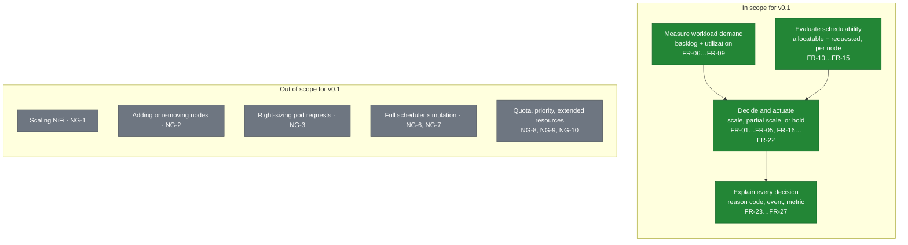

# KubeScaleSense — Requirements

> Status: **Design (pre-implementation)** · Version: 0.2 · Owner: Lead Architect
> This document is the canonical source for requirement IDs (`FR-xx`, `NFR-xx`), assumptions (`A-xx`),
> and the configuration reference. Other documents link here instead of restating them.

Related documents: [architecture](architecture.md) · [scaling-algorithm](scaling-algorithm.md) ·
[resource-calculation](resource-calculation.md) · [failure-scenarios](failure-scenarios.md) ·
[test-plan](test-plan.md) · [implementation-plan](implementation-plan.md)

---

## 1. Problem statement

A data pipeline ingests files over SFTP, routes them through Apache NiFi 2.6.7, and normalizes them in a
pool of Kubernetes **Normalizer** pods reached through a `normalizer-service`. The incoming file rate is
bursty: a quiet period of a few files per minute can be followed by a spike of thousands of files.

With a fixed replica count the pipeline has two failure modes:

- **Under-provisioned.** The backlog grows faster than it drains, latency climbs, and downstream SLAs are missed.
- **Naively over-provisioned.** Scaling up "because CPU is high" ignores whether the cluster can actually
  *schedule* the new pods. In a resource-constrained cluster the result is Pending pods, node resource
  pressure, evictions of already-running workers, interrupted processing, and — if the pipeline is not
  durable — lost files.

The standard Kubernetes Horizontal Pod Autoscaler computes a desired replica count from *observed
utilization* and writes it to the target's `scale` subresource. It has no notion of whether the delta it just
requested is schedulable; it delegates that to the scheduler and, if the scheduler fails, the pods simply sit
in `Pending`. In a cluster that cannot grow on demand (no cluster autoscaler, fixed node pool, or a hard
namespace quota) this converts a *capacity* problem into a *reliability* problem.

**KubeScaleSense is a resource-aware autoscaling controller that decides scaling actions from both
workload demand and Kubernetes resource availability, and refuses to issue a scale-up it believes the
cluster cannot schedule.**

The distinction that drives the whole design:

| Question | Answered by | Sufficient for a safe scale-up decision? |
| --- | --- | --- |
| "Is the workload busy?" | Utilization metrics: CPU, memory, backlog | No — it only establishes *demand* |
| "Can the cluster place N more pods of this shape?" | Node allocatable minus already-requested resources, filtered by schedulability | Yes — this establishes *feasibility* |

Demand without feasibility produces Pending pods. Feasibility without demand produces waste.
KubeScaleSense requires both.

---

## 2. Goals

| ID | Goal |
| --- | --- |
| G-1 | Scale a single target processing workload (a Kubernetes `Deployment`) in response to measured workload demand |
| G-2 | Evaluate real cluster schedulability *before* increasing replicas, using allocatable and requested resources rather than utilization alone |
| G-3 | Never knowingly issue a scale-up that leaves pods Pending; prefer a smaller, schedulable scale-up or an explicit HOLD |
| G-4 | Make every decision explainable: a machine-readable reason code, a human-readable log line, and a Kubernetes Event |
| G-5 | Be stable: no replica oscillation, no retry storms against an impossible scale target |
| G-6 | Avoid disrupting in-flight work during scale-down and pod termination, within the responsibility boundary in [§7](#7-durability-boundary-and-workload-responsibilities) |
| G-7 | Be demonstrable end-to-end on a laptop-scale local Kubernetes cluster (kind), including the insufficient-resource case |
| G-8 | Keep the POC minimal and single-binary, with a documented evolution path to a production controller |

### Scope boundary



Demand and schedulability are deliberately separate inputs to one decision: neither alone may authorize a
scale-up.

---

## 3. Non-goals

Explicitly out of scope for v0.1 (the POC). Each is revisited in
[implementation-plan § Deferred scope](implementation-plan.md#7-deferred-scope-and-when-to-pick-it-up).

| ID | Non-goal | Rationale |
| --- | --- | --- |
| NG-1 | Autoscaling NiFi itself | NiFi 2.6.7 is the ingestion/buffer component and is treated as a fixed-size durable buffer. Scaling a NiFi cluster involves flow-state rebalancing and cluster coordinator concerns that are a separate project. See [ADR-01](architecture.md#adr-01-what-exactly-is-being-scaled) |
| NG-2 | Adding or removing **nodes** (cluster autoscaling) | KubeScaleSense scales pods within a fixed node pool. Cooperation with a cluster autoscaler is a Phase 5 topic |
| NG-3 | Vertical scaling / right-sizing pod requests | Requests are an input to the decision, not an output. No VPA interaction |
| NG-4 | Scale-to-zero | The POC keeps `minReplicas >= 1`; a zero-replica state needs a wake-up path that does not exist yet |
| NG-5 | Multiple target workloads per controller instance | One controller, one target. Multi-target is a config/CRD change, not an algorithm change |
| NG-6 | A full scheduler simulation | KubeScaleSense implements a deliberately conservative subset of scheduler predicates ([resource-calculation § 6](resource-calculation.md#6-predicates-modelled-and-predicates-ignored)). It is an *estimator*, not a scheduler |
| NG-7 | Pod topology spread constraints, inter-pod affinity/anti-affinity | Modelling these correctly requires simulating placement, not just counting capacity. Documented as a known source of over-estimation |
| NG-8 | Priority classes and preemption | The POC assumes the target workload does not preempt other pods |
| NG-9 | Extended/custom resources such as GPUs, hugepages | v0.1 models CPU, memory, and pod-count only |
| NG-10 | `ResourceQuota` / `LimitRange` awareness | A namespace quota can block a scale-up that node capacity permits. Detected reactively via the Pending-pod watchdog in v0.1, modelled proactively in Phase 3 |
| NG-11 | Custom Resource Definition (CRD) API | v0.1 is configured by a ConfigMap-mounted YAML file. A `ScalingPolicy` CRD is Phase 4 |
| NG-12 | High-availability active/active controller | Leader election gives active/passive; concurrent decision-making is not needed |
| NG-13 | Replacing or coexisting with an HPA on the same target | Two controllers writing the same `scale` subresource will fight. Enforced by [FR-19](#4-functional-requirements) |

---

## 4. Functional requirements

### Target and scaling actions

| ID | Requirement | Priority |
| --- | --- | --- |
| FR-01 | The controller SHALL scale exactly one target workload, identified by namespace + `Deployment` name, via the `scale` subresource | Must |
| FR-02 | The controller SHALL clamp all decisions to `[minReplicas, maxReplicas]` | Must |
| FR-03 | The controller SHALL limit a single scale-up to `maxScaleUpStep` replicas and a single scale-down to `maxScaleDownStep` replicas | Must |
| FR-04 | The controller SHALL support a `dryRun` mode that computes and reports decisions without mutating cluster state | Must |
| FR-05 | The controller SHALL use optimistic concurrency (`resourceVersion`) when updating the target and SHALL re-read and re-decide on conflict rather than retrying a stale value | Must |

### Workload demand

| ID | Requirement | Priority |
| --- | --- | --- |
| FR-06 | The controller SHALL collect a workload-pressure signal (count of outstanding work items) from the configured workload-signal source, per [FR-36](#workload-signal-requirements-v02) | Must |
| FR-07 | The controller SHALL collect per-pod CPU and memory usage for the target workload from `metrics.k8s.io` | Must |
| FR-08 | The controller SHALL compute desired replicas as the maximum of a backlog-derived target and a utilization-derived target, per [scaling-algorithm § 3](scaling-algorithm.md#3-step-1--compute-desired-replicas) | Must |
| FR-09 | The controller SHALL treat metrics older than `metricsStaleAfter` as unusable, and SHALL NOT scale in either direction on stale data | Must |

### Resource awareness

| ID | Requirement | Priority |
| --- | --- | --- |
| FR-10 | The controller SHALL derive the target pod's effective resource requests from the live `Deployment` pod template, including init/sidecar containers and pod overhead, per [resource-calculation § 3](resource-calculation.md#3-step-2--effective-pod-request-of-the-target-workload) | Must |
| FR-11 | The controller SHALL compute per-node free requestable CPU and memory as `allocatable − sum(requests of non-terminal pods) − perNodeReserve` | Must |
| FR-12 | The controller SHALL exclude nodes that are not `Ready`, are `unschedulable`/cordoned, carry an untolerated `NoSchedule`/`NoExecute` taint, or fail the target's `nodeSelector` / required node affinity | Must |
| FR-13 | The controller SHALL compute fit capacity as the sum over candidate nodes of how many whole target pods fit on each node, bounded by remaining pod slots, minus `fitCapacityMarginPods` | Must |
| FR-14 | The controller SHALL scale up only if `fitCapacity >= requestedDelta`, or — when `allowPartialScaleUp` is true — by `min(requestedDelta, fitCapacity)` | Must |
| FR-15 | When demand requires more replicas than fit capacity allows, the controller SHALL emit a `HoldInsufficientResources` decision recording desired, feasible, and blocking dimension (CPU / memory / pod slots) | Must |

### Stability

| ID | Requirement | Priority |
| --- | --- | --- |
| FR-16 | The controller SHALL enforce asymmetric cooldowns (`scaleUpCooldown`, `scaleDownCooldown`) and a scale-down stabilization window | Must |
| FR-17 | The controller SHALL apply a `tolerancePercent` deadband so that small demand fluctuations produce no action | Must |
| FR-18 | The controller SHALL apply exponential backoff to repeated infeasible scale-up attempts, resetting when fit capacity increases or a scale action succeeds | Must |
| FR-19 | The controller SHALL detect an HPA targeting the same workload and SHALL refuse to act (fatal config error) while one exists | Must |
| FR-20 | The controller SHALL detect pods of the target that remain unschedulable for longer than `pendingPodTimeout` and apply the configured `onPendingTimeout` remediation | Must |

### Safety of in-flight work

| ID | Requirement | Priority |
| --- | --- | --- |
| FR-21 | The controller SHALL set `controller.kubernetes.io/pod-deletion-cost` so scale-down removes the least-busy pods first | Should |
| FR-22 | The controller SHALL NOT scale down while the backlog implies the remaining replicas would be immediately insufficient (guaranteed by the `max()` in FR-08) | Must |

### Operability

| ID | Requirement | Priority |
| --- | --- | --- |
| FR-23 | The controller SHALL expose Prometheus metrics, `/healthz`, and `/readyz` per [architecture § 8](architecture.md#8-observability-requirements) | Must |
| FR-24 | The controller SHALL emit a Kubernetes Event for every state-changing decision and for the first occurrence of each HOLD reason (rate-limited thereafter) | Must |
| FR-25 | The controller SHALL run with a least-privilege RBAC role per [architecture § 7](architecture.md#7-kubernetes-permissions-and-rbac) | Must |
| FR-26 | The controller SHALL support leader election so that only one replica makes decisions | Should |
| FR-27 | On unrecoverable API failure the controller SHALL take no scaling action and SHALL surface the failure via metrics, logs, and readiness | Must |

### Review-driven requirements (v0.1.1)

Added by the [design review](design-review.md); each closes a specific correctness gap found in the v0.1
design rather than adding new capability.

| ID | Requirement | Priority | Finding |
| --- | --- | --- | --- |
| FR-28 | The controller SHALL exclude pods that have been `Ready` for less than `workload.podWarmupPeriod` from the utilization average, and SHALL report the signal unavailable if no warm Ready pod exists | Must | [DR-05](design-review.md#dr-05-new-pod-warmup-dilutes-the-utilization-average) |
| FR-29 | The controller SHALL NOT perform a demand-driven scale-down unless all replicas are `Ready` **and** the stabilization window is covered by at least `scaling.scaleDownWindowCoverage` of its expected samples | Must | [DR-03](design-review.md#dr-03-demand-driven-scale-down-can-fire-while-replicas-are-still-starting), [DR-04](design-review.md#dr-04-stabilization-window-gaps-permit-a-blind-scale-down) |
| FR-30 | The controller SHALL block scale-ups while any pod of the target's current ReplicaSet has been scheduled but not `Ready` for longer than `pending.podStartupTimeout`, and SHALL NOT auto-remediate that state | Must | [DR-06](design-review.md#dr-06-scheduled-but-unhealthy-pods-cause-unbounded-scale-up) |
| FR-31 | The controller SHALL detect replica changes it did not write, adopt them as the new baseline, reset cooldown and history state, and refuse to act after `scaling.externalChangeTolerance` recurrences | Must | [DR-07](design-review.md#dr-07-external-writers-of-specreplicas-are-undetected) |
| FR-32 | The controller SHALL take no scaling action while a rollout of the target is in progress | Must | [DR-08](design-review.md#dr-08-rollouts-and-maxsurge-are-unaccounted-for) |
| FR-33 | The controller SHALL compute fit capacity on every reconcile whose direction is up, **including while hold backoff is armed**, and SHALL reset backoff when fit capacity exceeds the level recorded when it was armed | Must | [DR-01](design-review.md#dr-01-backoff-gate-makes-the-recovery-in-one-interval-claim-unreachable) |
| FR-34 | The controller SHALL treat a signal as stale if **either** its local receive age **or** its source-reported sample age exceeds `metricsStaleAfter` | Must | [DR-14](design-review.md#dr-14-staleness-measured-only-from-local-receive-time-misses-a-frozen-source) |
| FR-35 | The controller SHALL compute the utilization ratio and smoothing state in integer units so that decisions are exactly reproducible | Should | [DR-15](design-review.md#dr-15-floating-point-arithmetic-weakens-the-determinism-claim) |

### Workload-signal requirements (v0.2)

Added by the [architecture simplification](architecture.md#11-phase-1-architecture-baseline). FR-06 is
amended: the pressure signal comes from a **pluggable workload-signal source**, and the controller depends on
no particular storage or messaging technology to obtain it
([ADR-22](architecture.md#adr-22-where-does-the-workload-pressure-signal-come-from)).

| ID | Requirement | Priority |
| --- | --- | --- |
| FR-36 | The controller SHALL obtain the workload-pressure signal through a **replaceable source interface**, and SHALL support at minimum a `synthetic` source (for the first implementation and for tests) and an `http` source (scraped from the Normalizer's own metrics) | Must |
| FR-37 | The controller SHALL treat the pressure signal as **read-only telemetry**: it SHALL never write to, acknowledge, or otherwise mutate the workload's data path | Must |
| FR-38 | A signal-source failure or timeout SHALL be recorded as an **unavailable** signal (producing `HoldStaleMetrics`) and SHALL NOT abort the reconcile or cause a scale-down. Unavailable SHALL NEVER be read as zero | Must |
| FR-39 | The controller SHALL collect and export request rate, processing rate, and processing latency as **observability-only** signals that are not inputs to the v0.2 decision, so that a future demand model can be derived from recorded data | Should |

**Requirements on the workload** (the Normalizer application, not the controller — verified by
[test-plan § 6](test-plan.md#6-data-integrity-scenarios)):

| ID | Requirement | Priority |
| --- | --- | --- |
| WR-01 | The Normalizer SHALL be **stateless per request**: any replica can serve any request, with no affinity, ordering, or per-pod identity | Must |
| WR-02 | The Normalizer SHALL expose an HTTP endpoint that accepts raw data and returns or writes the normalized result, plus `/healthz` and `/readyz` | Must |
| WR-03 | Normalization SHALL be a **pure function of its input**, so that a retried request produces an identical result and at-least-once delivery is harmless | Must |
| WR-04 | The Normalizer SHALL declare explicit CPU and memory requests, identical across all replicas | Must |
| WR-05 | The Normalizer SHALL scale **horizontally**: throughput increases with replica count, provided the client's concurrency exceeds the replica count ([A-13](#103-assumptions-that-must-hold-for-the-guarantees-to-be-meaningful)) | Must |
| WR-06 | On `SIGTERM` the Normalizer SHALL stop accepting new requests, finish in-flight requests within `terminationGracePeriodSeconds`, and fail readiness so the Service removes it from rotation | Must |
| WR-07 | Each Normalizer pod SHALL publish its in-flight request count, for the pressure signal and for `pod-deletion-cost` input | Should |

---

## 5. Non-functional requirements

| ID | Requirement | Target |
| --- | --- | --- |
| NFR-01 | Decision latency: time from backlog crossing a threshold to a `scale` write | ≤ 2 × `interval` (≤ 30 s at defaults) |
| NFR-02 | Reconcile loop duration (p95) | ≤ 500 ms for a 50-node / 1000-pod cluster |
| NFR-03 | Controller resource footprint | ≤ 100 m CPU, ≤ 128 MiB memory steady state |
| NFR-04 | API server load | Read path served from informer caches; no `LIST` per reconcile; writes only on state change |
| NFR-05 | Correctness bias | Decisions must be conservative: prefer HOLD over an unschedulable scale-up. False HOLDs are acceptable; Pending pods are not |
| NFR-06 | Decision engine testability | Core algorithm is a pure function of a snapshot struct → decision struct, with no I/O, ≥ 90 % unit coverage |
| NFR-07 | Determinism | Identical input snapshot ⇒ identical decision (clock and randomness injected) |
| NFR-08 | Startup safety | No scaling action until all informer caches have synced and one full metrics sample exists |
| NFR-09 | Portability | Runs on kind, minikube, and managed Kubernetes 1.29+ with no code change |
| NFR-10 | Auditability | Every decision reconstructible from logs alone: inputs, intermediate values, reason code |

---

## 6. Workload and environment assumptions

| ID | Assumption | Consequence if violated |
| --- | --- | --- |
| A-01 | The Normalizer is **horizontally scalable and stateless per request**: any replica can serve any request | Scaling changes throughput non-linearly; the pressure model breaks down |
| A-02 | All replicas of the target have **identical resource requests** (single pod template, no in-place resize) | Fit capacity math must become per-pod-shape |
| A-03 | The target pod template **sets CPU and memory requests explicitly** | Fit capacity is unbounded/undefined for zero-request pods; startup validation rejects this ([FR-10](#4-functional-requirements)) |
| A-04 | `metrics-server` (or another `metrics.k8s.io` provider) is installed | Utilization-derived desired replicas unavailable; controller degrades to backlog-only and reports it |
| A-05 | The cluster has a **fixed node pool** during the POC | With a cluster autoscaler present, a HOLD may be pessimistic; see [NG-2](#3-non-goals) |
| A-06 | KubeScaleSense is the **only** writer of the target's replica count | Fighting controllers, oscillation ([FR-19](#4-functional-requirements)) |
| A-07 | Request processing time is bounded and shorter than `terminationGracePeriodSeconds` | Graceful shutdown is truncated: in-flight requests fail and depend entirely on NiFi's retry ([§7](#7-durability-boundary-and-workload-responsibilities), [FS-14](failure-scenarios.md#fs-14-scale-down-terminates-a-busy-pod)) |

---

## 7. Durability boundary and workload responsibilities

**KubeScaleSense does not provide data durability, and this design does not claim that it does.** It makes
scaling decisions. Stated as a boundary:

| Responsibility | Owner |
| --- | --- |
| Durability of ingested data; retry, back-pressure, and error handling for failed normalization requests | **NiFi and the workload design** |
| Deciding *whether and when* to change the Normalizer replica count, safely | **KubeScaleSense** |

This split is deliberate and is the single most important framing in the project. An autoscaler cannot make a
lossy pipeline safe; it can only avoid making a safe pipeline unsafe. Every durability property below is a
property **of the workload**, not a feature of the controller. They are recorded here because the controller's
safety argument depends on them being true — not because the controller implements them.

| ID | Property | Mechanism in the POC pipeline | Owner |
| --- | --- | --- | --- |
| D-01 | **Durable ingestion buffer.** A file accepted from SFTP survives Normalizer pod loss | NiFi FlowFile/content repositories on a PersistentVolume; NiFi deletes the remote file only after the flow commits | Workload |
| D-02 | **Retry on failure.** A normalization request that fails, times out, or is refused is re-sent | NiFi's `InvokeHTTP` retry relationship with back-off and a retry limit; a failed request stays a FlowFile in NiFi's queue rather than disappearing | Workload |
| D-03 | **At-least-once with idempotent normalization.** A re-sent request produces an identical result | Normalization is a **pure function of its input** ([WR-03](#workload-signal-requirements-v02)), so reprocessing is harmless by construction. This is what makes retry — and therefore the whole design — safe |
| D-04 | **Crash recovery.** Work in flight on a pod that dies is not lost | The request fails, so NiFi retries it against another pod (D-02). Nothing durable lives inside the Normalizer, which is why pod loss costs a request, never data | Workload |
| D-05 | **Graceful shutdown on scale-down.** A terminating pod finishes its in-flight requests | `SIGTERM` → fail readiness so the Service stops sending traffic → drain in-flight requests inside `terminationGracePeriodSeconds` ([WR-06](#workload-signal-requirements-v02), [A-07](#6-workload-and-environment-assumptions)) | Workload |
| D-06 | **Least-busy-first eviction.** Scale-down prefers idle pods | Pods publish their in-flight request count; the controller writes `pod-deletion-cost` ([FR-21](#4-functional-requirements)). **Preference, not a guarantee** — the ReplicaSet controller removes any not-Ready pod before considering cost ([DR-11](design-review.md#dr-11-pod-deletion-cost-ordering-was-described-too-loosely)) | Controller (hint) |
| D-07 | **Resistance to node-level disruption** | `PodDisruptionBudget` with `minAvailable: 1` — note this constrains the **Eviction API only** (node drain, descheduler, autoscaler consolidation) and has **no effect on scale-down**, which deletes pods directly ([DR-10](design-review.md#dr-10-poddisruptionbudget-does-not-protect-against-scale-down)). Per-pod memory *limits* keep one busy pod from pressuring a node and evicting its peers | Workload |

> **The load-bearing pair is D-02 + D-03**: because NiFi retries and normalization is idempotent, an
> over-aggressive or wrong scaling decision costs *throughput and some retried requests* — never durability.
> The worst outcome of a scaling mistake is that a request is served twice or served late.

What this design deliberately no longer does: it does not place a durable queue, database, broker, or shared
filesystem between NiFi and the Normalizer. The previous version of this design did, and the durability
argument it bought was **not needed for the project's actual subject**, which is resource-aware scaling
([ADR-21](architecture.md#adr-21-how-does-work-reach-the-normalizer-pods)). Durability is delegated to the
component that already implements it well.

The parameters governing these properties — `terminationGracePeriodSeconds`, the readiness-probe timing, and
NiFi's retry count and back-off — belong to the **workload's** manifests, not to the controller configuration
in [§8](#8-configuration-requirements). The controller neither reads nor validates them; it only assumes they
are set consistently with [A-07](#6-workload-and-environment-assumptions).

---

## 8. Configuration requirements

Configuration is a YAML file mounted from a ConfigMap and parsed at startup, with per-key environment
variable overrides (`KSS_` + upper-snake path, e.g. `KSS_SCALING_SCALEUPCOOLDOWN`). This is the canonical
parameter list; other documents reference these names verbatim.

**Requirements on configuration handling:**

- **CR-1** Every parameter has a documented default; a minimal config specifies only `target`.
- **CR-2** Config is validated at startup and the controller **fails fast with a non-zero exit** on invalid
  input (e.g. `minReplicas > maxReplicas`, target pod template without resource requests, `interval` < 5 s).
- **CR-3** Config is **immutable at runtime** in v0.1: a ConfigMap change requires a pod restart. Hot reload is Phase 4.
- **CR-4** Defaults must be safe for a small cluster: conservative headroom, partial scale-up enabled,
  scale-down slower than scale-up.
- **CR-5** No secrets in the config file. The v0.2 design needs **no workload credentials at all**: the
  pressure signal is either generated synthetically or scraped from the Normalizer's own metrics endpoint over
  in-cluster HTTP, so there is no database role, broker user, or API token to hold
  ([FR-37](#workload-signal-requirements-v02)).

```yaml
# config/kubescalesense.yaml — all values shown are the defaults
controller:
  interval: 15s                 # reconcile period
  leaderElection: true
  dryRun: false
  metricsAddr: ":8080"
  healthAddr: ":8081"
  logLevel: info                # debug|info|warn|error
  logFormat: json

target:
  namespace: data-pipeline
  deployment: normalizer        # the Normalizer Deployment behind normalizer-service
  minReplicas: 1
  maxReplicas: 12

workload:
  itemsPerReplica: 50           # outstanding work items one replica is expected to hold
  targetCPUUtilizationPercent: 70   # of the pod's CPU *request*
  metricsStaleAfter: 60s
  podWarmupPeriod: 60s          # pods Ready for less than this are excluded from the utilization average
  backlogSmoothing:
    mode: ewma                  # none | ewma
    alpha: 0.4
  signal:
    source: synthetic           # synthetic | http | none  (FR-36; replaceable by design)
    endpoint: ""                # http source: Normalizer metrics endpoint, e.g.
                                # http://normalizer-service.data-pipeline.svc.cluster.local:9090/metrics
    timeout: 3s                 # per-scrape timeout; expiry => unavailable, never zero (FR-38)
    syntheticPath: /etc/kubescalesense/pressure.yaml   # scripted series for source: synthetic

resources:
  perNodeReserveCPUMilli: 200   # safety margin left free on every candidate node
  perNodeReserveMemoryMiB: 256
  fitCapacityMarginPods: 1      # subtracted from total computed fit capacity
  respectNodeSelector: true
  respectNodeAffinity: true     # required-during-scheduling only
  respectTaints: true
  nodeLabelSelector: ""         # optional extra restriction of the candidate node set

scaling:
  scaleUpCooldown: 60s
  scaleDownCooldown: 300s
  scaleDownStabilizationWindow: 300s
  scaleDownWindowCoverage: 0.8  # fraction of expected window samples required before scaling down
  tolerancePercent: 10          # deadband around current replicas
  maxScaleUpStep: 4
  maxScaleDownStep: 1
  allowPartialScaleUp: true
  externalChangeTolerance: 3    # replica changes by others, per window, before refusing to act
  holdBackoff:
    initial: 30s
    max: 15m
    factor: 2.0

pending:
  pendingPodTimeout: 120s       # unschedulable pod -> remediation
  onPendingTimeout: revert      # revert | freeze | none
  podStartupTimeout: 300s       # scheduled but not Ready -> block scale-ups (no auto-remediation)
```

### Parameter reference

| Parameter | Default | Meaning | Consumed by |
| --- | --- | --- | --- |
| `controller.interval` | `15s` | Reconcile period. Lower = faster reaction, more API/metrics load | [architecture § 5](architecture.md#5-scaling-decision-flow) |
| `controller.dryRun` | `false` | Decide and report, never mutate | [FR-04](#4-functional-requirements) |
| `controller.leaderElection` | `true` | Active/passive HA via a `Lease` | [FR-26](#4-functional-requirements) |
| `target.namespace` / `.deployment` | — | The scaled workload. **Required** | [ADR-01](architecture.md#adr-01-what-exactly-is-being-scaled) |
| `target.minReplicas` / `.maxReplicas` | `1` / `12` | Hard clamp on every decision | [scaling-algorithm § 3.4](scaling-algorithm.md#34-clamping) |
| `workload.itemsPerReplica` | `50` | Pressure-to-replica conversion factor | [scaling-algorithm § 3.1](scaling-algorithm.md#31-backlog-derived-target) |
| `workload.targetCPUUtilizationPercent` | `70` | Utilization target, relative to CPU **request** | [scaling-algorithm § 3.2](scaling-algorithm.md#32-utilization-derived-target) |
| `workload.metricsStaleAfter` | `60s` | Age at which a metric sample is unusable | [FR-09](#4-functional-requirements), [FS-08](failure-scenarios.md#fs-08-stale-resource-or-metric-information) |
| `workload.backlogSmoothing.*` | `ewma`, `0.4` | Damps single-sample backlog spikes | [scaling-algorithm § 8.4](scaling-algorithm.md#84-signal-smoothing) |
| `workload.signal.*` | see YAML | Pressure-signal source selection and its parameters: `synthetic`, `http` endpoint, scrape timeout | [FR-36](#workload-signal-requirements-v02)…[FR-38](#workload-signal-requirements-v02), [architecture § 4.3](architecture.md#43-workload-metrics-collector-internalmetrics) |
| `resources.perNodeReserveCPUMilli` | `200` | Per-node CPU held back from fit math | [resource-calculation § 4](resource-calculation.md#4-step-3--per-node-free-requestable-resources) |
| `resources.perNodeReserveMemoryMiB` | `256` | Per-node memory held back from fit math | [resource-calculation § 4](resource-calculation.md#4-step-3--per-node-free-requestable-resources) |
| `resources.fitCapacityMarginPods` | `1` | Global pessimism margin on fit capacity | [resource-calculation § 5](resource-calculation.md#5-step-4--fit-capacity) |
| `resources.respectTaints` / `respectNodeSelector` / `respectNodeAffinity` | `true` | Enable scheduling predicates in candidate-node filtering | [resource-calculation § 2](resource-calculation.md#2-step-1--candidate-node-set) |
| `resources.nodeLabelSelector` | `""` | Restrict the candidate node set further (e.g. a dedicated pool) | [resource-calculation § 2](resource-calculation.md#2-step-1--candidate-node-set) |
| `scaling.scaleUpCooldown` | `60s` | Minimum interval between scale-ups | [scaling-algorithm § 5](scaling-algorithm.md#5-step-3--stability-gates) |
| `scaling.scaleDownCooldown` | `300s` | Minimum interval between scale-downs | [scaling-algorithm § 5](scaling-algorithm.md#5-step-3--stability-gates) |
| `scaling.scaleDownStabilizationWindow` | `300s` | Scale down only if desired stayed lower for this whole window | [scaling-algorithm § 7](scaling-algorithm.md#7-step-5--scale-down-logic) |
| `scaling.tolerancePercent` | `10` | Deadband; suppresses churn | [scaling-algorithm § 8.1](scaling-algorithm.md#81-deadband-tolerance) |
| `scaling.maxScaleUpStep` / `maxScaleDownStep` | `4` / `1` | Per-decision rate limit | [FR-03](#4-functional-requirements) |
| `scaling.allowPartialScaleUp` | `true` | Take the schedulable part of an infeasible scale-up | [ADR-09](architecture.md#adr-09-what-happens-when-demand-is-high-but-resources-are-insufficient) |
| `scaling.holdBackoff.*` | `30s` / `15m` / `2.0` | Backoff for repeatedly infeasible scale-ups | [FR-18](#4-functional-requirements), [FS-07](failure-scenarios.md#fs-07-repeated-impossible-scale-attempts) |
| `pending.pendingPodTimeout` | `120s` | How long a pod may stay unschedulable before remediation | [FS-06](failure-scenarios.md#fs-06-newly-created-pod-stays-pending) |
| `pending.onPendingTimeout` | `revert` | `revert` to last-good replicas, `freeze` scale-ups, or `none` | [FS-06](failure-scenarios.md#fs-06-newly-created-pod-stays-pending) |
| `workload.podWarmupPeriod` | `60s` | Grace period before a Ready pod counts in the utilization average | [FR-28](#review-driven-requirements-v011) |
| `scaling.scaleDownWindowCoverage` | `0.8` | Minimum fraction of expected window samples required to scale down | [FR-29](#review-driven-requirements-v011) |
| `scaling.externalChangeTolerance` | `3` | External replica changes tolerated before `HoldExternalChange` | [FR-31](#review-driven-requirements-v011) |
| `pending.podStartupTimeout` | `300s` | Scheduled-but-not-Ready duration that blocks scale-ups | [FR-30](#review-driven-requirements-v011) |

---

## 9. Glossary

| Term | Meaning |
| --- | --- |
| **Capacity** | `node.status.capacity` — the node's total hardware resources. Not used for fit decisions ([ADR-05](architecture.md#adr-05-capacity-allocatable-or-requested)) |
| **Allocatable** | `node.status.allocatable` — capacity minus kube/system reserved and eviction thresholds. The scheduler's real budget |
| **Requested** | Sum of container `resources.requests` of non-terminal pods on a node. What the scheduler has already committed |
| **Usage / utilization** | Live consumption from `metrics.k8s.io`. Signals *demand*, never *schedulability* |
| **Effective pod request** | The request the scheduler charges for one target pod, including sidecars and pod overhead ([resource-calculation § 3](resource-calculation.md#3-step-2--effective-pod-request-of-the-target-workload)) |
| **Fit capacity** | Estimated number of additional target pods placeable on the candidate node set right now |
| **Requested delta** | `targetReplicas − currentReplicas` for a scale-up |
| **Candidate node** | A node passing all modelled scheduling predicates for the target pod |
| **HOLD** | A decision to leave replicas unchanged despite unmet demand, with a reason code |
| **Backlog / workload pressure** | Count of outstanding work items: queued plus in-flight normalization requests, or the equivalent number from the configured signal source ([FR-36](#workload-signal-requirements-v02)) |
| **Normalizer** | The workload KubeScaleSense scales: a small stateless HTTP application, one `Deployment`, reached through `normalizer-service` ([ADR-21](architecture.md#adr-21-how-does-work-reach-the-normalizer-pods)) |
| **Workload-signal source** | The replaceable component that produces the pressure signal — `synthetic`, `http`, or `none` ([ADR-22](architecture.md#adr-22-where-does-the-workload-pressure-signal-come-from)) |
| **Reason code** | Canonical enum labelling every decision ([scaling-algorithm § 2](scaling-algorithm.md#2-decision-outcomes-and-reason-codes)) |

---

## 10. Design Limitations and Assumptions

Added following the [design review](design-review.md). This section is the honest statement of what the first
POC does and does not promise. It exists because the difference between the three statements below is the
whole subject of the project, and blurring them is how resource-aware autoscalers over-claim:

| Level | Statement | Status in KubeScaleSense |
| --- | --- | --- |
| **L1** | "The cluster has spare resources" | Aggregate and **not a decision input** — exported for humans only |
| **L2** | "The cluster can *probably* schedule this specific pod" | The estimate the gate uses (`kss_fit_capacity_pods`). Probabilistic by construction |
| **L3** | "The cluster *actually scheduled* the pod" | Observed fact, produced only by the scheduler; verified after the fact by the watchdogs |

Full analysis: [design-review § 2](design-review.md#2-three-statements-that-are-not-the-same-thing).

### 10.1 What the POC guarantees

Each item is asserted by a named test ([test-plan § 11](test-plan.md#11-traceability-matrix)):

1. **No knowingly-infeasible scale-up.** A scale-up is issued only for a replica delta that the L2 estimate
   says fits, using requests against allocatable per node. If less fits, the controller scales by that
   amount or holds.
2. **No scaling on unknown state.** A missing or stale primary signal, an unsynced cache, or an API failure
   produces a hold — never a scale-down.
3. **Bounded action rate.** At most one scale-up per `scaleUpCooldown` and one scale-down per
   `scaleDownCooldown`, one replica at a time downward, regardless of input.
4. **Bounded futile retries.** Infeasible scale-ups back off exponentially, and recovery is level-triggered on
   observed capacity, so an operator adding a node is acted on within one interval.
5. **Detection and remediation of L2 ≠ L3.** A pod that stays unschedulable past `pendingPodTimeout` is
   remediated; a pod scheduled but never Ready past `podStartupTimeout` blocks further scale-ups.
6. **No pod deletion by the controller.** Replica count is the only actuator, so graceful termination,
   `preStop` drain, and deletion-cost ordering always apply.
7. **Explainability.** One reason code per reconcile, identical in logs, events, and metrics; every decision
   reconstructible from a single log line.
8. **Determinism.** An identical snapshot always produces an identical decision; integer arithmetic and an
   injected clock make this exact rather than approximate.
9. **Sole ownership or abstention.** If an HPA or another actor also writes the replica count, the controller
   refuses to act rather than competing.

### 10.2 What the POC does *not* guarantee

1. **That no pod will ever be Pending.** This is the central limitation. The controller guarantees it will not
   *knowingly* request an infeasible scale-up; it cannot guarantee the scheduler's answer, because v0.1 models
   a documented **subset** of predicates ([resource-calculation § 6](resource-calculation.md#6-predicates-modelled-and-predicates-ignored)).
   Unmodelled cases — topology spread (including scheduler-level default constraints), inter-pod
   affinity/anti-affinity, volume topology and attach limits, extended resources, `ResourceQuota` and
   `LimitRange`, and capacity races against other workloads — can all produce a Pending pod despite a passing
   gate. The design's answer is bounded detection and remediation, not prevention.
2. **Scheduler-accurate feasibility.** KubeScaleSense is an estimator. It is deliberately pessimistic
   (reserves, margin, conservative filtering), so it will also sometimes hold when the scheduler *would* have
   succeeded — including whenever priority/preemption or a cluster autoscaler could have made room.
3. **Accurate capacity when neighbours under-request.** Fit capacity trusts requests. A node crowded with
   `BestEffort` or under-requesting pods looks emptier than it behaves, so pods may schedule onto genuinely
   loaded nodes ([resource-calculation § 4.1](resource-calculation.md#41-known-over-estimation-under-requesting-neighbours)).
4. **SLO attainment.** Under a real capacity shortfall the backlog grows and latency degrades while the
   controller behaves correctly. The deliverable in that case is a loud, specific, attributable deficit — not
   throughput the cluster does not have.
5. **An optimal replica count.** `itemsPerReplica` is an empirical constant, not a model of service time; the
   controller aims for "safe and sufficient", not minimal.
6. **Protection against admission-time rejection.** Quota and `LimitRange` violations are detected reactively,
   from replicas that never materialise into pods.
7. **Correctness for heterogeneous pod shapes.** The fit arithmetic assumes one pod template with identical
   requests ([A-02](#6-workload-and-environment-assumptions)); in-place pod resize, mixed shapes, or a
   mid-rollout template change are handled conservatively but not modelled precisely.
8. **Data durability, in any form.** The controller provides none and claims none
   ([§7](#7-durability-boundary-and-workload-responsibilities)). Durability, retry, and back-pressure belong to
   NiFi and the workload design. The controller's only contributions are negative ones: it avoids the resource
   exhaustion that causes involuntary eviction, and it never bypasses graceful termination.
9. **That adding replicas increases throughput.** Work is *pushed* to the Normalizer over HTTP, so throughput
   is bounded by the client's concurrency as well as by the replica count. If NiFi dispatches fewer concurrent
   requests than there are replicas, the controller can scale correctly and change nothing
   ([A-13](#103-assumptions-that-must-hold-for-the-guarantees-to-be-meaningful),
   [FS-28](failure-scenarios.md#fs-28-adding-replicas-does-not-add-throughput)). This is the cost of choosing
   the simplest credible workload interface over a durable queue
   ([ADR-21](architecture.md#adr-21-how-does-work-reach-the-normalizer-pods)).
10. **Visibility of work still inside NiFi.** The pressure signal measures work that has reached the
    Normalizer — queued and in-flight requests. A spike still buffered in NiFi's own queues is not yet visible,
    so the pool is under-provisioned until NiFi dispatches it. Mitigated by exporting NiFi's queue depth to the
    dashboard as an observability-only signal ([FR-39](#workload-signal-requirements-v02)).
11. **Multi-target fairness, HA beyond active/passive, or hot reconfiguration.** All explicitly deferred
    ([§3](#3-non-goals)).

### 10.3 Assumptions that must hold for the guarantees to be meaningful

Beyond [A-01…A-07](#6-workload-and-environment-assumptions):

| # | Assumption | If it does not hold |
| --- | --- | --- |
| A-08 | Node objects, pod requests, and `allocatable` are truthful and current within one informer round-trip | Fit capacity is wrong in an unbounded direction; the watchdogs become the only defence |
| A-09 | The cluster runs the default scheduler with no admin-configured **hard** default topology constraints | L2 over-estimates invisibly; only observable as Pending pods |
| A-10 | No other controller writes the target's replica count in steady state | The controller abstains ([FR-31](#review-driven-requirements-v011)), so scaling stops entirely |
| A-11 | The node pool is fixed during a decision cycle | A HOLD may be pessimistic where a cluster autoscaler would have added capacity |
| A-12 | **NiFi retries failed normalization requests**, and normalization is idempotent | A dropped or failed request is lost. The durability argument in [§7](#7-durability-boundary-and-workload-responsibilities) rests entirely on this pair, which is why D-02/D-03 are workload *requirements* and not controller features |
| A-13 | **NiFi's request concurrency exceeds the Normalizer replica count.** Because work is pushed over HTTP, throughput is bounded by the *client's* concurrency as well as by replica count | Adding replicas would not add throughput and the demonstration would be meaningless — the controller would scale correctly while nothing improved ([FS-28](failure-scenarios.md#fs-28-adding-replicas-does-not-add-throughput), [ADR-21](architecture.md#adr-21-how-does-work-reach-the-normalizer-pods)) |
| A-14 | The workload-pressure signal reflects **outstanding work**, not merely instantaneous arrivals | Desired replicas would track noise rather than demand; this is the assumption the `synthetic` source makes explicit and testable ([ADR-22](architecture.md#adr-22-where-does-the-workload-pressure-signal-come-from)) |
| A-15 | The Normalizer has **no hidden shared bottleneck** (external service, lock, or single-threaded dependency) | Replicas stop converting into throughput and the pressure signal measures contention rather than demand ([FS-28](failure-scenarios.md#fs-28-adding-replicas-does-not-add-throughput)) |
| A-16 | Work items are of comparable CPU cost | `itemsPerReplica` becomes unstable ([R-2](implementation-plan.md#5-risk-register)); the utilization signal is the designed safety net |
