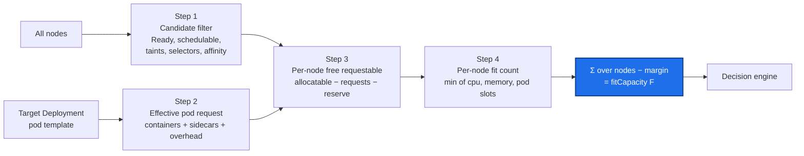

# KubeScaleSense — Resource Calculation

> Status: **Design (pre-implementation)** · Version: 0.1
> Canonical source for: candidate node filtering, effective pod request, free requestable resources, fit
> capacity, and the exact set of scheduling predicates modelled in v0.1.

Related documents: [requirements](requirements.md) · [architecture](architecture.md) ·
[scaling-algorithm](scaling-algorithm.md) · [failure-scenarios](failure-scenarios.md) ·
[test-plan](test-plan.md) · [implementation-plan](implementation-plan.md)

Implemented by `internal/resources` ([architecture § 4.4](architecture.md#44-resource-discovery-internalresources)),
which contains **no policy**: it answers only "how many more pods of this exact shape can the cluster place
right now?" The decision about whether to use that capacity belongs to
[scaling-algorithm](scaling-algorithm.md).

---

## 1. The question, and three wrong answers

**Question:** *given the target's pod template, how many additional replicas can Kubernetes actually schedule
at this moment?*

Three tempting formulations that all produce Pending pods:

| Wrong answer | Why it fails | Concrete failure |
| --- | --- | --- |
| "CPU utilization is 40 %, so there is 60 % free" | Utilization is not the scheduler's currency. A pod requesting 2 cores and using 50 m still holds 2 cores of scheduling budget | Cluster looks 60 % idle; every new pod is Pending because requests are fully committed |
| "Cluster capacity − cluster usage ÷ pod request" | Ignores `kube-reserved`, `system-reserved`, and eviction thresholds; also ignores per-node boundaries | Schedules pods the kubelet then evicts under pressure |
| "Total free CPU ÷ pod request" (aggregate) | **Fragmentation.** Resources are only usable where they are | 10 nodes × 400 m free = 4 cores "free", but zero placements for a 500 m pod |

The correct basis, per [ADR-05](architecture.md#adr-05-capacity-allocatable-or-requested), is **allocatable
minus already-requested, evaluated per node, on nodes that pass the target's scheduling predicates**. That is
what `kube-scheduler`'s `NodeResourcesFit` plugin checks, so it is what an estimator must mirror.



---

## 2. Step 1 — Candidate node set

A node is a **candidate** only if every modelled hard predicate passes. Each exclusion is counted and
exported as `kss_excluded_nodes{exclusion_reason}` so an unexpected HOLD is explainable at a glance
([architecture § 8.1](architecture.md#81-metrics-prometheus-port-8080-canonical-names)).

| # | Check | Source | `exclusion_reason` |
| --- | --- | --- | --- |
| C1 | `Ready` condition is `True` | `node.status.conditions` | `notReady` |
| C2 | `Ready` heartbeat is recent (within the node-monitor grace period, 40 s default) | `lastHeartbeatTime` | `staleHeartbeat` |
| C3 | Not cordoned | `node.spec.unschedulable == false` | `cordoned` |
| C4 | No untolerated `NoSchedule` / `NoExecute` taint | `node.spec.taints` vs. pod tolerations | `taint` |
| C5 | Matches `nodeSelector` (if `respectNodeSelector`) | node labels | `nodeSelector` |
| C6 | Matches required node affinity (if `respectNodeAffinity`) | node labels | `nodeAffinity` |
| C7 | Matches `resources.nodeLabelSelector`, when configured | node labels | `operatorRestricted` |
| C8 | Has a non-zero remaining pod slot count | `allocatable.pods` vs. pod count | `podSlotsFull` |

### 2.1 Taints and tolerations (C4)

Full Kubernetes toleration semantics ([ADR-07](architecture.md#adr-07-how-do-taints-and-tolerations-affect-the-calculation)):

- Effects `NoSchedule` and `NoExecute` block scheduling; `PreferNoSchedule` does **not** and is ignored.
- A toleration matches when the key matches and: `operator: Exists`, or `operator: Equal` with an equal value.
- An empty `key` with `operator: Exists` tolerates **all** taints.
- An empty `effect` matches **all** effects.
- `tolerationSeconds` is irrelevant here — it governs eviction of running pods, not admission.

This check is why the model works on real clusters and on the kind demo. Two cases it catches:

- **Control-plane nodes.** `node-role.kubernetes.io/control-plane:NoSchedule` makes a node's substantial free
  resources unusable by application pods. Counting them is the single most common way a naive capacity
  calculation over-estimates.
- **Kubelet pressure taints.** When a node is under memory/disk/PID pressure the kubelet adds
  `node.kubernetes.io/memory-pressure:NoSchedule` (and similar). Because those are ordinary taints, C4
  removes pressured nodes for free — no separate condition handling, and the controller automatically stops
  targeting a node that is already in trouble.

### 2.2 Node selector and affinity (C5, C6)

`nodeSelector` is an AND of label equalities. Required node affinity
(`requiredDuringSchedulingIgnoredDuringExecution`) is an **OR of `nodeSelectorTerms`**, each an **AND of
`matchExpressions`**, with operators `In`, `NotIn`, `Exists`, `DoesNotExist`, `Gt`, `Lt`. Both are pure
functions of node labels, so they are cheap and exact.

`preferredDuringSchedulingIgnoredDuringExecution` is deliberately ignored: it influences node *ranking*, not
feasibility, so honouring it would shrink the candidate set below what the scheduler would accept and cause
false HOLDs ([ADR-08](architecture.md#adr-08-how-do-node-affinity-rules-affect-the-calculation)).

---

## 3. Step 2 — Effective pod request of the target workload

The request the scheduler charges for **one** target pod, read from the live `Deployment` pod template so the
calculation follows template changes automatically ([FR-10](requirements.md#4-functional-requirements)).

For each resource `r ∈ {cpu, memory}`:

```text
appSum(r)      = Σ requests[r] over spec.containers
sidecarSum(r)  = Σ requests[r] over restartable init containers   // native sidecars, restartPolicy: Always
initPeak(r)    = max over non-restartable init containers of ( requests[r] + sidecarSum-so-far(r) )

effective(r)   = max( appSum(r) + sidecarSum(r), initPeak(r) ) + spec.overhead[r]
```

Why each term:

- **Regular containers sum**, because they run concurrently.
- **Sidecars add to the sum**, because a restartable init container runs for the pod's whole lifetime. A
  logging or metrics sidecar is a very common reason a "500 m pod" actually needs 600 m, and ignoring it makes
  fit capacity over-estimate by exactly the sidecar size × number of pods.
- **Init containers take a max, not a sum**, since they run sequentially before the app; the pod's peak
  request is whichever phase demands most.
- **`spec.overhead`** is added by a RuntimeClass (e.g. a sandboxed runtime) and is charged by the scheduler,
  so it must be charged here too.

**Validation.** If either CPU or memory request is absent or zero, the controller **fails startup** with a
configuration error ([A-03](requirements.md#6-workload-and-environment-assumptions), CR-2). A zero-request pod
is schedulable anywhere, which makes fit capacity meaningless and hands the safety question back to the
kubelet's eviction logic — the opposite of this project's purpose. Requiring honest requests is a hard
precondition, and stating it loudly is better than silently computing nonsense.

v0.1 models CPU, memory, and pod count only. Extended resources (GPUs, hugepages), ephemeral storage, and
volume-attachment limits are [NG-9](requirements.md#3-non-goals); the structure above generalises to them
without change.

---

## 4. Step 3 — Per-node free requestable resources

For each candidate node `n`:

```text
requested(n, r) = Σ effective(pod, r)  over pods P where
                      P.spec.nodeName == n
                  and P.status.phase ∉ {Succeeded, Failed}
                  and P is not terminal-with-deletionTimestamp-elapsed

free(n, cpu)    = max(0, allocatable(n, cpu)    − requested(n, cpu)    − perNodeReserveCPUMilli)
free(n, memory) = max(0, allocatable(n, memory) − requested(n, memory) − perNodeReserveMemoryMiB)
freeSlots(n)    = max(0, allocatable(n, pods)   − count(non-terminal pods on n))
```

Decisions of substance here:

- **`allocatable`, never `capacity`.** `allocatable = capacity − kube-reserved − system-reserved − eviction
  thresholds`. It is the scheduler's real budget; the difference is often 10–15 % of a node and is exactly the
  margin whose absence causes kubelet evictions.
- **All namespaces are summed.** Node budget is shared cluster-wide, which is why the controller reads pods
  cluster-scoped ([architecture § 7](architecture.md#7-kubernetes-permissions-and-rbac)). Counting only the
  target namespace would be a serious over-estimate on a shared cluster.
- **Assigned-but-Pending pods count.** A pod with `spec.nodeName` set is already charged to that node even
  before it starts. Unassigned Pending pods (`nodeName == ""`) are charged to no node, yet they *will* compete
  with our new pods — one of the races the reserve absorbs ([§8](#8-staleness-and-the-readdecidewrite-race)).
- **Terminating pods still count.** A pod with a `deletionTimestamp` still holds its resources until it is
  gone. Assuming otherwise creates a window where the controller double-books a node during a rollout.
- **Per-node reserve.** `perNodeReserveCPUMilli` (200 m) and `perNodeReserveMemoryMiB` (256 MiB) are held back
  on every candidate node as slack for pods that land during our decision window — DaemonSet rollouts, other
  controllers, static pods — and for the drift between our cached view and reality.
- **Pod slots.** `allocatable.pods` (default 110 per node) is a real limit and a genuinely surprising one on
  small nodes running many tiny pods: a node can have cores free and no slots.

### 4.1 Known over-estimation: under-requesting neighbours

Because the model trusts requests, a node crowded with `BestEffort` or under-requesting pods looks emptier
than it behaves: those pods consume real CPU and memory while holding little or no scheduling budget.
KubeScaleSense will then place a pod that *schedules successfully* but lands on a node under genuine load, so
throughput per replica drops even though nothing goes Pending.

This is a property of Kubernetes resource management rather than a bug in the model, and the mitigations are
deliberate and modest: the per-node reserve, and the fact that the utilization-derived target
([scaling-algorithm § 3.2](scaling-algorithm.md#32-utilization-derived-target)) notices the resulting slowdown
and asks for more replicas. A stricter guardrail — refusing nodes whose *measured* usage already exceeds a
threshold, blending Step 3 with `metrics.k8s.io` node metrics — is deferred to Phase 3 rather than added to
v0.1, because it introduces a second, softer notion of "full" that needs its own tuning and can cause false
HOLDs ([implementation-plan § 7](implementation-plan.md#7-deferred-scope-and-when-to-pick-it-up)).

---

## 5. Step 4 — Fit capacity

```text
fit(n) = min( ⌊free(n, cpu)    / effective(cpu)⌋,
              ⌊free(n, memory) / effective(memory)⌋,
              freeSlots(n) )

F = max(0, Σ fit(n) over candidate nodes − fitCapacityMarginPods)
```

- **`min` across dimensions**, because the scheduler requires *all* dimensions to fit simultaneously. The
  dimension that produced the minimum is recorded as the **blocking dimension** and reported per
  [§10](#10-reported-outputs) — it turns "insufficient resources" into "add CPU".
- **Floor division**, because a pod is indivisible. 900 m free with a 500 m request is one pod, not 1.8.
- **Sum across nodes after flooring**, never before. Flooring per node is what encodes fragmentation; this
  ordering is the difference between the correct answer and the third wrong answer in [§1](#1-the-question-and-three-wrong-answers).
- **Global margin.** `fitCapacityMarginPods` (default 1) is pessimism about the model itself: unmodelled
  predicates, in-flight scheduling by others, and rounding. It is the last line of defence before the Pending
  watchdog.

Because all target replicas share one pod template
([A-02](requirements.md#6-workload-and-environment-assumptions)), greedy per-node counting is **exact for the
modelled predicates** — identical items need no bin-packing search
([ADR-06](architecture.md#adr-06-how-do-we-determine-whether-n-additional-pods-are-likely-schedulable)).
The estimate's error therefore comes only from what is *not* modelled ([§6](#6-predicates-modelled-and-predicates-ignored)),
which is the honest and bounded claim.

---

## 6. Predicates modelled and predicates ignored

KubeScaleSense is an **estimator, not a scheduler** ([P-6](architecture.md#2-architectural-principles)). This
table is the contract, and it is the first thing to consult when a Pending pod appears.

| Scheduler concern | v0.1 | Effect if unmodelled | Backstop |
| --- | --- | --- | --- |
| `NodeResourcesFit` (cpu, memory requests) | **Modelled** | — | — |
| Pod count limit (`allocatable.pods`) | **Modelled** | — | — |
| `NodeUnschedulable` (cordon) | **Modelled** | — | — |
| Node readiness / heartbeat | **Modelled** | — | — |
| `TaintToleration` (`NoSchedule`, `NoExecute`) | **Modelled** | — | — |
| `NodeAffinity` required + `nodeSelector` | **Modelled** | — | — |
| Node affinity *preferred* | Ignored (by design) | None — ranking only | — |
| Extended resources, GPUs, hugepages, ephemeral storage | **Not modelled** ([NG-9](requirements.md#3-non-goals)) | Over-estimate → Pending | Watchdog |
| `PodTopologySpread` | **Not modelled** ([NG-7](requirements.md#3-non-goals)) | Over-estimate → Pending | Watchdog |
| Inter-pod affinity / anti-affinity | **Not modelled** ([NG-7](requirements.md#3-non-goals)) | Over-estimate → Pending | Watchdog |
| `ResourceQuota` / `LimitRange` | **Not modelled** ([NG-10](requirements.md#3-non-goals)) | Over-estimate → pods never created by the ReplicaSet controller | Watchdog + quota alert |
| Volume topology / `VolumeBinding` / attach limits | **Not modelled** | Over-estimate → Pending | Watchdog |
| Priority and preemption | **Not modelled** ([NG-8](requirements.md#3-non-goals)) | **Under**-estimate (a privileged pod could preempt) → conservative HOLD | Acceptable |
| Cluster autoscaler adding nodes | **Not modelled** ([NG-2](requirements.md#3-non-goals)) | Under-estimate → conservative HOLD | Acceptable; Phase 5 |

Read the error directions carefully, because they are not symmetric:

- **Over-estimates** (we believe a pod fits when it does not) are the dangerous ones. They are bounded by
  `fitCapacityMarginPods`, detected by the Pending-pod watchdog
  ([ADR-13](architecture.md#adr-13-what-happens-if-a-newly-created-pod-stays-pending)), and remediated within
  `pendingPodTimeout`. This is precisely why the watchdog is mandatory rather than a nice-to-have.
- **Under-estimates** cause a false HOLD: some throughput is lost, nothing breaks. Accepted per
  [NFR-05](requirements.md#5-non-functional-requirements).

One nuance worth stating: a `ResourceQuota` block behaves differently from the other over-estimates. The
ReplicaSet controller cannot even *create* the pod, so no Pending pod appears — `replicas` and
`status.replicas` simply diverge and the ReplicaSet reports a `FailedCreate` event. The watchdog therefore
also treats "spec replicas not materialising into pods within `pendingPodTimeout`" as a remediation trigger
([FS-10](failure-scenarios.md#fs-10-namespace-resourcequota-blocks-pod-creation)).

---

## 7. Worked example

The reference cluster used across all documents. Target pod effective request: **500 m CPU / 512 MiB memory**.
Config: `perNodeReserveCPUMilli: 200`, `perNodeReserveMemoryMiB: 256`, `fitCapacityMarginPods: 1`.

### 7.1 Candidate filtering

| Node | Role | Ready | Cordoned | Taints | Candidate? |
| --- | --- | --- | --- | --- | --- |
| `cp-1` | control-plane | Yes | No | `node-role.kubernetes.io/control-plane:NoSchedule` | **No** — `taint` |
| `w-1` | worker | Yes | No | none | Yes |
| `w-2` | worker | Yes | No | none | Yes |
| `w-3` | worker | Yes | No | none | Yes |

`kss_candidate_nodes = 3`, `kss_excluded_nodes{exclusion_reason="taint"} = 1`. Note that `cp-1` has plenty of
free resources and contributes **nothing** — the point of [§2.1](#21-taints-and-tolerations-c4).

### 7.2 Per-node free requestable resources and fit

| Node | Allocatable CPU | Requested CPU | Free CPU | Allocatable mem | Requested mem | Free mem | CPU fit | Mem fit | Slots | `fit(n)` |
| --- | --- | --- | --- | --- | --- | --- | --- | --- | --- | --- |
| `w-1` | 4000 m | 3200 m | 600 m | 8192 MiB | 6144 MiB | 1792 MiB | 1 | 3 | 96 | **1** |
| `w-2` | 4000 m | 1800 m | 2000 m | 8192 MiB | 2048 MiB | 5888 MiB | 4 | 11 | 101 | **4** |
| `w-3` | 2000 m | 1900 m | 0 m | 4096 MiB | 3900 MiB | 0 MiB | 0 | 0 | 88 | **0** |

Free values are `allocatable − requested − reserve`, floored at zero: `w-1` CPU = 4000 − 3200 − 200 = 600 m;
`w-3` CPU = 2000 − 1900 − 200 = −100 → **0**.

```text
Σ fit(n) = 1 + 4 + 0 = 5
F        = 5 − fitCapacityMarginPods(1) = 4
blocking dimension = cpu     // CPU is the min on w-1 and w-3
```

**The headline result:** the candidate nodes hold 2600 m of free CPU — nominally five 500 m pods — yet
`F = 4`, and a naive aggregate calculation including `cp-1` would have claimed far more. Fragmentation
(`w-1` has room for exactly one), the per-node reserve, the taint exclusion, and the global margin each
removed capacity that a simple division would have promised.

### 7.3 Feeding the decision

With `R_cur = 2` and a backlog of 400 items, the engine wants `Δ_req = 4` after step limiting
([scaling-algorithm § 11, Example A](scaling-algorithm.md#example-a--spike-fully-feasible)): `F = 4 ≥ 4`, so
`ScaleUp` to 6. Had `w-2` been busier (`F = 2`), the same demand would have produced `ScaleUpPartial` to 4
plus an armed backoff (Example B). Had all three nodes been full (`F = 0`), `HoldInsufficientResources`
(Example C).

---

## 8. Staleness and the read–decide–write race

The snapshot is built immediately before `Decide`, from informer caches that are updated by watches
([ADR-12](architecture.md#adr-12-how-do-we-avoid-stale-resource-information)). An irreducible race remains:
between our read and the scheduler's placement of our new pods, other actors can consume the same capacity.

| Race | Window | Mitigation |
| --- | --- | --- |
| Another controller's pods take the free space | ms–seconds | `perNodeReserve*` + `fitCapacityMarginPods`; watchdog if it still fails |
| A node goes `NotReady` after our read | ≤ 40 s heartbeat + watch latency | C1/C2 exclusion next reconcile; a scale-up already issued is caught by the watchdog |
| Our own previous scale-up is still being scheduled | ≤ `pendingPodTimeout` | Assigned-but-Pending pods already count in Step 3; `HoldPendingPods` blocks stacking |
| Deployment pod template changed mid-flight | one interval | Effective request re-read every reconcile; `resourceVersion` precondition on the write ([FR-05](requirements.md#4-functional-requirements)) |
| Informer watch silently desynced | until re-list | Periodic informer resync; `kss_metric_sample_age_seconds`; `HoldStaleMetrics` |

The design accepts the race and bounds its consequences instead of pretending it can be eliminated: reserves
absorb the common case, the watchdog remediates the rest, and `HoldPendingPods` guarantees errors do not
compound across reconciles.

---

## 9. Complexity and performance

- Pods are indexed by `spec.nodeName` in the informer, so a reconcile is `O(N + P)` for `N` nodes and `P`
  pods, with no API calls.
- At the [NFR-02](requirements.md#5-non-functional-requirements) target scale (50 nodes, 1000 pods) this is a
  few hundred microseconds of arithmetic — the reason the design can afford a full recomputation every
  reconcile instead of maintaining incremental per-node sums, which would add cache-coherence bugs for no
  measurable gain.
- Step 4 runs **only on the scale-up path** ([scaling-algorithm § 5](scaling-algorithm.md#5-step-3--stability-gates)),
  keeping the steady-state loop trivial.
- Per-node metrics (`kss_node_free_requestable_cpu_millicores`) are label-per-node; cardinality is bounded by
  cluster size and can be disabled for very large clusters.

---

## 10. Reported outputs

The `Feasibility` half of the snapshot ([architecture § 6](architecture.md#6-data-model--the-decision-snapshot)):

| Output | Metric | Use |
| --- | --- | --- |
| `F` | `kss_fit_capacity_pods` | The feasibility gate input; the headline resource-awareness metric |
| Blocking dimension | `kss_fit_capacity_blocking_dimension{dimension}` | Tells the operator *which* resource to add |
| Candidate node count | `kss_candidate_nodes` | Confirms the filter behaved as expected |
| Exclusions by reason | `kss_excluded_nodes{exclusion_reason}` | Explains a surprising `F` |
| Aggregate free CPU / memory | `kss_free_requestable_cpu_millicores`, `kss_free_requestable_memory_bytes` | Headroom trend; **deliberately not** a decision input |
| Per-node free CPU | `kss_node_free_requestable_cpu_millicores{node}` | Fragmentation visibility |
| Effective pod request | `kss_config_info` labels + debug logs | Verifies sidecar/overhead accounting |

Aggregate free resources are exported for humans and dashboards only. Using them as a decision input would
reintroduce the fragmentation error this document exists to eliminate.

---

## 11. Traceability

| Requirement | Where satisfied |
| --- | --- |
| [FR-10](requirements.md#4-functional-requirements) effective pod request | [§3](#3-step-2--effective-pod-request-of-the-target-workload) |
| [FR-11](requirements.md#4-functional-requirements) allocatable − requests − reserve | [§4](#4-step-3--per-node-free-requestable-resources) |
| [FR-12](requirements.md#4-functional-requirements) node filtering | [§2](#2-step-1--candidate-node-set) |
| [FR-13](requirements.md#4-functional-requirements) fit capacity | [§5](#5-step-4--fit-capacity) |
| [ADR-03](architecture.md#adr-03-how-should-available-cpu-be-calculated) / [ADR-04](architecture.md#adr-04-how-should-available-memory-be-calculated) | [§4](#4-step-3--per-node-free-requestable-resources), [§5](#5-step-4--fit-capacity) |
| [ADR-07](architecture.md#adr-07-how-do-taints-and-tolerations-affect-the-calculation) taints | [§2.1](#21-taints-and-tolerations-c4) |
| [ADR-08](architecture.md#adr-08-how-do-node-affinity-rules-affect-the-calculation) affinity | [§2.2](#22-node-selector-and-affinity-c5-c6), [§6](#6-predicates-modelled-and-predicates-ignored) |
| [ADR-12](architecture.md#adr-12-how-do-we-avoid-stale-resource-information) staleness | [§8](#8-staleness-and-the-readdecidewrite-race) |
| [NFR-02](requirements.md#5-non-functional-requirements) performance | [§9](#9-complexity-and-performance) |
