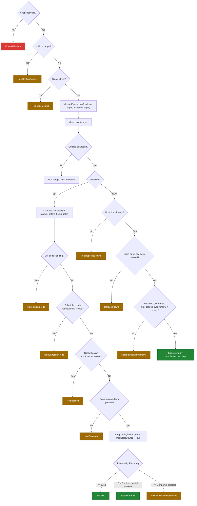
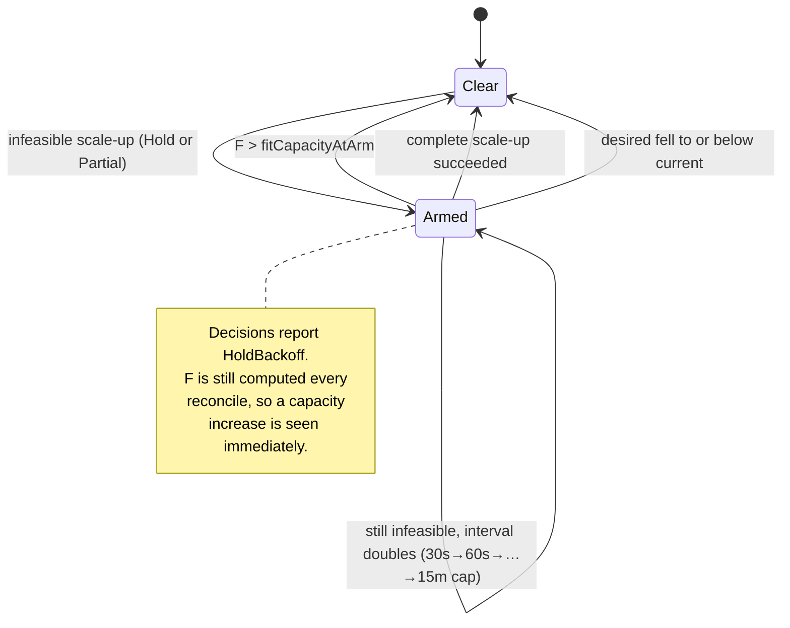

# KubeScaleSense — Scaling Algorithm

> Status: **Design (pre-implementation)** · Version: 0.2
> Canonical source for: decision outcomes and reason codes, desired-replica computation, guard ordering,
> scale-up/scale-down logic, cooldown and hysteresis, and insufficient-resource behaviour.

Related documents: [requirements](requirements.md) · [architecture](architecture.md) ·
[resource-calculation](resource-calculation.md) · [failure-scenarios](failure-scenarios.md) ·
[test-plan](test-plan.md) · [implementation-plan](implementation-plan.md)

This document specifies the pure function `scaling.Decide(Snapshot, Config, now) → Decision`
([architecture § 4.5](architecture.md#45-decision-engine-internalscaling)). It performs **no I/O**; the
feasibility inputs it consumes are produced by [resource-calculation](resource-calculation.md).

---

## 1. Notation and inputs

| Symbol | Source | Meaning |
| --- | --- | --- |
| `R_cur` | `Deployment.spec.replicas` | Current replica count |
| `R_ready` | `Deployment.status.readyReplicas` | Ready replicas (denominator for utilization) |
| `R_min`, `R_max` | `target.minReplicas`, `target.maxReplicas` | Hard clamp |
| `B` | Workload pressure, smoothed | Outstanding work: items queued plus in flight, as reported by the configured signal source ([FR-36](requirements.md#workload-signal-requirements-v02)) |
| `IPR` | `workload.itemsPerReplica` | Outstanding items one replica is expected to hold |
| `U_cpu` | metrics.k8s.io, % of **request** | Mean CPU utilization over Ready pods |
| `U_target` | `workload.targetCPUUtilizationPercent` | Utilization target |
| `F` | [resource-calculation § 5](resource-calculation.md#5-step-4--fit-capacity) | Fit capacity: additional target pods placeable now |
| `Δ_req` | derived | Requested delta for a scale-up, after step limiting |
| `T` | `scaling.tolerancePercent` | Deadband |
| `S_up`, `S_down` | `scaling.maxScaleUpStep`, `maxScaleDownStep` | Per-decision rate limits |
| `C_up`, `C_down` | `scaling.scaleUpCooldown`, `scaleDownCooldown` | Minimum interval between actions |
| `W` | `scaling.scaleDownStabilizationWindow` | Scale-down look-back window |

All configuration parameters and defaults: [requirements § 8](requirements.md#8-configuration-requirements).
Defaults referenced in this document: `IPR = 50`, `U_target = 70`, `T = 10 %`, `S_up = 4`, `S_down = 1`,
`C_up = 60 s`, `C_down = 300 s`, `W = 300 s`, `interval = 15 s`.

---

## 2. Decision outcomes and reason codes

Every reconcile produces exactly one reason code. The same string appears in the log line, the Kubernetes
Event, and the `reason` label of `kss_reconcile_total`
([architecture § 8](architecture.md#8-observability-requirements)) — this is the project's audit contract, so
codes are treated as a stable API.

| Reason code | Action | Meaning |
| --- | --- | --- |
| `ScaleUp` | write | Demand requires more replicas and all of them fit |
| `ScaleUpPartial` | write | Demand requires more than fits; scaled by `F`, remainder deferred |
| `ScaleDown` | write | Demand has been sustainably lower for the whole window |
| `NoChangeWithinTolerance` | none | Desired is within the deadband of current — the steady state |
| `HoldInsufficientResources` | none | Scale-up needed, `F == 0` |
| `HoldCooldown` | none | Correct direction, but too soon since the last action |
| `HoldStabilizationWindow` | none | Scale-down candidate, but demand was higher inside `W` |
| `HoldBackoff` | none | Previous scale-up was infeasible; waiting out backoff |
| `HoldPendingPods` | none | One or more of our pods is unschedulable; never stack another request |
| `HoldUnhealthyPods` | none | Pods are scheduled but not becoming Ready; more replicas cannot help ([DR-06](design-review.md#dr-06-scheduled-but-unhealthy-pods-cause-unbounded-scale-up)) |
| `HoldReplicasSettling` | none | Scale-down candidate, but not all replicas are Ready yet ([DR-03](design-review.md#dr-03-demand-driven-scale-down-can-fire-while-replicas-are-still-starting)) |
| `HoldRolloutInProgress` | none | The target is mid-rollout; surge would invalidate the fit estimate ([DR-08](design-review.md#dr-08-rollouts-and-maxsurge-are-unaccounted-for)) |
| `HoldExternalChange` | none | Another actor repeatedly writes the replica count ([DR-07](design-review.md#dr-07-external-writers-of-specreplicas-are-undetected)) |
| `HoldAtMaxReplicas` | none | Demand exceeds `R_max` — a capacity/policy ceiling, distinct from a resource shortfall |
| `HoldAtMinReplicas` | none | Demand below `R_min` |
| `HoldScalingConflict` | none | Another controller (HPA) targets this workload ([FR-19](requirements.md#4-functional-requirements)) |
| `HoldStaleMetrics` | none | A required signal is missing or older than `metricsStaleAfter` |
| `ErrorAPIFailure` | none | Snapshot could not be built ([FS-09](failure-scenarios.md#fs-09-kubernetes-api-failure)) |

Two distinctions worth keeping sharp, because they change what an operator does next:

- `HoldAtMaxReplicas` (raise the policy limit) vs. `HoldInsufficientResources` (add cluster capacity).
- `ScaleUpPartial` (progress, still short) vs. `HoldInsufficientResources` (no progress at all).

In `dryRun` mode the reason code is computed identically and reported; only the write is skipped. The
decision is labelled `dry_run=true` rather than given its own reason code, so dry-run and live traces are
directly comparable.

---

## 3. Step 1 — Compute desired replicas

### 3.1 Backlog-derived target

```text
desiredBacklog = ceil(B / IPR)
```

The leading indicator ([ADR-02](architecture.md#adr-02-how-should-the-desired-replica-count-be-calculated)).
Pressure reacts the instant work arrives, whereas CPU only reacts once pods are already saturated. `IPR`
answers "how many outstanding items is one replica allowed to be responsible for?" and is derived empirically
in the Phase 2 load tests, not guessed: run a fixed replica count, find the pressure level at which
per-request latency reaches the SLO, and divide.

`B` is the smoothed pressure value ([§8.4](#84-signal-smoothing)). If the signal source is unavailable,
`desiredBacklog` is *not* treated as zero — the guard in [§5](#5-step-3--stability-gates) rejects the whole
reconcile with `HoldStaleMetrics` instead. Treating "unknown" as "empty" is how autoscalers scale busy
systems to the floor during a monitoring outage.

**Where `B` comes from is deliberately not this document's concern.** The engine consumes a count of
outstanding work through a replaceable source interface — `synthetic`, `http`, or `none`
([ADR-22](architecture.md#adr-22-where-does-the-workload-pressure-signal-come-from)) — and every rule below
holds identically whichever is configured. That independence is the reason the v0.2 architecture
simplification changed nothing in this file's arithmetic: swapping a database query for an HTTP metrics
scrape alters where the number is read, not what it means.

### 3.2 Utilization-derived target

```text
desiredUtilization = ceil(R_ready × U_cpu / U_target)
```

The HPA-style trailing indicator, retained as a safety net for the case where `IPR` is wrong because items are
unexpectedly expensive (very large or complex files). Two deliberate choices:

- **Relative to the CPU *request*, not the limit or the node.** The request is what the pod is entitled to and
  what the fit math in [resource-calculation](resource-calculation.md) reserves, so the two halves of the
  system speak the same unit.
- **Averaged over pods that are Ready *and* warm.** Including starting pods (near-zero usage) would drag the
  average down exactly when a scale-up is in progress, suppressing the next one — a classic self-defeating
  feedback path. Readiness alone is not enough: a pod that has passed its probe but has not yet been sent a
  request also reports near-zero CPU, so pods Ready for less than `workload.podWarmupPeriod` (60 s) are excluded too
  ([DR-05](design-review.md#dr-05-new-pod-warmup-dilutes-the-utilization-average); upstream HPA carries two
  dedicated knobs for the same effect). If no pod is both Ready and warm, the signal is reported
  **unavailable** rather than fabricated, and the engine decides what that means.
- **Computed in integer milli-units,** not floating point, so that identical snapshots yield identical
  decisions at exact boundaries ([NFR-07](requirements.md#5-non-functional-requirements),
  [DR-15](design-review.md#dr-15-floating-point-arithmetic-weakens-the-determinism-claim)).

Note the asymmetry this creates: `R_ready` in the numerator means the utilization target is computed from a
*smaller* base while a scale-up settles, which can push `desiredUtilization` below `R_cur`. That is safe on the
scale-up path but would be dangerous on the scale-down path, which is why [§7](#7-step-5--scale-down-logic)
requires all replicas to be Ready before a demand-driven scale-down.

Memory utilization is collected and exported but **not** used to raise the desired count in v0.1: for this
workload high memory usage indicates buffer sizing rather than a throughput deficit, and adding replicas does
not reduce per-pod memory. It is retained as an alerting signal and a Phase 3 input.

### 3.3 Combining the signals

```text
desiredRaw = max(desiredBacklog, desiredUtilization)
```

`max()` is the conservative combiner: either signal may *request* capacity, but a scale-down requires **both**
to be low. This is what satisfies [FR-22](requirements.md#4-functional-requirements) — the controller cannot
scale down while a backlog exists, because `desiredBacklog` keeps the floor up on its own, no separate guard
needed.

### 3.4 Clamping

```text
desiredClamped = min(max(desiredRaw, R_min), R_max)
```

`desiredRaw` is exported unclamped as `kss_desired_replicas_uncapped` so that saturation against `R_max` is
visible rather than hidden by the clamp. If `desiredRaw > R_max` and `R_cur == R_max`, the reason is
`HoldAtMaxReplicas`; symmetrically for `R_min`.

---

## 4. Step 2 — Direction, deadband, and step limits

```text
if |desiredClamped − R_cur| / R_cur < T/100  →  NoChangeWithinTolerance
```

The deadband is evaluated on the *clamped* value and, being relative, is effectively inert at small replica
counts — at `R_cur = 2`, a one-replica change is 50 %, far outside a 10 % band. That is intentional: at low
replica counts every change is significant, and hysteresis at that scale is provided by the cooldowns and the
stabilization window instead ([§8](#8-hysteresis-and-oscillation-control)).

Direction and step limiting:

```text
if desiredClamped > R_cur:   target = min(desiredClamped, R_cur + S_up)     // Δ_req = target − R_cur
if desiredClamped < R_cur:   target = max(desiredClamped, R_cur − S_down)
```

Step limits bound the blast radius of a bad input. A corrupt backlog reading of 10 000 cannot jump the
deployment to `R_max` in one write; it takes several intervals, during which the feasibility gate, the
Pending watchdog, and a human all have a chance to intervene. `S_down = 1` makes retreat strictly gradual,
since each removed pod terminates work in progress.

---

## 5. Step 3 — Stability gates

Guards are evaluated in a fixed order, and the **first** one that matches determines the reason code. Order
matters: it is what makes the reported reason the *most actionable* one rather than an arbitrary one.

| # | Guard | Condition | Reason if matched |
| --- | --- | --- | --- |
| G0 | Snapshot valid | Target unreadable / caches unsynced | `ErrorAPIFailure` |
| G1 | Sole ownership | An HPA targets the same workload, or external drift exceeded `externalChangeTolerance` | `HoldScalingConflict` / `HoldExternalChange` |
| G1′ | Rollout quiet | `generation != observedGeneration` or `updatedReplicas != replicas` | `HoldRolloutInProgress` |
| G2 | Signal freshness | Backlog unavailable, or `age > metricsStaleAfter` | `HoldStaleMetrics` |
| G3 | Clamp binding | `desiredRaw > R_max` and `R_cur == R_max` | `HoldAtMaxReplicas` |
| G3′ | Clamp binding | `desiredRaw < R_min` and `R_cur == R_min` | `HoldAtMinReplicas` |
| G4 | Deadband | Within `T` of `R_cur` | `NoChangeWithinTolerance` |
| **Scale-up path** (fit capacity `F` is computed before these guards — see below) | | | |
| G5 | Pending pods | `PendingOurPods > 0` | `HoldPendingPods` |
| G5′ | Unhealthy pods | A scheduled pod has been not-Ready for > `podStartupTimeout` | `HoldUnhealthyPods` |
| G6 | Backoff | `now < holdBackoff.nextEligible` **and** `F <= holdBackoff.fitCapacityAtArm` | `HoldBackoff` |
| G7 | Cooldown | `now − LastScaleUp < C_up` | `HoldCooldown` |
| G8 | Feasibility | see [§6](#6-step-4--scale-up-logic-and-the-feasibility-gate) | `ScaleUp` / `ScaleUpPartial` / `HoldInsufficientResources` |
| **Scale-down path** | | | |
| G9 | Replicas settled | `ReadyReplicas != R_cur` (demand-driven scale-downs only) | `HoldReplicasSettling` |
| G10 | Cooldown | `now − LastScaleDown < C_down` | `HoldCooldown` |
| G11 | Stabilization | `max(desired over W) >= R_cur`, **or** the window is not covered | `HoldStabilizationWindow` |
| G12 | — | otherwise | `ScaleDown` |

Notes on specific orderings:

- **G2 before everything numeric.** Never compute a decision from data known to be stale.
- **G5/G5′/G6 before G7.** If pods are already Pending, are failing to start, or a scale-up was just proven
  infeasible, the cooldown state is irrelevant and reporting it would be misleading.
- **G5 and G5′ apply only to the scale-up path.** Scaling *down* while pods are Pending is allowed and often
  desirable: it is the mechanism by which a `revert` remediation clears a stuck pod
  ([ADR-13](architecture.md#adr-13-what-happens-if-a-newly-created-pod-stays-pending)). For the same reason,
  **G9 exempts watchdog remediation writes**, which must be able to remove a pod that is by definition not
  Ready.
- **Fit capacity is computed whenever the direction is up — including while backoff is armed.** This is
  required for correctness, not performance: the backoff reset is level-triggered on observed capacity
  ([§9.2](#92-reset-is-level-triggered-on-capacity-not-timer-driven)), so `F` must be evaluated even on a
  reconcile that will return `HoldBackoff`. Computing it after the backoff gate would make recovery
  unreachable ([DR-01](design-review.md#dr-01-backoff-gate-makes-the-recovery-in-one-interval-claim-unreachable)).
  The node walk is skipped only when G0–G4 already settle the decision — which is the true steady-state path,
  so the [NFR-02](requirements.md#5-non-functional-requirements) budget is unaffected.



---

## 6. Step 4 — Scale-up logic and the feasibility gate

This is the gate that distinguishes KubeScaleSense from a standard HPA
([ADR-06](architecture.md#adr-06-how-do-we-determine-whether-n-additional-pods-are-likely-schedulable)).

```text
Δ_req = target − R_cur                       // already step-limited

if F >= Δ_req:
    write(R_cur + Δ_req);  reason = ScaleUp;  resetBackoff()      // complete scale-up only

else if F > 0 and allowPartialScaleUp:
    write(R_cur + F);      reason = ScaleUpPartial
    armBackoff(F); deficit = Δ_req − F        // a partial scale-up does NOT reset backoff

else:
    no write;              reason = HoldInsufficientResources
    armBackoff(F); deficit = Δ_req
```

Properties this gives us:

- **A scale-up is issued only for pods believed placeable**, so `Pending` becomes the exception (an
  estimation error) rather than the normal outcome of a shortfall.
- **Partial progress is preferred to none.** Placing 2 of 4 needed pods drains the backlog more slowly but it
  does drain, using capacity the cluster genuinely has. Operators who prefer all-or-nothing set
  `allowPartialScaleUp: false`, which routes `0 < F < Δ_req` to `HoldInsufficientResources`.
- **The deficit stays visible.** `kss_desired_replicas` continues to report the true desired value while
  `kss_current_replicas` reports reality; the gap is the recommended alert
  ([ADR-09](architecture.md#adr-09-what-happens-when-demand-is-high-but-resources-are-insufficient)).
- **Only a *complete* scale-up resets backoff.** A partial scale-up is evidence of a shortfall, not of
  recovery, so it arms or advances the backoff instead. Treating it as a success would clear the backoff on the
  same reconcile that armed it, restoring the retry storm backoff exists to prevent
  ([DR-02](design-review.md#dr-02-partial-scale-up-both-arms-and-resets-the-backoff)).

After a write the controller sets `LastScaleUp = now` and records `lastGoodReplicas = R_cur` (the *pre*-scale
value), which is the revert target if the new pods turn out to be unschedulable
([FS-06](failure-scenarios.md#fs-06-newly-created-pod-stays-pending)).

---

## 7. Step 5 — Scale-down logic

Scale-down is treated as the more dangerous direction, because removing a pod terminates work in progress.
Six conditions must all hold:

1. `desiredClamped < R_cur` — both demand signals are low, by the `max()` in [§3.3](#33-combining-the-signals).
2. The change is outside the deadband ([§4](#4-step-2--direction-deadband-and-step-limits)).
3. `ReadyReplicas == R_cur` — **all replicas have settled.** Otherwise a scale-up still in progress depresses
   `desiredUtilization` through its `R_ready` numerator and the controller can remove pods it added seconds
   earlier ([DR-03](design-review.md#dr-03-demand-driven-scale-down-can-fire-while-replicas-are-still-starting)).
   Watchdog remediation writes are exempt.
4. `now − LastScaleDown >= C_down` (300 s, five times the scale-up cooldown).
5. `max(desired samples over the last W) < R_cur` — no sample inside the 5-minute window wanted the current
   count or more.
6. **The window is covered:** at least `scaleDownWindowCoverage` (0.8) of the `ceil(W / interval)` expected
   samples are present, and the oldest is at least `W` old. Reconciles that return before computing demand
   (`HoldStaleMetrics`, `ErrorAPIFailure`) append no sample, so without this condition a five-minute metrics
   outage would leave a nearly-empty window whose `max()` is trivially low — permitting a scale-down justified
   by *missing* data ([DR-04](design-review.md#dr-04-stabilization-window-gaps-permit-a-blind-scale-down)).
   Uncovered windows report `HoldStabilizationWindow`.

Then, and only then:

```text
target = max(desiredClamped, R_cur − S_down, R_min)     // S_down = 1
```

Before the write, the controller refreshes `controller.kubernetes.io/pod-deletion-cost` on the target's pods
from their reported in-flight item counts (lowest cost = removed first), so the ReplicaSet controller drops the
idlest pod ([FR-21](requirements.md#4-functional-requirements),
[D-06](requirements.md#7-durability-boundary-and-workload-responsibilities)). The controller **never deletes pods itself** —
going through the ReplicaSet controller is what preserves `preStop` drain, `terminationGracePeriodSeconds`,
and the `PodDisruptionBudget` ([ADR-15](architecture.md#adr-15-how-do-we-protect-data-processing-when-a-worker-pod-crashes)).

**Convergence cost of this conservatism.** With `S_down = 1` and `C_down = 300 s`, returning from 8 replicas
to 2 takes ~30 minutes. That is an accepted trade for the POC: the wasted capacity is bounded and cheap,
whereas a premature scale-down re-queues in-flight items and can start a scale-up/scale-down cycle. Operators
who value faster reclamation raise `maxScaleDownStep`; the demo calls this out explicitly rather than hiding
it.

Scale-down is **never** performed when signals are stale or unavailable (G2), and never below `R_min`
(v0.1 has no scale-to-zero, [NG-4](requirements.md#3-non-goals)).

---

## 8. Hysteresis and oscillation control

Four independent mechanisms, each targeting a different cause of flapping
([ADR-10](architecture.md#adr-10-how-do-we-avoid-replica-oscillation)).

### 8.1 Deadband (tolerance)

Suppresses action when `|desiredClamped − R_cur| / R_cur < T/100`. Removes churn from rounding at a
threshold — e.g. a backlog hovering at 199/200 items with `IPR = 50` and 4 replicas. Effective mainly at
higher replica counts; see the note in [§4](#4-step-2--direction-deadband-and-step-limits).

### 8.2 Asymmetric cooldowns

`C_up = 60 s` vs. `C_down = 300 s`. Reacting quickly to load is cheap and reversible; retreating quickly is
expensive and disruptive. The asymmetry alone makes a tight 1→2→1→2 cycle impossible: a scale-down cannot
follow a scale-up for at least 300 s, and each direction is independently rate-limited.

### 8.3 Scale-down stabilization window

The strongest guard: `max(desired over W)` must be below `R_cur`. A single quiet sample can never cause a
scale-down; the workload must be *sustainably* quiet for the whole window. `desiredHistory` is a ring buffer
of `(timestamp, desiredRaw)` samples held by the controller
([architecture § 4.6](architecture.md#46-controller-internalcontroller)) — at a 15 s interval, 20 samples.

### 8.4 Signal smoothing

Optional EWMA on the raw pressure value: `B_t = α·raw_t + (1−α)·B_{t−1}` with `α = 0.4`. Damps single-sample
artefacts (a NiFi batch arriving at once, a scrape hiccup) without materially delaying a real spike: a step change
reaches ~87 % of its true value within four samples (≈60 s). Both raw and smoothed values are exported
(`kss_backlog_items`, `kss_backlog_items_smoothed`) so the effect of smoothing is auditable. Set
`backlogSmoothing.mode: none` to disable, which the unit tests do for determinism.

### 8.5 Worked oscillation trace

`R_cur = 4`, `IPR = 50`, smoothing off, deadband 10 %, `W = 300 s`. The backlog oscillates around the
4-replica boundary (200 items) and then drops for good:

| t (s) | Raw backlog | `desiredRaw` | `max` over window | Decision |
| --- | --- | --- | --- | --- |
| 0 | 210 | 5 | 5 | `HoldCooldown` (scale-up cooldown from an earlier action) |
| 15 | 190 | 4 | 5 | `NoChangeWithinTolerance` |
| 30 | 205 | 5 | 5 | `ScaleUp` → 5 |
| 45 | 195 | 4 | 5 | `HoldCooldown` (down-cooldown; would otherwise flap back) |
| 60–285 | 40–60 | 1–2 | 5 | `HoldStabilizationWindow` — the window still contains a 5 |
| 330 | 45 | 1 | 2 | `ScaleDown` → 4 |
| 630 | 45 | 1 | 1 | `ScaleDown` → 3 |

The single 5-replica sample at t=30 pins the window until t≈330, which is exactly the intent: the controller
does not undo a scale-up until the demand that caused it has been absent for the whole window.

---

## 9. Insufficient-resource behaviour and backoff

### 9.1 Backoff state machine



```text
armBackoff(F):
    attempts += 1
    interval  = min(initial × factor^(attempts−1), max)     // 30s, 60s, 120s … 15m
    nextEligible      = now + interval
    fitCapacityAtArm  = F            // the capacity level this backoff is a statement about

resetBackoff():
    attempts = 0; nextEligible = zero; fitCapacityAtArm = −1
```

`fitCapacityAtArm` is what makes the reset condition expressible: "capacity increased" is meaningless without
recording the level it increased *from*. It is stored in the snapshot's `BackoffState`, so the reset remains a
pure function of the snapshot.

### 9.2 Reset is level-triggered on capacity, not timer-driven

The reset conditions matter more than the growth curve. `Armed → Clear` on **fit capacity increased** means
that when an operator adds a node or a neighbouring workload releases resources, the informer sees it within
milliseconds and the next reconcile (≤ 15 s) acts — the controller does not sit out the remainder of a
15-minute backoff ([ADR-11](architecture.md#adr-11-how-do-we-avoid-repeatedly-attempting-an-impossible-scale)).
The backoff exists to suppress *futile retries*, not to delay *recovery*.

This is only true because `F` is recomputed on every scale-up-direction reconcile, **including while backoff is
armed** ([§5](#5-step-3--stability-gates)). Evaluating feasibility after the backoff gate — the obvious
performance optimization — would make the reset condition unobservable and silently convert this design into a
timer-based backoff ([DR-01](design-review.md#dr-01-backoff-gate-makes-the-recovery-in-one-interval-claim-unreachable)).

### 9.3 What the operator sees

| Signal | Content |
| --- | --- |
| Event (once per cycle) | `InsufficientClusterResources: need 4 pods of 500m/512Mi, can place 0; candidate nodes 2/3, blocking cpu; retry in 30s` |
| `kss_insufficient_resource_holds_total{dimension="cpu"}` | Increments per hold — the count of shortfall events |
| `kss_desired_replicas` − `kss_current_replicas` | The replica deficit; **the recommended alert** when sustained > 5 min |
| `kss_fit_capacity_pods` = 0 | Cluster cannot take another target pod |
| `kss_fit_capacity_blocking_dimension{dimension="cpu"}` = 1 | Which resource to add |
| `kss_hold_backoff_seconds` | Current backoff interval |

The design intent restated: a capacity shortfall is not something the controller can fix, so its job is to
keep the pipeline as fast as the cluster safely allows and make the shortfall **loud and specific**.

---

## 10. Reference pseudocode

```go
func Decide(s Snapshot, c Config, now time.Time) Decision {
    // G0–G2: validity, sole ownership, quiet target, freshness
    if !s.Valid                       { return hold(ErrorAPIFailure) }
    if s.HPAPresent                   { return hold(HoldScalingConflict) }
    if s.ExternalDrifts > c.ExternalChangeTolerance { return hold(HoldExternalChange) }
    if s.RolloutInProgress            { return hold(HoldRolloutInProgress) }
    if !s.Backlog.Fresh(c.MetricsStaleAfter, now) { return hold(HoldStaleMetrics) }

    // Step 1: demand
    desiredBacklog := ceilDiv(s.Backlog.Value, c.ItemsPerReplica)
    desiredUtil    := int32(0)
    if s.AvgCPUPercent.Fresh(c.MetricsStaleAfter, now) && s.ReadyReplicas > 0 {
        desiredUtil = ceil(float64(s.ReadyReplicas) * s.AvgCPUPercent.Value / c.TargetCPUUtilizationPercent)
    }
    desiredRaw     := max(desiredBacklog, desiredUtil)
    desiredClamped := clamp(desiredRaw, c.MinReplicas, c.MaxReplicas)

    // G3/G3′: clamp binding
    if desiredRaw > c.MaxReplicas && s.CurrentReplicas == c.MaxReplicas { return hold(HoldAtMaxReplicas) }
    if desiredRaw < c.MinReplicas && s.CurrentReplicas == c.MinReplicas { return hold(HoldAtMinReplicas) }

    // G4: deadband
    if withinTolerance(desiredClamped, s.CurrentReplicas, c.TolerancePercent) {
        return hold(NoChangeWithinTolerance)
    }

    if desiredClamped > s.CurrentReplicas {   // ── scale-up path
        // s.FitCapacity was computed for this snapshot before Decide was called (see §5).
        backoffActive := now.Before(s.HoldBackoff.NextEligible) &&
                         s.FitCapacity <= s.HoldBackoff.FitCapacityAtArm

        if s.PendingOurPods > 0                                { return hold(HoldPendingPods) }
        if s.UnhealthyPodAge > c.PodStartupTimeout             { return hold(HoldUnhealthyPods) }
        if backoffActive                                       { return hold(HoldBackoff) }
        if now.Sub(s.LastScaleUp) < c.ScaleUpCooldown          { return hold(HoldCooldown) }

        target := min(desiredClamped, s.CurrentReplicas+c.MaxScaleUpStep)
        delta  := target - s.CurrentReplicas

        switch {
        case s.FitCapacity >= delta:
            return scale(target, ScaleUp, resetBackoff)              // complete: reset
        case s.FitCapacity > 0 && c.AllowPartialScaleUp:
            return scale(s.CurrentReplicas+s.FitCapacity, ScaleUpPartial, armBackoff)
        default:
            return holdWith(HoldInsufficientResources, armBackoff)
        }
    }

    // ── scale-down path (demand-driven; watchdog remediation bypasses these gates)
    if s.ReadyReplicas != s.CurrentReplicas                    { return hold(HoldReplicasSettling) }
    if now.Sub(s.LastScaleDown) < c.ScaleDownCooldown          { return hold(HoldCooldown) }
    if !s.WindowCovered(c.ScaleDownStabilizationWindow, c.Interval, c.ScaleDownWindowCoverage) ||
        s.MaxDesiredInWindow(c.ScaleDownStabilizationWindow) >= s.CurrentReplicas {
        return hold(HoldStabilizationWindow)
    }
    target := maxOf(desiredClamped, s.CurrentReplicas-c.MaxScaleDownStep, c.MinReplicas)
    return scale(target, ScaleDown, nil)
}
```

Every `hold`/`scale` return also carries the intermediate values (`desiredBacklog`, `desiredUtil`,
`desiredRaw`, `delta`, `F`, blocking dimension) so that a single log line reconstructs the whole decision
([NFR-10](requirements.md#5-non-functional-requirements)).

---

## 11. Worked examples

All examples use the reference cluster from
[resource-calculation § 7](resource-calculation.md#7-worked-example) — pod request 500 m / 512 MiB, three
worker nodes, per-node reserve 200 m / 256 MiB, `fitCapacityMarginPods = 1`.

### Example A — Spike, fully feasible

| Input | Value |
| --- | --- |
| `R_cur` / `R_ready` | 2 / 2 |
| Backlog | 400 |
| `U_cpu` | 88 % |
| `F` | 4 |

```text
desiredBacklog = ceil(400/50) = 8
desiredUtil    = ceil(2 × 88/70) = 3
desiredRaw     = 8  →  clamped 8 (max 12)
deadband: |8−2|/2 = 300 % > 10 %  → act, direction up
step limit: min(8, 2+4) = 6  →  Δ_req = 4
feasibility: F(4) >= Δ_req(4)  →  ScaleUp to 6
```

Event: `ScaledUp: 2 -> 6 (backlog 400, itemsPerReplica 50, fitCapacity 4)`. The remaining shortfall (desired 8
vs. 6) is picked up on the next reconcile after `C_up`, subject to the fit capacity that then remains.

### Example B — Same demand, fragmented cluster → partial

Node w2 is busier, so `F = 2`:

```text
Δ_req = 4, F = 2, allowPartialScaleUp = true
→ ScaleUpPartial to 4;  deficit 2;  backoff armed at 30s
```

Event (Warning): `ScaledUpPartial: 2 -> 4 of 6 desired; fitCapacity 2, blocking dimension cpu`.
`kss_desired_replicas` stays at 8 — the deficit is visible even though progress was made.

### Example C — No room at all

```text
Δ_req = 4, F = 0  →  HoldInsufficientResources
backoff: 30s → 60s → 120s → … → 15m
```

Then an operator adds a worker node. The node informer fires; the next reconcile computes `F = 8` — which it
does *despite* the armed backoff — and since `8 > fitCapacityAtArm (0)`, backoff resets and the same tick
issues `ScaleUp`. Recovery latency is one interval, not one backoff period
([§9.2](#92-reset-is-level-triggered-on-capacity-not-timer-driven)).

### Example D — Expensive items caught by the utilization signal

Files are unusually large, so `IPR = 50` under-estimates cost:

```text
Backlog 60, R_cur = R_ready = 4, U_cpu = 95 %
desiredBacklog = ceil(60/50) = 2
desiredUtil    = ceil(4 × 95/70) = 6
desiredRaw     = max(2, 6) = 6   → ScaleUp (if F allows)
```

The backlog signal alone would have suggested scaling *down* to 2 while pods were CPU-saturated. This is the
case `max()` exists for.

### Example E — Quiet pipeline, gradual scale-down

```text
R_cur = 6, R_ready = 6, backlog 30, U_cpu = 12 %
desiredBacklog = 1;  desiredUtil = ceil(6 × 12/70) = 2;  desiredRaw = 2
deadband: |2−6|/6 = 67 % > 10 %  → act, direction down
replicas settled (6 == 6); C_down satisfied
window covered (20 of 20 samples) and max(desired over 300s) = 2 < 6  → ScaleDown
target = max(2, 6−1, 1) = 5
```

One replica per 300 s: 6 → 5 → 4 → 3 → 2, ~20 minutes to converge
([§7](#7-step-5--scale-down-logic) explains why that is deliberate).

### Example F — Stale metrics during a spike

```text
workload-signal source unreachable for 75s > metricsStaleAfter (60s)
→ HoldStaleMetrics; no write in either direction
```

Replicas stay where they are, `MetricsUnavailable` is emitted, and `/readyz` reports the degraded source. The
controller does **not** interpret "no pressure data" as "no pressure"
([ADR-14](architecture.md#adr-14-what-happens-if-kubernetes-api-calls-fail),
[FR-38](requirements.md#workload-signal-requirements-v02)).

Note that when the source is the Normalizer's own `/metrics`, this example and a total Normalizer outage are
the same observation — the signal and the workload share a failure domain, which
[FS-15](failure-scenarios.md#fs-15-metrics-source-unavailable) records as a known consequence of the v0.2
simplification. Freezing is still the right response; diagnosing *why* requires the pod-health signals rather
than the pressure metric.

---

## 12. Tuning guidance

| Symptom | Likely cause | Adjustment |
| --- | --- | --- |
| Pressure drains too slowly at steady state | `IPR` too high | Lower `itemsPerReplica` (measure per Phase 2 load test) |
| Replicas grow while CPU stays low | Items are I/O-bound; the pressure target dominates | Raise `itemsPerReplica`; consider concurrency inside the pod instead of more pods |
| Replicas grow but throughput does not | Not a tuning problem: the caller's concurrency, not the replica count, is the bound | Raise NiFi's `InvokeHTTP` concurrent tasks above `maxReplicas` ([FS-28](failure-scenarios.md#fs-28-adding-replicas-does-not-add-throughput)) |
| Frequent `ScaleUpPartial` | Cluster is chronically near capacity | Add nodes, or lower `maxReplicas` to make the ceiling explicit and stop the noise |
| Frequent `HoldCooldown` on scale-up during spikes | `C_up` too long relative to spike shape, or `S_up` too small | Raise `maxScaleUpStep` before lowering `scaleUpCooldown` |
| Replica count sawtooths | Deadband/window too weak for a noisy signal | Enable/raise EWMA (`alpha` down), raise `scaleDownStabilizationWindow` |
| Slow reclamation after a spike | `S_down`/`C_down` conservative by design | Raise `maxScaleDownStep` to 2, verify no re-processing spike in the drain test |
| Pods occasionally Pending despite the gate | Unmodelled predicate ([ADR-08](architecture.md#adr-08-how-do-node-affinity-rules-affect-the-calculation)) | Raise `fitCapacityMarginPods` and/or `perNodeReserve*`; check `kss_pending_pod_remediations_total` |

---

## 13. Traceability

| Requirement | Where satisfied |
| --- | --- |
| [FR-02](requirements.md#4-functional-requirements) clamp | [§3.4](#34-clamping) |
| [FR-03](requirements.md#4-functional-requirements) step limits | [§4](#4-step-2--direction-deadband-and-step-limits) |
| [FR-08](requirements.md#4-functional-requirements) desired replicas | [§3](#3-step-1--compute-desired-replicas) |
| [FR-09](requirements.md#4-functional-requirements) staleness | G2 in [§5](#5-step-3--stability-gates), Example F |
| [FR-14](requirements.md#4-functional-requirements) feasibility gate | [§6](#6-step-4--scale-up-logic-and-the-feasibility-gate) |
| [FR-15](requirements.md#4-functional-requirements) insufficient-resource reporting | [§9.3](#93-what-the-operator-sees) |
| [FR-16](requirements.md#4-functional-requirements) cooldowns | [§8.2](#82-asymmetric-cooldowns), [§8.3](#83-scale-down-stabilization-window) |
| [FR-17](requirements.md#4-functional-requirements) deadband | [§8.1](#81-deadband-tolerance) |
| [FR-18](requirements.md#4-functional-requirements) backoff | [§9.1](#91-backoff-state-machine) |
| [FR-21](requirements.md#4-functional-requirements) deletion cost | [§7](#7-step-5--scale-down-logic) |
| [FR-22](requirements.md#4-functional-requirements) no premature scale-down | [§3.3](#33-combining-the-signals) |
| [FR-28](requirements.md#review-driven-requirements-v011) warmup exclusion | [§3.2](#32-utilization-derived-target) |
| [FR-29](requirements.md#review-driven-requirements-v011) settled replicas + covered window | [§7](#7-step-5--scale-down-logic) |
| [FR-30](requirements.md#review-driven-requirements-v011) unhealthy-pod guard | G5′ in [§5](#5-step-3--stability-gates) |
| [FR-31](requirements.md#review-driven-requirements-v011) external change detection | G1 in [§5](#5-step-3--stability-gates) |
| [FR-32](requirements.md#review-driven-requirements-v011) rollout hold | G1′ in [§5](#5-step-3--stability-gates) |
| [FR-33](requirements.md#review-driven-requirements-v011) feasibility computed under backoff | [§5](#5-step-3--stability-gates), [§9.2](#92-reset-is-level-triggered-on-capacity-not-timer-driven) |
