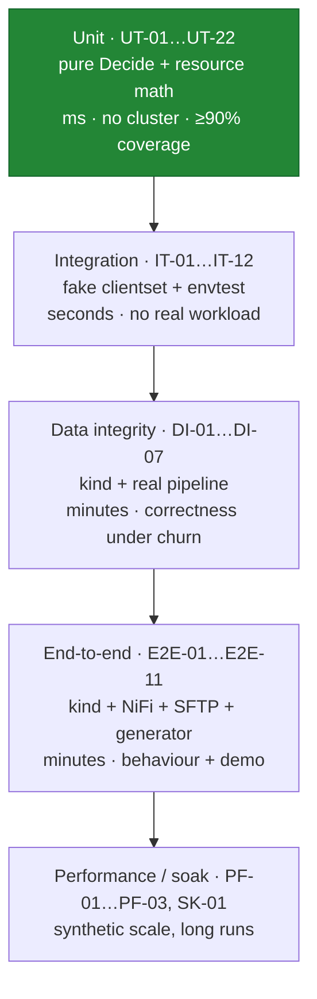
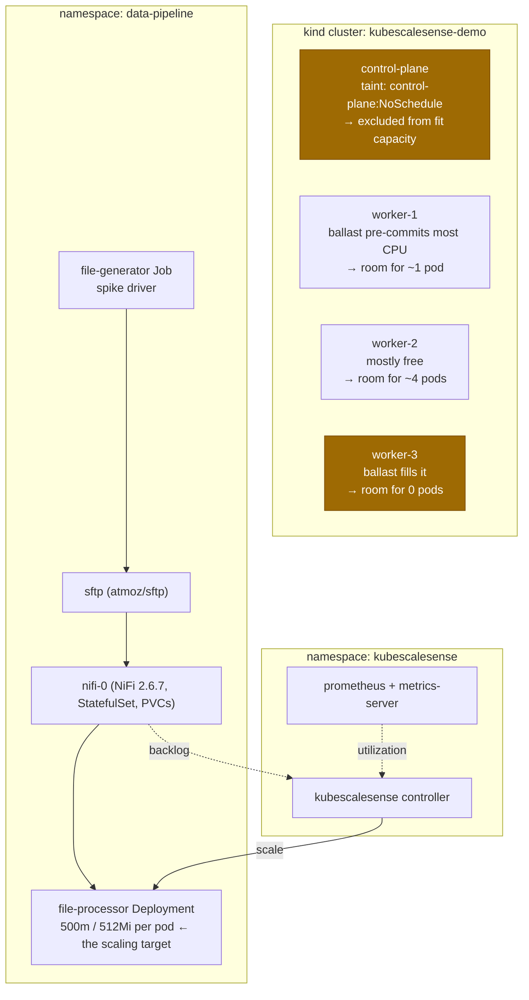
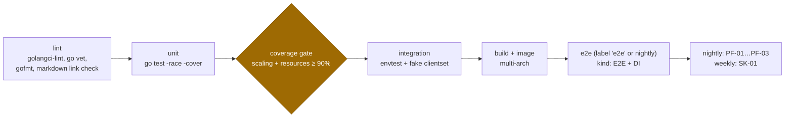

# KubeScaleSense — Test Plan

> Status: **Design (pre-implementation)** · Version: 0.1
> Canonical source for: test strategy, test IDs (`UT-xx`, `IT-xx`, `DI-xx`, `E2E-xx`, `PF-xx`, `SK-xx`), the
> local demonstration environment, and CI gates.

Related documents: [requirements](requirements.md) · [architecture](architecture.md) ·
[scaling-algorithm](scaling-algorithm.md) · [resource-calculation](resource-calculation.md) ·
[failure-scenarios](failure-scenarios.md) · [implementation-plan](implementation-plan.md)

---

## 1. Strategy

The architecture was shaped to make testing cheap, and the test plan spends its budget accordingly
([P-2](architecture.md#2-architectural-principles)): the decision engine is a pure function, so the
combinatorially interesting behaviour — every guard, every boundary, every failure combination — is covered by
fast unit tests with hand-built snapshots. Cluster-dependent tests then only need to prove that the snapshot
is assembled correctly and that the single mutation lands.



Three principles govern what gets tested where:

1. **Decision logic is never tested through a cluster.** Reproducing "node drained, metrics stale, backoff
   armed, 3 of 4 pods fit" in a live cluster is slow and flaky; as a snapshot struct it is five lines.
2. **Every `FS-xx` scenario has at least one owning test.** The failure analysis is a specification, not prose,
   and [§11](#11-traceability-matrix) is the proof of coverage.
3. **Data integrity is tested by counting.** Every DI test ends with a conservation assertion: files in =
   outputs out, with no partial or duplicate final outputs. Behavioural correctness of an autoscaler is
   arguable; a file count is not.

---

## 2. Levels, tooling, and definition of done

| Level | Tooling | Runs | Gate |
| --- | --- | --- | --- |
| Unit | `go test -race`, table-driven, `testing/quick` for properties | Every push | ≥ 90 % coverage in `internal/scaling` and `internal/resources`; 100 % of reason codes exercised |
| Integration | `k8s.io/client-go/kubernetes/fake` for logic, `envtest` (real API server, no kubelet) for API semantics | Every push | All IT pass; no test may sleep on wall-clock time — clocks are injected |
| Data integrity | `kind` + the demo pipeline | Pre-merge on the e2e label, nightly | Zero lost items, zero partial outputs |
| End-to-end | `kind` + NiFi 2.6.7 + SFTP + file generator + scripted scenarios | Nightly and pre-release | Asserted reason-code sequence per scenario |
| Performance | Synthetic informer stores (50 nodes / 1000 pods) | Nightly | [NFR-02](requirements.md#5-non-functional-requirements), [NFR-03](requirements.md#5-non-functional-requirements) |
| Soak | kind, 8 h, oscillating load | Weekly / pre-release | Bounded action count, no leaks, no drift |

**Cross-cutting rules.**

- The clock is an interface everywhere; cooldowns and windows are tested by advancing a fake clock, never by
  sleeping. A test suite that sleeps for 300 s to test a 300 s window is a test suite nobody runs.
- Randomness (backoff jitter) is seeded.
- EWMA smoothing is disabled in unit tests unless it is the subject ([UT-13](#3-unit-tests--decision-engine)),
  so expectations stay exact.
- E2E assertions are on **reason-code sequences and invariants**, not on exact replica counts at exact times —
  the latter is how autoscaler test suites become permanently flaky. Example invariant: "at no point does a
  pod of the target remain Pending for more than `pendingPodTimeout` + one interval".

---

## 3. Unit tests — decision engine

`internal/scaling`, pure `Decide` calls against hand-built snapshots.

| ID | Case | Asserts |
| --- | --- | --- |
| UT-01 | Backlog-derived target | `ceil` behaviour: backlog 0/1/49/50/51/400 with `IPR=50` → 0/1/1/1/2/8; no division-by-zero when `IPR` invalid (rejected at config time) |
| UT-02 | Utilization-derived target | `ceil(R_ready × U/U_target)`; averaging over Ready pods only; `R_ready = 0` → signal omitted, not divide-by-zero |
| UT-03 | Signal combination | `max()` of the two; each signal can raise alone; a high backlog blocks scale-down even at low CPU ([FR-22](requirements.md#4-functional-requirements)) |
| UT-04 | Clamping | `HoldAtMaxReplicas` / `HoldAtMinReplicas` only when the clamp binds *and* current is already at the bound; `desiredRaw` reported unclamped |
| UT-05 | Deadband | Boundary at exactly `tolerancePercent`; inert at low replica counts (2 → 3 always acts) |
| UT-06 | Step limits | `maxScaleUpStep`/`maxScaleDownStep` applied after clamping; a corrupt backlog of 10⁶ cannot exceed one step |
| UT-07 | Guard precedence | Full ordering G0→G11 ([scaling-algorithm § 5](scaling-algorithm.md#5-step-3--stability-gates)); with several guards matching, the *first* wins — e.g. pending pods + cooldown + backoff all true → `HoldPendingPods` |
| UT-08 | Feasibility gate | `F ≥ Δ` → `ScaleUp`; `0 < F < Δ` → `ScaleUpPartial` to `current+F`; `F = 0` → `HoldInsufficientResources`; `allowPartialScaleUp: false` routes partial → hold |
| UT-09 | Backoff | Growth 30→60→120→…→900 s cap; reset on capacity increase, on successful scale, and on demand falling; **no** reset from mere elapsed time |
| UT-10 | Stabilization window | `max()` over the window; a single high sample inside `W` blocks scale-down; expiry of that sample permits it (matches the trace in [scaling-algorithm § 8.5](scaling-algorithm.md#85-worked-oscillation-trace)) |
| UT-11 | Cooldowns | Asymmetric enforcement; a scale-down cannot follow a scale-up within `C_down`; boundary at exactly the cooldown |
| UT-12 | Stale / missing signals | Backlog missing or `age > metricsStaleAfter` → `HoldStaleMetrics` in **both** directions; utilization missing alone → degrade, keep scaling |
| UT-13 | EWMA smoothing | `α = 0.4` step response; ~87 % of a step within 4 samples; `mode: none` is exactly pass-through |
| UT-22 | Properties (`testing/quick`, randomized snapshots) | Invariants that must hold for **all** inputs: result ∈ `[min, max]`; `F = 0` ⇒ result ≤ current; scale-down never exceeds `maxScaleDownStep`; stale signals ⇒ result = current; identical snapshot ⇒ identical decision ([NFR-07](requirements.md#5-non-functional-requirements)); exactly one reason code returned |

UT-22 is the highest-value test in the suite: the property "when nothing fits, replicas never increase" is the
project's central safety claim, and a property test asserts it across thousands of generated states rather
than the handful an author thought to enumerate.

---

## 4. Unit tests — resource calculation

`internal/resources`, pure functions over synthetic node/pod lists.

| ID | Case | Asserts |
| --- | --- | --- |
| UT-14 | Candidate filter basics | Exclusion of `NotReady`, stale heartbeat, cordoned (`spec.unschedulable`), and zero-pod-slot nodes; each attributed to the correct `exclusion_reason` |
| UT-15 | Toleration semantics | Matrix over `NoSchedule`/`NoExecute`/`PreferNoSchedule` × operators `Equal`/`Exists` × empty key × empty effect; **the kind control-plane taint case is asserted explicitly** ([resource-calculation § 2.1](resource-calculation.md#21-taints-and-tolerations-c4)); `PreferNoSchedule` never excludes |
| UT-16 | Selector and affinity | `nodeSelector` AND semantics; required node affinity as OR-of-terms / AND-of-expressions with `In`, `NotIn`, `Exists`, `DoesNotExist`, `Gt`, `Lt`; **preferred affinity is ignored** |
| UT-17 | Effective pod request | Multi-container sum; restartable init (sidecar) added to the sum; non-restartable init taken as a max; `spec.overhead` added; missing request → validation error, not zero |
| UT-18 | Per-node free resources | `allocatable − requested − reserve`, floored at zero (negative reserve case); pods of other namespaces counted; assigned-but-Pending counted; terminating (with `deletionTimestamp`) counted; `Succeeded`/`Failed` excluded |
| UT-19 | Fit capacity | Per-node floor then sum (**fragmentation**: 5 nodes × 300 m free, 500 m request → `F = 0`); pod-slot limit binding while CPU is free; `fitCapacityMarginPods` subtraction floored at zero; reproduces the reference example `F = 4` from [resource-calculation § 7](resource-calculation.md#7-worked-example) exactly |
| UT-20 | Blocking dimension | Correct dimension reported when CPU binds, when memory binds, when pod slots bind, and on ties (documented precedence: cpu → memory → podSlots) |
| UT-21 | Config validation | `minReplicas > maxReplicas`; `interval < 5s`; `itemsPerReplica ≤ 0`; missing target; pod template without CPU or memory requests; malformed NiFi URL — each produces a specific, non-generic error ([FS-19](failure-scenarios.md#fs-19-misconfiguration)) |

---

## 5. Integration tests

Fake clientset for logic; `envtest` (real API server, no kubelet, so pods never actually run) where genuine API
semantics matter — subresources, preconditions, RBAC, events.

| ID | Case | Asserts |
| --- | --- | --- |
| IT-01 | Startup gating | No write before informer caches sync and one metric sample exists ([NFR-08](requirements.md#5-non-functional-requirements)) |
| IT-02 | Scale write semantics | Update targets `deployments/scale` (not the deployment spec); `resourceVersion` precondition present; injected `409` → decision discarded, re-read, re-decided, **never** a blind retry ([FS-09](failure-scenarios.md#fs-09-kubernetes-api-failure), [FS-21](failure-scenarios.md#fs-21-target-pod-template-changes-mid-flight)) |
| IT-03 | RBAC denial | With the scale verb removed, a `403` is fatal: event emitted, `/readyz` fails, no retry storm ([FR-27](requirements.md#4-functional-requirements)) |
| IT-04 | Events | One event per state change; repeated HOLDs rate-limited to one per backoff cycle; messages contain desired, feasible, and blocking dimension ([architecture § 8.2](architecture.md#82-kubernetes-events)) |
| IT-05 | Metrics exposition | Every metric in [architecture § 8.1](architecture.md#81-metrics-prometheus-port-8080-canonical-names) is registered with the documented name, type, and labels; all reason-code label values appear across the suite (guards against silent renames — the audit contract) |
| IT-06 | HPA conflict | HPA on the target → fatal at startup; created later → `HoldScalingConflict`, no writes ([FS-16](failure-scenarios.md#fs-16-competing-controller-on-the-same-target)) |
| IT-07 | Pending watchdog | Pod forced `Unschedulable`: immediate `HoldPendingPods`; after `pendingPodTimeout`, each `onPendingTimeout` mode behaves as specified (`revert` restores `lastGoodReplicas`, `freeze` blocks scale-ups, `none` reports only); remediation goes through `scale`, never pod deletion ([FS-06](failure-scenarios.md#fs-06-newly-created-pod-stays-pending)) |
| IT-08 | Quota block | `ResourceQuota` rejects creation: `spec.replicas` rises, `status.replicas` does not, no Pending pod exists; watchdog still triggers on unmaterialised replicas ([FS-10](failure-scenarios.md#fs-10-namespace-resourcequota-blocks-pod-creation)) |
| IT-09 | Leader election | Only the leader writes; on lease loss the controller stops deciding and exits; the successor starts cooled down with empty history ([FS-17](failure-scenarios.md#fs-17-controller-crash-restart-or-leadership-change)) |
| IT-10 | Metrics-server absent | `metrics.k8s.io` unavailable → backlog-only scaling continues, `MetricsUnavailable` emitted; NiFi absent → `HoldStaleMetrics` ([FS-15](failure-scenarios.md#fs-15-metrics-source-unavailable)) |
| IT-11 | Deletion cost | Before a scale-down, `pod-deletion-cost` is patched from in-flight counts, lowest on the idlest pod ([FR-21](requirements.md#4-functional-requirements)) |
| IT-12 | Dry run | `dryRun: true` produces identical reason codes and metrics with **zero** mutating API calls (asserted via a counting round-tripper) |

---

## 6. Data integrity scenarios

Run on kind against the real pipeline. Every test ends with the conservation assertion:

> `count(final outputs) == count(input files)`, every output byte-identical to the expected normalization, no
> `.tmp` files remaining, no duplicate final outputs, and `/work/inflight` empty.

| ID | Scenario | Method | Asserts | Verifies |
| --- | --- | --- | --- | --- |
| DI-01 | Worker killed mid-item | `kubectl delete pod --grace-period=0 --force` during processing | Item reclaimed by the reaper and reprocessed; conservation holds | [D-04](requirements.md#7-data-loss-protection-assumptions), [FS-12](failure-scenarios.md#fs-12-worker-pod-crashes-mid-item) |
| DI-02 | Scale-down during processing | Force a scale-down while all replicas are busy | Terminating pod finishes its current item; drain completes inside the grace period; conservation holds | [D-05](requirements.md#7-data-loss-protection-assumptions), [FS-14](failure-scenarios.md#fs-14-scale-down-terminates-a-busy-pod) |
| DI-03 | Crash-looping replica | One pod configured to exit repeatedly | Other replicas continue; the failing pod's claims are reclaimed; conservation holds | D-04 |
| DI-04 | Duplicate delivery | Same file injected twice / an item deliberately reprocessed | Exactly one final output; atomic rename overwrites identically | [D-03](requirements.md#7-data-loss-protection-assumptions) |
| DI-05 | Reaper behaviour | Abandon a claim in `/work/inflight` with an old timestamp | Reclaimed after `inflightReclaimAfter`; not reclaimed before (no double-processing of live claims) | D-04 |
| DI-06 | Node memory pressure | Ballast pod balloons past its request until the kubelet evicts | Evicted worker's items reclaimed; conservation holds; the node's `memory-pressure` taint removes it from the candidate set | [FS-11](failure-scenarios.md#fs-11-node-memory-pressure-evicts-running-workers) |
| DI-07 | Spike with full scaling churn | 5000 files, scale-up + partial + scale-down all occurring | Conservation holds across every scaling action; no item stalls beyond the reaper interval | [§4 of failure-scenarios](failure-scenarios.md#4-data-loss-analysis) |

DI-05's negative half matters as much as the positive: a reaper that reclaims *live* claims causes duplicate
processing on every long item, which is the classic way this pattern is implemented incorrectly.

---

## 7. Local demonstration environment

Per [ADR-16](architecture.md#adr-16-how-will-this-be-demonstrated-in-a-local-kubernetes-environment). The goal
is a laptop cluster where **resource exhaustion is reachable on purpose**, since the interesting behaviour
(HOLD instead of Pending) only exists in a cluster that can run out of room.

### 7.1 Cluster topology



Node **heterogeneity is the point**: it is what makes fragmentation demonstrable, so the demo can show that
"2.6 cores free in the cluster" and "no room for a 500 m pod" are simultaneously true
([FS-04](failure-scenarios.md#fs-04-fragmentation-free-resources-exist-but-nothing-fits)).

### 7.2 Making nodes small, deterministically

kind nodes are containers that share the host's resources, so "small nodes" must be created explicitly. Two
mechanisms, used together:

1. **Ballast pods (primary).** A `ballast` Deployment of `pause` containers with large CPU/memory *requests*
   and no real usage, pinned per node with `nodeName`. This pre-commits scheduling budget exactly and is the
   cleanest possible demonstration of the project's thesis: the ballast consumes **no CPU at all**, so a
   usage-based autoscaler sees an idle cluster while the scheduler sees a full one. Adjusting ballast replicas
   is how each scenario sets up its capacity state, and how E2E-03 "adds capacity" without touching the host.
2. **Shrunken allocatable (optional refinement).** Reserve resources from the kubelet so `allocatable` is
   genuinely small:

```yaml
# tests/e2e/kind-cluster.yaml
kind: Cluster
apiVersion: kind.x-k8s.io/v1alpha4
name: kubescalesense-demo
nodes:
  - role: control-plane
  - role: worker
    kubeadmConfigPatches:
      - |
        kind: KubeletConfiguration
        systemReserved:
          cpu: "1"
          memory: "1Gi"
        maxPods: 40
  - role: worker
  - role: worker
```

Verify with `kubectl describe node | grep -A5 Allocatable` before running scenarios — a demo whose premise is
node capacity should never assume it.

### 7.3 Prerequisites

| Tool | Purpose |
| --- | --- |
| Docker / Podman | kind node runtime |
| `kind` ≥ 0.23, `kubectl` ≥ 1.29 | Cluster lifecycle |
| Go ≥ 1.24 | Build the controller |
| `helm` (optional) | metrics-server / Prometheus install |
| `make` | `make demo-up`, `make demo-scenario-N`, `make demo-down` |

`metrics-server` needs `--kubelet-insecure-tls` on kind. Scripts live in `tests/e2e/`; nothing in the demo
requires cloud access or a paid service.

### 7.4 Demo narrative

Five scenarios, run in order, each ending with `kubectl describe deployment file-processor` (events tell the
story) and a Prometheus/console view of `kss_desired_replicas` vs. `kss_current_replicas` and
`kss_fit_capacity_pods`:

| Step | Scenario | Expected reason codes | Point being made |
| --- | --- | --- | --- |
| 1 | Idle baseline | `NoChangeWithinTolerance` | Steady state is quiet; no churn |
| 2 | Spike, capacity available (E2E-01) | `ScaleUp` → `HoldCooldown` → `ScaleUp` | Demand-driven scaling works, rate-limited |
| 3 | Spike, capacity exhausted (E2E-02) | `ScaleUpPartial` then `HoldInsufficientResources`, backoff growing | **The core result: zero Pending pods, loud deficit** |
| 4 | Capacity restored — delete ballast (E2E-03) | `ScaleUp` within one interval | Level-triggered recovery, not timer-driven |
| 5 | Drain a worker + kill a busy pod (E2E-05, DI-01) | `HoldInsufficientResources`; conservation assertion passes | Resource awareness and durability under disruption |

The comparison that makes the value legible: run step 3 against a stock HPA with the same target and show the
Pending pods it produces. Same demand, same cluster, different outcome — that side-by-side is the deliverable
of the demo, not the replica graph.

---

## 8. End-to-end scenarios

Run in the [§7](#7-local-demonstration-environment) environment. Each asserts a reason-code sequence plus
invariants, never exact timings.

| ID | Scenario | Setup | Asserts |
| --- | --- | --- | --- |
| E2E-01 | Feasible spike | Ballast leaves room for ≥ 6 pods; 1000 files | `ScaleUp` issued within 2 intervals; backlog drains; **no pod ever Pending > `pendingPodTimeout`**; final replicas ≥ demand-implied |
| E2E-02 | Insufficient resources | Ballast leaves room for 2; demand implies 8 | `ScaleUpPartial` to `current+2`, then `HoldInsufficientResources`; backoff grows 30→60→120 s; **zero Pending pods**; deficit metric > 0 ([FS-02](failure-scenarios.md#fs-02-insufficient-cluster-resources), [FS-03](failure-scenarios.md#fs-03-partial-scale-up-leaves-a-deficit), [FS-20](failure-scenarios.md#fs-20-sustained-overload-beyond-cluster-capacity)) |
| E2E-03 | Capacity restored | From E2E-02 state, delete ballast | `ScaleUp` within **one** interval despite an active backoff; `kss_hold_backoff_seconds` → 0 ([scaling-algorithm § 9.2](scaling-algorithm.md#92-reset-is-level-triggered-on-capacity-not-timer-driven)) |
| E2E-04 | Fragmentation | Ballast leaves 300 m free on each of 3 nodes; pod needs 500 m | `HoldInsufficientResources` while `kss_free_requestable_cpu_millicores` ≈ 900 m — the two metrics disagree *correctly* ([FS-04](failure-scenarios.md#fs-04-fragmentation-free-resources-exist-but-nothing-fits)) |
| E2E-05 | Node drain under load | `kubectl drain worker-2` mid-spike | Node leaves the candidate set; `kss_excluded_nodes{exclusion_reason="cordoned"}` = 1; no scale attempt targets it; recovery on uncordon ([FS-13](failure-scenarios.md#fs-13-node-failure-or-drain-removes-workers)) |
| E2E-06 | Oscillation soak | 60 min sawtooth load across a replica boundary | Scale actions ≤ ⌈duration/`C_up`⌉ up and ≤ ⌈duration/`C_down`⌉ down; no up→down→up within `C_down` ([FS-18](failure-scenarios.md#fs-18-replica-oscillation)) |
| E2E-07 | Signal outage | Scale NiFi to 0 / block metrics-server mid-spike | `HoldStaleMetrics` after `metricsStaleAfter`; **replica count unchanged** (no scale-down); recovery on restore ([FS-08](failure-scenarios.md#fs-08-stale-resource-or-metric-information), [FS-15](failure-scenarios.md#fs-15-metrics-source-unavailable)) |
| E2E-08 | Forced Pending | Add an unsatisfiable `nodeSelector` to the target after a scale-up, or apply a tight quota | Pod Pending → `HoldPendingPods` → remediation at `pendingPodTimeout`; `kss_pending_pod_remediations_total` = 1 ([FS-05](failure-scenarios.md#fs-05-unmodelled-scheduling-predicate-causes-a-wrong-fit-estimate), [FS-06](failure-scenarios.md#fs-06-newly-created-pod-stays-pending)) |
| E2E-09 | Gradual scale-down | Stop the generator after a spike | `HoldStabilizationWindow` for ≥ `W`, then one `ScaleDown` per `C_down`, one replica at a time, never below `minReplicas`; DI-02 conservation holds throughout |
| E2E-10 | Max replicas ceiling | `maxReplicas: 4`, demand implies 10 | `HoldAtMaxReplicas` (**not** `HoldInsufficientResources`); `kss_desired_replicas_uncapped` = 10 ([FS-01](failure-scenarios.md#fs-01-workload-spike-exceeds-maxreplicas)) |
| E2E-11 | Controller restart | Delete the controller pod mid-spike | New instance takes over, no action before caches sync, no scale-down for a full window after restart, no duplicate/conflicting writes ([FS-17](failure-scenarios.md#fs-17-controller-crash-restart-or-leadership-change)) |

---

## 9. Performance and soak

| ID | Test | Method | Gate |
| --- | --- | --- | --- |
| PF-01 | Reconcile duration at scale | Synthetic informer stores: 50 nodes, 1000 pods, 200 pods on one node | p95 ≤ 500 ms ([NFR-02](requirements.md#5-non-functional-requirements)); `resources` step dominates and is measured separately |
| PF-02 | Controller footprint | 1 h steady state under load | ≤ 100 m CPU, ≤ 128 MiB ([NFR-03](requirements.md#5-non-functional-requirements)) |
| PF-03 | API load | Count requests per minute via the API server audit log or a counting round-tripper | Zero `LIST` per reconcile; writes only on state change ([NFR-04](requirements.md#5-non-functional-requirements)) |
| SK-01 | 8 h soak | Oscillating load, one node drained and restored midway, metrics-server restarted once | No goroutine or memory growth; bounded scale actions; conservation assertion at the end; every reason code observed at least once |

---

## 10. CI pipeline



- Unit + integration run on every push and must stay under ~2 minutes total; the whole point of the pure-core
  design is that the meaningful suite is fast enough to run on every save.
- E2E/DI are gated by label or nightly schedule because they need a kind cluster (~5 min setup).
- A **markdown link check** over `docs/` runs in the lint job: this document set is heavily cross-referenced
  and internal consistency is a stated deliverable, so broken anchors are treated as build failures.
- Coverage gates apply only to `internal/scaling` and `internal/resources`. Blanket repo-wide coverage targets
  encourage tests of glue code; these two packages are where the correctness lives.

---

## 11. Traceability matrix

### Failure scenarios → tests

| Scenario | Tests |
| --- | --- |
| [FS-01](failure-scenarios.md#fs-01-workload-spike-exceeds-maxreplicas) | UT-04, E2E-10 |
| [FS-02](failure-scenarios.md#fs-02-insufficient-cluster-resources) | UT-08, E2E-02 |
| [FS-03](failure-scenarios.md#fs-03-partial-scale-up-leaves-a-deficit) | UT-08, E2E-02 |
| [FS-04](failure-scenarios.md#fs-04-fragmentation-free-resources-exist-but-nothing-fits) | UT-19, E2E-04 |
| [FS-05](failure-scenarios.md#fs-05-unmodelled-scheduling-predicate-causes-a-wrong-fit-estimate) | IT-07, E2E-08 |
| [FS-06](failure-scenarios.md#fs-06-newly-created-pod-stays-pending) | UT-07, IT-07, E2E-08 |
| [FS-07](failure-scenarios.md#fs-07-repeated-impossible-scale-attempts) | UT-09, E2E-02, E2E-03 |
| [FS-08](failure-scenarios.md#fs-08-stale-resource-or-metric-information) | UT-12, UT-14, E2E-07 |
| [FS-09](failure-scenarios.md#fs-09-kubernetes-api-failure) | IT-02, IT-03 |
| [FS-10](failure-scenarios.md#fs-10-namespace-resourcequota-blocks-pod-creation) | IT-08 |
| [FS-11](failure-scenarios.md#fs-11-node-memory-pressure-evicts-running-workers) | UT-18, DI-06 |
| [FS-12](failure-scenarios.md#fs-12-worker-pod-crashes-mid-item) | DI-01, DI-03, DI-04, DI-05 |
| [FS-13](failure-scenarios.md#fs-13-node-failure-or-drain-removes-workers) | UT-14, E2E-05 |
| [FS-14](failure-scenarios.md#fs-14-scale-down-terminates-a-busy-pod) | IT-11, DI-02 |
| [FS-15](failure-scenarios.md#fs-15-metrics-source-unavailable) | UT-12, IT-10, E2E-07 |
| [FS-16](failure-scenarios.md#fs-16-competing-controller-on-the-same-target) | IT-06 |
| [FS-17](failure-scenarios.md#fs-17-controller-crash-restart-or-leadership-change) | IT-01, IT-09, E2E-11 |
| [FS-18](failure-scenarios.md#fs-18-replica-oscillation) | UT-05, UT-10, UT-11, E2E-06, SK-01 |
| [FS-19](failure-scenarios.md#fs-19-misconfiguration) | UT-21 |
| [FS-20](failure-scenarios.md#fs-20-sustained-overload-beyond-cluster-capacity) | E2E-02 |
| [FS-21](failure-scenarios.md#fs-21-target-pod-template-changes-mid-flight) | UT-17, IT-02 |

### Requirements → tests

| Requirement group | Tests |
| --- | --- |
| [FR-01](requirements.md#4-functional-requirements)–FR-05 target and actions | IT-02, IT-12, UT-04, UT-06 |
| FR-06–[FR-09](requirements.md#4-functional-requirements) demand | UT-01, UT-02, UT-03, UT-12, IT-10 |
| FR-10–[FR-15](requirements.md#4-functional-requirements) resource awareness | UT-08, UT-14…UT-20, E2E-02, E2E-04 |
| FR-16–[FR-20](requirements.md#4-functional-requirements) stability | UT-05, UT-09, UT-10, UT-11, IT-06, IT-07, E2E-06 |
| FR-21–[FR-22](requirements.md#4-functional-requirements) in-flight safety | UT-03, IT-11, DI-02 |
| FR-23–[FR-27](requirements.md#4-functional-requirements) operability | IT-03, IT-04, IT-05, IT-09 |
| [NFR-01](requirements.md#5-non-functional-requirements)–NFR-04 performance | PF-01, PF-02, PF-03, E2E-01 |
| [NFR-05](requirements.md#5-non-functional-requirements)–NFR-08 correctness bias | UT-22, IT-01, E2E-02, E2E-11 |
| [NFR-09](requirements.md#5-non-functional-requirements)–NFR-10 portability, audit | E2E suite on kind + minikube; IT-04, IT-05 |
| [D-01](requirements.md#7-data-loss-protection-assumptions)–D-07 data protection | DI-01…DI-07 |
